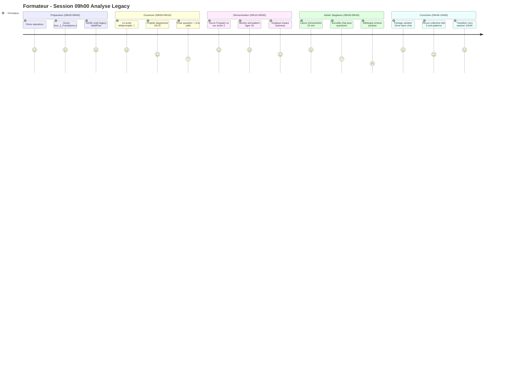
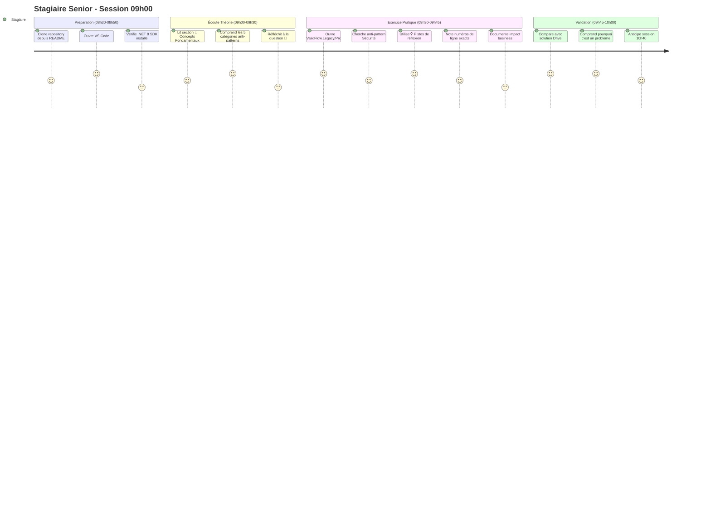
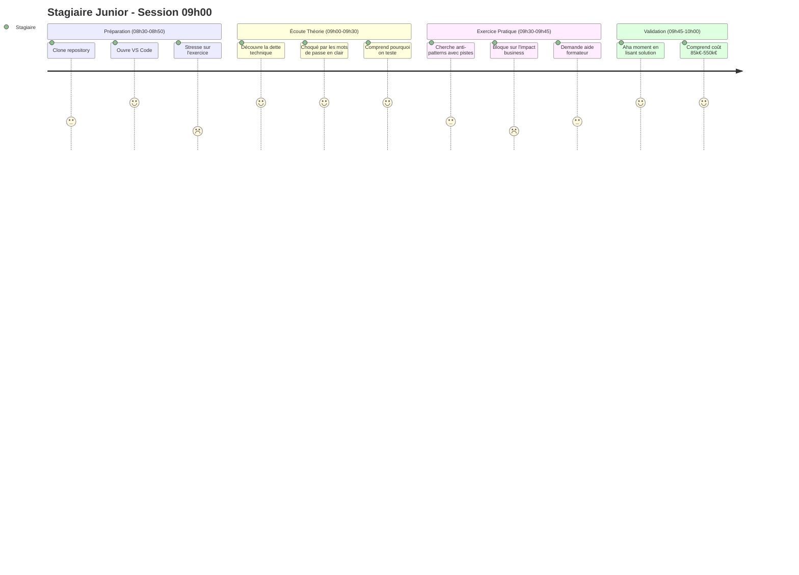
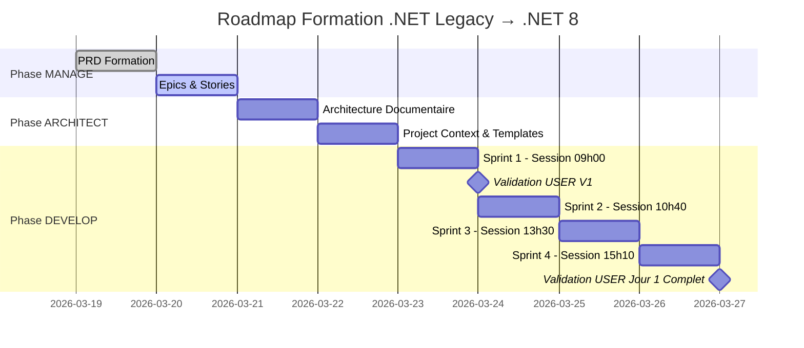

# PRD - Formation .NET Legacy → .NET 8 Moderne

**Version** : 1.0  
**Date** : 19 mars 2026  
**Product Manager** : Agent BMAD  
**Statut** : ✅ Validé

---

## 📋 Executive Summary

### Vision du Produit

Créer un programme de formation de 5 jours (35h) permettant à des développeurs .NET expérimentés de transformer une application batch legacy (.NET Framework) en solution moderne .NET 8, testable, sécurisée et déployable sur Linux/Docker.

### Objectif Business

**Pour qui** : Développeurs .NET seniors travaillant sur du code legacy  
**Qui souffrent de** : Peur de modifier le code, verrouillage Windows, dette de sécurité  
**Notre formation** : Est un programme structuré 5 jours  
**Qui transforme** : Un batch monolithique impossible à tester  
**En** : Une solution Clean Architecture .NET 8 avec 80% de couverture de tests  
**Contrairement à** : Des tutoriels YouTube désorganisés ou une formation théorique pure  
**Notre approche unique** : Scaffolding pédagogique ("Montrer puis Faire") avec exercices guidés

---

## 💡 Problème Client (Les 5 Douleurs)

### Douleur #1 : Peur de Modifier le Code
**Symptôme** : "Il me faut 3 jours pour changer une règle métier au lieu de 2h"  
**Cause Racine** : Zéro test unitaire - impossible de valider qu'une modification ne casse rien  
**Impact Business** : Vélocité divisée par 10, turnover développeurs  
**Coût Estimé** : -70% productivité

### Douleur #2 : Verrouillage Windows Server
**Symptôme** : "On ne peut pas migrer vers le cloud moderne (Kubernetes, Linux)"  
**Cause Racine** : Chemins hardcodés Windows, dépendances .NET Framework  
**Impact Business** : Coût licences Windows Server (5 000€/an), impossibilité conteneurisation  
**Coût Estimé** : 5 000€/an + dette technique croissante

### Douleur #3 : Dette de Sécurité (RGPD)
**Symptôme** : "Les mots de passe SQL sont en clair dans le code source"  
**Cause Racine** : Secrets hardcodés ligne 16-19 du Program.cs  
**Impact Business** : Violation RGPD, risque audit sécurité échoué, perte clients B2B  
**Coût Estimé** : 50 000€ à 500 000€ en cas de fuite

### Douleur #4 : Impossibilité de Tester
**Symptôme** : "Pour tester une règle métier, je dois lancer SQL Server + SMTP"  
**Cause Racine** : Couplage fort infrastructure (SQL, SMTP) mélangée avec logique métier  
**Impact Business** : Tests manuels 10x plus lents, bugs en production  
**Coût Estimé** : 10 000€/incident + 20 000€/an infrastructure de test

### Douleur #5 : Gestion d'Erreur Silencieuse
**Symptôme** : "Le batch plante, mais personne n'est alerté"  
**Cause Racine** : `catch (Exception ex)` générique ligne 40-44, erreurs ignorées  
**Impact Business** : Découverte des pannes 3 jours après, perte de données  
**Coût Estimé** : 4h investigation/incident

**Coût Total Dette Technique** : **85 000€ à 550 000€/an**

---

## 👥 User Personas & Journeys

### Persona #1 : Le Formateur .NET Senior

**Profil** :
- Expérience : 10+ ans .NET, connaît Clean Architecture
- Contexte : Doit donner la formation devant 8-12 stagiaires
- Contraintes : 1h30 par session, salle virtuelle (2 écrans), chat pour questions

**User Journey - Session 09h00 (Analyse Legacy)** :

**Pain Points** :
- ❌ Si le document n'a pas de script téléprompter → Improvisation (perte de temps, incohérence)
- ❌ Si les stagiaires bloquent sur le clone → 10 minutes perdues
- ❌ Si le timing n'est pas indiqué → Débordement sur la session suivante

**Jobs to be Done** :
- JTBD #1 : Donner une session fluide sans préparation supplémentaire
- JTBD #2 : Débloquer les stagiaires en < 2 minutes
- JTBD #3 : Respecter le timing (1h30 exactement)

---

### Persona #2 : Le Stagiaire .NET Expérimenté (Senior)

**Profil** :
- Expérience : 5+ ans .NET Framework, jamais touché .NET 8
- Contexte : Travaille sur du legacy en production, a peur de casser
- Compétences : Connaît SQL, Entity Framework 6, ASP.NET WebForms
- Lacunes : Ne connaît pas Clean Architecture, C# 12, Docker, xUnit

**User Journey - Session 09h00 (Analyse Legacy)** :

**Pain Points** :
- ❌ Si pas de pistes de réflexion → Bloque 10 minutes sur un anti-pattern
- ❌ Si pas d'instructions clone → Perd 15 minutes au démarrage
- ❌ Si solution donnée trop tôt → N'apprend pas (effet copier-coller)

**Jobs to be Done** :
- JTBD #1 : Identifier les anti-patterns sans bloquer (scaffolding)
- JTBD #2 : Comprendre l'impact business (pas juste la technique)
- JTBD #3 : Reproduire l'exercice sur mon code legacy au travail

---

### Persona #3 : Le Stagiaire .NET Débutant (Junior)

**Profil** :
- Expérience : 1-2 ans .NET, formation école récente
- Contexte : Premier job, code propre au travail (pas de legacy)
- Compétences : .NET 6, Entity Framework Core, Git basique
- Lacunes : Ne comprend pas pourquoi on teste, jamais vu du vrai code legacy

**User Journey - Session 09h00** :

**Pain Points** :
- ❌ Si pas de pistes de réflexion → Totalement bloqué
- ❌ Si impact business pas expliqué → Ne comprend que la technique (50% de la valeur)
- ❌ Si exercice trop complexe → Abandonne

**Jobs to be Done** :
- JTBD #1 : Comprendre pourquoi le code legacy est dangereux
- JTBD #2 : Apprendre à diagnostiquer (compétence transférable)
- JTBD #3 : Convaincre mon manager d'investir dans les tests

---

## 🎯 Définition du MVP (Minimum Viable Product)

### Scope V1 - Jour 1 Complet (4 Sessions)

**Objectif** : Produire un Jour 1 100% fonctionnel avec les 4 sessions documentées

**Livrables V1** :
- ✅ `03_Support_Quotidien/Jour_1_Fondations.md` (Livrable Quotidien Unique Git)
- ✅ 4 Solutions Drive :
  - `J1_S1_Solution_09h00_Analyse.md`
  - `J1_S2_Solution_10h40_Architecture.md`
  - `J1_S3_Solution_13h30_Domain.md`
  - `J1_S4_Solution_15h10_CSharp12.md`
- ✅ README.md avec instructions clone
- ✅ Code legacy `ValidFlow.Legacy/Program.cs` (déjà existant)

**Critères d'Acceptation V1** :
- [ ] Le formateur peut donner les 4 sessions sans préparation supplémentaire
- [ ] Chaque session a un script téléprompter 🎤 complet
- [ ] Chaque exercice a des pistes de réflexion 💡 (scaffolding)
- [ ] Zéro mention IA dans les documents stagiaires
- [ ] Timing respecté : Session 09h00 = 1h30 exactement

---

### Scope V2 - Jours 2 & 3 (Post-Validation V1)

**Condition** : V1 validée par l'utilisateur avec feedback positif

**Livrables V2** :
- `03_Support_Quotidien/Jour_2_Data_DI.md`
- `03_Support_Quotidien/Jour_3_Securite.md`
- 8 Solutions Drive (4 par jour)

---

### Scope V3 - Jours 4 & 5 (Post-Validation V2)

**Condition** : V2 validée

**Livrables V3** :
- `03_Support_Quotidien/Jour_4_Tests_Docker.md`
- `03_Support_Quotidien/Jour_5_CICD_Bilan.md`
- 8 Solutions Drive

---

### Hors Scope (Toutes Versions)

❌ Génération de vidéos ou podcasts  
❌ Intégration LMS (Moodle, Dendreo, Arkesys)  
❌ Création de slides PowerPoint  
❌ Génération de quiz automatiques  
❌ Support multilingue (uniquement français)

---

## 📊 KPI de Succès

### KPI Formateur (Efficacité de Préparation)

| KPI | Valeur Cible | Mesure |
|-----|--------------|--------|
| Temps de préparation par session | < 10 minutes | Chronomètre manuel |
| % de sessions données sans improvisation | > 90% | Feedback formateur |
| Taux de respect du timing | > 80% | Fin session à +/- 5 min |

### KPI Stagiaires (Apprentissage)

| KPI | Valeur Cible | Mesure |
|-----|--------------|--------|
| Taux de réussite exercice Jour 1 | > 80% | 4/5 anti-patterns trouvés |
| Temps de déblocage moyen | < 5 min | Chrono entre question chat et réponse |
| Compréhension impact business | > 70% | Quiz fin Jour 1 (optionnel) |

### KPI Qualité Documentaire

| KPI | Valeur Cible | Mesure |
|-----|--------------|--------|
| Zéro mention IA détectée | 100% | Scan grep automatique |
| Couverture scaffolding | 100% | Toutes sections ⚙️ ont 💡 Pistes |
| Scripts téléprompter présents | 100% | Toutes sections ont 🎤 |

---

## 📋 Besoins Fonctionnels (FR)

### Epic 1 - Jour 1 : Fondations

**FR001 - Session 09h00 : Analyse Legacy**
- **En tant que** formateur
- **Je veux** un document avec théorie + exercice détection 5 anti-patterns
- **Afin de** prouver que le code legacy est dangereux (impact business chiffré)
- **Critères d'acceptation** :
  - [ ] Section 🧠 Concepts Fondamentaux (Dette Technique)
  - [ ] Diagramme Mermaid (Workflow Legacy AS-IS)
  - [ ] Section 💬 Analyse Collective (Question : Peur de modifier)
  - [ ] Section ⚙️ Défi (Détective Anti-Patterns, 15 min)
  - [ ] Section 💡 Pistes de réflexion (5 indices : Sécurité, Perf, Robustesse, Maintenabilité, Déploiement)
  - [ ] Script téléprompter 🎤 (ouverture + lancement exercice)
  - [ ] Timing détaillé (10 min théorie + 15 min exercice + 5 min correction)
  - [ ] Solution Drive avec 5 problèmes documentés (lignes + impact business)

**FR002 - Session 10h40 : Scaffolding Clean Architecture**
- **En tant que** stagiaire
- **Je veux** créer 5 projets .NET 8 isolés (Domain, Application, Infrastructure, Console, Tests)
- **Afin de** remplacer le monolithe par une architecture testable
- **Critères d'acceptation** :
  - [ ] Section 🧠 (Principe Inversion de Dépendances)
  - [ ] Diagramme Mermaid (Architecture Clean TO-BE)
  - [ ] Section ⚙️ Défi (Créer 5 projets via dotnet CLI, 30 min)
  - [ ] Section 💡 Pistes (Ordre de création : Domain → Tests → Application → Infrastructure → Console)
  - [ ] Script téléprompter 🎤 (démo live formateur)
  - [ ] Solution Drive avec commandes CLI exactes

**FR003 - Session 13h30 : Implémentation Domain**
- **En tant que** stagiaire
- **Je veux** extraire l'entité Client et les règles de validation vers le projet Domain
- **Afin de** isoler le cœur métier (zéro dépendance externe)
- **Critères d'acceptation** :
  - [ ] Section 🧠 (Domain-Driven Design - Entités pures)
  - [ ] Section ⚙️ Défi (Migrer MinLengthRule, MaxLengthRule, MandatoryRule, 45 min)
  - [ ] Section 💡 Pistes (Utiliser record C# 12, pattern matching)
  - [ ] Script téléprompter 🎤 (crash test NullReferenceException)
  - [ ] Solution Drive avec code C# 12 complet

**FR004 - Session 15h10 : Modernisation C# 12**
- **En tant que** stagiaire
- **Je veux** refactoriser la syntaxe legacy vers C# 12
- **Afin de** réduire la complexité et améliorer la lisibilité
- **Critères d'acceptation** :
  - [ ] Section 🧠 (Nouveautés C# 12 : file-scoped namespace, primary constructors)
  - [ ] Section ⚙️ Défi (Refactoriser 3 classes, 30 min)
  - [ ] Section 💡 Pistes (Remplacer using imbriqués par using declarations)
  - [ ] Script téléprompter 🎤 (démo live before/after)
  - [ ] Solution Drive avec diff avant/après

---

### Epic 2 - Jour 2 : Data & DI

**FR005 - Session 09h00 : Injection de Dépendances**  
**FR006 - Session 10h40 : Entity Framework Core 8**  
**FR007 - Session 13h30 : Repository Pattern**  
**FR008 - Session 15h10 : Migrations & Testabilité**

*(Détails à développer en Phase V2)*

---

### Epic 3 - Jour 3 : Sécuriser la Configuration et les Services

**🎯 Enjeu Client** : Éliminer le risque de fuite de données. Obtenir la capacité d'écrire du code sécurisé et professionnel.

**FR009 - Session 09h00 (1h30) : Externalisation de la Configuration**
- **À faire** : Supprimer toutes les données en dur dans le code (chemins, paramètres)
- **Objectif** : Création et structuration des fichiers `appsettings.json` et `appsettings.Development.json`. Lecture via le pattern IOptions
- **Transformation** : Migration de `ConfigurationManager.AppSettings` (XML) vers configuration moderne .NET 8 fortement typée
- **Livrables** : Classes Options (POCO), fichiers JSON hiérarchiques, service injecté avec IOptions<T>

**FR010 - Session 10h40 (1h30) : Gestion des Secrets (Secure Coding)**
- **À faire** : Traiter les credentials (mots de passe SQL, identifiants SMTP) hardcodés ligne 99
- **Objectif** : Mise en place de l'outil .NET Secret Manager pour l'environnement de développement
- **Théorie** : Variables d'environnement en production et Azure Key Vault
- **Livrables** : Secrets hors Git, configuration sécurisée, démonstration lecture SMTP depuis User Secrets

**FR011 - Session 13h30 (2h30) : Modernisation des Services Externes (E-mail)**
- **À faire** : Remplacer le vieux client SMTP obsolète et non sécurisé
- **Objectif** : Intégration de MailKit. Implémentation d'un service d'envoi d'emails découplé, asynchrone et supportant TLS/HTTPS obligatoire
- **Livrables** : Interface IEmailService, implémentation MailKitEmailService, méthode SendAsync(), support TLS

**FR012 - Session 15h10 (2h) : Sécurisation des Flux et Logging**
- **À faire** : Assainir les entrées et les traces
- **Objectif** : Mise en place d'une validation stricte des inputs (pour éviter les injections) et configuration d'un logging structuré et sécurisé (qui ne fait pas fuiter de données sensibles)
- **Livrables** : Validation Data Annotations, Serilog configuré, logs JSON structurés, masquage données sensibles

---

### Epic 4 - Jour 4 : Garantir la Qualité (Tests) et Conteneurisation (Linux)

**🎯 Enjeu Client** : Le filet de sécurité absolu. Pouvoir refactoriser sans crainte et déployer l'application partout (fin de la dépendance à Windows).

**FR013 - Session 09h00 (1h30) : Le Filet de Sécurité (Tests Unitaires)**
- **À faire** : Adresser le problème "Code sans Tests"
- **Objectif** : Création du projet de tests xUnit. Rédaction des tests unitaires sur le projet Domain (moteur de validation) avec mock des interfaces. Objectif : >80% de couverture sur le métier
- **Livrables** : Projet ValidFlow.Domain.Tests, tests sur règles de validation, couverture >80%, démonstration TDD (Red-Green-Refactor)

**FR014 - Session 10h40 (1h30) : Tests d'Intégration**
- **À faire** : Valider que l'application communique bien avec l'extérieur (sans casser la base de prod)
- **Objectif** : Mise en place de tests d'intégration sur le Repository (via base In-Memory ou Testcontainers)
- **Livrables** : Projet Infrastructure.Tests, tests CRUD complet, base In-Memory pour isolation, fixture xUnit

**FR015 - Session 13h30 (2h30) : Préparation Multiplateforme (Vers Linux)**
- **À faire** : Éradiquer les adhérences à Windows
- **Objectif** : Remplacement des chemins Windows hardcodés par des chemins relatifs cross-platform (Path.Combine). Compilation de l'application en mode self-contained pour Linux
- **Livrables** : Chemins cross-platform, compilation Linux (dotnet publish -r linux-x64), tests passent sur WSL

**FR016 - Session 15h10 (2h) : Conteneurisation (Docker)**
- **À faire** : Passer d'un déploiement manuel "Pet" à un déploiement standardisé "Cattle"
- **Objectif** : Écriture du Dockerfile optimisé pour .NET 8. Build de l'image, passage des variables d'environnement, et exécution du batch dans un conteneur Linux local
- **Livrables** : Dockerfile multi-stage, image Docker construite, exécution dans conteneur avec env vars, logs accessibles

---

### Epic 5 - Jour 5 : Déploiement CI/CD, Documentation et Bilan

**🎯 Enjeu Client** : Avoir une visibilité claire sur l'avenir, automatiser les processus laborieux et mesurer le retour sur investissement technique.

**FR017 - Session 09h00 (1h30) : Automatisation (Introduction CI/CD)**
- **À faire** : Finir l'ère du déploiement manuel risqué
- **Objectif** : Création d'un workflow GitHub Actions basique. Automatisation de la compilation, de l'exécution des tests (le filet de sécurité) et du build de l'image Docker à chaque commit
- **Livrables** : Fichier .github/workflows/ci.yml, workflow auto sur push, étapes build/test/docker, badge GitHub Actions dans README

**FR018 - Session 10h40 (1h30) : Revue de Code Finale et Patterns Avancés**
- **À faire** : Lisser les derniers détails architecturaux
- **Objectif** : Session de refactoring en groupe. Application de patterns avancés si le temps le permet (ex: pattern Mediator, ou gestion avancée des exceptions globales)
- **Livrables** : Revue 3 fichiers clés, identification code smells, refactoring appliqué, théorie Mediator et Global Exception Handler

**FR019 - Session 13h30 (2h30) : Documentation de la Solution**
- **À faire** : Rendre le projet transmissible à d'autres développeurs
- **Objectif** : Rédaction d'un fichier README.md complet (instructions de build multiplateforme, lancement des tests, configuration des secrets locaux, commandes Docker)
- **Livrables** : README.md avec sections prérequis, build, tests, secrets, Docker, CI/CD, diagramme architecture

**FR020 - Session 15h10 (2h) : Bilan AS-IS vs TO-BE et Prochaines Étapes**
- **À faire** : Mesurer la valeur créée pendant les 5 jours
- **Objectif** : Présentation des métriques (Temps d'exécution des tests vs tests manuels, sécurité des secrets). Discussion d'architecture sur la scalabilité future (passage vers Kubernetes / Docker Swarm pour orchestrer les futurs batchs). Clôture de la formation
- **Livrables** : Tableau comparatif AS-IS vs TO-BE, métriques (tests, couverture, sécurité, déploiement), discussion Kubernetes, questionnaire satisfaction

---

## 🔒 Besoins Non-Fonctionnels (NFR)

### NFR001 - Zéro Mention IA (Sécurité Pédagogique)
- Tous les documents stagiaires (Git) ne doivent contenir AUCUNE mention : IA, NotebookLM, ChatGPT, Cascade, intelligence artificielle
- **Validation** : Scan grep automatique dans `.bmad/05_TASK_TRACKING.md`

### NFR002 - Design Informationnel à Double Lecture
- Tous les documents quotidiens utilisent EXACTEMENT les icônes : 🧠💡💬⚙️🔗
- **Validation** : Template défini dans `.bmad/03_ARCHITECTURE_DOCUMENTAIRE.md`

### NFR003 - Scaffolding Obligatoire
- Toutes les sections ⚙️ Défi doivent avoir une section 💡 Pistes de réflexion
- **Validation** : Checklist dans `.bmad/05_TASK_TRACKING.md`

### NFR004 - Scripts Téléprompter Complets
- Toutes les sessions doivent avoir minimum 2 scripts 🎤 (ouverture + lancement exercice)
- **Validation** : Review manuel dans `.bmad/05_TASK_TRACKING.md`

### NFR005 - Timing Documenté
- Chaque section doit indiquer sa durée (ex: "10 min", "15 min")
- Total session = 1h30 exactement
- **Validation** : Calcul automatique dans template

### NFR006 - Séparation Git/Drive
- Livrables quotidiens → Git (`03_Support_Quotidien/`)
- Solutions → Drive (`Solutions_A_Partager/`)
- **Validation** : Structure validée dans `.bmad/03_ARCHITECTURE_DOCUMENTAIRE.md`

### NFR007 - Langue Unique (Français)
- 100% du contenu en français
- **Validation** : Review manuel

### NFR008 - Compatibilité Windows (PowerShell)
- Toutes les commandes doivent fonctionner sur Windows 11 PowerShell
- **Validation** : Test manuel sur machine Windows

### NFR009 - Markdown Standard
- Format Markdown strict (GitHub Flavored Markdown)
- Diagrammes : Mermaid uniquement
- **Validation** : Lint Markdown automatique

### NFR010 - Persistance Documentaire (BMAD)
- Tous les artefacts BMAD sauvegardés dans `.bmad/`
- Permet de reprendre le travail sans perte de contexte
- **Validation** : Fichiers `.bmad/01_PRD.md`, `.bmad/02_EPICS.md`, etc. existent

---

## 🎯 Critères de Succès Globaux

### ✅ MVP (V1) Considéré comme Succès Si :

1. **Formateur Autonome** : Peut donner Session 09h00 sans aide externe (10/10 sur échelle satisfaction)
2. **Stagiaires Déblocables** : Taux de blocage < 20% (80% trouvent 4/5 anti-patterns)
3. **Timing Respecté** : Session 09h00 termine à 10h30 +/- 5 minutes
4. **Zéro Mention IA** : Scan grep retourne 0 résultat
5. **Validation USER** : Feedback positif → GO pour V2 (Jours 2-3)

---

## 📅 Roadmap de Livraison

---

## 🚀 Prochaines Étapes (Next Actions)

1. ✅ PRD Validé → Créer `.bmad/02_EPICS_STORIES.md`
2. ⏳ Epics Validés → Créer `.bmad/03_ARCHITECTURE_DOCUMENTAIRE.md`
3. ⏳ Architecture Validée → Créer `.bmad/04_PROJECT_CONTEXT.md`
4. ⏳ Context Validé → Créer `.bmad/05_TASK_TRACKING.md`
5. ⏳ Tracking Prêt → Sprint 1 : Générer Session 09h00

---

## 📝 Notes & Décisions

### Décision #1 - Scaffolding vs Solution Complète
**Problème** : Faut-il donner les étapes exactes ou juste des pistes ?  
**Décision** : Scaffolding (Option C recommandée par experts)  
**Raison** : Équilibre apprentissage actif vs risque de blocage  
**Responsable** : Expert UX/Formateur

### Décision #2 - Livrable Quotidien Unique
**Problème** : Master Document + Workbook séparés ou fusionnés ?  
**Décision** : Fusionné avec Design Informationnel à Double Lecture  
**Raison** : Simplicité de maintenance, icônes permettent la double lecture  
**Responsable** : Architecte Pédagogique

### Décision #3 - Stratégie Git
**Problème** : Multiple branches ou checkpoint folders ?  
**Décision** : Single branch `main` + checkpoints en fin de jour uniquement  
**Raison** : Éviter les merges conflicts, simplicité pour stagiaires  
**Responsable** : Développeur .NET Senior

---

**Fin du PRD - Version 1.0**

**Validation Requise** : USER doit approuver ce PRD avant de passer à la Phase ARCHITECT (Epics & Stories)
