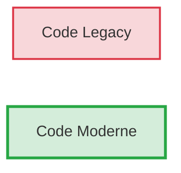
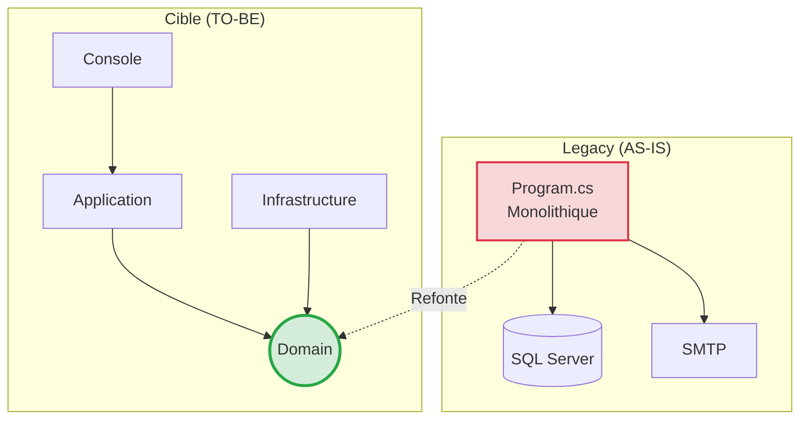
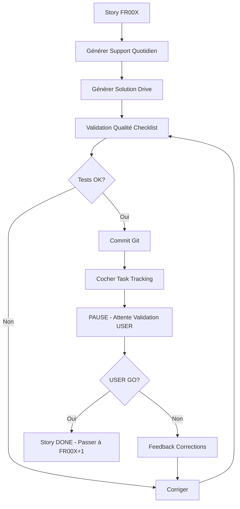

# Architecture Documentaire - Formation .NET Legacy → .NET 8

**Version** : 1.0  
**Date** : 19 mars 2026  
**Architecte** : Agent BMAD  
**Statut** : ✅ Validé

---

## 📋 Vue d'Ensemble

Ce document définit l'architecture complète des livrables de formation :
- Structure des dossiers (Git vs Drive)
- Conventions de nommage
- Format des documents (Markdown + Mermaid)
- Template de session (structure standardisée)
- Règles de scaffolding (pistes vs solution complète)

---

## 📁 Structure des Dossiers

### Git Repository (Stagiaires + Formateur)

```
net-mod-legacy/
├─ .bmad/                           ← Persistance BMAD (méthode)
│  ├─ 00_TABLE_RONDE_EXPERTS.md
│  ├─ 01_PRD_FORMATION.md
│  ├─ 02_EPICS_STORIES.md
│  ├─ 03_ARCHITECTURE_DOCUMENTAIRE.md (ce fichier)
│  ├─ 04_PROJECT_CONTEXT.md
│  └─ 05_TASK_TRACKING.md
│
├─ 00_Reference_Client/             ← Code legacy original (READ ONLY)
│  └─ ValidFlow.NetFramework48/
│
├─ 01_Demo_Formateur/               ← Démos live formateur (DataGuard)
│  └─ (sessions formateur)
│
├─ 02_Atelier_Stagiaires/           ← Code exercices stagiaires
│  └─ ValidFlow.Legacy/
│     └─ Program.cs                 (Code avec anti-patterns volontaires)
│
├─ 03_Support_Quotidien/            ← NOUVEAU - Livrable Quotidien Unique
│  ├─ Jour_1_Fondations.md          (Fusion Master + Workbook)
│  ├─ Jour_2_Data_DI.md
│  ├─ Jour_3_Securite.md
│  ├─ Jour_4_Tests_Docker.md
│  └─ Jour_5_CICD_Bilan.md
│
├─ 04_Checkpoints_Code/             ← Checkpoints Git (fin de jour)
│  ├─ checkpoint_jour_1/
│  ├─ checkpoint_jour_2/
│  └─ (etc.)
│
├─ .validation/                     ← Rapports BMAD validation (historique)
│  ├─ RAPPORT_SESSION_S1_J1.md
│  └─ (etc.)
│
└─ README.md                        ← Instructions clone stagiaires
```

### Google Drive (Solutions Formateur UNIQUEMENT)

```
G:\Drive partagés\wetic-s\modules\net-mod-legacy\net-mod-legacy_master_documents\
├─ Jour_1_Fondations\
│  └─ Solutions_A_Partager\
│     ├─ J1_S1_Solution_09h00_Analyse.md
│     ├─ J1_S2_Solution_10h40_Architecture.md
│     ├─ J1_S3_Solution_13h30_Domain.md
│     └─ J1_S4_Solution_15h10_CSharp12.md
│
├─ Jour_2_Data_DI\
│  └─ Solutions_A_Partager\
│     └─ (4 solutions)
│
└─ (idem pour Jours 3, 4, 5)
```

**Principe de Séparation** :
- **Git** : Contenu accessible aux stagiaires (support quotidien + code exercices)
- **Drive** : Solutions complètes réservées au formateur (partagées APRÈS l'exercice)

---

## 🏗️ Conventions de Nommage

### Fichiers Support Quotidien (Git)

**Format** : `Jour_X_Theme.md`

**Exemples** :
- `Jour_1_Fondations.md`
- `Jour_2_Data_DI.md`
- `Jour_3_Securite.md`

**Règle** : 
- `X` = numéro du jour (1-5)
- `Theme` = mot-clé du jour (PascalCase, max 3 mots)

### Fichiers Solutions (Drive)

**Format** : `JX_SY_Solution_HHhMM_Theme.md`

**Exemples** :
- `J1_S1_Solution_09h00_Analyse.md`
- `J1_S2_Solution_10h40_Architecture.md`
- `J2_S3_Solution_13h30_Repository.md`

**Règle** :
- `JX` = Jour X (1-5)
- `SY` = Session Y (1-4)
- `HHhMM` = Horaire début session
- `Theme` = Mot-clé session (PascalCase)

### Documents BMAD (.bmad/)

**Format** : `XX_NOM_DOCUMENT.md`

**Exemples** :
- `00_TABLE_RONDE_EXPERTS.md`
- `01_PRD_FORMATION.md`
- `05_TASK_TRACKING.md`

**Règle** :
- `XX` = Numéro séquentiel (00-99)
- `NOM_DOCUMENT` = UPPERCASE avec underscores

---

## 🎨 Design Informationnel à Double Lecture

### Icônes Obligatoires

| Icône | Nom Section | Usage | Durée Typique |
|-------|-------------|-------|---------------|
| 🧠 | **Concepts Fondamentaux** | Théorie pure, définitions, principes | 10-15 min |
| 💡 | **L'Astuce Pratique** | Anecdote, métaphore, best-practice | 5 min |
| 💬 | **Analyse Collective** | Question ouverte + silence 5-8s | 5 min |
| 👨‍💻 | **Démonstration Live** | Formateur exécute commandes dans `01_Demo_Formateur/` - Stagiaires observent | 10-20 min |
| ⚙️ | **Défi d'Application** | Stagiaires travaillent dans `02_Atelier_Stagiaires/` - Exercice pratique | 15-45 min |
| 🔗 | **Lien vers la Solution** | Phrase standard + lien Drive | 1 min |

### Structure Type d'une Session

```markdown
# Session SY - HHhMM : Titre Session

## 🧠 Concepts Fondamentaux

[Théorie expliquée - 2-3 paragraphes]

### Tableau Synthèse (optionnel)

| Concept | Définition | Exemple |
|---------|------------|---------|
| ...     | ...        | ...     |

### Diagramme Mermaid

```mermaid
graph LR
    ...
\`\`\`

---

## 💡 L'Astuce Pratique

> **Métaphore** : [Analogie simple]
>
> [Explication 2-3 lignes]

**Best-Practice** : [Conseil actionnable]

---

## 💬 Analyse Collective

**Question à la Salle** :

> "[Question ouverte qui fait réfléchir]"

**🎤 Instruction Formateur** :
- Posez la question
- Silence 5-8 secondes (laissez réfléchir)
- Accueillez 2-3 réponses
- Synthétisez : "[Réponse attendue]"

---

## 👨‍💻 Démonstration Live

**🎯 Ce que le formateur va montrer** :

[Description brève de la démo - 1-2 lignes]

**📂 Répertoire de Travail** : `01_Demo_Formateur/`

**⏱️ Durée** : 10-20 minutes

**Étapes** :

1. **[Nom étape 1]**
   ```bash
   # Commande exacte à taper
   cd 01_Demo_Formateur
   dotnet new classlib -n Demo.Project
   ```
   **Explication** : [Pourquoi cette commande]
   
2. **[Nom étape 2]**
   ```bash
   # Commande exacte à taper
   dotnet build
   ```
   **Résultat attendu** : [Ce que les stagiaires voient à l'écran]

**💬 Message aux stagiaires** :
> "Observez bien les commandes. Vous allez reproduire exactement la même chose dans votre dossier `02_Atelier_Stagiaires/` juste après."

---

## ⚙️ Défi d'Application

**Contexte** : [1-2 lignes de mise en situation]

**Mission** : [Action précise à réaliser]

**📂 Répertoire de Travail** : `02_Atelier_Stagiaires/`

**Durée** : XX minutes

**Critères de Succès** :
- [ ] Critère 1
- [ ] Critère 2
- [ ] Critère 3

**Format de Réponse** : (si applicable)
```
[Structure attendue]
\`\`\`

---

### 💡 Pistes de Réflexion (SCAFFOLDING)

**Pour démarrer** :
- [Indice 1 : Où chercher]
- [Indice 2 : Quelle méthode utiliser]
- [Indice 3 : Comment valider]

**Si vous bloquez** :
- [Erreur courante + solution]

**Pour aller plus loin** : (optionnel)
- [Challenge avancé]

---

## 🔗 Solution Complète

La solution détaillée est disponible ici :

📂 `Solutions_A_Partager/JX_SY_Solution_HHhMM_Theme.md`

**Le formateur partagera le lien après l'exercice.**

---

## 🎤 Scripts Téléprompter (Formateur)

### Script Ouverture Session

> "[Phrase d'accroche - 1 ligne]
>
> [Explication objectif - 2-3 lignes]
>
> [Annonce plan session - 1 ligne]"

**Durée** : 2 minutes

---

### Script Lancement Exercice

> "[Rappel mission - 1 ligne]
>
> Vous avez XX minutes. Top chrono !"

**Action** : Lancer chronomètre projeté à l'écran

**Durée** : 1 minute

---

## ⏱️ Timing Détaillé

| Horaire | Section | Durée | Cumul |
|---------|---------|-------|-------|
| HHhMM | 🧠 Concepts Fondamentaux | 10 min | 10 min |
| HHhMM+10 | 💡 + 💬 | 10 min | 20 min |
| HHhMM+20 | ⚙️ Exercice (Lancement) | 2 min | 22 min |
| HHhMM+22 | ⚙️ Exercice (Travail) | 15 min | 37 min |
| HHhMM+37 | 🔗 Correction | 15 min | 52 min |

**Total** : 52 minutes (ajuster selon durée session cible 1h00-1h30)
```

---

## 📏 Règles de Scaffolding

### Principe Général

**Objectif** : Guider sans donner la réponse complète

**Équilibre** :
- ❌ Trop guidé : "Copiez ce code ligne 15"
- ✅ Équilibré : "Cherchez les secrets (lignes 15-20)"
- ❌ Pas assez : "Trouvez les problèmes" (trop vague)

### Matrice de Scaffolding par Niveau

| Niveau Stagiaire | Scaffolding Recommandé | Exemple |
|------------------|------------------------|---------|
| Junior (1-2 ans) | Fort (5 indices précis) | "Ligne 16 : Cherchez le mot 'password'" |
| Intermédiaire (3-4 ans) | Moyen (3 indices contextuels) | "Sécurité : Cherchez les secrets hardcodés" |
| Senior (5+ ans) | Léger (1-2 pistes générales) | "Catégories : Sécurité, Performance, Robustesse..." |

**Règle Formation** : Cibler niveau **Intermédiaire** (moyen)

### Format Standard des Pistes

```markdown
### 💡 Pistes de Réflexion

**Pour démarrer** :
- [Catégorie] : [Question orientée] (lignes XX-YY si pertinent)
- [Catégorie] : [Question orientée]

**Si vous bloquez** :
- Erreur [X] : [Explication courte + solution]

**Pour aller plus loin** : (optionnel)
- [Challenge avancé pour seniors]
```

### Anti-Patterns à Éviter

❌ **Ne JAMAIS faire** :
- Donner le code exact dans les pistes
- Donner les numéros de ligne exacts de tous les problèmes
- Répondre à la question dans l'énoncé

✅ **À faire** :
- Donner une plage de lignes (ex: "lignes 15-20")
- Poser des questions qui guident la réflexion
- Fournir le contexte business (pourquoi c'est un problème)

---

## 📝 Format Markdown Standard

### Structure Générale

```markdown
# Jour X - Titre Jour

**Durée** : 6h00 (4 sessions × 1h30)  
**Objectif** : [Phrase courte]

---

## Session 1 - 09h00 : Titre Session 1

[Contenu session avec icônes 🧠💡💬⚙️🔗]

---

## Session 2 - 10h40 : Titre Session 2

[Contenu session]

---

## Session 3 - 13h30 : Titre Session 3

[Contenu session]

---

## Session 4 - 15h10 : Titre Session 4

[Contenu session]

---

## 📋 Checkpoint Fin de Journée

**Ce que vous avez accompli aujourd'hui** :
- [ ] [Réalisation 1]
- [ ] [Réalisation 2]

**Prochaine Session (Demain 09h00)** :
- [Aperçu Jour X+1]
```

### Conventions Markdown

**Titres** :
- `#` Jour
- `##` Session
- `###` Sous-section (🧠, 💡, etc.)
- `####` Détails (rarement utilisé)

**Emphases** :
- `**Gras**` pour les termes importants
- `*Italique*` pour les concepts (rarement)
- `` `Code inline` `` pour noms de classes, fichiers

**Listes** :
- `- [ ]` Checklist (critères de succès)
- `-` Liste à puces standard
- `1.` Liste numérotée (étapes séquentielles)

**Blocs de Code** :
```markdown
\`\`\`csharp
// Code C#
\`\`\`

\`\`\`bash
# Commandes CLI
\`\`\`

\`\`\`mermaid
graph LR
    A --> B
\`\`\`
```

**Citations** :
```markdown
> 🎤 **SCRIPT FORMATEUR**
>
> "Texte à dire exactement"
```

---

## 🎨 Diagrammes Mermaid

### Types Autorisés

1. **graph** : Flux de données, architecture
2. **classDiagram** : Entités, relations DDD
3. **sequenceDiagram** : Appels méthodes, interactions
4. **journey** : User Journeys (formateur, stagiaires)
5. **gantt** : Planning (rarement)

### Standards Visuels

**Couleurs** :


**Règle** :
- Rouge (`#dc3545`) : Legacy, anti-pattern, problème
- Vert (`#28a745`) : Moderne, solution, objectif
- Bleu (`#007bff`) : Infrastructure, externe
- Jaune (`#ffc107`) : Avertissement, attention

### Exemple Standard Architecture



---

## 🔒 Règles de Sécurité Pédagogique

### NFR001 - Zéro Mention IA

**Interdictions Strictes** :
- ❌ IA, AI, intelligence artificielle
- ❌ ChatGPT, GPT-4, Claude, Copilot
- ❌ NotebookLM, LLM, modèle de langage
- ❌ "Généré par", "Créé avec", "Assisté par"
- ❌ Toute référence à l'automatisation de la génération

**Validation** :
```bash
# Scan automatique dans TASK_TRACKING.md
grep -i -E "(IA|AI|ChatGPT|Claude|Copilot|NotebookLM|LLM)" 03_Support_Quotidien/*.md
# Doit retourner : 0 résultat
```

**Raison** : Les stagiaires doivent croire que le contenu est créé par un formateur humain expert.

---

### NFR002 - Langue Unique (Français)

**Règle** :
- 100% du contenu en français
- Exception : Code C#, commandes CLI (naturellement en anglais)
- Commentaires code : français

**Validation** : Review manuelle

---

## 📂 Format des Solutions (Drive)

### Structure Type Solution

```markdown
# Solution - Session SY - Titre Session

**Jour** : X  
**Session** : Y  
**Horaire** : HHhMM  
**Durée Exercice** : XX minutes

---

## 🎯 Objectif de l'Exercice

[Rappel mission en 1-2 lignes]

---

## 📋 Réponse Attendue

### Problème 1 : [Catégorie]

**Localisation** : Lignes XX-YY

**Code Problématique** :
```csharp
// Code avec anti-pattern
\`\`\`

**Impact Business** :
- Risque : [Description]
- Coût Estimé : [Montant]

**Solution Moderne** :
```csharp
// Code corrigé
\`\`\`

**Explication** :
[Pourquoi c'est mieux - 2-3 lignes]

---

(Répéter pour chaque problème)

---

## 📊 Synthèse

### Tableau Récapitulatif

| # | Catégorie | Ligne | Impact Business | Coût |
|---|-----------|-------|-----------------|------|
| 1 | Sécurité  | 16-19 | Violation RGPD  | 50k€-500k€ |
| 2 | Performance | 25 | Timeout SQL | 10k€/an |
| ... | ... | ... | ... | ... |

**Total Coût Dette** : [Montant]

---

## 🏗️ Architecture Cible

[Diagramme Mermaid de la solution complète]

---

## 🚀 Pour Aller Plus Loin

**Challenge Avancé** : (optionnel)
- [Exercice supplémentaire pour seniors]

**Ressources** :
- [Lien documentation officielle]
```

---

## ✅ Checklist de Validation par Livrable

### Avant de Marquer une Story DONE

**Livrable Git (Support Quotidien)** :
- [ ] Fichier `Jour_X_Theme.md` créé dans `03_Support_Quotidien/`
- [ ] Toutes les icônes présentes (🧠💡💬⚙️🔗)
- [ ] Scaffolding (💡 Pistes) présent pour tous les exercices
- [ ] Scripts téléprompter 🎤 (minimum 2 par session)
- [ ] Timing documenté (tableau ⏱️ avec cumul)
- [ ] Diagramme Mermaid valide (test rendu)
- [ ] Zéro mention IA (scan grep)
- [ ] Markdown valide (pas d'erreurs syntaxe)
- [ ] Langue française (sauf code/CLI)

**Livrable Drive (Solution)** :
- [ ] Fichier `JX_SY_Solution_HHhMM_Theme.md` créé sur Drive
- [ ] Code testé (compile sans erreur)
- [ ] Commandes CLI testées sur Windows PowerShell
- [ ] Tableau synthèse présent
- [ ] Impact business chiffré
- [ ] Diagramme architecture cible

**Validation BMAD** :
- [ ] Story cochée dans `.bmad/05_TASK_TRACKING.md`
- [ ] Commit Git avec message conventionnel
- [ ] USER validé (GO/NOGO reçu)

---

## 🔄 Workflow de Génération (Sprints)

### Processus Standard par Story



**Points de Blocage** :
1. ⛔ Tests ne passent pas → Corriger code solution
2. ⛔ Scan IA positif → Réécrire section concernée
3. ⛔ USER NOGO → Appliquer feedback avant de continuer

---

## 📝 Notes d'Architecture

### Décisions Clés

**Décision #1 - Livrable Quotidien Unique**
- **Alternative Rejetée** : Master Document + Workbook séparés
- **Choix Retenu** : Fusion avec Design Informationnel à Double Lecture
- **Raison** : Maintenance simplifiée, icônes permettent double usage
- **Date** : 19 mars 2026

**Décision #2 - Scaffolding Niveau Moyen**
- **Alternative Rejetée** : Code complet dans énoncé OU aucune aide
- **Choix Retenu** : Pistes de réflexion (questions + plages de lignes)
- **Raison** : Équilibre apprentissage actif vs risque blocage
- **Date** : 19 mars 2026

**Décision #3 - Solutions sur Drive (Hors Git)**
- **Alternative Rejetée** : Solutions dans repository Git (branche solution)
- **Choix Retenu** : Drive séparé, partage manuel par formateur
- **Raison** : Évite triche stagiaires, contrôle timing partage
- **Date** : 19 mars 2026

---

**Fin Architecture Documentaire - Version 1.0**

**Prochaine Étape** : Créer `.bmad/04_PROJECT_CONTEXT.md` (Conventions + Stack)
