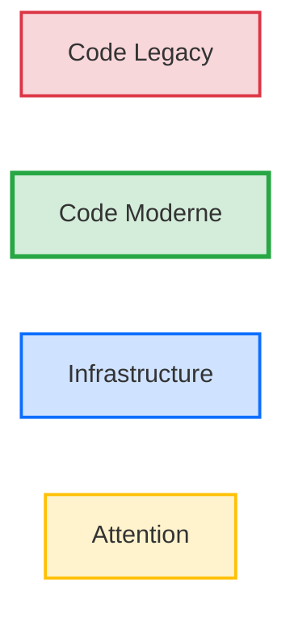
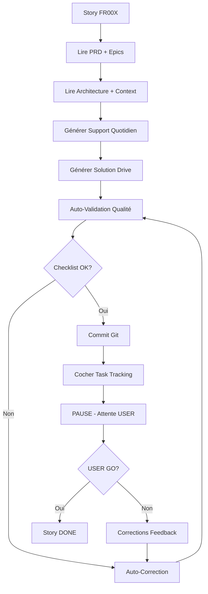

# Project Context - Formation .NET Legacy → .NET 8

**Version** : 1.0  
**Date** : 19 mars 2026  
**Responsable** : Agent BMAD  
**Statut** : ✅ Validé

---

## 📋 Vue d'Ensemble

Ce document centralise toutes les conventions, règles et contraintes techniques du projet de formation. Il sert de **mémoire persistante** pour garantir la cohérence de tous les livrables générés.

**Objectif** : Cadrer le LLM pour éviter les hallucinations et garantir que tous les agents respectent les mêmes standards.

---

## 🎯 Objectif du Projet

**Produit** : Programme de formation 5 jours (35h) pour transformer une application .NET Framework legacy en solution .NET 8 moderne

**Contraintes Client** :
- Formateur = développeur .NET senior (10+ ans expérience)
- Stagiaires = développeurs .NET (1-10 ans expérience, niveau mixte)
- Format = présentiel ou distanciel (2 écrans pour démo live)
- Durée sessions = 1h00 à 1h30 maximum
- Budget = Zéro (pas d'outils payants)

---

## 🛠️ Stack Documentaire

### Formats Autorisés

| Type Document | Format | Validation |
|---------------|--------|------------|
| Support quotidien | Markdown (GitHub Flavored) | Lint markdown |
| Solutions | Markdown | Lint markdown |
| Diagrammes | Mermaid uniquement | Test rendu |
| Code | C# (.cs), Bash (.sh), PowerShell (.ps1) | Syntaxe valide |
| Configuration | JSON (.json), XML (.csproj) | Schéma valide |

### Interdictions

❌ **Formats INTERDITS** :
- PowerPoint (.pptx)
- Word (.docx)
- PDF (pour support quotidien)
- HTML standalone
- LaTeX

**Raison** : Git-friendly, versionnable, éditeur texte simple

---

## 📝 Conventions d'Écriture

### Langue

**Règle Absolue** : Français uniquement

**Exceptions** :
- Code C# (naturellement en anglais)
- Commandes CLI (dotnet, git, etc.)
- Noms de fichiers techniques (.csproj, Program.cs)
- Termes techniques sans traduction (Clean Architecture, Repository Pattern)

**Validation** : Review manuelle

---

### Ton et Style

**Principes** :
- Professionnel mais accessible
- Tutoyer les stagiaires ("Vous allez créer...")
- Vouvoyer le formateur dans instructions ("Vous incarnez le Tech Lead...")
- Éviter jargon inutile
- Préférer exemples concrets aux théories abstraites

**Anti-Patterns Rédactionnels** :
- ❌ "Il est important de noter que..." (verbeux)
- ✅ "Attention :" (direct)
- ❌ "On pourrait penser que..." (indirect)
- ✅ "Erreur courante :" (direct)

---

### Formatage Markdown

**Titres** :
```markdown
# Jour X - Titre Jour (H1 - 1 seul par fichier)
## Session Y - HHhMM : Titre Session (H2)
### 🧠 Concepts Fondamentaux (H3 - avec icône)
#### Sous-section (H4 - rarement)
```

**Emphases** :
- `**Gras**` : Termes importants, définitions
- `*Italique*` : Rarement (seulement pour emphase légère)
- `` `Code inline` `` : Classes, méthodes, fichiers

**Listes** :
```markdown
- [ ] Checklist (critères de succès, tâches)
- Liste à puces (énumération simple)
1. Liste numérotée (étapes séquentielles)
```

**Blocs de Code** :
- Toujours spécifier le langage : `csharp`, `bash`, `mermaid`
- Utiliser `// ...` pour indiquer code tronqué
- Commenter le code solution en français

---

## 🎨 Design Informationnel (Icônes)

### Icônes Obligatoires

**Règle** : Utiliser EXACTEMENT ces icônes (copier-coller Unicode)

| Icône | Code Unicode | Nom Section | Usage |
|-------|--------------|-------------|-------|
| 🧠 | U+1F9E0 | Concepts Fondamentaux | Théorie |
| 💡 | U+1F4A1 | L'Astuce Pratique / Pistes | Métaphore, scaffolding |
| 💬 | U+1F4AC | Analyse Collective | Question ouverte |
| ⚙️ | U+2699 | Défi d'Application | Exercice pratique |
| 🔗 | U+1F517 | Lien vers la Solution | Référence Drive |
| 🎤 | U+1F3A4 | Script Téléprompter | Parole formateur |
| ⏱️ | U+23F1 | Timing Détaillé | Tableau horaires |

**Validation** : Scan automatique présence icônes

---

## 🔒 Règles de Sécurité (NFR)

### NFR001 - Zéro Mention IA

**Interdictions Strictes** :

```regex
(IA|AI|ChatGPT|GPT-4|Claude|Copilot|Gemini|NotebookLM|LLM|
intelligence artificielle|artificial intelligence|
modèle de langage|language model|
généré par|generated by|créé avec|assisté par)
```

**Scan Automatique** :
```bash
grep -i -E "(IA|AI|ChatGPT|Claude|Copilot|NotebookLM|LLM)" \
  03_Support_Quotidien/*.md \
  Jour_1_Fondations/Solutions_A_Partager/*.md
```

**Doit retourner** : 0 résultat

**Raison** : Authenticité pédagogique (stagiaires croient contenu créé par humain expert)

---

### NFR002 - Design à Double Lecture

**Obligation** : Toutes les sections doivent avoir une icône

**Validation** :
- Scan présence 🧠💡💬⚙️🔗 dans chaque session
- Minimum 5 icônes par session (une de chaque type)

---

### NFR003 - Scaffolding Obligatoire

**Règle** : Toute section ⚙️ Défi DOIT avoir une section 💡 Pistes de réflexion

**Format Standard** :
```markdown
### 💡 Pistes de Réflexion

**Pour démarrer** :
- [Catégorie] : [Question orientée] (lignes XX-YY)
- ...

**Si vous bloquez** :
- Erreur [X] : [Solution courte]

**Pour aller plus loin** : (optionnel)
- [Challenge avancé]
```

**Validation** : Review manuelle (checklist dans TASK_TRACKING)

---

### NFR004 - Scripts Téléprompter

**Obligation** : Minimum 2 scripts 🎤 par session

**Types de Scripts** :
1. **Script Ouverture** : Accueil + objectif session
2. **Script Lancement Exercice** : Mission + chronomètre

**Format** :
```markdown
### 🎤 Script [Type]

> "[Texte exact à dire - citation Markdown]
>
> [Ligne 2]"

**Durée** : X minutes

**Action** : [Action physique à faire]
```

---

### NFR005 - Timing Documenté

**Obligation** : Chaque session doit avoir un tableau ⏱️ Timing Détaillé

**Format** :
```markdown
## ⏱️ Timing Détaillé

| Horaire | Section | Durée | Cumul |
|---------|---------|-------|-------|
| HHhMM | 🧠 Concepts | 10 min | 10 min |
| HHhMM+10 | 💡 + 💬 | 10 min | 20 min |
| ... | ... | ... | ... |

**Total** : XX minutes
```

**Validation** : Total = durée session (1h00-1h30)

---

## 🏗️ Architecture Technique (Exemples Code)

### Stack .NET

**Version Cible** : .NET 8 (LTS)

**Frameworks** :
- Entity Framework Core 8
- xUnit (tests)
- Moq (mocks - optionnel)

**Outils CLI** :
- dotnet CLI (standard)
- git (versionning)

**IDE** : VS Code + C# Dev Kit (ou Visual Studio 2022)

---

### Conventions Code C#

**Namespaces** : File-scoped (C# 10+)
```csharp
namespace ValidFlow.Domain.Entities;

public record Client(string Nom, string Email);
```

**Naming** :
- Classes : PascalCase (`Client`, `ValidationRule`)
- Méthodes : PascalCase (`IsValid()`, `ValidateData()`)
- Propriétés : PascalCase (`MinLength`, `Email`)
- Paramètres : camelCase (`minLength`, `email`)
- Privés : _camelCase (`_repository`, `_logger`)

**Structure Fichier** :
```csharp
namespace Project.Layer.SubLayer;

// Usings en haut (C# 10+)
using System;
using System.Linq;

public class MyClass
{
    // Ordre : Champs → Propriétés → Constructeur → Méthodes
}
```

---

### Conventions Diagrammes Mermaid

**Couleurs Standard** :



**Palette** :
- Rouge `#dc3545` : Legacy, anti-pattern, problème
- Vert `#28a745` : Moderne, solution, objectif
- Bleu `#0d6efd` : Infrastructure, externe
- Jaune `#ffc107` : Avertissement

**Direction Préférée** :
- `graph LR` (gauche-droite) : Architecture, flux données
- `graph TB` (top-bottom) : Hiérarchie, dépendances

---

## 📂 Gestion Git

### Stratégie de Branches

**Règle** : Single branch `main` uniquement

**Checkpoints** : Créés en fin de jour dans `04_Checkpoints_Code/`

**Raison** : Éviter complexité merge conflicts pour stagiaires

---

### Messages de Commit

**Format Conventionnel** :

```
<type>(<scope>): <description>

[body optionnel]
```

**Types** :
- `feat` : Nouvelle fonctionnalité
- `fix` : Correction bug
- `docs` : Documentation
- `refactor` : Refactoring
- `test` : Ajout tests
- `chore` : Maintenance

**Exemples** :
```
feat(bmad): PRD Formation v1.0 - 5 Douleurs + 3 Personas + 20 FR
docs(jour1): Session 09h00 - Analyse Legacy avec scaffolding
refactor(domain): Migration Client vers record C# 12
```

---

## 🎯 Principes Pédagogiques

### Scaffolding (Support Dégradé)

**Principe** : Guider sans donner la réponse

**Niveaux** :
1. **Junior** : 5 indices précis avec numéros ligne
2. **Intermédiaire** : 3 indices contextuels avec plage lignes
3. **Senior** : 1-2 pistes générales

**Formation Cible** : Niveau **Intermédiaire**

**Exemple** :
```markdown
### 💡 Pistes de Réflexion

**Pour démarrer** :
- 🔓 Sécurité : Cherchez les mots de passe (lignes 15-20)
- 🐌 Performance : Les appels SQL sont-ils async ?
- 💥 Robustesse : Que se passe-t-il si SQL plante ?
```

---

### Pédagogie Active

**Principe** : "Montrer puis Faire"

**Séquence Type** :
1. Formateur démontre en live (écran 2)
2. Stagiaires reproduisent (15-45 min)
3. Correction collective avec solution Drive

**Durée Exercice** :
- Court : 15 minutes (détection problèmes)
- Moyen : 30 minutes (création projets)
- Long : 45 minutes (implémentation code)

---

### Questions Socratiques

**Format 💬 Analyse Collective** :

```markdown
## 💬 Analyse Collective

**Question à la Salle** :

> "[Question ouverte qui fait réfléchir]"

**🎤 Instruction Formateur** :
- Posez la question
- Silence 5-8 secondes (laissez réfléchir)
- Accueillez 2-3 réponses
- Synthétisez : "[Réponse attendue]"
```

**Objectif** : Engagement actif vs lecture passive

---

## 🚀 Workflow de Génération

### Processus par Story (Sprint)



---

### Checklist de Validation Automatique

**Avant Commit** :

```bash
# 1. Scan IA
grep -i -E "(IA|AI|ChatGPT)" 03_Support_Quotidien/Jour_1_Fondations.md
# Résultat attendu : 0

# 2. Vérif icônes
grep -E "(🧠|💡|💬|⚙️|🔗)" 03_Support_Quotidien/Jour_1_Fondations.md
# Résultat attendu : Minimum 5 occurrences

# 3. Test Markdown
# (pas de commande standard, review visuel)

# 4. Test Mermaid
# (vérifier rendu dans preview Markdown)
```

---

## 📊 Métriques de Qualité

### KPI par Livrable

| Critère | Cible | Validation |
|---------|-------|------------|
| Mentions IA détectées | 0 | Scan grep |
| Icônes présentes | 5+ par session | Scan grep |
| Scripts téléprompter | 2+ par session | Review manuelle |
| Scaffolding (💡 Pistes) | 100% exercices | Review manuelle |
| Timing documenté | 1 tableau ⏱️ par session | Review manuelle |
| Code testé | 100% solutions | dotnet build + test |

---

## 🔧 Environnement Technique

### Prérequis Stagiaires

**Système** :
- Windows 11, macOS, ou Linux
- 8 GB RAM minimum
- 20 GB espace disque

**Logiciels** :
- .NET 8 SDK
- Git 2.40+
- VS Code + C# Dev Kit OU Visual Studio 2022
- SQL Server Express (optionnel Jour 2+)

**Validation Environnement** :
```bash
dotnet --version  # Doit afficher 8.x.x
git --version     # Doit afficher 2.40+
code --version    # Doit afficher version VS Code
```

---

### Compatibilité Commandes

**Règle Absolue** : Toutes les commandes CLI DOIVENT fonctionner sur Windows PowerShell

**Commandes Universelles** :
- `dotnet` (CLI .NET - cross-platform)
- `git` (CLI Git - cross-platform)

**Commandes Windows** :
```powershell
New-Item -ItemType Directory -Name "MyFolder"
Remove-Item -Path "file.txt" -Force
Move-Item -Path "src.txt" -Destination "dest.txt"
```

**Interdictions** :
- ❌ `mkdir` (Unix) → Utiliser `dotnet new` ou `New-Item`
- ❌ `rm` (Unix) → Utiliser `Remove-Item`
- ❌ `mv` (Unix) → Utiliser `Move-Item`

**Exception** : Commandes dans `git bash` (fourni avec Git Windows)

---

## 📝 Template de Commit

**Chaque Commit de Story** :

```bash
git add 03_Support_Quotidien/Jour_1_Fondations.md
git add "G:/Drive partagés/.../J1_S1_Solution_09h00_Analyse.md"
git commit -m "feat(jour1-s1): Session 09h00 Analyse Legacy avec scaffolding complet

- Section 🧠 Concepts Fondamentaux (Dette Technique)
- Diagramme Mermaid AS-IS workflow
- Section ⚙️ Défi + 💡 Pistes (5 anti-patterns)
- Scripts 🎤 ouverture + lancement exercice
- Solution Drive avec impact business chiffré

Story FR001 - Validation USER requise
"
```

---

## 🎓 Glossaire Technique

| Terme | Définition | Utilisation |
|-------|------------|-------------|
| Clean Architecture | Architecture en couches concentriques (Domain au centre) | Jour 1 S2 |
| DDD | Domain-Driven Design - Focus sur le métier | Jour 1 S3 |
| Repository Pattern | Abstraction accès données | Jour 2 S3 |
| IoC | Inversion of Control - Injection dépendances | Jour 2 S1 |
| EF Core | Entity Framework Core - ORM .NET | Jour 2 S2 |
| xUnit | Framework de tests unitaires | Jour 4 S1 |

---

## 🚨 Anti-Patterns à Éviter

### Rédaction

❌ **Ne JAMAIS** :
- Mentionner "IA", "généré par", etc. (NFR001)
- Donner la solution complète dans l'énoncé
- Oublier les scripts téléprompter
- Mélanger français et anglais (hors code/CLI)
- Créer des exercices > 45 minutes

✅ **Toujours** :
- Scaffolding (💡 Pistes) pour tous les exercices
- Impact business chiffré (coût dette technique)
- Diagramme Mermaid pour architecture
- Timing détaillé avec cumul
- Valider code solution (compile + tests verts)

---

### Code

❌ **Ne JAMAIS** :
- Hardcoder secrets (même dans exemples)
- Utiliser `async void` (sauf event handlers)
- Ignorer exceptions (`catch (Exception) {}`)
- Mélanger logique métier et infrastructure

✅ **Toujours** :
- File-scoped namespaces (C# 10+)
- Primary constructors quand approprié (C# 12)
- Async/await pour I/O
- Tests unitaires pour Domain

---

## 📋 Résumé des Règles Critiques

### Top 10 Règles Non-Négociables

1. ✅ Zéro mention IA (NFR001)
2. ✅ Français uniquement (sauf code/CLI)
3. ✅ Icônes obligatoires (🧠💡💬⚙️🔗)
4. ✅ Scaffolding pour tous les exercices (💡 Pistes)
5. ✅ Scripts téléprompter (🎤 minimum 2 par session)
6. ✅ Timing documenté (⏱️ tableau avec cumul)
7. ✅ Diagramme Mermaid par session
8. ✅ Code solution testé (compile + tests verts)
9. ✅ Commandes Windows PowerShell compatibles
10. ✅ Validation USER avant Sprint suivant

---

**Fin Project Context - Version 1.0**

**Prochaine Étape** : Créer `.bmad/05_TASK_TRACKING.md` (Fichier de suivi des tâches)
