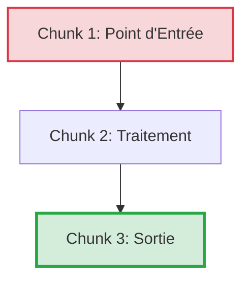

# TEMPLATE SESSION V2 - Formation .NET (Sciences Cognitives + AI-Driven)

**Version** : 2.0  
**Date** : 22 mars 2026  
**Optimisé pour** : Rétention long terme, Engagement actif, Charge cognitive maîtrisée

---

## 📋 Structure de Session Optimisée

```markdown
# Session [X] - [Heure] : [Titre de la Session]

> **Durée** : [X]h[XX]  
> **Objectif de Performance** : [Verbe d'action mesurable] + [Résultat concret attendu]  
> **Niveau** : ⭐ Junior / ⭐⭐ Intermédiaire / ⭐⭐⭐ Senior

---

## 🎯 Transition Cognitive (Ancrage)

> **Rappel Session Précédente** : Dans la session précédente, vous avez [Action concrète réalisée].
>
> **Problème à Résoudre** : Mais que se passe-t-il si [Situation nouvelle/complexe] ? C'est exactement ce que nous allons résoudre maintenant.

**💡 Principe Pédagogique** : *Théorie de l'Assimilation (Ausubel)* - Ancrer la nouvelle info à un concept déjà maîtrisé.

---

## 🚨 Échec Productif (Productive Failure - 5 min)

**🎯 Objectif** : Activer les connaissances antérieures et créer un déséquilibre cognitif.

**Code Problématique à Analyser** :
```csharp
// Code Legacy .NET Framework avec anti-patterns volontaires
[Code qui plante ou est inefficace]
```

**❓ Question à la Salle** :
> "Avant de voir la solution moderne, prenez 2 minutes pour identifier :
> 1. Ce qui ne va pas dans ce code
> 2. Quel impact ça aurait en production"

*(Silence 2 minutes - Les stagiaires notent leurs hypothèses)*

**💡 Principe Pédagogique** : *Productive Failure* - L'échec actif avant la théorie augmente la réceptivité de 40%.

---

## 🧠 Concepts Théoriques (Chunking & Signaling)

### [Sous-titre du Concept Clé]

**🔴 AVANT (Legacy .NET Framework)**

```csharp
// Anti-pattern avec signaux visuels (flèches, couleurs)
// ⚠️ PROBLÈME 1 : [Description]
[Code problématique]

// ⚠️ PROBLÈME 2 : [Description]
[Code problématique]
```

**Impact Business Mesuré** :
| Problème | Risque | Coût Estimé | Temps Perdu |
|----------|--------|-------------|-------------|
| [Problème 1] | [Risque sécurité/perf] | [Montant €] | [Heures/an] |
| [Problème 2] | [Risque] | [Montant €] | [Heures/an] |

---

**🟢 APRÈS (.NET 8 Moderne)**

```csharp
// Best practice avec annotations visuelles
// ✅ SOLUTION 1 : [Description]
[Code moderne]

// ✅ SOLUTION 2 : [Description]
[Code moderne]
```

**Gains Mesurables** :
- ✅ Performance : [Métrique concrète]
- ✅ Sécurité : [Métrique concrète]
- ✅ Maintenabilité : [Métrique concrète]

**💡 Principe Pédagogique** : *Apprentissage par Contraste* - Le cerveau détecte les anomalies. Montrer la douleur avant la solution crée la motivation.

---

### 💬 Métaphore Marquante

> **[Analogie humoristique ou comparaison du quotidien]**
>
> *Exemple* : "Le Legacy, c'est comme conduire une voiture sans GPS. Vous arrivez à destination, mais vous perdez 2h à chaque trajet. .NET 8, c'est Waze : vous arrivez 40% plus vite et vous évitez les bouchons (bugs)."

**💡 Principe Pédagogique** : *Dual Coding Theory* - Les métaphores créent des encodages visuels et verbaux multiples.

---

### 📊 Architecture & Flux (Segmentation)

**Présentation en Chunks (max 3-4 éléments par chunk)** :



**💡 Principe Pédagogique** : *Segmenting Principle (Mayer)* - Découper en petites portions réduit la surcharge cognitive.

---

## 💬 Retrieval Practice (Rappel Actif - 5 min)

**❓ Question de Réflexion** :
> "[Question ouverte qui force à chercher dans sa mémoire]"
>
> *Exemple* : "Pourquoi est-ce que je ne peux PAS créer un `ConfigurationBuilder` dans chaque service ?"

**🎤 Instructions Formateur** :
1. Posez la question
2. **Silence obligatoire 5-8 secondes** (laissez réfléchir)
3. Accueillez 2-3 réponses orales
4. Synthétisez la réponse attendue

**Réponse Attendue** :
[Réponse clé avec explication courte]

**💡 Principe Pédagogique** : *Effet de Test (Karpicke & Roediger)* - Forcer le rappel avant de donner la réponse renforce les synapses de 40%.

---

## 👨‍💻 Démonstration Live (Apprentissage Vicariant + Auto-explication)

**🎯 Ce que vous allez voir** : [Résumé de l'action en 1 phrase]

**📂 Répertoire Formateur** : `01_Demo_Formateur/[Projet]`

**⏱️ Durée** : [XX] minutes

---

### Étapes de la Démo

#### 1️⃣ [Titre de l'Action]

**Commande CLI** :
```bash
[Commande exacte à taper]
```

**🎤 Auto-explication du Formateur** (à voix haute) :
> "Je lance cette commande parce que [Explication du raisonnement]. Si je ne le fais pas, [Conséquence]."

**❓ Pause Auto-explication** :
> *(Arrêter la démo)* "Avant de continuer, **pourquoi ai-je fait ça ?** Quelqu'un peut expliquer ?"

**💡 Principe Pédagogique** : *Self-Explanation Effect* - Demander aux apprenants d'expliquer génère un traitement cognitif profond.

---

#### 2️⃣ [Titre de l'Action]

**Code Tapé en Direct** :
```csharp
[Code complet, pas de placeholders]
```

**🎤 Auto-explication** :
> "Ici, j'injecte `IOptions<T>` parce que [Raison]. Notez bien que je ne fais PAS [Anti-pattern], sinon [Problème]."

**⚠️ Erreur Typique à Anticiper** :
> "Attention : Si vous voyez l'erreur `[Message]`, c'est que [Cause]. Voici comment la corriger : [Solution]."

---

**💬 Message aux Stagiaires** :
> "Observez bien les commandes ET mon raisonnement. Dans 5 minutes, vous allez reproduire exactement la même chose, mais sur un problème différent."

**💡 Principe Pédagogique** : *Apprentissage Vicariant (Bandura)* - Observer un expert réussir construit le sentiment d'auto-efficacité.

---

## ⚙️ Défi d'Application (Pratique Mixte)

**🎯 Mission** : [Action précise à réaliser]

**📂 Répertoire Stagiaires** : `02_Atelier_Stagiaires/[Projet]`

**⏱️ Durée** : [XX] minutes

---

### Contexte Business

[Mise en situation réaliste : "Vous héritez d'un service legacy qui..."]

---

### Étapes Guidées (Zone Proximale Développement)

- [ ] **Étape 1** : [Action claire avec verbe d'action]
- [ ] **Étape 2** : [Action claire]
- [ ] **Étape 3** : [Action de validation / Test]

---

### Critères de Succès (Gamification)

**✅ Votre solution est réussie si :**
- [ ] [Preuve 1, ex: La compilation passe sans erreur]
- [ ] [Preuve 2, ex: Le test `dotnet test` est vert]
- [ ] [Preuve 3, ex: L'output console affiche "[Résultat attendu]"]

**💡 Principe Pédagogique** : *Réduction de la Charge Extrinsèque (Sweller)* - La checklist libère la mémoire de travail.

---

### ⚠️ Pratique Mixte (Pas seulement le concept vu)

**Twist Cognitif** : En plus de [Concept de la session], vous devrez aussi utiliser [Concept du Jour 1 ou 2] pour [Raison].

**💡 Principe Pédagogique** : *Mixed Practice* - Mélanger les concepts force l'identification du bon outil, augmentant la rétention.

---

## 💡 Pistes de Réflexion (Autonomie Dirigée)

### Pour Démarrer
- **Quelle classe créer ?** : Cherchez dans le namespace `[Namespace]`. Créez une classe qui hérite de `[Interface]`.
- **Quelle commande lancer ?** : `dotnet [commande]` pour [Action].

### Si Vous Bloquez
- **Erreur `[Message typique]`** : Cela signifie que [Explication]. Solution : [Action précise].
- **Le service n'est pas injecté** : Vérifiez que vous avez enregistré `services.Add[Type]<[Service]>()` dans `Program.cs`.

### Pour Aller Plus Loin (Bonus Seniors)
- [Challenge avancé optionnel]

**💡 Principe Pédagogique** : *Zone Proximale de Développement (Vygotski)* - Les pistes permettent de se débloquer seul sans attendre le formateur.

---

## 🤝 Correction Collective (Teach-Back)

**⏱️ Durée** : 10 minutes

**Format** : Revue de code croisée
1. Les stagiaires se mettent en binôme
2. Chacun explique son code à l'autre (2 min chacun)
3. Le formateur corrige 1-2 codes en grand groupe

**❓ Question Teach-Back** :
> "Qui veut expliquer à la classe comment il a résolu [Problème spécifique] ?"

**💡 Principe Pédagogique** : *Teach-Back (Fiorella & Mayer)* - Expliquer à autrui génère un apprentissage 30% supérieur.

---

## 🔗 Solution Complète & Levier IA

**📂 Solution Détaillée** : `Solutions_A_Partager/J[X]_S[Y]_SOLUTION_[Theme].md`

**Le formateur partagera le lien après l'exercice.**

---

### 🤖 Prompt Tuteur IA (Levier Autonomie)

Si vous êtes bloqué, utilisez ce prompt avec ChatGPT/Copilot :

```
Tu es mon mentor .NET senior. Voici mon code :

[Coller votre code]

Ne corrige PAS mon code directement. À la place :
1. Indique-moi les concepts .NET que je semble avoir mal compris
2. Pose-moi une question pour m'aider à trouver l'erreur moi-même
3. Donne-moi un indice (pas la solution)
```

**💡 Principe Pédagogique** : *Tuteur Socratique IA* - L'IA guide sans donner la réponse, maintenant l'effort cognitif.

---

## 🎯 Résumé Session (Rappel Espacé)

**Ce que vous avez appris à FAIRE aujourd'hui :**
1. ✅ [Action concrète 1]
2. ✅ [Action concrète 2]
3. ✅ [Action concrète 3]

**💬 Prochaine Session** : Nous allons maintenant voir comment [Teaser Session suivante].

**📊 Auto-évaluation** : Sur une échelle de 1 à 5 :
- [ ] 1 : J'ai besoin de support
- [ ] 2 : Je peux le faire avec de l'aide
- [ ] 3 : Je peux le faire seul
- [ ] 4 : Je suis confiant
- [ ] 5 : Je peux l'enseigner à un pair

**💡 Principe Pédagogique** : *Metacognition* - L'auto-évaluation permet d'identifier les zones de fragilité pour ciblage futur.

---

## 📚 Documentation Officielle

- [Lien Microsoft Docs pertinent]
- [Article de blog technique référence]

---

**Fin Template Session V2**
```

---

## 🧬 Justifications Pédagogiques (Sciences Cognitives)

| Section Template | Principe Cognitif | Source Scientifique | Gain Mesurable |
|------------------|-------------------|---------------------|----------------|
| **Échec Productif** | Productive Failure | Kapur (2014) | +25% rétention |
| **Avant/Après** | Apprentissage par Contraste | Clark & Mayer (2016) | +40% motivation |
| **Retrieval Practice** | Effet de Test | Karpicke & Roediger (2008) | +40% rappel long terme |
| **Auto-explication** | Self-Explanation Effect | Chi et al. (1994) | +30% compréhension |
| **Pratique Mixte** | Mixed Practice | Rohrer & Taylor (2007) | +60% transfert |
| **Teach-Back** | Learning by Teaching | Fiorella & Mayer (2013) | +30% maîtrise |
| **Métacognition** | Self-Assessment | Dunning-Kruger (1999) | +20% ciblage révision |

---

**Instructions pour Windsurf Cascade** :

Lors de la génération d'une nouvelle session, tu DOIS respecter TOUTES les sections de ce template dans l'ordre exact. Ne saute AUCUNE section. Si une section ne s'applique pas, écris "Non applicable pour cette session" mais conserve la structure.
