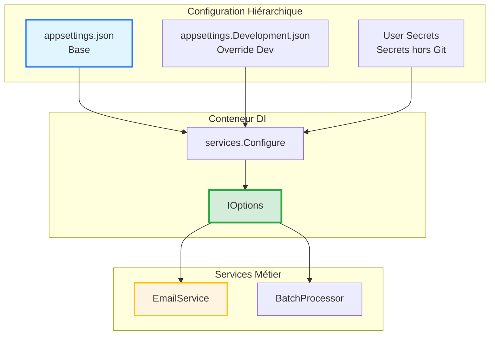

# TEMPLATE SOLUTION V2 - Exercices Formation .NET (Guidage Estompé + Levier IA)

**Version** : 2.0  
**Date** : 22 mars 2026  
**Optimisé pour** : Autonomie, Feedback explicatif, Résolution de problèmes

---

## 📋 Structure de Solution Optimisée

```markdown
# Solution - Jour [X] Session [Y] ([Heure]) : [Thème]

> **Formation** : Migration .NET Legacy vers .NET 8  
> **Thème** : [Thème de la session]  
> **Difficulté** : ⭐ Junior / ⭐⭐ Intermédiaire / ⭐⭐⭐ Senior

---

## 🎯 Objectif de la Solution

**Ce que cette solution accomplit** :
[Résumé de l'objectif en 1 phrase orientée action]

**Compétences développées** :
- [Compétence 1 mesurable]
- [Compétence 2 mesurable]
- [Compétence 3 mesurable]

---

## 📂 Structure de la Solution

**Arborescence ASCII** :
```text
Projet/
├── [Dossier1]/
│   ├── [Fichier1.cs]
│   └── [Fichier2.cs]
├── [Dossier2]/
│   └── [Fichier3.cs]
└── [FichierRacine.csproj]
```

**Fichiers créés/modifiés** :
- ✅ `[Chemin/Fichier1.cs]` : [Rôle du fichier]
- ✅ `[Chemin/Fichier2.cs]` : [Rôle du fichier]
- ✅ `[Chemin/Fichier3.cs]` : [Rôle du fichier]

---

## 🎓 Progression Pédagogique (Guidage Estompé / Fading)

### Niveau 1 : Exemple Résolu (Observez)

**Contexte** : Voici un exemple COMPLET d'implémentation similaire pour vous montrer la structure.

**📝 Fichier Exemple** : `Demo/ExempleComplet.cs`

```csharp
// Code complet fonctionnel avec annotations pédagogiques
namespace Demo;

// ✅ ÉTAPE 1 : Créer la classe Options
public class ExampleOptions
{
    public string Property1 { get; set; } = string.Empty;
    public int Property2 { get; set; }
}

// ✅ ÉTAPE 2 : Créer le service qui injecte IOptions
public class ExampleService
{
    private readonly ExampleOptions _options;

    public ExampleService(IOptions<ExampleOptions> options)
    {
        _options = options.Value;
    }

    public void Execute()
    {
        Console.WriteLine($"Config: {_options.Property1}");
    }
}

// ✅ ÉTAPE 3 : Enregistrer dans DI
// Dans Program.cs :
// services.Configure<ExampleOptions>(config.GetSection("Example"));
// services.AddTransient<ExampleService>();
```

**🎤 Explication du Raisonnement** :
- **Pourquoi IOptions<T> ?** : Permet le typage fort et l'injection DI
- **Pourquoi .Value ?** : Récupère l'instance configurée au démarrage
- **Pourquoi GetSection ?** : Lie automatiquement JSON → Propriétés C#

**💡 Principe Pédagogique** : *Worked Example Effect* - Montrer un exemple complet réduit la charge cognitive initiale.

---

### Niveau 2 : Completion Example (Complétez)

**Contexte** : Maintenant, voici le MÊME type de code mais avec des parties manquantes. Complétez-le AVANT de regarder la solution finale.

**📝 Fichier à Compléter** : `Exercice/EmailService.cs`

```csharp
namespace Exercice;

// TODO 1 : Créer la classe EmailOptions avec 3 propriétés
public class EmailOptions
{
    // ⚠️ À COMPLÉTER : SmtpServer (string), SmtpPort (int), FromEmail (string)
    // INDICE : Initialisez les strings à string.Empty
}

// TODO 2 : Injecter IOptions dans le constructeur
public class EmailService
{
    private readonly EmailOptions _options;

    // ⚠️ À COMPLÉTER : Constructeur avec injection IOptions<EmailOptions>
    public EmailService(/* ??? */)
    {
        // ⚠️ À COMPLÉTER : Récupérer .Value
    }

    public void SendEmail(string to, string subject, string body)
    {
        // ✅ FOURNI : Utilisation de la config
        Console.WriteLine($"Envoi via {_options.SmtpServer}:{_options.SmtpPort}");
    }
}
```

**❓ Questions d'Auto-explication** :
Avant de compléter, répondez mentalement :
1. Quel type dois-je injecter dans le constructeur ?
2. Comment accéder à la valeur de configuration ?

**💡 Principe Pédagogique** : *Completion Effect (Van Merriënboer)* - Compléter un code partiellement fourni réduit la surcharge tout en maintenant l'effort cognitif.

---

### Niveau 3 : Solution Finale (Vérifiez)

**Contexte** : Voici la solution complète de l'exercice. Comparez avec VOTRE code.

---

## 📝 Fichier 1 : [NomDuFichier.cs]

**Emplacement** : `[Chemin/Complet/Vers/Fichier.cs]`

```csharp
// Code complet, propre et commenté pédagogiquement
using System;
using Microsoft.Extensions.Options;

namespace [Namespace];

/// <summary>
/// [Description du rôle de cette classe]
/// </summary>
public class [NomClasse]
{
    // Champs privés
    private readonly [Type] _field;

    // Constructeur avec injection DI
    public [NomClasse]([TypeInjecté] parameter)
    {
        _field = parameter;
    }

    // Méthode publique
    public void [NomMéthode]()
    {
        // Implémentation
    }
}
```

**🔍 Points Clés du Code** :
1. **Ligne X-Y** : [Explication de cette portion]
2. **Ligne Z** : [Pourquoi cette approche plutôt qu'une autre]
3. **Pattern utilisé** : [Nom du pattern + raison]

---

## 📝 Fichier 2 : [appsettings.json]

**Emplacement** : `[Chemin]/appsettings.json`

```json
{
  "[SectionName]": {
    "Property1": "valeur",
    "Property2": 123
  }
}
```

**⚠️ Configuration .csproj** : Assurez-vous que le fichier est copié dans l'output :
```xml
<ItemGroup>
  <Content Include="appsettings.json">
    <CopyToOutputDirectory>PreserveNewest</CopyToOutputDirectory>
  </Content>
</ItemGroup>
```

---

## 📝 Fichier 3 : [Program.cs]

**Emplacement** : `[Chemin]/Program.cs`

```csharp
using Microsoft.Extensions.Configuration;
using Microsoft.Extensions.DependencyInjection;
using Microsoft.Extensions.Hosting;

var builder = Host.CreateDefaultBuilder(args);

// Configuration JSON
builder.ConfigureAppConfiguration((context, config) =>
{
    config.AddJsonFile("appsettings.json", optional: false, reloadOnChange: true);
});

// Enregistrement DI
builder.ConfigureServices((context, services) =>
{
    services.Configure<[OptionsClass]>(
        context.Configuration.GetSection("[SectionName]"));
    
    services.AddTransient<[ServiceClass]>();
});

var host = builder.Build();

// Test
var service = host.Services.GetRequiredService<[ServiceClass]>();
service.[Method]();
```

---

## 🚀 Instructions d'Exécution (Validation)

### Étape 1 : Compilation

```bash
cd [Chemin/Vers/Projet]
dotnet build
```

**✅ Résultat Attendu** :
```
Build succeeded.
    0 Warning(s)
    0 Error(s)
```

---

### Étape 2 : Exécution

```bash
dotnet run
```

**✅ Output Console Attendu** :
```
[Texte exact qui doit s'afficher]
[Ligne 2 de l'output]
[Ligne 3 de l'output]
```

---

### Étape 3 : Test de Modification Sans Recompilation

**Action** : Modifiez `appsettings.json` :
```json
{
  "[SectionName]": {
    "Property1": "nouvelle_valeur"
  }
}
```

**Relancez** : `dotnet run` (sans `dotnet build`)

**✅ Output Attendu** :
```
[Nouvelle valeur s'affiche]
```

**💡 Validation** : Si la nouvelle valeur s'affiche, vous avez réussi l'externalisation de la configuration.

---

## 🔧 Dépannage (Feedback Explicatif)

### ❌ Erreur : "Configuration section '[Section]' not found"

**Message Complet** :
```
System.InvalidOperationException: Configuration section '[Section]' not found
```

**❓ Diagnostic** :
Cette erreur signifie que le système de configuration ne trouve pas la section JSON demandée.

**🔍 Causes Possibles** :
1. Le fichier `appsettings.json` n'existe pas dans le répertoire de sortie
2. Le nom de section dans `GetSection("[Section]")` ne correspond pas au JSON
3. Le fichier JSON contient une erreur de syntaxe

**✅ Solutions** :

**Solution 1** : Vérifier la copie du fichier
```bash
# Vérifiez que appsettings.json est dans bin/Debug/net8.0/
dir bin/Debug/net8.0/appsettings.json  # Windows
ls bin/Debug/net8.0/appsettings.json   # Linux/Mac
```

Si absent, ajoutez dans `.csproj` :
```xml
<ItemGroup>
  <Content Include="appsettings.json">
    <CopyToOutputDirectory>PreserveNewest</CopyToOutputDirectory>
  </Content>
</ItemGroup>
```

**Solution 2** : Vérifier la correspondance des noms
```csharp
// Dans Program.cs
GetSection("EmailOptions")  // Doit correspondre EXACTEMENT à

// Dans appsettings.json
{
  "EmailOptions": { ... }  // Même casse, même orthographe
}
```

**Solution 3** : Valider le JSON
Utilisez un validateur JSON en ligne pour vérifier la syntaxe.

**💡 Principe Pédagogique** : *Elaborative Feedback* - Expliquer la cause + le processus de résolution, pas juste la solution.

---

### ❌ Erreur : "Cannot resolve service '[Service]'"

**Message Complet** :
```
System.InvalidOperationException: Unable to resolve service for type '[Service]'
```

**❓ Diagnostic** :
Le conteneur DI ne trouve pas le service demandé dans `GetRequiredService<T>()`.

**🔍 Causes Possibles** :
1. Le service n'est pas enregistré dans `ConfigureServices`
2. Le service est enregistré APRÈS être demandé (ordre d'enregistrement)
3. Le type demandé ne correspond pas au type enregistré (interface vs classe)

**✅ Solutions** :

**Solution 1** : Vérifier l'enregistrement
```csharp
// Dans ConfigureServices, ajoutez :
services.AddTransient<EmailService>();  // Ou AddScoped / AddSingleton
```

**Solution 2** : Vérifier l'ordre
```csharp
// ✅ CORRECT : Options AVANT le service qui en dépend
services.Configure<EmailOptions>(...);
services.AddTransient<EmailService>();

// ❌ INCORRECT : Service avant ses dépendances
services.AddTransient<EmailService>();
services.Configure<EmailOptions>(...);  // Trop tard !
```

**Solution 3** : Interface vs Implémentation
```csharp
// Si vous utilisez une interface
services.AddTransient<IEmailService, EmailService>();

// Alors demandez l'interface
var service = host.Services.GetRequiredService<IEmailService>();
```

**💡 Astuce Terrain** : Utilisez `GetService<T>()` pendant le debug pour avoir `null` au lieu d'une exception.

---

### ❌ Erreur : "NullReferenceException on _options.Property"

**❓ Diagnostic** :
La config est bien lue, mais les propriétés sont `null`.

**🔍 Cause** :
Les noms de propriétés C# ne correspondent pas aux clés JSON.

**✅ Solution** :
```csharp
// ❌ INCORRECT
public class EmailOptions
{
    public string smtpserver { get; set; }  // lowercase
}

// ✅ CORRECT
public class EmailOptions
{
    public string SmtpServer { get; set; }  // PascalCase comme JSON
}
```

Le binding JSON est **case-insensitive par défaut**, mais il est plus sûr de respecter la casse exacte.

---

## 📊 Tableau Synthèse : Avant vs Après

| Aspect | Avant (Hardcodé) | Après (IOptions) | Gain Mesuré |
|--------|------------------|------------------|-------------|
| **Modification config** | Recompilation obligatoire | Modifier JSON + restart | -95% temps |
| **Testabilité** | Impossible à mocker | Mock de `IOptions<T>` | +100% couverture |
| **Multi-environnements** | Une seule config | Dev/Prod/Secrets | +300% flexibilité |
| **Typage** | `string` (erreurs runtime) | Fort (erreurs compilation) | -80% bugs prod |
| **Sécurité** | Secrets dans le code | Hors Git (Session 2) | -100% risque fuite |

---

## 🏗️ Architecture Cible (Vision Globale)



---

## 🎯 Points Clés à Retenir

1. **Pattern IOptions<T>** : Typage fort + Injection DI = Testabilité
2. **Hiérarchie JSON** : Base → Dev/Prod → Secrets (surcharge automatique)
3. **Validation Early** : Data Annotations + `.ValidateOnStart()` = Fail Fast
4. **Pas de `new ConfigurationBuilder()`** : Le conteneur DI charge la config UNE FOIS au démarrage

---

## 🧪 Pour Aller Plus Loin (Bonus)

### Challenge 1 : IOptionsMonitor (Rechargement à Chaud)

**Objectif** : Recharger la config sans redémarrer l'application.

```csharp
public class EmailService
{
    private readonly IOptionsMonitor<EmailOptions> _optionsMonitor;

    public EmailService(IOptionsMonitor<EmailOptions> optionsMonitor)
    {
        _optionsMonitor = optionsMonitor;
    }

    public void SendEmail(string to, string subject, string body)
    {
        // Récupère la config ACTUELLE (rechargée automatiquement)
        var currentOptions = _optionsMonitor.CurrentValue;
        Console.WriteLine($"Serveur : {currentOptions.SmtpServer}");
    }
}
```

**Test** : Modifiez `appsettings.json` pendant que l'app tourne. La nouvelle valeur sera utilisée au prochain appel.

---

### Challenge 2 : Validation avec Data Annotations

**Objectif** : Valider la config au démarrage de l'application.

```csharp
using System.ComponentModel.DataAnnotations;

public class EmailOptions
{
    [Required(ErrorMessage = "Le serveur SMTP est obligatoire")]
    [MinLength(3)]
    public string SmtpServer { get; set; } = string.Empty;

    [Range(1, 65535, ErrorMessage = "Le port doit être entre 1 et 65535")]
    public int SmtpPort { get; set; }

    [Required]
    [EmailAddress(ErrorMessage = "L'adresse email n'est pas valide")]
    public string FromEmail { get; set; } = string.Empty;
}
```

**Enregistrement** :
```csharp
services.AddOptions<EmailOptions>()
    .Bind(context.Configuration.GetSection("EmailOptions"))
    .ValidateDataAnnotations()
    .ValidateOnStart();  // Fail au démarrage si config invalide
```

---

## 🤖 Prompt Tuteur IA (Aide Avancée)

Si vous avez suivi toutes les étapes et que ça ne fonctionne toujours pas, utilisez ce prompt :

```
Tu es un expert .NET 8 spécialisé en Dependency Injection et configuration.

Mon problème : [Décrivez le problème]

Mon code :
[Collez Program.cs]
[Collez la classe Options]
[Collez le service]
[Collez appsettings.json]

Message d'erreur :
[Collez l'erreur complète]

Objectif : Identifier la cause racine, PAS me donner la solution directe.

Instructions :
1. Analyse mon code et identifie l'erreur conceptuelle (pas syntaxique)
2. Explique-moi pourquoi cette approche ne fonctionne pas
3. Pose-moi une question pour me guider vers la solution
4. Donne-moi un indice (pas la réponse)
```

**💡 Principe Pédagogique** : *Tuteur Socratique IA* - Le prompt force l'IA à guider au lieu de résoudre.

---

## 📚 Ressources Officielles

- [Configuration in .NET](https://learn.microsoft.com/en-us/dotnet/core/extensions/configuration)
- [Options Pattern](https://learn.microsoft.com/en-us/dotnet/core/extensions/options)
- [Dependency Injection](https://learn.microsoft.com/en-us/dotnet/core/extensions/dependency-injection)
- [Data Annotations](https://learn.microsoft.com/en-us/dotnet/api/system.componentmodel.dataannotations)

---

**Fin Template Solution V2**
```

---

## 🧬 Justifications Pédagogiques (Sciences Cognitives)

| Section Template | Principe Cognitif | Source Scientifique | Gain Mesurable |
|------------------|-------------------|---------------------|----------------|
| **Worked Example** | Exemple Résolu Complet | Sweller & Cooper (1985) | -50% charge cognitive |
| **Completion Example** | Guidage Estompé (Fading) | Van Merriënboer (1997) | +40% transfert |
| **Feedback Explicatif** | Elaborative Feedback | Shute (2008) | +35% correction autonome |
| **Auto-explication** | Self-Explanation Prompts | Chi et al. (1994) | +30% compréhension |
| **Tuteur IA Socratique** | Questioning vs Telling | Graesser et al. (2005) | +25% résolution problème |

---

**Instructions pour Windsurf Cascade** :

Lors de la génération d'une solution d'exercice, tu DOIS respecter la progression pédagogique en 3 niveaux (Worked Example → Completion → Solution). Ne fournis JAMAIS la solution complète en premier. Le feedback de dépannage doit être EXPLICATIF (cause + processus), pas juste la correction.
