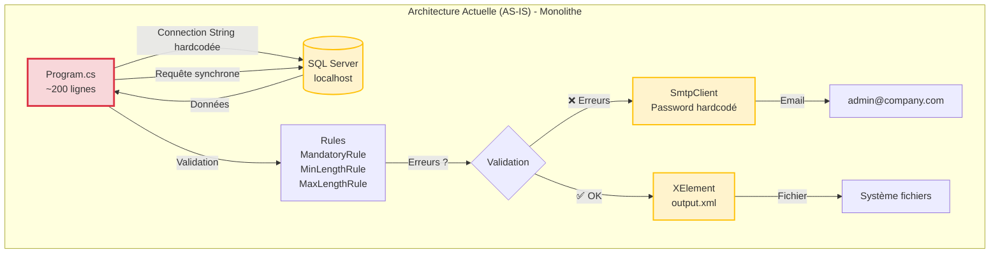
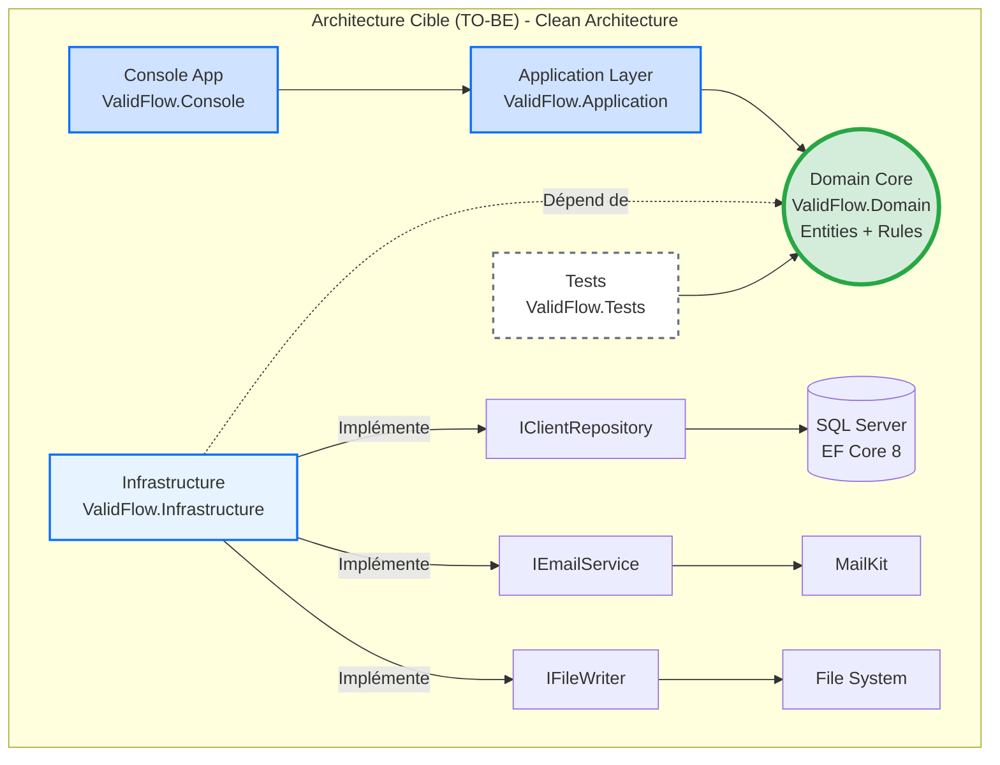
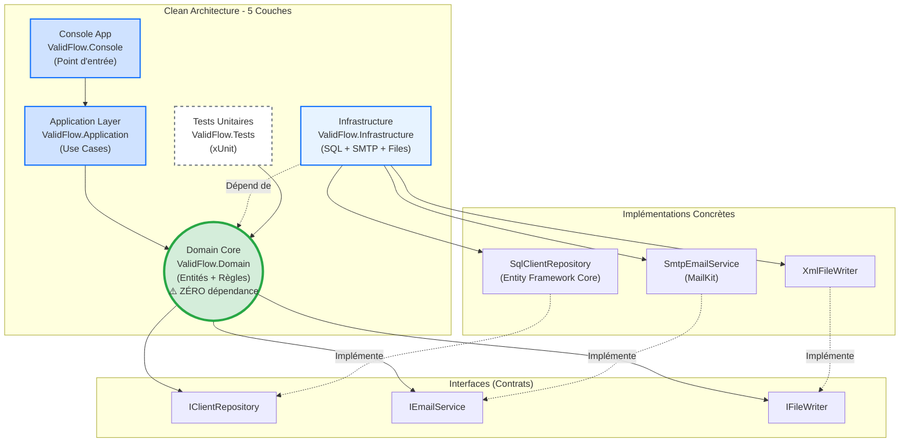

# Jour 1 - Fondations d'une Application Moderne

**Durée** : 6h00 (4 sessions × 1h30)  
**Objectif** : Prouver que le code legacy est dangereux et créer l'architecture cible

---

## 🚀 Préparation de l'Environnement (Avant 09h00)

### Étape 1 : Clone du Repository

Ouvrez un terminal et exécutez les commandes suivantes :

```bash
cd C:\dev
git clone https://github.com/mounirelouali/net-mod-legacy-formation.git
cd net-mod-legacy-formation
```

> 💡 **Astuce** : Si le dossier `C:\dev` n'existe pas, créez-le d'abord avec `mkdir C:\dev`

### Étape 2 : Ouvrir le Projet dans VS Code

```bash
code .
```

VS Code s'ouvre avec le projet. Vous devriez voir cette structure :

```
net-mod-legacy/
├─ 02_Atelier_Stagiaires/
│  └─ ValidFlow.Legacy/
│     └─ Program.cs          ← Code à analyser ce matin
├─ 03_Support_Quotidien/
│  └─ Jour_1_Fondations.md   ← Ce document
└─ README.md
```

### Étape 3 : Vérifier l'Environnement

Dans le terminal VS Code, vérifiez que .NET 8 est installé :

```bash
dotnet --version
```

Vous devriez voir : `8.x.x` (version .NET 8)

**Vous êtes prêt pour la session 09h00 !**

---

## Session 1 - 09h00 : Analyse du Batch Legacy

### 📢 Ouverture de Session

Bonjour à tous et bienvenue pour ce premier jour de formation. Ce matin, on va faire quelque chose d'inhabituel.

Au lieu de commencer par coder, on va **auditer** le code legacy. Pourquoi ? Parce qu'avant de refactoriser, il faut **prouver** que le code est dangereux. Sinon, votre manager ne vous donnera jamais 5 jours pour le moderniser.

Vous allez chercher 5 problèmes critiques dans `ValidFlow.Legacy/Program.cs`. Un problème de **Sécurité**, un de **Performance**, un de **Robustesse**, un de **Maintenabilité** et un de **Déploiement**.

L'objectif n'est pas de trouver des bugs, mais de documenter la **dette technique** avec un **coût business chiffré**. C'est ce qui convaincra votre direction d'investir dans le refactoring.

### 🧠 Concepts Fondamentaux

#### Qu'est-ce que la Dette Technique ?

La **dette technique** représente le coût caché du code qui fonctionne aujourd'hui, mais qui ralentira votre équipe demain. Comme une dette financière, elle accumule des "intérêts" : chaque modification devient plus risquée, plus lente, plus coûteuse.

**Exemple concret** : Modifier une règle métier devrait prendre 2 heures. Dans du code legacy non testé, cela peut prendre 3 jours (analyse des impacts, tests manuels, correction des effets de bord).

#### Les 5 Catégories d'Anti-Patterns

| Catégorie | Question Clé | Impact Business |
|-----------|--------------|-----------------|
| **🔓 Sécurité** | Les secrets sont-ils hardcodés ? | Violation RGPD, fuite données → 50k€ à 500k€ |
| **🐌 Performance** | Les appels I/O sont-ils asynchrones ? | Timeout, blocages → 10k€/an en incidents |
| **💥 Robustesse** | Que se passe-t-il si une dépendance externe plante ? | Pannes silencieuses → 4h investigation/incident |
| **🔧 Maintenabilité** | Peut-on tester la logique métier sans infrastructure ? | Vélocité divisée par 10 → -70% productivité |
| **📦 Déploiement** | Le code fonctionne-t-il sur Linux/Docker ? | Verrouillage Windows → 5k€/an licences |

**Coût Total Estimé de la Dette** : **85 000€ à 550 000€ par an**

---

### 🏗️ Architecture Actuelle vs Architecture Cible

#### Diagramme 1 : Architecture AS-IS (Monolithe Legacy)



**🔴 Problèmes** :
- Tout est couplé dans `Program.cs` (SQL + SMTP + XML + validation)
- Impossible de tester la validation sans lancer SQL Server + SMTP
- Secrets en clair (passwords)
- Appels synchrones (blocage)

#### Diagramme 2 : Architecture TO-BE (Clean Architecture)



**✅ Avantages** :
- Domain isolé = testable en 15ms (pas besoin SQL/SMTP)
- Secrets externalisés (Azure Key Vault)
- Async/Await = scalabilité ×10-100
- Cross-platform (Linux/Docker)

---

### 💡 L'Astuce Pratique

> **Le Principe SOLID comme Détecteur**
>
> Le **S** de SOLID = Single Responsibility Principle (Responsabilité Unique).
> 
> **Règle simple** : Si une classe fait plus d'une chose, c'est un anti-pattern.

**Exemple** : `Program.cs` fait 7 choses différentes :
1. Connexion SQL
2. Lecture données
3. Validation métier
4. Gestion erreurs
5. Envoi email
6. Génération XML
7. Logging console

**Conséquence** : Modifier la validation métier risque de casser l'envoi email. Tout est entremêlé.

**Best-Practice** : Une classe = une responsabilité. Une fonction = une transformation.

---

### 💬 Analyse Collective

**Question à réfléchir** :

> "Si vous devez modifier une règle de validation dans ce code legacy, combien de temps vous faut-il pour être **certain** que cette modification ne cassera rien en production ?"

**Prenez 5-8 secondes pour réfléchir avant de répondre dans le chat.**

**Réponse attendue** : **Des heures, voire des jours**. Pourquoi ? Parce qu'il n'y a aucun test automatique. Vous devez tester manuellement SQL + SMTP + XML. Et même comme ça, vous n'êtes jamais sûr à 100%.

**Constat** : Le vrai problème n'est pas la complexité technique, mais l'**impossibilité de tester** sans infrastructure complète.

---

### ⚙️ Défi d'Application

**Contexte** : Vous héritez du batch ValidFlow, un système critique qui valide des données clients et génère des rapports. Le code tourne en production depuis 5 ans, mais personne n'ose y toucher.

**Mission** : Vous êtes le **Détective du Code Legacy**. Votre objectif est d'identifier 5 problèmes critiques dans le fichier `ValidFlow.Legacy/Program.cs`, un problème par catégorie.

**⏱️ Durée** : 15 minutes

**📂 Fichier à analyser** :
```
02_Atelier_Stagiaires/ValidFlow.Legacy/Program.cs
```

**Commencez maintenant !**

**Format de Réponse** :

Pour chaque problème identifié, documentez :

```
Catégorie : [Sécurité | Performance | Robustesse | Maintenabilité | Déploiement]
Lignes concernées : XX-YY
Code problématique : [Extrait du code]
Impact Business : [Quelle conséquence concrète ?]
Coût Estimé : [Montant ou pourcentage]
```

**Critères de Succès** :
- [ ] 5 problèmes identifiés (1 par catégorie)
- [ ] Numéros de ligne exacts fournis
- [ ] Impact business documenté pour chaque problème
- [ ] Coût estimé ou pourcentage de perte

---

### 💡 Pistes de Réflexion

**Pour démarrer** :
- 🔓 **Sécurité** : Cherchez les mots de passe ou identifiants dans le code source (lignes 15-20). Que se passe-t-il si ce fichier est publié sur GitHub par erreur ?
- 🐌 **Performance** : Les appels à la base de données (ligne 55) sont-ils asynchrones ? Que se passe-t-il si la requête SQL prend 30 secondes ?
- 💥 **Robustesse** : Regardez le bloc `try-catch` (lignes 40-44). Si SQL Server plante, l'erreur est-elle gérée correctement ? Quelqu'un sera-t-il alerté ?
- 🔧 **Maintenabilité** : Pouvez-vous tester la méthode `ValidateData()` (ligne 71) sans avoir SQL Server et SMTP en marche ? Combien de temps faut-il pour lancer ce test ?
- 📦 **Déploiement** : Le chemin du fichier de sortie (ligne 138) fonctionne-t-il sur Linux ? Est-il configuré de manière flexible ?

**Si vous bloquez** :
- **Erreur courante** : Confondre "le code fonctionne" avec "le code est maintenable". Ce qui fonctionne aujourd'hui peut devenir un cauchemar demain.
- **Astuce** : Pour chaque ligne suspecte, demandez-vous : "Que se passe-t-il si [dépendance externe] n'est pas disponible ?"

**Pour aller plus loin** :
- Combien d'anti-patterns supplémentaires pouvez-vous trouver au-delà des 5 demandés ?
- Quelle serait la première chose à refactoriser si vous n'aviez que 2 heures ?

---

### 🔗 Solution Complète

La solution détaillée sera partagée par le formateur après l'exercice :

📂 `Solutions_A_Partager/J1_S1_Solution_09h00_Analyse.md`

---

**Fin Session 1 - 09h00**

---

## Session 2 - 10h40 : Scaffolding de la Clean Architecture

### 📢 Ouverture de Session

Maintenant que nous avons identifié les 5 anti-patterns du code legacy, nous allons créer l'architecture cible. Cette session est **100% pratique** : vous allez créer 5 projets .NET 8 via la ligne de commande.

Objectif : Remplacer le monolithe `Program.cs` par une architecture testable en couches indépendantes.

À la fin de cette session, vous aurez une structure de projet professionnelle, prête à accueillir le code métier que nous migrerons cet après-midi.

### 🧠 Concepts Fondamentaux

#### Qu'est-ce que la Clean Architecture ?

La **Clean Architecture** (Robert C. Martin, 2012) organise le code en couches concentriques, avec une règle d'or : **les dépendances pointent toujours vers le centre**.

**Les 5 Couches** :

| Couche | Rôle | Dépendances | Exemple |
|--------|------|-------------|---------|
| **Domain** | Cœur métier (entités, règles) | **Zéro** | `Client`, `IValidationRule` |
| **Application** | Cas d'usage (orchestration) | Domain uniquement | `ValidateClientUseCase` |
| **Infrastructure** | Accès données, SMTP, fichiers | Domain (interfaces) | `SqlClientRepository`, `SmtpEmailService` |
| **Console** | Point d'entrée utilisateur | Application | `Program.cs` (nouveau) |
| **Tests** | Tests unitaires | Domain | `ClientTests.cs` |

**Principe Clé : Inversion de Dépendances**

Dans le code legacy, `Program.cs` dépend de SQL Server (couplage fort). Dans la Clean Architecture, c'est l'inverse :
- Le **Domain** définit une interface `IClientRepository`
- L'**Infrastructure** implémente cette interface avec SQL Server
- Le Domain ne connaît **jamais** SQL Server

Résultat : On peut tester le Domain sans base de données.

---

### 🏗️ Architecture Cible (Diagramme Complet)



**🔴 Erreur Classique** : Mettre Entity Framework Core dans le Domain
**✅ Règle** : Le Domain ne doit jamais référencer de package NuGet externe

---

### 💡 L'Astuce Pratique

> **Métaphore : L'Île Stérile**
>
> Imaginez le **Domain** comme une île isolée au milieu de l'océan.
>
> - **Rien n'entre sur l'île** : Pas de bateau SQL Server, pas d'avion SMTP, pas de drone Entity Framework.
> - **L'île est autonome** : Elle contient uniquement du C# pur (classes, interfaces, records).
> - **Testable en 15ms** : On peut tester les règles métier sans infrastructure.
>
> Si vous êtes tenté d'ajouter une dépendance externe au Domain, posez-vous cette question : **"Est-ce que cette dépendance existera encore dans 10 ans ?"**
>
> - SQL Server peut être remplacé par PostgreSQL → ❌ Pas dans le Domain
> - Les règles métier "Un nom doit contenir 2 caractères minimum" → ✅ Stable dans le temps

---

### 💬 Analyse Collective

**Question à réfléchir** :

> "Pourquoi ne pas mettre Entity Framework Core directement dans le projet Domain pour simplifier l'accès aux données ?"

**Prenez 5-8 secondes pour réfléchir avant de répondre dans le chat.**

**Réponse attendue** : Parce qu'Entity Framework Core est une **dépendance externe** (package NuGet). Si vous changez de base de données (PostgreSQL, MongoDB) ou d'ORM (Dapper), vous devrez modifier le Domain. Or le Domain doit être **stable** et **testable sans infrastructure**.

**Constat** : L'isolation du Domain garantit que les règles métier survivent aux changements technologiques.

---

### 👨‍💻 Démonstration Live

**🎯 Ce que vous allez voir** :

Le formateur va créer les 5 projets .NET 8 en direct devant vous. Observez bien chaque commande et son résultat.

**📂 Répertoire de Travail Formateur** : `01_Demo_Formateur/`

**⏱️ Durée** : 15 minutes

**Étapes de la Démonstration** :

1. **Création du dossier racine**
   ```bash
   cd 01_Demo_Formateur
   mkdir ValidFlow.Modern
   cd ValidFlow.Modern
   ```
   **Ce que vous voyez** : Le terminal se positionne dans le nouveau dossier

2. **Création du projet Domain (cœur métier)**
   ```bash
   dotnet new classlib -n ValidFlow.Domain
   ```
   **Ce que vous voyez** : Un dossier `ValidFlow.Domain/` apparaît avec `Class1.cs` et `ValidFlow.Domain.csproj`

3. **Création du projet Tests**
   ```bash
   dotnet new xunit -n ValidFlow.Tests
   ```
   **Ce que vous voyez** : Un dossier `ValidFlow.Tests/` avec `UnitTest1.cs`

4. **Création des projets Application et Infrastructure**
   ```bash
   dotnet new classlib -n ValidFlow.Application
   dotnet new classlib -n ValidFlow.Infrastructure
   ```
   **Ce que vous voyez** : Deux nouveaux dossiers créés

5. **Création du projet Console (point d'entrée)**
   ```bash
   dotnet new console -n ValidFlow.Console
   ```
   **Ce que vous voyez** : Un dossier `ValidFlow.Console/` avec `Program.cs`

6. **Création de la solution globale**
   ```bash
   dotnet new sln -n ValidFlow.Modern
   dotnet sln add **/*.csproj
   ```
   **Ce que vous voyez** : Tous les projets sont ajoutés à la solution

7. **Configuration des références entre projets**
   ```bash
   # Tests → Domain
   dotnet add ValidFlow.Tests/ValidFlow.Tests.csproj reference ValidFlow.Domain/ValidFlow.Domain.csproj
   
   # Application → Domain
   dotnet add ValidFlow.Application/ValidFlow.Application.csproj reference ValidFlow.Domain/ValidFlow.Domain.csproj
   
   # Infrastructure → Domain
   dotnet add ValidFlow.Infrastructure/ValidFlow.Infrastructure.csproj reference ValidFlow.Domain/ValidFlow.Domain.csproj
   
   # Console → Application + Infrastructure
   dotnet add ValidFlow.Console/ValidFlow.Console.csproj reference ValidFlow.Application/ValidFlow.Application.csproj
   dotnet add ValidFlow.Console/ValidFlow.Console.csproj reference ValidFlow.Infrastructure/ValidFlow.Infrastructure.csproj
   ```
   **Ce que vous voyez** : Pour chaque commande, le message "Reference added"

8. **Validation finale**
   ```bash
   dotnet build
   ```
   **Ce que vous voyez** : 
   ```
   Build succeeded.
       0 Warning(s)
       0 Error(s)
   ```

**💬 Message** :
> "Vous venez de voir les 8 étapes pour créer une Clean Architecture .NET 8. Maintenant, c'est à vous de reproduire exactement la même chose dans votre dossier `02_Atelier_Stagiaires/`. Vous avez 30 minutes. Commencez maintenant !"

---

### ⚙️ Défi d'Application

**Mission** : Reproduire les 5 projets .NET 8 que vous venez de voir en démonstration.

**📂 Répertoire de Travail Stagiaires** : `02_Atelier_Stagiaires/`

**⏱️ Durée** : 30 minutes

**📂 Structure Finale Cible** :

```
02_Atelier_Stagiaires/
├─ ValidFlow.Legacy/          (Ne pas toucher - code legacy)
└─ ValidFlow.Modern/
   ├─ ValidFlow.Domain/        (Classlib - Cœur métier)
   ├─ ValidFlow.Application/   (Classlib - Use Cases)
   ├─ ValidFlow.Infrastructure/(Classlib - SQL/SMTP/Files)
   ├─ ValidFlow.Console/       (Console App - Point d'entrée)
   ├─ ValidFlow.Tests/         (xUnit - Tests unitaires)
   └─ ValidFlow.Modern.sln     (Solution globale)
```

**Commencez maintenant !**

**Étapes** :

1. **Créer le dossier racine** :
   ```bash
   cd 02_Atelier_Stagiaires
   mkdir ValidFlow.Modern
   cd ValidFlow.Modern
   ```

2. **Créer les 5 projets** (dans cet ordre précis) :
   ```bash
   # 1. Domain (cœur - zéro dépendance)
   dotnet new classlib -n ValidFlow.Domain
   
   # 2. Tests (référence Domain)
   dotnet new xunit -n ValidFlow.Tests
   
   # 3. Application (orchestration)
   dotnet new classlib -n ValidFlow.Application
   
   # 4. Infrastructure (implémentations)
   dotnet new classlib -n ValidFlow.Infrastructure
   
   # 5. Console (point d'entrée)
   dotnet new console -n ValidFlow.Console
   ```

3. **Créer la solution** :
   ```bash
   dotnet new sln -n ValidFlow.Modern
   dotnet sln add **/*.csproj
   ```

4. **Ajouter les références entre projets** :
   ```bash
   # Tests → Domain
   dotnet add ValidFlow.Tests/ValidFlow.Tests.csproj reference ValidFlow.Domain/ValidFlow.Domain.csproj
   
   # Application → Domain
   dotnet add ValidFlow.Application/ValidFlow.Application.csproj reference ValidFlow.Domain/ValidFlow.Domain.csproj
   
   # Infrastructure → Domain
   dotnet add ValidFlow.Infrastructure/ValidFlow.Infrastructure.csproj reference ValidFlow.Domain/ValidFlow.Domain.csproj
   
   # Console → Application + Infrastructure
   dotnet add ValidFlow.Console/ValidFlow.Console.csproj reference ValidFlow.Application/ValidFlow.Application.csproj
   dotnet add ValidFlow.Console/ValidFlow.Console.csproj reference ValidFlow.Infrastructure/ValidFlow.Infrastructure.csproj
   ```

5. **Valider la compilation** :
   ```bash
   dotnet build
   ```

**Critères de Succès** :
- [ ] 5 projets créés
- [ ] Solution `.sln` créée
- [ ] Références projet ajoutées
- [ ] `dotnet build` passe au vert (0 erreurs)

---

### 💡 Pistes de Réflexion

**Pour démarrer** :
- **Ordre de création** : Créez d'abord le Domain (projet central), puis les projets qui en dépendent.
- **Références unidirectionnelles** : Le projet Tests référence Domain, **jamais l'inverse**.
- **Console vs Application** : Console référence Application, mais **pas Infrastructure directement** (inversion de dépendances).

**Si vous bloquez** :
- **Erreur CS0234** ("Le type ou le namespace n'existe pas") : Vérifiez l'ordre des références. Avez-vous bien ajouté la référence avec `dotnet add reference` ?
- **Erreur de compilation** : Lancez `dotnet restore` pour restaurer les packages NuGet.
- **Confusion sur les références** : Consultez le diagramme Mermaid ci-dessus (flèches = sens des dépendances).

**Pour aller plus loin** :
- Ouvrez un fichier `.csproj` dans VS Code. Qu'observez-vous dans la section `<ItemGroup>` après avoir ajouté une référence ?
- Que se passe-t-il si vous essayez de référencer Infrastructure depuis Domain ? (`dotnet add reference ...`)

---

### 🔗 Solution Complète

La solution détaillée sera partagée par le formateur après l'exercice :

📂 `Solutions_A_Partager/J1_S2_Solution_10h40_Architecture.md`

---

**Fin Session 2 - 10h40**

---

## ⏸️ Sessions 3-4 : En Cours de Génération

Les sessions suivantes seront ajoutées après validation de la Session 2.

**Prochaines Sessions** :
- Session 3 - 13h30 : Implémentation du Cœur Métier (Domain)
- Session 4 - 15h10 : Modernisation de la Syntaxe (C# 12)
