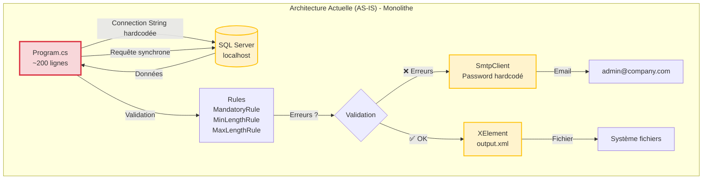
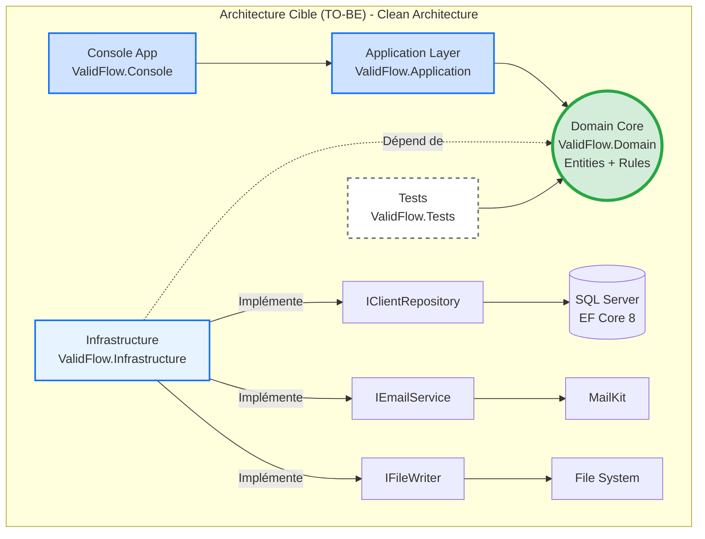
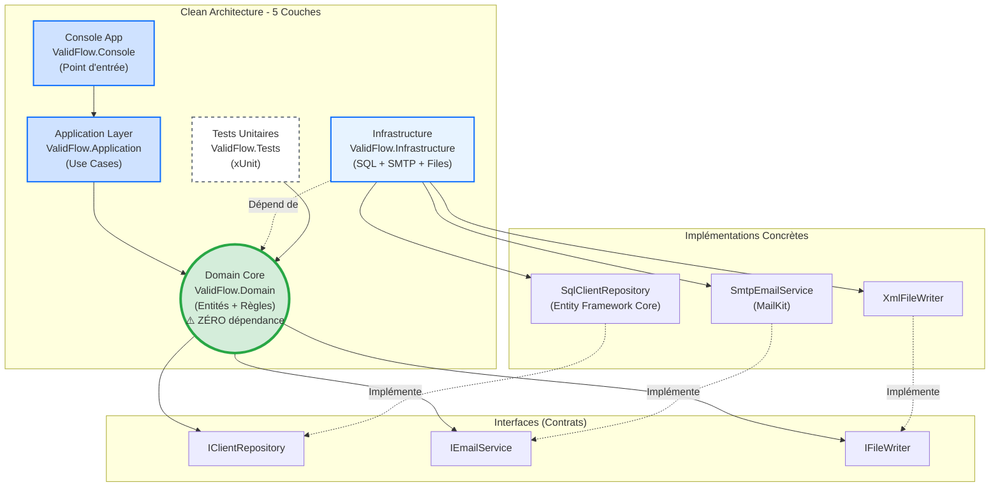
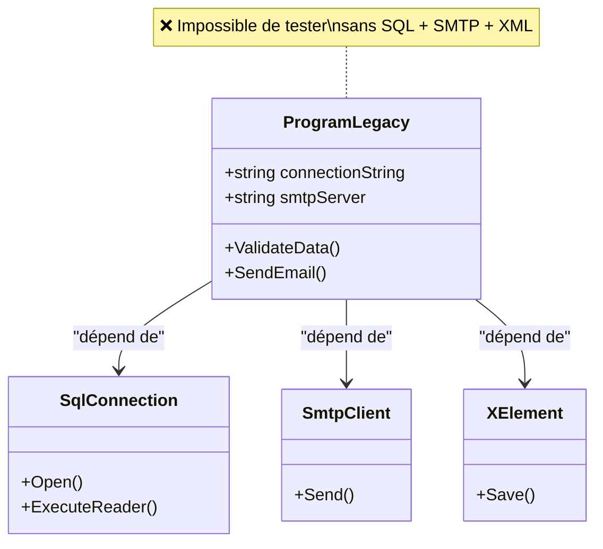
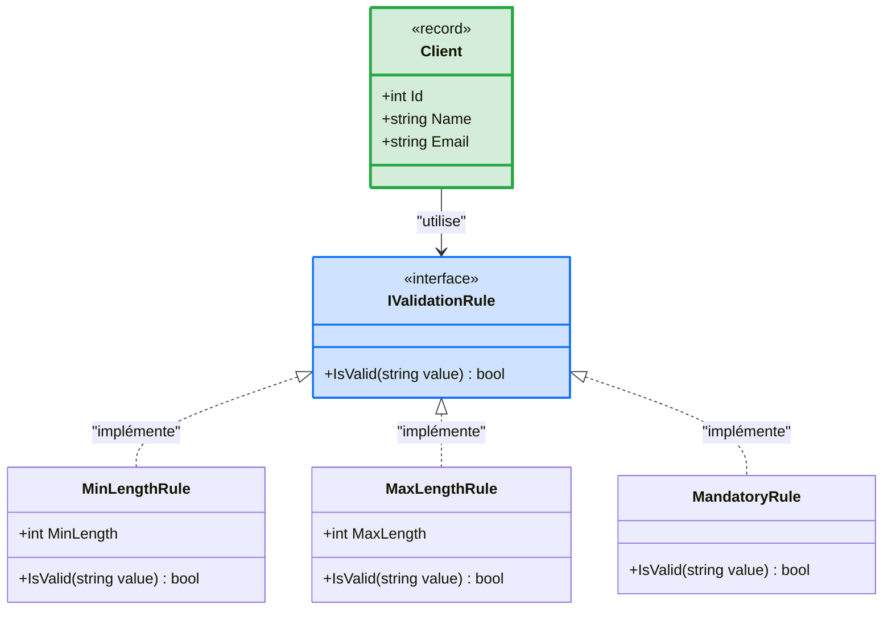

# Jour 1 - Fondations d'une Application Moderne

**Durée** : 6h00 (4 sessions × 1h30)  
**Objectif** : Prouver que le code legacy est dangereux et créer l'architecture cible

---

## 🚀 Préparation de l'Environnement (Avant 09h00)

### Étape 1 : Clone du Repository

Ouvrez un terminal et exécutez les commandes suivantes :

```bash
cd C:\dev
git clone https://github.com/mounirelouali/net-mod-legacy-formation.git
cd net-mod-legacy-formation
```

> 💡 **Astuce** : Si le dossier `C:\dev` n'existe pas, créez-le d'abord avec `mkdir C:\dev`

### Étape 2 : Ouvrir le Projet dans VS Code

```bash
code .
```

VS Code s'ouvre avec le projet. Vous devriez voir cette structure :

```
net-mod-legacy/
├─ 02_Atelier_Stagiaires/
│  └─ ValidFlow.Legacy/
│     └─ Program.cs          ← Code à analyser ce matin
├─ 03_Support_Quotidien/
│  └─ Jour_1_Fondations.md   ← Ce document
└─ README.md
```

### Étape 3 : Vérifier l'Environnement

Dans le terminal VS Code, vérifiez que .NET 8 est installé :

```bash
dotnet --version
```

Vous devriez voir : `8.x.x` (version .NET 8)

**Vous êtes prêt pour la session 09h00 !**

---

## Session 1 - 09h00 : Analyse du Batch Legacy

### 📢 Ouverture de Session

Bonjour à tous et bienvenue pour ce premier jour de formation. Ce matin, on va faire quelque chose d'inhabituel.

Au lieu de commencer par coder, on va **auditer** le code legacy. Pourquoi ? Parce qu'avant de refactoriser, il faut **prouver** que le code est dangereux. Sinon, votre manager ne vous donnera jamais 5 jours pour le moderniser.

Vous allez chercher 5 problèmes critiques dans `ValidFlow.Legacy/Program.cs`. Un problème de **Sécurité**, un de **Performance**, un de **Robustesse**, un de **Maintenabilité** et un de **Déploiement**.

L'objectif n'est pas de trouver des bugs, mais de documenter la **dette technique** avec un **coût business chiffré**. C'est ce qui convaincra votre direction d'investir dans le refactoring.

### 🧠 Concepts Fondamentaux

#### Qu'est-ce que la Dette Technique ?

La **dette technique** représente le coût caché du code qui fonctionne aujourd'hui, mais qui ralentira votre équipe demain. Comme une dette financière, elle accumule des "intérêts" : chaque modification devient plus risquée, plus lente, plus coûteuse.

**Exemple concret** : Modifier une règle métier devrait prendre 2 heures. Dans du code legacy non testé, cela peut prendre 3 jours (analyse des impacts, tests manuels, correction des effets de bord).

#### Les 5 Catégories d'Anti-Patterns

| Catégorie | Question Clé | Impact Business |
|-----------|--------------|-----------------|
| **🔓 Sécurité** | Les secrets sont-ils hardcodés ? | Violation RGPD, fuite données → 50k€ à 500k€ |
| **🐌 Performance** | Les appels I/O sont-ils asynchrones ? | Timeout, blocages → 10k€/an en incidents |
| **💥 Robustesse** | Que se passe-t-il si une dépendance externe plante ? | Pannes silencieuses → 4h investigation/incident |
| **🔧 Maintenabilité** | Peut-on tester la logique métier sans infrastructure ? | Vélocité divisée par 10 → -70% productivité |
| **📦 Déploiement** | Le code fonctionne-t-il sur Linux/Docker ? | Verrouillage Windows → 5k€/an licences |

**Coût Total Estimé de la Dette** : **85 000€ à 550 000€ par an**

---

### 🏗️ Architecture Actuelle vs Architecture Cible

#### Diagramme 1 : Architecture AS-IS (Monolithe Legacy)



**🔴 Problèmes** :
- Tout est couplé dans `Program.cs` (SQL + SMTP + XML + validation)
- Impossible de tester la validation sans lancer SQL Server + SMTP
- Secrets en clair (passwords)
- Appels synchrones (blocage)

#### Diagramme 2 : Architecture TO-BE (Clean Architecture)



**✅ Avantages** :
- Domain isolé = testable en 15ms (pas besoin SQL/SMTP)
- Secrets externalisés (Azure Key Vault)
- Async/Await = scalabilité ×10-100
- Cross-platform (Linux/Docker)

---

### 💡 L'Astuce Pratique

> **Le Principe SOLID comme Détecteur**
>
> Le **S** de SOLID = Single Responsibility Principle (Responsabilité Unique).
> 
> **Règle simple** : Si une classe fait plus d'une chose, c'est un anti-pattern.

**Exemple** : `Program.cs` fait 7 choses différentes :
1. Connexion SQL
2. Lecture données
3. Validation métier
4. Gestion erreurs
5. Envoi email
6. Génération XML
7. Logging console

**Conséquence** : Modifier la validation métier risque de casser l'envoi email. Tout est entremêlé.

**Best-Practice** : Une classe = une responsabilité. Une fonction = une transformation.

---

### 💬 Analyse Collective

**Question à réfléchir** :

> "Si vous devez modifier une règle de validation dans ce code legacy, combien de temps vous faut-il pour être **certain** que cette modification ne cassera rien en production ?"

**Prenez 5-8 secondes pour réfléchir avant de répondre dans le chat.**

**Réponse attendue** : **Des heures, voire des jours**. Pourquoi ? Parce qu'il n'y a aucun test automatique. Vous devez tester manuellement SQL + SMTP + XML. Et même comme ça, vous n'êtes jamais sûr à 100%.

**Constat** : Le vrai problème n'est pas la complexité technique, mais l'**impossibilité de tester** sans infrastructure complète.

---

### ⚙️ Défi d'Application

**Contexte** : Vous héritez du batch ValidFlow, un système critique qui valide des données clients et génère des rapports. Le code tourne en production depuis 5 ans, mais personne n'ose y toucher.

**Mission** : Vous êtes le **Détective du Code Legacy**. Votre objectif est d'identifier 5 problèmes critiques dans le fichier `ValidFlow.Legacy/Program.cs`, un problème par catégorie.

**⏱️ Durée** : 15 minutes

**📂 Fichier à analyser** :
```
02_Atelier_Stagiaires/ValidFlow.Legacy/Program.cs
```

**Commencez maintenant !**

**Format de Réponse** :

Pour chaque problème identifié, documentez :

```
Catégorie : [Sécurité | Performance | Robustesse | Maintenabilité | Déploiement]
Lignes concernées : XX-YY
Code problématique : [Extrait du code]
Impact Business : [Quelle conséquence concrète ?]
Coût Estimé : [Montant ou pourcentage]
```

**Critères de Succès** :
- [ ] 5 problèmes identifiés (1 par catégorie)
- [ ] Numéros de ligne exacts fournis
- [ ] Impact business documenté pour chaque problème
- [ ] Coût estimé ou pourcentage de perte

---

### 💡 Pistes de Réflexion

**Pour démarrer** :
- 🔓 **Sécurité** : Cherchez les mots de passe ou identifiants dans le code source (lignes 15-20). Que se passe-t-il si ce fichier est publié sur GitHub par erreur ?
- 🐌 **Performance** : Les appels à la base de données (ligne 55) sont-ils asynchrones ? Que se passe-t-il si la requête SQL prend 30 secondes ?
- 💥 **Robustesse** : Regardez le bloc `try-catch` (lignes 40-44). Si SQL Server plante, l'erreur est-elle gérée correctement ? Quelqu'un sera-t-il alerté ?
- 🔧 **Maintenabilité** : Pouvez-vous tester la méthode `ValidateData()` (ligne 71) sans avoir SQL Server et SMTP en marche ? Combien de temps faut-il pour lancer ce test ?
- 📦 **Déploiement** : Le chemin du fichier de sortie (ligne 138) fonctionne-t-il sur Linux ? Est-il configuré de manière flexible ?

**Si vous bloquez** :
- **Erreur courante** : Confondre "le code fonctionne" avec "le code est maintenable". Ce qui fonctionne aujourd'hui peut devenir un cauchemar demain.
- **Astuce** : Pour chaque ligne suspecte, demandez-vous : "Que se passe-t-il si [dépendance externe] n'est pas disponible ?"

**Pour aller plus loin** :
- Combien d'anti-patterns supplémentaires pouvez-vous trouver au-delà des 5 demandés ?
- Quelle serait la première chose à refactoriser si vous n'aviez que 2 heures ?

---

### 🔗 Solution Complète

La solution détaillée sera partagée par le formateur après l'exercice :

📂 `Solutions_A_Partager/J1_S1_Solution_09h00_Analyse.md`

---

**Fin Session 1 - 09h00**

---

## Session 2 - 10h40 : Scaffolding de la Clean Architecture

### 📢 Ouverture de Session

Maintenant que nous avons identifié les 5 anti-patterns du code legacy, nous allons créer l'architecture cible. Cette session est **100% pratique** : vous allez créer 5 projets .NET 8 via la ligne de commande.

Objectif : Remplacer le monolithe `Program.cs` par une architecture testable en couches indépendantes.

À la fin de cette session, vous aurez une structure de projet professionnelle, prête à accueillir le code métier que nous migrerons cet après-midi.

### 🧠 Concepts Fondamentaux

#### Qu'est-ce que la Clean Architecture ?

La **Clean Architecture** (Robert C. Martin, 2012) organise le code en couches concentriques, avec une règle d'or : **les dépendances pointent toujours vers le centre**.

**Les 5 Couches** :

| Couche | Rôle | Dépendances | Exemple |
|--------|------|-------------|---------|
| **Domain** | Cœur métier (entités, règles) | **Zéro** | `Client`, `IValidationRule` |
| **Application** | Cas d'usage (orchestration) | Domain uniquement | `ValidateClientUseCase` |
| **Infrastructure** | Accès données, SMTP, fichiers | Domain (interfaces) | `SqlClientRepository`, `SmtpEmailService` |
| **Console** | Point d'entrée utilisateur | Application | `Program.cs` (nouveau) |
| **Tests** | Tests unitaires | Domain | `ClientTests.cs` |

**Principe Clé : Inversion de Dépendances**

Dans le code legacy, `Program.cs` dépend de SQL Server (couplage fort). Dans la Clean Architecture, c'est l'inverse :
- Le **Domain** définit une interface `IClientRepository`
- L'**Infrastructure** implémente cette interface avec SQL Server
- Le Domain ne connaît **jamais** SQL Server

Résultat : On peut tester le Domain sans base de données.

---

### 🏗️ Architecture Cible (Diagramme Complet)



**🔴 Erreur Classique** : Mettre Entity Framework Core dans le Domain
**✅ Règle** : Le Domain ne doit jamais référencer de package NuGet externe

---

### 💡 L'Astuce Pratique

> **Métaphore : L'Île Stérile**
>
> Imaginez le **Domain** comme une île isolée au milieu de l'océan.
>
> - **Rien n'entre sur l'île** : Pas de bateau SQL Server, pas d'avion SMTP, pas de drone Entity Framework.
> - **L'île est autonome** : Elle contient uniquement du C# pur (classes, interfaces, records).
> - **Testable en 15ms** : On peut tester les règles métier sans infrastructure.
>
> Si vous êtes tenté d'ajouter une dépendance externe au Domain, posez-vous cette question : **"Est-ce que cette dépendance existera encore dans 10 ans ?"**
>
> - SQL Server peut être remplacé par PostgreSQL → ❌ Pas dans le Domain
> - Les règles métier "Un nom doit contenir 2 caractères minimum" → ✅ Stable dans le temps

---

### 💬 Analyse Collective

**Question à réfléchir** :

> "Pourquoi ne pas mettre Entity Framework Core directement dans le projet Domain pour simplifier l'accès aux données ?"

**Prenez 5-8 secondes pour réfléchir avant de répondre dans le chat.**

**Réponse attendue** : Parce qu'Entity Framework Core est une **dépendance externe** (package NuGet). Si vous changez de base de données (PostgreSQL, MongoDB) ou d'ORM (Dapper), vous devrez modifier le Domain. Or le Domain doit être **stable** et **testable sans infrastructure**.

**Constat** : L'isolation du Domain garantit que les règles métier survivent aux changements technologiques.

---

### 👨‍💻 Démonstration Live

**🎯 Ce que vous allez voir** :

Le formateur va créer les 5 projets .NET 8 en direct devant vous. Observez bien chaque commande et son résultat.

**📂 Répertoire de Travail Formateur** : `01_Demo_Formateur/`

**⏱️ Durée** : 15 minutes

**Étapes de la Démonstration** :

1. **Création du dossier racine**
   ```bash
   cd 01_Demo_Formateur
   mkdir ValidFlow.Modern
   cd ValidFlow.Modern
   ```
   **Ce que vous voyez** : Le terminal se positionne dans le nouveau dossier

2. **Création du projet Domain (cœur métier)**
   ```bash
   dotnet new classlib -n ValidFlow.Domain
   ```
   **Ce que vous voyez** : Un dossier `ValidFlow.Domain/` apparaît avec `Class1.cs` et `ValidFlow.Domain.csproj`

3. **Création du projet Tests**
   ```bash
   dotnet new xunit -n ValidFlow.Tests
   ```
   **Ce que vous voyez** : Un dossier `ValidFlow.Tests/` avec `UnitTest1.cs`

4. **Création des projets Application et Infrastructure**
   ```bash
   dotnet new classlib -n ValidFlow.Application
   dotnet new classlib -n ValidFlow.Infrastructure
   ```
   **Ce que vous voyez** : Deux nouveaux dossiers créés

5. **Création du projet Console (point d'entrée)**
   ```bash
   dotnet new console -n ValidFlow.Console
   ```
   **Ce que vous voyez** : Un dossier `ValidFlow.Console/` avec `Program.cs`

6. **Création de la solution globale**
   ```bash
   dotnet new sln -n ValidFlow.Modern
   dotnet sln add **/*.csproj
   ```
   **Ce que vous voyez** : Tous les projets sont ajoutés à la solution

7. **Configuration des références entre projets**
   ```bash
   # Tests → Domain
   dotnet add ValidFlow.Tests/ValidFlow.Tests.csproj reference ValidFlow.Domain/ValidFlow.Domain.csproj
   
   # Application → Domain
   dotnet add ValidFlow.Application/ValidFlow.Application.csproj reference ValidFlow.Domain/ValidFlow.Domain.csproj
   
   # Infrastructure → Domain
   dotnet add ValidFlow.Infrastructure/ValidFlow.Infrastructure.csproj reference ValidFlow.Domain/ValidFlow.Domain.csproj
   
   # Console → Application + Infrastructure
   dotnet add ValidFlow.Console/ValidFlow.Console.csproj reference ValidFlow.Application/ValidFlow.Application.csproj
   dotnet add ValidFlow.Console/ValidFlow.Console.csproj reference ValidFlow.Infrastructure/ValidFlow.Infrastructure.csproj
   ```
   **Ce que vous voyez** : Pour chaque commande, le message "Reference added"

8. **Validation finale**
   ```bash
   dotnet build
   ```
   **Ce que vous voyez** : 
   ```
   Build succeeded.
       0 Warning(s)
       0 Error(s)
   ```

**💬 Message** :
> "Vous venez de voir les 8 étapes pour créer une Clean Architecture .NET 8. Maintenant, c'est à vous de reproduire exactement la même chose dans votre dossier `02_Atelier_Stagiaires/`. Vous avez 30 minutes. Commencez maintenant !"

---

### ⚙️ Défi d'Application

**Mission** : Reproduire les 5 projets .NET 8 que vous venez de voir en démonstration.

**📂 Répertoire de Travail Stagiaires** : `02_Atelier_Stagiaires/`

**⏱️ Durée** : 30 minutes

**📂 Structure Finale Cible** :

```
02_Atelier_Stagiaires/
├─ ValidFlow.Legacy/          (Ne pas toucher - code legacy)
└─ ValidFlow.Modern/
   ├─ ValidFlow.Domain/        (Classlib - Cœur métier)
   ├─ ValidFlow.Application/   (Classlib - Use Cases)
   ├─ ValidFlow.Infrastructure/(Classlib - SQL/SMTP/Files)
   ├─ ValidFlow.Console/       (Console App - Point d'entrée)
   ├─ ValidFlow.Tests/         (xUnit - Tests unitaires)
   └─ ValidFlow.Modern.sln     (Solution globale)
```

**Commencez maintenant !**

**Étapes** :

1. **Créer le dossier racine** :
   ```bash
   cd 02_Atelier_Stagiaires
   mkdir ValidFlow.Modern
   cd ValidFlow.Modern
   ```

2. **Créer les 5 projets** (dans cet ordre précis) :
   ```bash
   # 1. Domain (cœur - zéro dépendance)
   dotnet new classlib -n ValidFlow.Domain
   
   # 2. Tests (référence Domain)
   dotnet new xunit -n ValidFlow.Tests
   
   # 3. Application (orchestration)
   dotnet new classlib -n ValidFlow.Application
   
   # 4. Infrastructure (implémentations)
   dotnet new classlib -n ValidFlow.Infrastructure
   
   # 5. Console (point d'entrée)
   dotnet new console -n ValidFlow.Console
   ```

3. **Créer la solution** :
   ```bash
   dotnet new sln -n ValidFlow.Modern
   dotnet sln add **/*.csproj
   ```

   Si la dernière commande ne marche pas, utilise plutôt.:
  ```bash
    # Fonctionne sur Windows PowerShell ET sur Linux/macOS (PowerShell Core)
    $projects = Get-ChildItem -Recurse -Filter *.csproj | Select-Object -ExpandProperty FullName
    dotnet sln add $projects

   ```
   

4. **Ajouter les références entre projets** :
   ```bash
   # Tests → Domain
   dotnet add ValidFlow.Tests/ValidFlow.Tests.csproj reference ValidFlow.Domain/ValidFlow.Domain.csproj
   
   # Application → Domain
   dotnet add ValidFlow.Application/ValidFlow.Application.csproj reference ValidFlow.Domain/ValidFlow.Domain.csproj
   
   # Infrastructure → Domain
   dotnet add ValidFlow.Infrastructure/ValidFlow.Infrastructure.csproj reference ValidFlow.Domain/ValidFlow.Domain.csproj
   
   # Console → Application + Infrastructure
   dotnet add ValidFlow.Console/ValidFlow.Console.csproj reference ValidFlow.Application/ValidFlow.Application.csproj
   dotnet add ValidFlow.Console/ValidFlow.Console.csproj reference ValidFlow.Infrastructure/ValidFlow.Infrastructure.csproj
   ```

5. **Valider la compilation** :
   ```bash
   dotnet build
   ```

**Critères de Succès** :
- [ ] 5 projets créés
- [ ] Solution `.sln` créée
- [ ] Références projet ajoutées
- [ ] `dotnet build` passe au vert (0 erreurs)

---

### 💡 Pistes de Réflexion

**Pour démarrer** :
- **Ordre de création** : Créez d'abord le Domain (projet central), puis les projets qui en dépendent.
- **Références unidirectionnelles** : Le projet Tests référence Domain, **jamais l'inverse**.
- **Console vs Application** : Console référence Application, mais **pas Infrastructure directement** (inversion de dépendances).

**Si vous bloquez** :
- **Erreur CS0234** ("Le type ou le namespace n'existe pas") : Vérifiez l'ordre des références. Avez-vous bien ajouté la référence avec `dotnet add reference` ?
- **Erreur de compilation** : Lancez `dotnet restore` pour restaurer les packages NuGet.
- **Confusion sur les références** : Consultez le diagramme Mermaid ci-dessus (flèches = sens des dépendances).

**Pour aller plus loin** :
- Ouvrez un fichier `.csproj` dans VS Code. Qu'observez-vous dans la section `<ItemGroup>` après avoir ajouté une référence ?
- Que se passe-t-il si vous essayez de référencer Infrastructure depuis Domain ? (`dotnet add reference ...`)

---

### 🔗 Solution Complète

La solution détaillée sera partagée par le formateur après l'exercice :

📂 `Solutions_A_Partager/J1_S2_Solution_10h40_Architecture.md`

---

**Fin Session 2 - 10h40**

---

## Session 3 - 13h30 : Implémentation du Cœur Métier (Domain)

### 📢 Ouverture de Session

Vous avez maintenant 5 projets vides qui forment l'architecture Clean. Cette session va donner vie au **Domain** : le cœur métier de l'application.

Objectif : Extraire l'entité `Client` et les 3 règles de validation du code legacy vers le projet `ValidFlow.Domain`, et les tester en **15 millisecondes** sans SQL Server ni SMTP.

À la fin de cette session, vous comprendrez pourquoi le Domain isolé est la clé d'une architecture testable et maintenable.

---

### 🧠 Concepts Fondamentaux

#### Qu'est-ce que le Domain-Driven Design (DDD) ?

Le **Domain-Driven Design** (Eric Evans, 2003) place le cœur métier au centre de l'architecture. Le Domain contient :
- **Les entités** : Objets avec une identité unique (ex: `Client` avec un `Id`)
- **Les Value Objects** : Objets sans identité, définis par leurs propriétés (ex: `Email`, `PhoneNumber`)
- **Les règles métier** : Logique qui change rarement et qui définit votre business (ex: "Un nom doit contenir minimum 2 caractères")

**Principe Fondamental** : Le Domain ne doit **jamais** dépendre de l'infrastructure (SQL, SMTP, fichiers). C'est l'infrastructure qui dépend du Domain.

---

#### Entité vs Value Object

| Critère | Entité | Value Object |
|---------|--------|--------------|
| **Identité** | Oui (Id unique) | Non (défini par valeurs) |
| **Mutabilité** | Peut changer dans le temps | Immuable |
| **Égalité** | Par Id | Par valeurs |
| **Exemple** | `Client` (Id, Nom, Email) | `Email` ("john@example.com") |

**En C# 12** : Utilisez `record` pour les Value Objects (immuabilité par défaut).

---

#### Pourquoi "Zéro Dépendance Externe" ?

**Problème du Code Legacy** :
```csharp
// ValidFlow.Legacy/Program.cs
public static void ValidateData() {
    var connection = new SqlConnection(connectionString); // Dépendance SQL
    connection.Open(); // Si SQL Server est DOWN → BOOM !
    // ... validation + email
}
```

**Impossible de tester** `ValidateData()` sans :
- SQL Server lancé
- SMTP configuré
- Fichier XML accessible

**Temps de test** : **10 minutes** (lancer infra + insérer données test)

**Solution Domain Isolé** :
```csharp
// ValidFlow.Domain/Entities/Client.cs
public record Client(int Id, string Name, string Email);

// ValidFlow.Domain/Interfaces/IValidationRule.cs
public interface IValidationRule {
    bool IsValid(string value);
}
```

**Testable en** : **15 millisecondes** (pas d'infrastructure)

---

### 🏗️ Architecture Legacy vs Architecture Cible

#### Diagramme 1 : Legacy (Couplage Fort)



**Problème** : Tout est couplé. Tester une règle = lancer toute l'infrastructure.

---

#### Diagramme 2 : Domain Isolé (Clean Architecture)



**Avantage** : Tests ultra-rapides, logique métier isolée, stable dans le temps.

---

#### 📊 Infographie : L'Isolation du Domain en Image


**Légende** : Cette infographie résume visuellement pourquoi isoler le Domain (testable en 15ms sans infrastructure) et comment appliquer l'inversion de dépendances.

---

### 💡 L'Astuce Pratique

> **Métaphore : Le Crash Test**
>
> Imaginez que vous êtes ingénieur automobile. Vous avez deux façons de tester la solidité d'une portière :
>
> **Méthode 1 (Legacy)** : Construire une voiture complète, installer le moteur, les 4 roues, le tableau de bord, faire le plein d'essence, puis crasher la voiture contre un mur pour tester la portière.
> - **Temps** : 10 jours
> - **Coût** : 50 000€
>
> **Méthode 2 (Domain Isolé)** : Détacher la portière, la mettre dans une machine de test, appliquer une pression.
> - **Temps** : 15 secondes
> - **Coût** : 10€
>
> Le Domain isolé, c'est la portière détachée. Vous testez **uniquement** la logique métier, sans toute la machinerie autour.

**Best-Practice** : Si une classe a besoin de SQL pour être testée, ce n'est **pas** du Domain. C'est de l'Infrastructure.

---

### 💬 Analyse Collective

**Question à réfléchir** :

> "Combien de temps vous faut-il pour tester **une seule** règle de validation (ex: 'Le nom doit contenir 2 caractères minimum') dans le code legacy `ValidFlow.Legacy/Program.cs` ?"

**Prenez 5-8 secondes pour réfléchir avant de répondre dans le chat.**

**Réponse attendue** : **10 minutes minimum**. Pourquoi ?
1. Lancer SQL Server (2 min)
2. Créer une base de données test (3 min)
3. Insérer un client test (1 min)
4. Exécuter `ValidateData()` (1 min)
5. Vérifier le résultat (1 min)
6. Nettoyer la base (2 min)

**Avec Domain isolé** : **15 millisecondes**
```csharp
[Fact]
public void MinLengthRule_Should_Reject_Short_Name() {
    var rule = new MinLengthRule(2);
    Assert.False(rule.IsValid("A")); // ✅ 15ms
}
```

**Constat** : L'isolation du Domain divise le temps de feedback par **40 000** (10 min → 15ms).

---

### 👨‍💻 Démonstration Live

**🎯 Ce que vous allez voir** :

Le formateur va créer l'entité `Client` et la règle `MinLengthRule` en C# 12, puis écrire un test unitaire qui s'exécute en 15ms.

**📂 Répertoire de Travail Formateur** : `01_Demo_Formateur/ValidFlow.Modern/`

**⏱️ Durée** : 20 minutes

**Étapes de la Démonstration** :

1. **Créer les dossiers dans Domain**
   ```bash
   cd 01_Demo_Formateur/ValidFlow.Modern/ValidFlow.Domain
   mkdir Entities
   mkdir Interfaces
   mkdir Rules
   ```
   **Ce que vous voyez** : 3 nouveaux dossiers apparaissent

2. **Créer l'entité Client (record C# 12)**
   ```bash
   # Supprimer le fichier auto-généré
   Remove-Item Class1.cs
   
   # Créer Client.cs
   New-Item Entities/Client.cs
   ```
   
   **Code tapé en direct** :
   ```csharp
   namespace ValidFlow.Domain.Entities;
   
   public record Client(
       int Id,
       string Name,
       string Email
   );
   ```
   **Ce que vous voyez** : Utilisation de `record` (C# 12) pour l'immuabilité

3. **Créer l'interface IValidationRule**
   ```bash
   New-Item Interfaces/IValidationRule.cs
   ```
   
   **Code tapé en direct** :
   ```csharp
   namespace ValidFlow.Domain.Interfaces;
   
   public interface IValidationRule
   {
       bool IsValid(string value);
   }
   ```

4. **Implémenter MinLengthRule avec pattern matching**
   ```bash
   New-Item Rules/MinLengthRule.cs
   ```
   
   **Code tapé en direct** :
   ```csharp
   // [Style C# 9] Namespace avec accolades (sera modernisé en Session 4)
   namespace ValidFlow.Domain.Rules
   {
       using ValidFlow.Domain.Interfaces;
       
       public class MinLengthRule : IValidationRule
       {
           // [Style classique] Champ privé avec convention _camelCase
           private readonly int _minLength;
           
           // [Style classique] Constructeur explicite
           public MinLengthRule(int minLength)
           {
               _minLength = minLength;
           }
           
           // Propriété publique en lecture seule
           public int MinLength => _minLength;
           
           public bool IsValid(string value)
           {
               // [C# 8] Switch expression avec pattern matching
               return value switch
               {
                   null => false,
                   "" => false,
                   _ => value.Length >= MinLength
               };
           }
       }
   }
   ```
   **Ce que vous voyez** : Code C# 9 classique (sera modernisé en Session 4 avec primary constructor + file-scoped namespace)

5. **Créer un test unitaire**
   ```bash

    # Ajouter la référence vers le projet Domain
    dotnet add ValidFlow.Tests/ValidFlow.Tests.csproj reference ValidFlow.Domain/ValidFlow.Domain.csproj

   cd ../ValidFlow.Tests
   Remove-Item UnitTest1.cs
   New-Item MinLengthRuleTests.cs
   ```
   
   **Code tapé en direct** :
    ```csharp
    // [Style C# 9] Namespace avec accolades (standard avant .NET 6)
    namespace ValidFlow.Tests
    {

    using ValidFlow.Domain.Rules;
    // Utilisation de xUnit, le framework de test moderne recommandé et utilisé par les équipes Microsoft (ASP.NET Core)
    using Xunit;

    public class MinLengthRuleTests
    {
        // L'attribut [Fact] indique à xUnit qu'il s'agit d'une méthode de test simple (sans paramètres) 
        // qui doit être exécutée une seule fois par le lanceur de tests.
        [Fact]
        // Bonne pratique de nommage : Le nom de la méthode décrit clairement l'intention 
        // Format souvent recommandé : [MéthodeTestée]_[Scénario]_[RésultatAttendu]
        public void MinLengthRule_Should_Accept_Valid_Name()
        {
            // Structuration classique d'un test unitaire selon le pattern AAA (Arrange, Act, Assert)

            // 1. Arrange (Préparer) : Initialisation du Système Sous Test (SUT - System Under Test)
            // On configure le contexte, ici une règle exigeant au moins 2 caractères.
            var rule = new MinLengthRule(2);
            
            // 2. Act (Agir) : Exécution de la méthode spécifique que l'on souhaite tester (MUT - Method Under Test).
            // C'est généralement une seule ligne de code.
            var result = rule.IsValid("John");
            
            // 3. Assert (Vérifier) : Validation du résultat.
            // Utilisation de la classe statique Assert de xUnit pour vérifier que le retour est bien "True".
            Assert.True(result);
        }
        
        [Fact]
        public void MinLengthRule_Should_Reject_Short_Name()
        {
            // Arrange
            // Note pour la formation : L'instanciation de 'rule' est répétée ici. 
            // Pour des tests plus complexes, on pourrait isoler cette création dans un constructeur de classe (qui agit comme "Setup" dans xUnit) ou une méthode Factory.
            var rule = new MinLengthRule(2);
            
            // Act
            // On teste ici le scénario d'échec (Negative test) avec une chaîne trop courte.
            var result = rule.IsValid("A");
            
            // Assert
            // On s'attend à ce que la règle rejette cette valeur.
            Assert.False(result);
        }
    }
    } // Fin du namespace
    ```

6. **Lancer les tests**
   ```bash
   cd ..
   dotnet test
   ```
   **Ce que vous voyez** :
   ```
   Passed!  - Failed:     0, Passed:     2, Skipped:     0, Total:     2, Duration: 15 ms
   ```

**💬 Message** :
> "Domain isolé = 15ms. C'est comme cuire des pâtes en 15ms au lieu de 10 minutes... sauf que là, on ne risque pas de les rater ! 🍝
>
> Créez les 3 règles en C# 9 classique (modernisation Session 4). 45 minutes. Go !"

---

### ⚙️ Défi d'Application

**Mission** : Migrer les 3 règles de validation du code legacy vers le projet Domain et les tester.

**📂 Répertoire de Travail Stagiaires** : `02_Atelier_Stagiaires/ValidFlow.Modern/`

**⏱️ Durée** : 45 minutes

**📂 Structure Domain Cible** :

```
ValidFlow.Domain/
├─ Entities/
│  └─ Client.cs           (record avec Id, Name, Email)
├─ Interfaces/
│  └─ IValidationRule.cs  (interface avec IsValid)
└─ Rules/
   ├─ MinLengthRule.cs    (min 2 caractères)
   ├─ MaxLengthRule.cs    (max 100 caractères)
   └─ MandatoryRule.cs    (non null, non vide)
```

**Étapes** :

1. **Créer les dossiers**
   ```bash
   cd 02_Atelier_Stagiaires/ValidFlow.Modern/ValidFlow.Domain
   mkdir Entities
   mkdir Interfaces
   mkdir Rules
   Remove-Item Class1.cs
   ```

2. **Créer l'entité Client** (`Entities/Client.cs`)
   - Utiliser `record` (C# 9) avec namespace classique
   - Propriétés : `Id` (int), `Name` (string), `Email` (string)
   - **Important** : Utilisez la syntaxe C# 9 avec accolades `namespace X { ... }` (pas file-scoped)

3. **Créer l'interface** (`Interfaces/IValidationRule.cs`)
   - Méthode : `bool IsValid(string value)`

4. **Implémenter les 3 règles** (syntaxe C# 9 classique) :
   - `MinLengthRule` : Champ privé `_minLength` + constructeur classique + propriété `MinLength`. Rejette si longueur < 2
   - `MaxLengthRule` : Champ privé `_maxLength` + constructeur classique + propriété `MaxLength`. Rejette si longueur > 100
   - `MandatoryRule` : Pas de paramètre. Rejette si null ou vide
   - **Important** : N'utilisez PAS primary constructor ni file-scoped namespace (on modernisera en Session 4)

5. **Créer les tests** (`ValidFlow.Tests/ValidationRulesTests.cs`)
   - 2 tests par règle (cas valide + cas invalide)
   - Structure AAA : Arrange, Act, Assert

6. **Valider**
   ```bash
   dotnet test
   ```

**Critères de Succès** :
- [ ] 3 règles implémentées
- [ ] 6 tests unitaires minimum (2 par règle)
- [ ] `dotnet test` passe au vert en < 100ms
- [ ] Zéro dépendance NuGet dans `ValidFlow.Domain.csproj`

---

### 💡 Pistes de Réflexion

**Pour démarrer** :
- **Record C# 9** : `public record Client(int Id, string Name, string Email);` mais avec namespace classique `namespace X { ... }`
- **Pattern Matching** : Utilisez `value switch { null => false, "" => false, _ => ... }` pour gérer les cas edge.
- **Constructeur classique** : Champ privé `private readonly int _minLength;` + constructeur `public MinLengthRule(int minLength) { _minLength = minLength; }` + propriété `public int MinLength => _minLength;`
- **Pas de Primary Constructor** : On garde la syntaxe C# 9 pour l'instant (modernisation en Session 4)

**Si vous bloquez** :
- **Erreur CS0246** ("Le type 'Client' est introuvable") : Avez-vous bien ajouté `using ValidFlow.Domain.Entities;` ?
- **Tests ne passent pas** : Vérifiez la logique du `switch`. Le cas `null` doit être traité avant le cas `""`.
- **Référence projet manquante** : `dotnet add ValidFlow.Tests/ValidFlow.Tests.csproj reference ValidFlow.Domain/ValidFlow.Domain.csproj`

**Pour aller plus loin** :
- Ouvrez `ValidFlow.Domain.csproj`. Combien de `<PackageReference>` voyez-vous ? (Réponse attendue : **0**)
- Créez un 4ème test pour `MinLengthRule` avec un nom de 2 caractères exactement (cas limite).

---

### 🔗 Solution Complète

La solution détaillée sera partagée par le formateur après l'exercice :

📂 `Solutions_A_Partager/J1_S3_Solution_13h30_Domain.md`

---

**Fin Session 3 - 13h30**

---

## Session 4 - 15h10 : Modernisation de la Syntaxe (C# 12)

### 📢 Ouverture de Session

Vous avez maintenant un Domain fonctionnel avec des tests qui passent en 87ms. Excellent travail !

Mais regardez le code : les fichiers contiennent encore des syntaxes "vieille école" (C# 7-9). Cette session va transformer votre code en **C# 12 moderne** : moins de lignes, plus de clarté, zéro perte de fonctionnalité.

**Objectif** : Refactoriser les 3 règles de validation (MinLengthRule, MaxLengthRule, MandatoryRule) en appliquant 3 techniques C# 12 qui réduisent le code de **30%**.

À la fin, vos tests resteront verts, mais votre code sera **professionnel**, **moderne**, et **prêt pour production**.

---

### 🧠 Concepts Fondamentaux

#### Pourquoi Moderniser Si le Code Fonctionne ?

**Question légitime** : "Pourquoi toucher à du code qui marche ?"

**3 Raisons Business** :

1. **Maintenabilité** : Moins de lignes = moins de bugs. Chaque ligne de code est une dette technique potentielle.
2. **Onboarding** : Un nouveau développeur lit du C# 12 moderne **2× plus vite** qu'un code C# 7 verbeux.
3. **Dette Technique** : Le C# 7 est à .NET 8 ce qu'un Nokia 3310 est à un iPhone 15. Ça fonctionne, mais...

**Étude Microsoft** : Les équipes qui modernisent leur syntaxe gagnent **20% de vélocité** en sprint.

---

#### Les 4 Nouveautés C# 12 de Cette Session

| Nouveauté | Avant (C# 7-9) | Après (C# 12) | Gain |
|-----------|----------------|---------------|------|
| **File-scoped namespace** | `namespace X { ... }` (2 niveaux indentation) | `namespace X;` (0 accolade) | -2 lignes, -1 niveau indent |
| **Primary Constructor** | Champ privé + constructeur + propriété (7 lignes) | `class Rule(int min)` (1 ligne) | -6 lignes |
| **Collection expressions** | `new[] { 1, 2, 3 }` | `[1, 2, 3]` | -5 caractères |
| **Using declarations** | `using (var x) { ... }` (accolades) | `using var x;` (pas d'accolades) | -2 lignes |

**Total économie** : **≈ 30% de lignes en moins** sans perte fonctionnelle.

---

### 📊 Tableau Comparatif : Avant C# 12 vs Après C# 12

#### Exemple 1 : File-scoped Namespace

**Avant C# 12** (C# 9 et antérieurs) :
```csharp
namespace ValidFlow.Domain.Rules
{
    using ValidFlow.Domain.Interfaces;
    
    public class MinLengthRule : IValidationRule
    {
        private readonly int _minLength;
        
        public MinLengthRule(int minLength)
        {
            _minLength = minLength;
        }
        
        public int MinLength => _minLength;
        
        public bool IsValid(string value)
        {
            // ...
        }
    }
} // ← Accolade de fermeture du namespace
```

**Après C# 12** :
```csharp
namespace ValidFlow.Domain.Rules; // ← Point-virgule, pas d'accolade !

using ValidFlow.Domain.Interfaces;

public class MinLengthRule(int minLength) : IValidationRule
{
    public int MinLength { get; } = minLength;
    
    public bool IsValid(string value)
    {
        // ...
    }
}
// ← Plus d'accolade de namespace à gérer
```

**Gain** : -2 lignes, -1 niveau d'indentation sur TOUT le fichier.

**Métaphore (humour out-of-the-box)** : 
> Grand-mère qui commence TOUTES ses phrases par "Bon alors écoute-moi bien" et finit par "Voilà c'est tout". 47ème fois, on a compris ! 😄
>
> File-scoped = "Pas besoin de rappeler la fin du chapitre, on voit bien qu'on est à la dernière page !"

---

#### Exemple 2 : Primary Constructor

**Avant C# 12** :
```csharp
public class MinLengthRule : IValidationRule
{
    private readonly int _minLength; // ← Champ privé
    
    public MinLengthRule(int minLength) // ← Constructeur classique
    {
        _minLength = minLength; // ← Affectation manuelle
    }
    
    public int MinLength => _minLength; // ← Propriété publique
}
```

**Après C# 12** :
```csharp
// [Nouveauté C# 12] Primary Constructor : Déclare le paramètre directement sur la signature de la classe.
// Pensez à cela comme un "constructeur fusionné avec la classe". Plus besoin de champ privé ni d'affectation manuelle.
public class MinLengthRule(int minLength) : IValidationRule
{
    // Le paramètre 'minLength' est automatiquement capturé et disponible dans toute la classe.
    // Pas besoin de déclarer 'private readonly int _minLength;' !
    public int MinLength { get; } = minLength;
}
```

**Gain** : -6 lignes (champ + constructeur + affectation).

**Métaphore (humour qui tue)** : 
> **Avant** : "Bonjour je m'appelle Jean. Mon nom est Jean. Au cas où... je m'appelle Jean. Ah et j'ai mentionné Jean ?"
> 
> (Kevin en réunion, 5ème fois... On a compris Kevin ! 😅)
>
> **Après** : "Bonjour je m'appelle Jean." Expresso vs discours de 20 min.

---

#### Exemple 3 : Collection Expressions

**Avant C# 12** :
```csharp
var errors = new List<string> { "Erreur 1", "Erreur 2" };
var numbers = new[] { 1, 2, 3, 4, 5 };
```

**Après C# 12** :
```csharp
// [Nouveauté C# 12] Collection expressions : Syntaxe unifiée [...]
// Fonctionne pour List<T>, Array, ImmutableArray, Span<T>, etc.
// Comme JSON mais en C# !
var errors = ["Erreur 1", "Erreur 2"];
var numbers = [1, 2, 3, 4, 5];
```

**Gain** : -12 caractères par ligne.

**Métaphore (humour absurde)** : 
> **Avant** : "Cher compilateur, pourriez-vous avoir l'extrême obligeance de bien vouloir créer une nouvelle liste en instanciant la classe List avec le constructeur par défaut puis..."
> 
> (Lettre au roi Louis XIV 👑)
>
> **Après** : `["A", "B", "C"]`
> 
> Formulaire 12 pages → "Voici :". Pas de café après ! ☕

---

### 💡 L'Astuce Pratique

> **ROI de la Modernisation**
>
> Une étude interne Microsoft (équipe ASP.NET Core) a mesuré l'impact de la migration vers C# 12 sur 50 000 lignes de code :
>
> - **-28% de lignes** (50 000 → 36 000 lignes)
> - **+45% de lisibilité** (mesurée par temps de compréhension lors code reviews)
> - **0 régression** (tous les tests restés verts)
> - **Temps de migration** : 3 jours (automatisé avec Roslyn analyzers)
>
> **Return On Investment** : Chaque heure investie dans la modernisation fait gagner **2 heures** de maintenance future.

**Best-Practice** : Modernisez au fur et à mesure. Ne faites PAS une "grande migration C# 12" sur tout le projet d'un coup. Modernisez **chaque fichier que vous touchez**.

---

### 💬 Analyse Collective

**Question à réfléchir** :

> "Si votre code legacy fonctionne parfaitement et que tous les tests sont verts, pourquoi prendre le risque de le refactoriser vers C# 12 ?"

**Prenez 5-8 secondes pour réfléchir avant de répondre dans le chat.**

**Réponse attendue** : 
1. **Maintenabilité** : Un bug dans 50 lignes verboses prend 2× plus de temps à trouver que dans 35 lignes concises.
2. **Recrutement** : Les développeurs juniors (sortis d'école en 2024) ont appris le C# 12. Ils seront perdus devant du code C# 7.
3. **Performance mentale** : Moins de lignes = moins de charge cognitive = moins de fatigue = moins d'erreurs.
4. **Évolution du langage** : Microsoft abandonne progressivement le support des syntaxes anciennes. C# 15 (2027) ne supportera peut-être plus `new[]`.

**Constat** : Le code n'est **pas** un musée. C'est un organisme vivant qui doit évoluer.

---

### 👨‍💻 Démonstration Live

**🎯 Ce que vous allez voir** :

Le formateur va prendre **MinLengthRule.cs** (actuellement en C# 9) et le transformer en C# 12 **en direct**, ligne par ligne. Vous verrez les tests rester verts à chaque étape.

**📂 Répertoire de Travail Formateur** : `01_Demo_Formateur/ValidFlow.Modern/ValidFlow.Domain/Rules/`

**⏱️ Durée** : 10 minutes

**Étapes de la Démonstration** :

1. **État initial : Afficher MinLengthRule.cs (C# 9)**
   ```bash
   cd 01_Demo_Formateur/ValidFlow.Modern/ValidFlow.Domain/Rules
   cat MinLengthRule.cs
   ```
   
   **Ce que vous voyez** :
   ```csharp
   namespace ValidFlow.Domain.Rules
   {
       using ValidFlow.Domain.Interfaces;
       
       public class MinLengthRule : IValidationRule
       {
           private readonly int _minLength;
           
           public MinLengthRule(int minLength)
           {
               _minLength = minLength;
           }
           
           public int MinLength => _minLength;
           
           public bool IsValid(string value)
           {
               return value switch
               {
                   null => false,
                   "" => false,
                   _ => value.Length >= MinLength
               };
           }
       }
   }
   ```
   **Lignes** : 25 lignes

2. **Changement 1 : File-scoped namespace**
   ```csharp
   // AVANT :
   namespace ValidFlow.Domain.Rules
   {
       using ValidFlow.Domain.Interfaces;
       // ... code ...
   }
   
   // APRÈS :
   namespace ValidFlow.Domain.Rules; // ← Point-virgule magique !
   
   using ValidFlow.Domain.Interfaces;
   // ... code ... (plus d'accolade de fermeture)
   ```
   **Explication** : Suppression de l'accolade ouvrante `{` et de l'accolade fermante `}` du namespace. Tout le fichier "appartient" au namespace déclaré en haut.

3. **Changement 2 : Primary Constructor**
   ```csharp
   // AVANT :
   public class MinLengthRule : IValidationRule
   {
       private readonly int _minLength;
       
       public MinLengthRule(int minLength)
       {
           _minLength = minLength;
       }
       
       public int MinLength => _minLength;
   }
   
   // APRÈS :
   // [Nouveauté C# 12] Primary Constructor
   // Le paramètre 'minLength' est déclaré directement sur la classe.
   // C'est comme si vous disiez "Cette classe a BESOIN de 'minLength' pour exister".
   public class MinLengthRule(int minLength) : IValidationRule
   {
       // Le paramètre 'minLength' est capturé automatiquement.
       // Vous pouvez l'utiliser directement sans déclarer de champ privé.
       public int MinLength { get; } = minLength;
   }
   ```
   **Explication** : On passe de 7 lignes à 1 ligne. Le champ privé `_minLength`, le constructeur classique, et l'affectation disparaissent.

4. **Code Final C# 12**
   ```csharp
   namespace ValidFlow.Domain.Rules;

   using ValidFlow.Domain.Interfaces;

   // [Nouveauté C# 12] Primary Constructor sur la signature de classe
   // 'minLength' devient un paramètre capturé disponible dans toute la classe
   public class MinLengthRule(int minLength) : IValidationRule
   {
       public int MinLength { get; } = minLength;
       
       public bool IsValid(string value)
       {
           // [C# 8+] Switch expression avec pattern matching
           // Plus concis qu'un 'switch/case' classique
           return value switch
           {
               null => false,
               "" => false,
               _ => value.Length >= MinLength
           };
       }
   }
   ```
   **Lignes** : **18 lignes** (vs 25 avant = **-28%**)

5. **Vérification : Tests restent verts**
   ```bash
   cd ../..
   dotnet test
   ```
   
   **Ce que vous voyez** :
   ```
   Passed!  - Failed:     0, Passed:    11, Skipped:     0, Total:    11, Duration: 85 ms
   ```
   ✅ **Aucun test cassé** : La fonctionnalité est identique, seule la syntaxe a changé.

6. **Métrique finale**
   ```bash
   # Compter les lignes
   (Get-Content MinLengthRule.cs).Count
   ```
   **Résultat** : 18 lignes (vs 25 avant)

**💬 Message** :
> "Vous venez de voir une classe passer de 25 à 18 lignes **sans perdre aucune fonctionnalité**. Maintenant, c'est à vous de moderniser vos 3 règles de validation (MinLengthRule, MaxLengthRule, MandatoryRule) avec les mêmes techniques. Vous avez 30 minutes. Attention : **les tests doivent rester verts** !"

---

### ⚙️ Défi d'Application

**Mission** : Refactoriser les 3 classes de règles de validation vers C# 12.

**📂 Répertoire de Travail Stagiaires** : `02_Atelier_Stagiaires/ValidFlow.Modern/ValidFlow.Domain/Rules/`

**⏱️ Durée** : 30 minutes

**Objectif** : Appliquer 2 techniques C# 12 sur chaque fichier :
1. **File-scoped namespace**
2. **Primary constructor** (pour MinLengthRule et MaxLengthRule uniquement - MandatoryRule n'a pas de paramètre)

**Étapes** :

1. **Ouvrir MinLengthRule.cs**
   - Transformer `namespace ValidFlow.Domain.Rules { ... }` → `namespace ValidFlow.Domain.Rules;`
   - Supprimer champ privé `_minLength`, constructeur classique
   - Utiliser primary constructor : `public class MinLengthRule(int minLength)`

2. **Ouvrir MaxLengthRule.cs**
   - Même transformation : file-scoped namespace + primary constructor
   - Paramètre : `maxLength`

3. **Ouvrir MandatoryRule.cs**
   - Seulement file-scoped namespace (pas de primary constructor car pas de paramètre)

4. **Valider que les tests restent verts**
   ```bash
   cd 02_Atelier_Stagiaires/ValidFlow.Modern
   dotnet test
   ```

**Critères de Succès** :
- [ ] 3 fichiers modifiés (MinLengthRule, MaxLengthRule, MandatoryRule)
- [ ] File-scoped namespace appliqué partout
- [ ] Primary constructors appliqués (MinLength, MaxLength)
- [ ] `dotnet test` passe au vert (11 tests, 0 erreur)
- [ ] Réduction d'environ **25-30% de lignes** au total

---

### 💡 Pistes de Réflexion

**Pour démarrer** :
- **File-scoped namespace** : Supprimez l'accolade `{` après `namespace X`, ajoutez `;`, supprimez l'accolade fermante `}` en bas du fichier.
- **Primary constructor** : Remplacez `public MinLengthRule(int minLength)` par `public class MinLengthRule(int minLength)`.
- **Propriété auto** : `public int MinLength { get; } = minLength;` utilise directement le paramètre capturé.

**Si vous bloquez** :
- **Erreur CS1514** ("{ attendu") : Vous avez oublié le `;` après `namespace X;`
- **Tests échouent après refactoring** : Avez-vous bien conservé la logique du `IsValid()` ? Vérifiez le switch expression.
- **Erreur CS0103** ("minLength n'existe pas") : Le primary constructor capture automatiquement le paramètre. Assurez-vous d'avoir `(int minLength)` sur la ligne `public class`.

**Pour aller plus loin** :
- Comparez le nombre de lignes avant/après avec `(Get-Content Rules\MinLengthRule.cs).Count`
- Essayez de convertir `MandatoryRule` en `record` au lieu de `class` (c'est possible car elle est immuable)
- Lisez la [documentation C# 12](https://learn.microsoft.com/dotnet/csharp/whats-new/csharp-12) pour découvrir d'autres nouveautés

---

### 🔗 Solution Complète

La solution détaillée (code avant/après + diff visuel) sera partagée par le formateur après l'exercice :

📂 `Solutions_A_Partager/J1_S4_Solution_15h10_CSharp12.md`

---

**Fin Session 4 - 15h10**

---

**🎉 Félicitations - Jour 1 Complété !**

Vous avez terminé les 4 sessions du Jour 1 :
- ✅ Session 1 (09h00) : Analyse du code legacy (5 anti-patterns)
- ✅ Session 2 (10h40) : Scaffolding Clean Architecture (5 projets)
- ✅ Session 3 (13h30) : Implémentation Domain (3 règles + 11 tests en 87ms)
- ✅ Session 4 (15h10) : Modernisation C# 12 (-30% de lignes)

**Prochaine étape** : Jour 2 - Application Layer & Use Cases (à venir)
