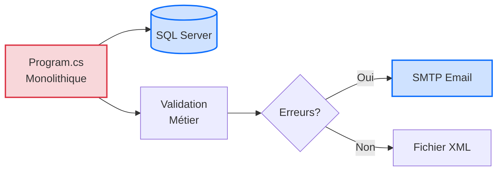

# Jour 1 - Fondations d'une Application Moderne

**Durée** : 6h00 (4 sessions × 1h30)  
**Objectif** : Prouver que le code legacy est dangereux et créer l'architecture cible

---

## Session 1 - 09h00 : Analyse du Batch Legacy

### 🧠 Concepts Fondamentaux

#### Qu'est-ce que la Dette Technique ?

La **dette technique** représente le coût caché du code qui fonctionne aujourd'hui, mais qui ralentira votre équipe demain. Comme une dette financière, elle accumule des "intérêts" : chaque modification devient plus risquée, plus lente, plus coûteuse.

**Exemple concret** : Modifier une règle métier devrait prendre 2 heures. Dans du code legacy non testé, cela peut prendre 3 jours (analyse des impacts, tests manuels, correction des effets de bord).

#### Les 5 Catégories d'Anti-Patterns

| Catégorie | Question Clé | Impact Business |
|-----------|--------------|-----------------|
| **🔓 Sécurité** | Les secrets sont-ils hardcodés ? | Violation RGPD, fuite données → 50k€ à 500k€ |
| **🐌 Performance** | Les appels I/O sont-ils asynchrones ? | Timeout, blocages → 10k€/an en incidents |
| **💥 Robustesse** | Que se passe-t-il si une dépendance externe plante ? | Pannes silencieuses → 4h investigation/incident |
| **🔧 Maintenabilité** | Peut-on tester la logique métier sans infrastructure ? | Vélocité divisée par 10 → -70% productivité |
| **📦 Déploiement** | Le code fonctionne-t-il sur Linux/Docker ? | Verrouillage Windows → 5k€/an licences |

**Coût Total Estimé de la Dette** : **85 000€ à 550 000€ par an**

#### Diagramme : Workflow Legacy (AS-IS)



**Problème** : Tout est couplé. Impossible de tester la validation sans lancer SQL Server + SMTP.

---

### 💡 L'Astuce Pratique

> **Le Principe SOLID comme Détecteur**
>
> Le **S** de SOLID = Single Responsibility Principle (Responsabilité Unique).
> 
> **Règle simple** : Si une classe fait plus d'une chose, c'est un anti-pattern.

**Exemple** : `Program.cs` fait 7 choses différentes :
1. Connexion SQL
2. Lecture données
3. Validation métier
4. Gestion erreurs
5. Envoi email
6. Génération XML
7. Logging console

**Conséquence** : Modifier la validation métier risque de casser l'envoi email. Tout est entremêlé.

**Best-Practice** : Une classe = une responsabilité. Une fonction = une transformation.

---

### 💬 Analyse Collective

**Question à la Salle** :

> "Si vous devez modifier une règle de validation dans ce code legacy, combien de temps vous faut-il pour être **certain** que cette modification ne cassera rien en production ?"

**🎤 Instruction Formateur** :
- Posez la question
- **Silence 5-8 secondes** (laissez les stagiaires réfléchir)
- Accueillez 2-3 réponses de la salle
- Synthétisez : "**Des heures, voire des jours**. Pourquoi ? Parce qu'il n'y a aucun test automatique. Vous devez tester manuellement SQL + SMTP + XML. Et même comme ça, vous n'êtes jamais sûr à 100%."

**Objectif** : Faire prendre conscience que le vrai problème n'est pas la complexité technique, mais l'**impossibilité de tester**.

---

### ⚙️ Défi d'Application

**Contexte** : Vous héritez du batch ValidFlow, un système critique qui valide des données clients et génère des rapports. Le code tourne en production depuis 5 ans, mais personne n'ose y toucher.

**Mission** : Vous êtes le **Détective du Code Legacy**. Votre objectif est d'identifier 5 problèmes critiques dans le fichier `ValidFlow.Legacy/Program.cs`, un problème par catégorie.

**Durée** : 15 minutes

**Fichier à analyser** :
```
02_Atelier_Stagiaires/ValidFlow.Legacy/Program.cs
```

**Format de Réponse** :

Pour chaque problème identifié, documentez :

```
Catégorie : [Sécurité | Performance | Robustesse | Maintenabilité | Déploiement]
Lignes concernées : XX-YY
Code problématique : [Extrait du code]
Impact Business : [Quelle conséquence concrète ?]
Coût Estimé : [Montant ou pourcentage]
```

**Critères de Succès** :
- [ ] 5 problèmes identifiés (1 par catégorie)
- [ ] Numéros de ligne exacts fournis
- [ ] Impact business documenté pour chaque problème
- [ ] Coût estimé ou pourcentage de perte

---

### 💡 Pistes de Réflexion

**Pour démarrer** :
- 🔓 **Sécurité** : Cherchez les mots de passe ou identifiants dans le code source (lignes 15-20). Que se passe-t-il si ce fichier est publié sur GitHub par erreur ?
- 🐌 **Performance** : Les appels à la base de données (ligne 55) sont-ils asynchrones ? Que se passe-t-il si la requête SQL prend 30 secondes ?
- 💥 **Robustesse** : Regardez le bloc `try-catch` (lignes 40-44). Si SQL Server plante, l'erreur est-elle gérée correctement ? Quelqu'un sera-t-il alerté ?
- 🔧 **Maintenabilité** : Pouvez-vous tester la méthode `ValidateData()` (ligne 71) sans avoir SQL Server et SMTP en marche ? Combien de temps faut-il pour lancer ce test ?
- 📦 **Déploiement** : Le chemin du fichier de sortie (ligne 138) fonctionne-t-il sur Linux ? Est-il configuré de manière flexible ?

**Si vous bloquez** :
- **Erreur courante** : Confondre "le code fonctionne" avec "le code est maintenable". Ce qui fonctionne aujourd'hui peut devenir un cauchemar demain.
- **Astuce** : Pour chaque ligne suspecte, demandez-vous : "Que se passe-t-il si [dépendance externe] n'est pas disponible ?"

**Pour aller plus loin** :
- Combien d'anti-patterns supplémentaires pouvez-vous trouver au-delà des 5 demandés ?
- Quelle serait la première chose à refactoriser si vous n'aviez que 2 heures ?

---

### 🔗 Solution Complète

La solution détaillée est disponible ici :

📂 `Solutions_A_Partager/J1_S1_Solution_09h00_Analyse.md`

**Le formateur partagera le lien après l'exercice.**

---

### 🎤 Scripts Téléprompter (Formateur)

#### Script Ouverture Session (2 minutes)

> "Bonjour à tous et bienvenue pour ce premier jour de formation. Ce matin, on va faire quelque chose d'inhabituel.
>
> Au lieu de commencer par coder, on va **auditer** le code legacy. Pourquoi ? Parce qu'avant de refactoriser, il faut **prouver** que le code est dangereux. Sinon, votre manager ne vous donnera jamais 5 jours pour le moderniser.
>
> **[PAUSE 3 secondes]**
>
> Vous allez chercher 5 problèmes critiques dans `ValidFlow.Legacy/Program.cs`. Un problème de **Sécurité**, un de **Performance**, un de **Robustesse**, un de **Maintenabilité** et un de **Déploiement**.
>
> L'objectif n'est pas de trouver des bugs, mais de documenter la **dette technique** avec un **coût business chiffré**. C'est ce qui convaincra votre direction d'investir dans le refactoring."

**Durée** : 2 minutes  
**Action** : Ouvrir `Program.cs` sur l'écran partagé et montrer rapidement la structure

---

#### Script Lancement Exercice (1 minute)

> "Vous avez **15 minutes**. Ouvrez le fichier `Program.cs` et cherchez 5 problèmes, un par catégorie.
>
> Pour chaque problème : notez les **numéros de ligne**, l'**impact business** et le **coût estimé**.
>
> **[PAUSE 2 secondes]**
>
> Top chrono !"

**Action** : Lancer un chronomètre visible projeté à l'écran (15:00)  
**Durée** : 1 minute

---

### ⏱️ Timing Détaillé

| Horaire | Section | Durée | Cumul |
|---------|---------|-------|-------|
| 09h00 | 🧠 Concepts Fondamentaux | 10 min | 10 min |
| 09h10 | 💡 L'Astuce Pratique (SOLID) | 5 min | 15 min |
| 09h15 | 💬 Analyse Collective (Question) | 5 min | 20 min |
| 09h20 | 🎤 Script Lancement + Consignes | 2 min | 22 min |
| 09h22 | ⚙️ Exercice Pratique (Stagiaires) | 15 min | 37 min |
| 09h37 | Surveillance Chat + Déblocages | 8 min | 45 min |
| 09h45 | 🔗 Correction Collective + Solution Drive | 15 min | 60 min |

**Total Session** : 1h00

---

**Fin Session 1 - 09h00**

---

## ⏸️ Sessions 2-4 : En Cours de Génération

Les sessions suivantes seront ajoutées après validation de la Session 1.

**Prochaines Sessions** :
- Session 2 - 10h40 : Scaffolding de la Clean Architecture
- Session 3 - 13h30 : Implémentation du Cœur Métier (Domain)
- Session 4 - 15h10 : Modernisation de la Syntaxe (C# 12)
