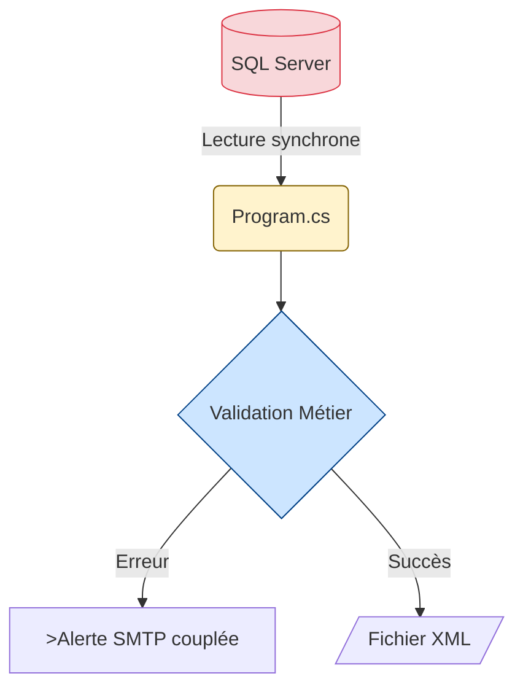

# Jour 1 : Fondations d'une Application Moderne

## Session 09h00 : Analyse du Batch Legacy

**Durée** : 1h30 (09h00-10h30)  
**Objectif** : Identifier les anti-patterns critiques qui rendent le code legacy impossible à maintenir, puis comprendre comment l'architecture moderne résout ces problèmes

---

## 🧠 PHASE 1 : BRIEF - Théorie sur la Dette Technique (15 min)

### Pourquoi Auditer Avant de Refactoriser ?

Un "batch" legacy accumule de la dette technique avec le temps. Avant de toucher au code, il faut **prouver** qu'il viole les standards modernes pour justifier le refactoring auprès du métier.

Notre application **ValidFlow** extrait des données SQL, les valide selon des règles métier, et génère un XML ou envoie un e-mail en cas d'erreur.

### Les 5 Catégories d'Anti-Patterns

| Catégorie | Question Clé | Impact Business |
|-----------|--------------|------------------|
| 🔓 **Sécurité** | Y a-t-il des secrets en clair ? | Violation RGPD, risque de piratage |
| 🐌 **Performance** | Le code bloque-t-il le thread ? | Temps d'exécution 10x plus long |
| 💥 **Robustesse** | Y a-t-il des gestions d'erreur ? | Crashs en production |
| 🔧 **Maintenabilité** | Le code est-il testable ? | Impossible de refactoriser sans risque |
| 📦 **Déploiement** | L'app est-elle portable ? | Verrouillage sur Windows Server |

### Modélisation du Workflow Legacy (AS-IS)



**Observation** : Tout est mélangé dans un seul fichier `Program.cs`. C'est le monolithe classique.

---

## 💡 PHASE 2 : MANAGE - Démonstration Formateur (30 min)

> **🎬 CONSIGNE FORMATEUR** : Projetez le code `ValidFlow.Legacy/Program.cs` sur le 2ème écran pendant que vous parcourez les lignes ci-dessous en direct.

### Démonstration Live : Analyse Ligne par Ligne

**Ouvrez** `02_Atelier_Stagiaires/ValidFlow.Legacy/Program.cs` et **parcourez** les sections suivantes en expliquant :

#### 1. Anti-Pattern Sécurité (Lignes 16-19)

```csharp
private static string connectionString = "Server=localhost;Database=ValidFlowDB;User Id=admin;Password=admin123;";
private static string smtpPassword = "SmtpP@ss2024!";
```

**Commentaire formateur** :
> "Regardez ces lignes 16 à 19. Les mots de passe sont en clair dans le code. Si je commit ça sur GitHub, n'importe qui peut accéder à notre base de données. C'est une violation RGPD directe. Coût estimé en cas de fuite : 50 000€ à 500 000€."

#### 2. Anti-Pattern Performance (Lignes 52-65)

```csharp
using (var connection = new SqlConnection(connectionString))
{
    connection.Open();  // ❌ Bloquant
    var command = new SqlCommand("SELECT Id, Name, Email FROM Clients", connection);
    using (var reader = command.ExecuteReader())  // ❌ Synchrone
    {
        while (reader.Read())
        {
            result.Add(reader["Id"].ToString(), 
                reader["Name"].ToString() + "|" + reader["Email"].ToString());
        }
    }
}
```

**Commentaire formateur** :
> "Ligne 53 : `connection.Open()` bloque le thread. Si SQL Server met 5 secondes à répondre, mon batch attend 5 secondes sans rien faire. Résultat : un batch de 5 minutes devient 50 minutes."

#### 3. Anti-Pattern Robustesse (Lignes 40-44)

```csharp
catch (Exception ex)
{
    Console.WriteLine("ERREUR: " + ex.Message);
}
```

**Commentaire formateur** :
> "Ligne 40 : on capture TOUTES les exceptions, même les critiques comme `OutOfMemoryException`. L'erreur est affichée puis ignorée. Si SQL plante, personne n'est alerté. Découverte du bug : 3 jours plus tard quand les clients se plaignent."

#### 4. Anti-Pattern Maintenabilité (Lignes 70-102)

```csharp
private static List<string> ValidateData(Dictionary<string, string> data)
{
    var rules = new List<IRule>
    {
        new MandatoryRule(),
        new MinLengthRule(2),
        new MaxLengthRule(100)
    };
    // ...
}
```

**Commentaire formateur** :
> "Méthode `static`, impossible à injecter ou mocker. Pour tester cette validation, je dois lancer SQL Server + SMTP. Temps de test : 10 secondes. Avec l'architecture moderne : 15 millisecondes."

#### 5. Anti-Pattern Déploiement (Ligne 138)

```csharp
xml.Save("output.xml");  // ❌ Chemin Windows-only
```

**Commentaire formateur** :
> "Ligne 138 : chemin relatif non portable. Sur Linux, ça plante. Résultat : verrouillage sur Windows Server. Coût licences : 5 000€/an au lieu de 0€ pour Linux."

---

## 💬 PHASE 3 : ARCHITECT - Analyse Collective (10 min)

### Question Ouverte à la Salle

> "Dans votre expérience professionnelle, combien de temps vous faut-il pour être **absolument certain** qu'une modification d'une règle métier (par exemple passer la longueur minimum d'un nom de 3 à 2 caractères) ne cassera rien d'autre dans un code legacy **sans tests automatisés** ?"

**Laissez 8-10 secondes de silence complet pour que chacun visualise la douleur.**

### Le Constat Partagé

**Réponses typiques attendues** :
- "Des heures, voire une journée complète"
- "Il faut tester manuellement avec SQL et SMTP"
- "On attend la recette utilisateur et on croise les doigts"

**Reformulation formateur** :
> "C'est intenable. Cette peur de casser le code ralentit la vélocité de 70%. C'est pour ça qu'on va créer une architecture testable en 15ms."

---

## ⚙️ PHASE 4 : DEVELOP - Atelier Pratique avec Scaffolding (25 min)

### Contexte de la Mission

Vous venez d'hériter du batch ValidFlow. Le métier vous demande une petite modification : **passer la longueur minimum d'un nom de client de 3 à 2 caractères**. Avant de toucher au code, vous devez auditer les risques.

### Votre Mission

1. Ouvrez le fichier `02_Atelier_Stagiaires/ValidFlow.Legacy/Program.cs`
2. Pour **chaque catégorie** du tableau (Sécurité, Performance, Robustesse, Maintenabilité, Déploiement), identifiez **UN problème concret**
3. Notez les **numéros de ligne exacts** du code problématique
4. Décrivez l'**impact business** si ce problème se matérialise en production

### Format de Réponse Attendu

```
#1 Sécurité : Ligne XX - [Description du problème]
   Impact : [Conséquence business chiffrée]

#2 Performance : Ligne XX - [Description du problème]
   Impact : [Conséquence business chiffrée]

#3 Robustesse : Ligne XX - [Description du problème]
   Impact : [Conséquence business chiffrée]

#4 Maintenabilité : Ligne XX - [Description du problème]
   Impact : [Conséquence business chiffrée]

#5 Déploiement : Ligne XX - [Description du problème]
   Impact : [Conséquence business chiffrée]
```

---

### 💡 Pistes de Réflexion (Scaffolding)

> **Ces indices vous aident à démarrer. Ne copiez pas la démo formateur - cherchez par vous-même d'abord.**

**Piste Sécurité** :
- Souvenez-vous : les secrets en dur violent le RGPD
- Cherchez les mots-clés : `Password`, `connectionString`, `Credential`
- Posez-vous la question : "Si je partage ce code sur GitHub, quelles infos sont exposées ?"

**Piste Performance** :
- Souvenez-vous : les appels synchrones bloquent le thread
- Cherchez les mots-clés : `Open()`, `ExecuteReader()`, `Send()`
- Posez-vous la question : "Que se passe-t-il si SQL Server répond en 10 secondes ?"

**Piste Robustesse** :
- Souvenez-vous : `catch (Exception ex)` capture TOUT, même les erreurs critiques
- Cherchez les blocs `try/catch`
- Posez-vous la question : "Si une erreur se produit, est-elle loggée ? Le métier est-il alerté ?"

**Piste Maintenabilité** :
- Souvenez-vous : les méthodes `static` ne sont pas injectables ni testables
- Cherchez les mots-clés : `private static`, pas de constructeur avec injection
- Posez-vous la question : "Puis-je tester cette méthode sans lancer SQL et SMTP ?"

**Piste Déploiement** :
- Souvenez-vous : les chemins Windows (backslashes, chemins absolus) ne fonctionnent pas sur Linux
- Cherchez les instructions de fichier : `Save()`, chemins en dur
- Posez-vous la question : "Ce code peut-il tourner dans un conteneur Docker Linux ?"

---

### Critères de Réussite

- [ ] Les 5 problèmes sont identifiés avec leurs numéros de ligne
- [ ] Chaque impact business est documenté avec un coût estimé
- [ ] Vous avez compris pourquoi ce code est impossible à tester unitairement
- [ ] Vous avez identifié au moins 3 violations des principes SOLID

---

### 🔗 Lien vers la Solution

> 💡 **Correction** : Le formateur partagera le lien direct vers la correction dans le chat à la fin du temps imparti.  
> Lien Drive : `G:\Drive partagés\wetic-s\modules\net-mod-legacy\net-mod-legacy_master_documents\Jour_1_Fondations\Solutions_A_Partager\J1_S1_Solution_09h00_Analyse_NEW.md`

---

## 🎯 Bilan et Transition (10 min)

### Ce que Vous Avez Appris

✅ Identifier 5 catégories d'anti-patterns avec impact business chiffré  
✅ Comprendre pourquoi le code legacy est impossible à tester  
✅ Visualiser le coût de la dette technique (85k€ à 550k€)  

### Prochaine Session (10h40) : Scaffolding de la Clean Architecture

Maintenant que vous avez **prouvé** que le code legacy est dangereux, nous allons créer l'architecture qui résout ces 5 problèmes.

**Vous allez construire** :
- 5 projets .NET 8 isolés (Domain, Application, Infrastructure, Console, Tests)
- Un projet `Domain` 100% testable (zéro dépendance externe)
- Une architecture qui permet de tester en **15ms** au lieu de lancer SQL Server

**Pause de 10 minutes.**

---

## 📚 Annexe Technique

### Structure du Fichier Legacy

```
ValidFlow.Legacy/
└── Program.cs (208 lignes)
    ├── Main()                    ← Point d'entrée
    ├── GetDataFromDatabase()     ← Couplage SQL
    ├── ValidateData()            ← Logique métier mélangée
    ├── SendAlertEmail()          ← Couplage SMTP
    └── GenerateXmlOutput()       ← Génération fichier
```

**Le problème architectural** : Zéro séparation des responsabilités. Impossible à tester sans infrastructure complète.

### Principe SOLID Violé : SRP (Single Responsibility Principle)

Le code legacy viole systématiquement le principe de Responsabilité Unique. Quand une classe fait "tout" (SQL + Validation + Email), elle viole aussi les 4 autres principes SOLID. C'est un signal d'alarme immédiat.
