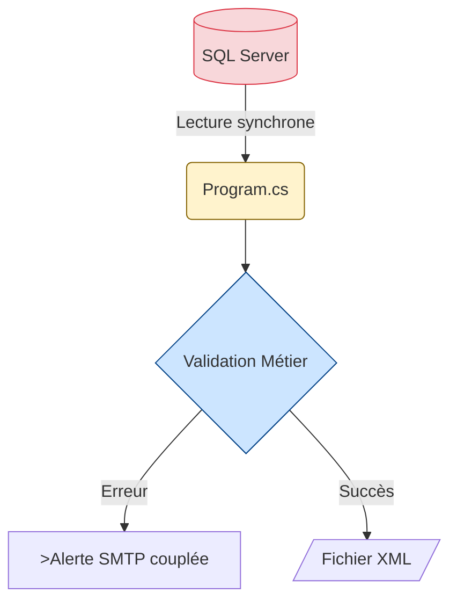

# Jour 1 : Fondations d'une Application Moderne

## Session 09h00 : Analyse du Batch Legacy

**Durée** : 1h30 (09h00-10h30)  
**Objectif** : Identifier les anti-patterns critiques qui rendent le code legacy impossible à maintenir et à tester

---

### 🧠 Concepts Fondamentaux : La Dette Technique

Un "batch" legacy accumule de la dette technique avec le temps. Avant de refactoriser, il faut auditer le code pour prouver qu'il viole les standards modernes.

Notre application ValidFlow extrait des données SQL, les valide selon des règles métier, et génère un XML ou envoie un e-mail en cas d'erreur.

**Les 5 catégories d'anti-patterns à identifier :**

| Catégorie | Question clé | Impact Business |
|-----------|--------------|-----------------|
| 🔓 **Sécurité** | Y a-t-il des secrets en clair ? | Violation RGPD, risque de piratage |
| 🐌 **Performance** | Le code bloque-t-il le thread ? | Temps d'exécution 10x plus long |
| 💥 **Robustesse** | Y a-t-il des gestions d'erreur ? | Crashs en production |
| 🔧 **Maintenabilité** | Le code est-il testable ? | Impossible de refactoriser sans risque |
| 📦 **Déploiement** | L'app est-elle portable ? | Verrouillage sur Windows Server |

---

### 🧠 Modélisation du Workflow Legacy (AS-IS)

Visualisons le flux actuel pour comprendre le problème :



**Observation critique** : Tout est mélangé dans un seul fichier `Program.cs`. C'est le monolithe classique.

---

### 💡 L'Astuce Pratique : Le Principe SOLID comme Détecteur

Le code legacy viole systématiquement le principe de Responsabilité Unique (SRP). Quand une classe fait "tout" (SQL + Validation + Email), elle viole aussi les 4 autres principes SOLID. C'est un signal d'alarme immédiat.

---

### 💬 Analyse Collective : La Peur de Modifier

**Question ouverte à la salle** :

> "Dans votre expérience, combien de temps vous faut-il pour être **certain** qu'une modification d'une règle métier ne cassera rien d'autre dans un code legacy sans tests ?"

*(Laissez 5-8 secondes de silence pour que chacun visualise la douleur)*

**Le constat** : Des heures, voire des jours. Parce qu'il faut tester manuellement avec SQL et SMTP. C'est intenable.

---

### ⚙️ Défi d'Application : Détective du Code Legacy

**Durée** : 15 minutes

**Contexte** : Vous venez d'hériter du batch ValidFlow. Le métier vous demande une petite modification : passer la longueur minimum d'un nom de client de 3 à 2 caractères. Avant de toucher au code, vous devez auditer les risques.

**Votre mission** :

1. Ouvrez le fichier `02_Atelier_Stagiaires/ValidFlow.Legacy/Program.cs`
2. Pour **chaque catégorie** du tableau ci-dessus (Sécurité, Performance, Robustesse, Maintenabilité, Déploiement), identifiez **UN problème concret**
3. Notez les **numéros de ligne exacts** du code problématique
4. Décrivez l'**impact business** si ce problème se matérialise en production

**Format de réponse attendu** :

```
#1 Sécurité : Ligne XX - [Description du problème]
   Impact : [Conséquence business]

#2 Performance : Ligne XX - [Description du problème]
   Impact : [Conséquence business]

...
```

**Critères de réussite** :
- [ ] Les 5 problèmes sont identifiés avec leurs numéros de ligne
- [ ] Chaque impact business est documenté
- [ ] Vous avez compris pourquoi ce code est impossible à tester unitairement

---

### 🔗 Lien vers la Solution

> 💡 **Correction** : Le formateur partagera le lien direct vers la correction dans le chat à la fin du temps imparti.  
> Lien Drive : `G:\Drive partagés\wetic-s\modules\net-mod-legacy\net-mod-legacy_master_documents\Jour_1_Fondations\Solutions_A_Partager\J1_S1_Solution_09h00_Analyse_NEW.md`

---

### 🧠 Préparation pour la Session Suivante (10h40)

Maintenant que vous avez identifié les 5 anti-patterns, nous allons créer l'architecture qui résout ces problèmes : la **Clean Architecture**.

Vous allez créer 5 projets .NET 8 avec une structure qui rend le code **testable en 15ms** au lieu de devoir lancer SQL Server.

**Pause de 10 minutes.**

---

## Annexe Technique : Structure du Fichier Legacy

```
ValidFlow.Legacy/
└── Program.cs (208 lignes)
    ├── Main()                    ← Point d'entrée
    ├── GetDataFromDatabase()     ← Couplage SQL
    ├── ValidateData()            ← Logique métier mélangée
    ├── SendAlertEmail()          ← Couplage SMTP
    └── GenerateXmlOutput()       ← Génération fichier
```

**Le problème architectural** : Zéro séparation des responsabilités. Impossible à tester sans infrastructure complète.
