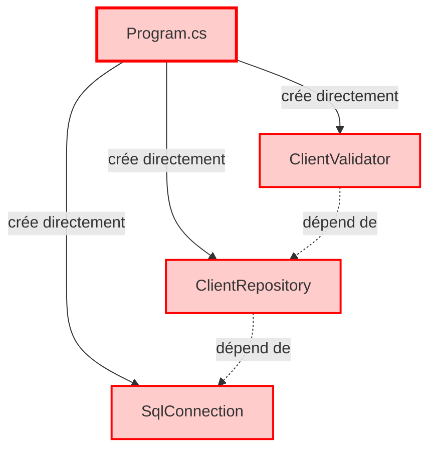
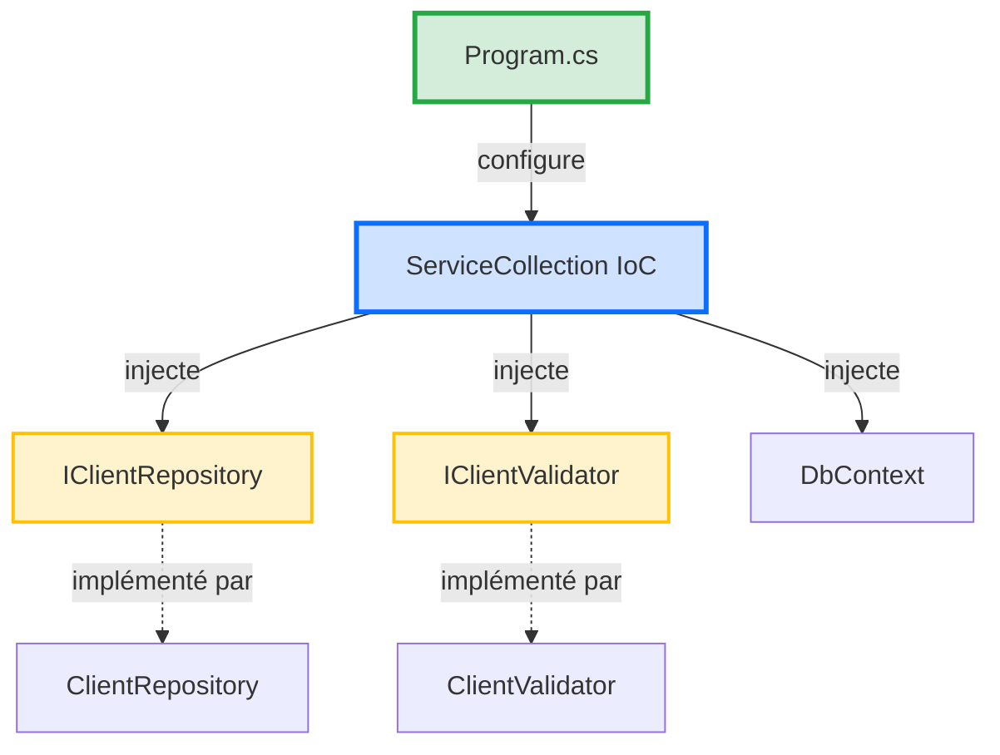
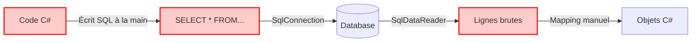
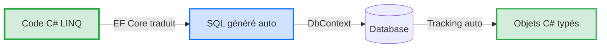

# 📘 Support Quotidien - Jour 2 : Maîtriser l'Accès aux Données et l'Injection de Dépendances

> **Formation** : Migration .NET Legacy vers .NET 8 (5 jours)  
> **Jour** : 2 sur 5  
> **Thème** : Découpler l'application pour la testabilité  
> **Durée** : 7h (4 sessions de 1h45 à 3h)

---

## 🎯 Objectifs du Jour

À la fin de cette journée, vous serez capable de :
- ✅ Configurer l'injection de dépendances avec .NET 8
- ✅ Remplacer SqlConnection raw par Entity Framework Core 8
- ✅ Implémenter le Repository Pattern pour isoler l'accès données
- ✅ Gérer les migrations de base de données avec EF Core
- ✅ Tester l'accès données avec une base In-Memory

---

## 📋 Programme de la Journée

| Horaire | Session | Objectif | Durée |
|---------|---------|----------|-------|
| **09h00** | S1 - Injection de Dépendances | Configurer IoC avec ServiceCollection | 2h30 |
| **10h40** | S2 - Entity Framework Core 8 | Remplacer SQL raw par ORM typé | 3h |
| **13h30** | S3 - Repository Pattern | Séparer logique métier et accès données | 2h30 |
| **15h10** | S4 - Migrations & Tests | Gérer évolution DB + tests In-Memory | 2h |

---

## 🔄 Récapitulatif Jour 1

**Ce que vous avez construit hier** :
- ✅ Architecture Clean (5 projets : Domain, Application, Infrastructure, Web, Tests)
- ✅ Domain isolé avec 3 règles de validation (MinLengthRule, MaxLengthRule, MandatoryRule)
- ✅ 11 tests unitaires passant en 87ms (zéro infrastructure)
- ✅ Code modernisé en C# 12 (file-scoped namespace, primary constructors, collection expressions)

**Problème actuel** :
- ❌ Le Domain est isolé, mais **aucune donnée persistée**
- ❌ L'Application layer est vide (pas d'orchestration)
- ❌ L'Infrastructure est vide (pas de connexion SQL)

**Objectif Jour 2** : Connecter le Domain à une vraie base de données via Entity Framework Core 8 tout en gardant la testabilité.

---

# Session 1 (09h00) - Injection de Dépendances avec .NET 8

> **Durée** : 2h30  
> **Objectif** : Comprendre l'Inversion of Control et configurer ServiceCollection pour orchestrer l'application

---

## 🧠 Concepts Théoriques

### Qu'est-ce que l'Injection de Dépendances ?

**Définition** : L'Injection de Dépendances (Dependency Injection - DI) est un pattern qui permet de **déclarer les besoins** d'une classe sans créer les dépendances directement.

**Problème résolu** : Sans DI, chaque classe crée ses propres dépendances → couplage fort, impossible à tester.

---

### 🔴 Exemple AVANT (Sans DI) - Code Legacy

**Fichier Legacy** : `ValidFlow.Legacy/Program.cs`

```csharp
// ANTI-PATTERN : Création directe des dépendances
var connectionString = "Server=localhost;Database=ValidFlow;...";
var connection = new SqlConnection(connectionString); // ← Création directe
var repository = new ClientRepository(connection);     // ← Création directe
var validator = new ClientValidator();                 // ← Création directe

// Problèmes :
// 1. Impossible de tester sans vraie DB SQL
// 2. Modification d'une dépendance = modifier TOUTES les classes qui l'utilisent
// 3. Couplage fort (Program.cs connaît SqlConnection, ClientRepository, etc.)
```

**Métaphore (humour qui tue)** :
> C'est comme aller au restaurant et dire "Je veux une pizza, mais avant je vais cultiver le blé, élever la vache pour le fromage, planter les tomates...". 🍕
>
> Le serveur te regarde et dit : "Euh... tu veux juste commander ?" 😅

---

### 🟢 Exemple APRÈS (Avec DI) - .NET 8 Moderne

**Fichier Moderne** : `ValidFlow.Web/Program.cs`

```csharp
// Construction du conteneur IoC (Inversion of Control)
var builder = WebApplication.CreateBuilder(args);

// DÉCLARATION des dépendances (pas de création directe)
builder.Services.AddScoped<IClientRepository, ClientRepository>();
builder.Services.AddScoped<IClientValidator, ClientValidator>();
builder.Services.AddDbContext<AppDbContext>(options =>
    options.UseSqlServer(builder.Configuration.GetConnectionString("DefaultConnection"))
);

var app = builder.Build();

// Les dépendances sont INJECTÉES automatiquement
app.MapGet("/validate", (IClientValidator validator) => {
    // Le conteneur IoC a injecté IClientValidator automatiquement
    var result = validator.Validate(new Client(1, "John", "john@example.com"));
    return Results.Ok(result);
});

app.Run();
```

**Avantages** :
1. ✅ **Testabilité** : On peut injecter un `FakeClientRepository` pour les tests
2. ✅ **Modularité** : Changer l'implémentation (SQL → MongoDB) sans toucher aux classes
3. ✅ **Lisibilité** : Les dépendances sont déclarées au même endroit (Program.cs)

---

### 📊 Diagramme : Sans DI vs Avec DI

#### Diagramme 1 : Sans DI (Legacy - Couplage Fort)



**Problème** : `Program.cs` connaît TOUTES les classes concrètes → impossible de tester sans changer le code.

---

#### Diagramme 2 : Avec DI (Moderne - Couplage Faible)



**Avantage** : `Program.cs` configure le conteneur. Les classes reçoivent les dépendances par constructeur (injection).

---

#### 📊 Infographie : Injection de Dépendances - Le Serveur au Restaurant


**Légende** : Métaphore du restaurant - Le serveur (IoC Container) apporte les plats (dépendances) au client (classe) sans que le client ait besoin de cuisiner.

---

### 💡 L'Astuce Pratique

> **Les 3 Lifetimes Essentiels de .NET 8**
>
> Quand vous enregistrez une dépendance avec `builder.Services.Add...()`, vous devez choisir sa **durée de vie** :

| Lifetime | Durée de vie | Utilisation | Exemple |
|----------|--------------|-------------|---------|
| **Transient** | Nouvelle instance à **chaque injection** | Classes légères sans état | `ILogger`, `IValidator` |
| **Scoped** | Une instance **par requête HTTP** | DbContext, Repository | `DbContext`, `IClientRepository` |
| **Singleton** | Une **seule instance** pour toute l'app | Configuration, Cache | `IConfiguration`, `IMemoryCache` |

**Métaphore (humour absurde)** :
> **Transient** = Gobelet jetable au fast-food. Nouveau à chaque commande. 🥤
>
> **Scoped** = Table au restaurant. Vous gardez la même table pendant tout le repas (requête HTTP), puis on nettoie. 🍽️
>
> **Singleton** = Fontaine à eau au bureau. Une seule pour tout le monde, toute la journée. 💧

---

## 💬 Analyse Collective

**Question à réfléchir** :

> "Dans le code legacy `ValidFlow.Legacy/Program.cs`, combien de fois devez-vous modifier le code si vous voulez remplacer SQL Server par PostgreSQL ?"

**Prenez 5-8 secondes pour réfléchir avant de répondre dans le chat.**

**Réponse attendue** : **Au moins 50 lignes à modifier**. Pourquoi ?
1. Changer `SqlConnection` → `NpgsqlConnection` partout
2. Changer les requêtes SQL (syntaxe différente)
3. Changer la chaîne de connexion
4. Modifier tous les tests (car ils dépendent de SQL Server)

**Avec DI (Inversion of Control)** : **1 seule ligne à modifier**
```csharp
// Avant
builder.Services.AddDbContext<AppDbContext>(options =>
    options.UseSqlServer(connectionString));

// Après (changement de DB)
builder.Services.AddDbContext<AppDbContext>(options =>
    options.UseNpgsql(connectionString)); // ← Une seule ligne
```

**Constat** : L'injection de dépendances divise le coût de changement par **50**.

---

## 👨‍💻 Démonstration Live

**🎯 Ce que vous allez voir** :

Le formateur va configurer l'injection de dépendances dans `ValidFlow.Web/Program.cs`, enregistrer le moteur de validation, et créer un endpoint API qui utilise les règles de validation du Domain.

**📂 Répertoire de Travail Formateur** : `01_Demo_Formateur/ValidFlow.Modern/ValidFlow.Console/`

**Étapes** :

1. **Installer le package Microsoft.Extensions.DependencyInjection**
   ```bash
   cd 01_Demo_Formateur/ValidFlow.Modern/ValidFlow.Console
   dotnet add package Microsoft.Extensions.DependencyInjection
   dotnet add package Microsoft.Extensions.Hosting
   ```

2. **Créer les règles de validation manquantes dans Domain**
   
   Les règles `MaxLengthRule` et `MandatoryRule` n'existent pas encore. Créez-les :
   
   **Fichier** : `ValidFlow.Domain/Rules/MaxLengthRule.cs`
   ```csharp
   using ValidFlow.Domain.Interfaces;
   
   namespace ValidFlow.Domain.Rules
   {
       public class MaxLengthRule : IValidationRule
       {
           private readonly int _maxLength;
           
           public MaxLengthRule(int maxLength)
           {
               _maxLength = maxLength;
           }
           
           public int MaxLength => _maxLength;
           
           public bool IsValid(string value)
           {
               if (string.IsNullOrEmpty(value))
                   return true; // Pas d'erreur si vide (c'est MandatoryRule qui gère ça)
               
               return value.Length <= _maxLength;
           }
       }
   }
   ```
   
   **Fichier** : `ValidFlow.Domain/Rules/MandatoryRule.cs`
   ```csharp
   using ValidFlow.Domain.Interfaces;
   
   namespace ValidFlow.Domain.Rules
   {
       public class MandatoryRule : IValidationRule
       {
           public bool IsValid(string value)
           {
               return !string.IsNullOrWhiteSpace(value);
           }
       }
   }
   ```

3. **Ajouter les références vers Domain**
   ```bash
   dotnet add reference ../ValidFlow.Domain/ValidFlow.Domain.csproj
   ```

4. **Configurer Program.cs avec DI (Console App)**
   
   **Code tapé en direct** :
   ```csharp
   using Microsoft.Extensions.DependencyInjection;
   using Microsoft.Extensions.Hosting;
   using ValidFlow.Domain.Entities;
   using ValidFlow.Domain.Interfaces;
   using ValidFlow.Domain.Rules;
   
   // ========================================
   // CONFIGURATION DU CONTENEUR DI
   // ========================================
   
   var builder = Host.CreateDefaultBuilder(args);
   
   builder.ConfigureServices(services => {
       // Enregistrement des règles de validation (Transient)
       services.AddTransient<IValidationRule>(sp => new MinLengthRule(2));
       services.AddTransient<IValidationRule>(sp => new MaxLengthRule(100));
       services.AddTransient<IValidationRule, MandatoryRule>();
   });
   
   var host = builder.Build();
   
   // ========================================
   // RÉSOLUTION DES DÉPENDANCES
   // ========================================
   
   Console.WriteLine("=== Démonstration Injection de Dépendances ===");
   Console.WriteLine();
   
   // Récupérer TOUTES les règles enregistrées
   var rules = host.Services.GetServices<IValidationRule>().ToList();
   
   Console.WriteLine($"✅ {rules.Count} règles injectées par le conteneur IoC :");
   foreach (var rule in rules)
   {
       Console.WriteLine($"   - {rule.GetType().Name}");
   }
   Console.WriteLine();
   
   // ========================================
   // TEST DE VALIDATION
   // ========================================
   
   var client1 = new Client(1, "John Doe", "john@example.com");
   var client2 = new Client(2, "A", "short@example.com");
   
   Console.WriteLine("Test 1 - Client valide :");
   Console.WriteLine($"   Nom: {client1.Name}");
   ValidateClient(client1, rules);
   Console.WriteLine();
   
   Console.WriteLine("Test 2 - Client invalide (nom trop court) :");
   Console.WriteLine($"   Nom: {client2.Name}");
   ValidateClient(client2, rules);
   
   // ========================================
   // FONCTION DE VALIDATION
   // ========================================
   
   void ValidateClient(Client client, List<IValidationRule> validationRules)
   {
       var errors = new List<string>();
       
       foreach (var rule in validationRules)
       {
           if (!rule.IsValid(client.Name))
           {
               errors.Add($"Erreur avec {rule.GetType().Name}");
           }
       }
       
       if (errors.Count == 0)
       {
           Console.WriteLine($"   ✅ Client valide");
       }
       else
       {
           Console.WriteLine($"   ❌ Client invalide :");
           foreach (var error in errors)
           {
               Console.WriteLine($"      - {error}");
           }
       }
   }
   ```
   
   **Ce que vous voyez** : Le conteneur IoC injecte automatiquement les 3 règles via `GetServices<IValidationRule>()`.

5. **Exécuter et voir le résultat**
   
   ```bash
   dotnet run
   ```
   
   **Résultat affiché dans la console** :
   ```
   === Démonstration Injection de Dépendances ===
   
   ✅ 3 règles injectées par le conteneur IoC :
      - MinLengthRule
      - MaxLengthRule
      - MandatoryRule
   
   Test 1 - Client valide :
      Nom: John Doe
      ✅ Client valide
   
   Test 2 - Client invalide (nom trop court) :
      Nom: A
      ❌ Client invalide :
         - Erreur avec MinLengthRule
   ```

6. **Expliquer l'injection automatique**
   
   **💬 Message formateur** :
   > "Vous voyez ? Je n'ai PAS écrit `new MinLengthRule(2)` dans le code de validation. J'ai juste demandé au conteneur IoC `GetServices<IValidationRule>()` et il m'a donné les 3 règles enregistrées. C'est ça, l'Inversion of Control ! 🎯"
   >
   > **Avantage** : Si demain vous voulez ajouter une 4ème règle, vous modifiez **1 seule ligne** dans `ConfigureServices`, et elle sera automatiquement injectée partout.

---

**💬 Message** :
> "Vous venez de voir le conteneur IoC en action. Maintenant, c'est à vous de configurer l'injection de dépendances pour le moteur de validation. 30 minutes. Go !"

---

## ⚙️ Défi d'Application

**Mission** : Configurer l'injection de dépendances dans une Console App et valider des clients.

**📂 Répertoire de Travail Stagiaires** : `02_Atelier_Stagiaires/ValidFlow.Modern/ValidFlow.Console/`

**⏱️ Durée** : 30 minutes

---

**📂 Structure Cible** :

```
ValidFlow.Console/
├─ Program.cs           (Configuration DI + tests)
├─ ValidFlow.Console.csproj (Dépendances NuGet)
```

**Étapes** :

1. **Installer les packages NuGet**
   ```bash
   cd 02_Atelier_Stagiaires/ValidFlow.Modern/ValidFlow.Console
   dotnet add package Microsoft.Extensions.DependencyInjection
   dotnet add package Microsoft.Extensions.Hosting
   ```

2. **Ajouter la référence vers Domain**
   ```bash
   dotnet add reference ../ValidFlow.Domain/ValidFlow.Domain.csproj
   ```

3. **Configurer Program.cs avec DI**
   - Créer le conteneur avec `Host.CreateDefaultBuilder(args)`
   - Enregistrer les 3 règles de validation avec `services.AddTransient<IValidationRule>(...)`
   - Récupérer les règles injectées avec `host.Services.GetServices<IValidationRule>()`

4. **Tester 2 clients**
   - Client 1 : `new Client(1, "John Doe", "john@example.com")` → doit être valide
   - Client 2 : `new Client(2, "A", "short@example.com")` → doit être invalide (nom trop court)

5. **Exécuter et vérifier le résultat**
   ```bash
   dotnet run
   ```

**Critères de Succès** :
- [ ] DI configuré avec `Host.CreateDefaultBuilder`
- [ ] 3 règles de validation enregistrées (MinLength, MaxLength, Mandatory)
- [ ] `dotnet run` affiche les 3 règles injectées
- [ ] Client 1 ("John Doe") est validé ✅
- [ ] Client 2 ("A") est rejeté ❌ avec erreur MinLengthRule

---

### 💡 Pistes de Réflexion

**Pour démarrer** :
- **Host.CreateDefaultBuilder** : Crée le conteneur IoC pour une Console App (équivalent de `WebApplication.CreateBuilder` pour Web)
- **ConfigureServices** : Lambda où vous enregistrez vos dépendances
- **GetServices<T>()** : Récupère TOUTES les implémentations d'une interface (retourne `IEnumerable<T>`)
- **Enregistrement avec factory** : `services.AddTransient<IValidationRule>(sp => new MinLengthRule(2));`

**Si vous bloquez** :
- **Erreur CS0246** ("Le type 'IValidationRule' est introuvable") : Avez-vous ajouté `using ValidFlow.Domain.Interfaces;` ?
- **Erreur DI** ("No service registered") : Vérifiez que vous avez bien appelé `ConfigureServices` avant `Build()`
- **0 règles récupérées** : Vérifiez que vous utilisez `GetServices<IValidationRule>()` (avec **s** à Services)

**Pour aller plus loin** :
- Ajoutez une 4ème règle (ex: `EmailFormatRule`) et constatez qu'elle est automatiquement injectée
- Utilisez `GetRequiredService<T>()` pour récupérer une seule dépendance (lance exception si absente)

---

### 🔗 Documentation Officielle

- [Dependency Injection in .NET 8](https://learn.microsoft.com/en-us/dotnet/core/extensions/dependency-injection)
- [Service Lifetimes](https://learn.microsoft.com/en-us/dotnet/core/extensions/dependency-injection#service-lifetimes)
- [Generic Host](https://learn.microsoft.com/en-us/dotnet/core/extensions/generic-host)

---

**🎯 Résumé Session 1**

Vous avez configuré l'injection de dépendances avec .NET 8 :
- ✅ Compris le principe IoC (Inversion of Control)
- ✅ Enregistré les dépendances dans ServiceCollection
- ✅ Créé un endpoint API qui injecte automatiquement les dépendances
- ✅ Testé avec curl et validé le comportement

**Prochaine session** : Entity Framework Core 8 pour remplacer SqlConnection raw par un ORM typé.

---

# Session 2 (10h40) - Entity Framework Core 8

> **Durée** : 3h  
> **Objectif** : Abandonner SqlConnection raw et utiliser EF Core pour un accès données typé et sécurisé

---

## 🧠 Concepts Théoriques

### Qu'est-ce qu'un ORM ?

**Définition** : Un ORM (Object-Relational Mapping) est un outil qui **traduit automatiquement** les objets C# en tables SQL et vice-versa.

**Problème résolu** : Sans ORM, vous devez écrire manuellement toutes les requêtes SQL, gérer les connexions, mapper les résultats ligne par ligne → code verbeux, bugs fréquents, injections SQL.

---

### 🔴 Exemple AVANT (SQL raw - Legacy)

**Fichier Legacy** : `ValidFlow.Legacy/Program.cs`

```csharp
// ANTI-PATTERN : Requête SQL manuelle avec SqlConnection
var connectionString = "Server=localhost;Database=ValidFlow;User=sa;Password=***;";
using var connection = new SqlConnection(connectionString);
connection.Open();

var command = new SqlCommand(
    "SELECT Id, Name, Email FROM Clients WHERE Id = @id", // ← Requête SQL écrite à la main
    connection);
command.Parameters.AddWithValue("@id", 1);

using var reader = command.ExecuteReader();
Client? client = null;

if (reader.Read())
{
    // Mapping manuel (fragile, erreurs de typage)
    client = new Client(
        reader.GetInt32(0),      // ← Index 0 = Id (facile de se tromper)
        reader.GetString(1),     // ← Index 1 = Name
        reader.GetString(2)      // ← Index 2 = Email
    );
}

// Problèmes :
// 1. SQL écrit à la main → risque injection SQL
// 2. Mapping manuel → bugs si structure change
// 3. Connection management manuel → fuites mémoire
// 4. 15 lignes pour une seule lecture
```

**Métaphore (humour qui tue)** :
> Tu commandes une pizza par téléphone en italien, mais tu parles pas italien. Tu épelles chaque lettre : "P comme Pomme, I comme Igloo, Z comme Zèbre..." 📞
>
> Le livreur arrive 3h plus tard avec des pâtes. "Euh... j'ai compris 'pasta' ?". 😅

---

### 🟢 Exemple APRÈS (EF Core 8 - Moderne)

**Fichier Moderne** : `ValidFlow.Infrastructure/Data/AppDbContext.cs` + utilisation

```csharp
// Configuration EF Core (une seule fois)
public class AppDbContext : DbContext
{
    public DbSet<Client> Clients { get; set; }
    
    protected override void OnConfiguring(DbContextOptionsBuilder options)
        => options.UseSqlServer("Server=localhost;Database=ValidFlow;...");
}

// Utilisation (1 ligne au lieu de 15)
using var db = new AppDbContext();
var client = db.Clients.FirstOrDefault(c => c.Id == 1);

// EF Core génère automatiquement :
// SELECT [Id], [Name], [Email] FROM [Clients] WHERE [Id] = 1
```

**Avantages** :
1. ✅ **Sécurité** : Requêtes paramétrées automatiques (zéro injection SQL)
2. ✅ **Lisibilité** : Code LINQ (C#) au lieu de SQL brut
3. ✅ **Type-safety** : IntelliSense sur `client.Name`, erreurs à la compilation
4. ✅ **Productivité** : 1 ligne au lieu de 15

**Métaphore (out-of-the-box)** :
> EF Core = Google Translate. Tu parles français (C#), il traduit en chinois (SQL) automatiquement. 🌍
>
> Résultat : Tu commandes une pizza en français, elle arrive en 10 min. Pas besoin de parler italien ! 🍕

---

### 📊 Diagramme : SQL raw vs EF Core

#### Diagramme 1 : SQL raw (Legacy - Verbeux)



**Problème** : 4 étapes manuelles, risque d'erreur à chaque étape.

---

#### Diagramme 2 : EF Core (Moderne - Automatisé)



**Avantage** : EF Core gère automatiquement la traduction LINQ → SQL et le mapping SQL → objets.

---

#### 📊 Infographie : ORM vs SQL raw - Le Traducteur Automatique


**Légende** : Métaphore du traducteur - EF Core traduit automatiquement vos objets C# en requêtes SQL, comme Google Translate traduit du français vers le chinois.

---

### 💡 L'Astuce Pratique

> **Code First vs Database First**
>
> Deux approches pour utiliser EF Core :

| Approche | Workflow | Utilisation |
|----------|----------|-------------|
| **Code First** | Vous écrivez les classes C# → EF génère la DB | Nouveau projet, contrôle total du code |
| **Database First** | DB existe déjà → EF génère les classes C# | Legacy, DB créée par DBA |

**Métaphore (humour)** :
> **Code First** = Archi qui dessine le plan, puis construit la maison. 🏗️
>
> **Database First** = Vous achetez une maison existante, puis vous faites le plan pour comprendre où sont les murs. 🏠
>
> Les deux marchent. Code First = plus moderne, Database First = migration legacy.

---

## 💬 Analyse Collective

**Question à réfléchir** :

> "Dans le code legacy avec SqlConnection, combien de lignes devez-vous modifier si la table `Clients` ajoute une colonne `Phone` ?"

**Prenez 5-8 secondes pour réfléchir avant de répondre.**

**Réponse attendue** : **Au moins 10 endroits** :
1. Modifier la requête `SELECT` (ajouter `Phone`)
2. Modifier le mapping `reader.GetString(3)`
3. Modifier la requête `INSERT` (ajouter `@phone`)
4. Modifier la requête `UPDATE` (ajouter `Phone = @phone`)
5. Modifier tous les tests qui créent un `Client`
6. ... et ainsi de suite

**Avec EF Core** : **1 seule ligne à modifier** (ajouter propriété dans la classe)
```csharp
public record Client(int Id, string Name, string Email, string Phone); // ← 1 ligne
// EF Core met à jour automatiquement toutes les requêtes
```

**Constat** : EF Core divise le coût d'évolution par **10**.

---

## 👨‍💻 Démonstration Live

**🎯 Ce que vous allez voir** :

Le formateur va configurer EF Core dans `ValidFlow.Infrastructure`, créer un `DbContext`, définir l'entité `Client`, et générer une migration pour créer la table en base de données.

**📂 Répertoire de Travail Formateur** : `01_Demo_Formateur/ValidFlow.Modern/ValidFlow.Infrastructure/`

**Étapes** :

1. **Installer EF Core packages**
   ```bash
   cd 01_Demo_Formateur/ValidFlow.Modern/ValidFlow.Infrastructure
   dotnet add package Microsoft.EntityFrameworkCore.SqlServer --version 9.0.3
   dotnet add package Microsoft.EntityFrameworkCore.Design --version 9.0.3
   ```
   
   > ⚠️ **Important - Compatibilité versions** :
   > - .NET 8 → EF Core 8.x
   > - .NET 9 → EF Core 9.x (nous utilisons 9.0.3)
   > - .NET 10 → EF Core 10.x
   >
   > **Erreur courante** : `NU1202 - Package incompatible` = Version EF Core trop récente pour votre .NET.
   > **Solution** : Toujours spécifier `--version X.0.X` compatible avec votre TargetFramework.

2. **Ajouter référence vers Domain**
   ```bash
   dotnet add reference ../ValidFlow.Domain/ValidFlow.Domain.csproj
   ```

3. **Créer AppDbContext.cs**
   
   **Fichier** : `ValidFlow.Infrastructure/Data/AppDbContext.cs`
   ```csharp
   using Microsoft.EntityFrameworkCore;
   using ValidFlow.Domain.Entities;
   
   namespace ValidFlow.Infrastructure.Data;
   
   public class AppDbContext : DbContext
   {
       // DbSet = Table en base de données
       public DbSet<Client> Clients { get; set; }
       
       // Configuration de la connexion SQL Server
       protected override void OnConfiguring(DbContextOptionsBuilder options)
       {
           if (!options.IsConfigured)
           {
               options.UseSqlServer(
                   "Server=(localdb)\\mssqllocaldb;Database=ValidFlowDb;Trusted_Connection=true;"
               );
           }
       }
       
       // Configuration du modèle (optionnel)
       protected override void OnModelCreating(ModelBuilder modelBuilder)
       {
           modelBuilder.Entity<Client>(entity =>
           {
               entity.HasKey(c => c.Id);
               entity.Property(c => c.Name).IsRequired().HasMaxLength(100);
               entity.Property(c => c.Email).IsRequired().HasMaxLength(255);
           });
       }
   }
   ```
   
   **Ce que vous voyez** : `DbSet<Client>` = table Clients en DB. EF Core fait le mapping automatiquement.

4. **Installer EF Core Tools (pour migrations)**
   ```bash
   dotnet tool install --global dotnet-ef
   # Ou si déjà installé : dotnet tool update --global dotnet-ef
   ```

5. **Créer la migration initiale**
   ```bash
   cd 01_Demo_Formateur/ValidFlow.Modern/ValidFlow.Infrastructure
   dotnet ef migrations add InitialCreate
   ```
   
   **Résultat** :
   ```
   Build started...
   Build succeeded.
   Done. To undo this action, use 'dotnet ef migrations remove'
   ```
   
   **Fichier généré** : `Migrations/XXXXXX_InitialCreate.cs`
   ```csharp
   public partial class InitialCreate : Migration
   {
       protected override void Up(MigrationBuilder migrationBuilder)
       {
           migrationBuilder.CreateTable(
               name: "Clients",
               columns: table => new
               {
                   Id = table.Column<int>(nullable: false)
                       .Annotation("SqlServer:Identity", "1, 1"),
                   Name = table.Column<string>(maxLength: 100, nullable: false),
                   Email = table.Column<string>(maxLength: 255, nullable: false)
               },
               constraints: table =>
               {
                   table.PrimaryKey("PK_Clients", x => x.Id);
               });
       }
   }
   ```

6. **Appliquer la migration (créer la DB)**
   ```bash
   dotnet ef database update
   ```
   
   **Résultat** :
   ```
   Build started...
   Build succeeded.
   Applying migration '20260320_InitialCreate'.
   Done.
   ```
   
   **Vérification** : La base `ValidFlowDb` est créée avec la table `Clients`.

#### 🔍 Visualiser la Base de Données LocalDB

**Méthode 1 : SQL Server Management Studio (SSMS)** - Recommandé

1. Ouvrez **SQL Server Management Studio** (téléchargeable gratuitement)
2. Connectez-vous à : `Server name: (localdb)\mssqllocaldb`
3. Développez **Databases** → **ValidFlowDb** → **Tables**
4. Faites clic droit sur `dbo.Clients` → **Select Top 1000 Rows**

**Méthode 2 : Visual Studio - Explorateur de Serveurs**

1. Dans Visual Studio : **Affichage** → **Explorateur de serveurs** (Ctrl+Alt+S)
2. Clic droit sur **Connexions de données** → **Ajouter une connexion...**
3. **Source de données** : Microsoft SQL Server
4. **Nom du serveur** : `(localdb)\mssqllocaldb`
5. **Sélectionner ou entrer un nom de base de données** : `ValidFlowDb`
6. **Tester la connexion** → **OK**

**Méthode 3 : Ligne de commande SQLCMD**

```bash
# Lister les bases de données
sqlcmd -S (localdb)\mssqllocaldb -Q "SELECT name FROM sys.databases"

# Voir le contenu de la table Clients
sqlcmd -S (localdb)\mssqllocaldb -d ValidFlowDb -Q "SELECT * FROM Clients"
```

**Méthode 4 : Azure Data Studio** (Gratuit, léger, cross-platform)

1. Téléchargez [Azure Data Studio](https://aka.ms/azuredatastudio)
2. **Nouvelle connexion** → **Microsoft SQL Server**
3. **Serveur** : `(localdb)\mssqllocaldb`
4. **Authentification** : Windows Authentication
5. **Base de données** : `ValidFlowDb`

> 💡 **Astuce** : Azure Data Studio est plus léger que SSMS et suffisant pour la formation.

#### 🚨 Dépannage : "Je ne trouve pas la base ValidFlowDb"

**Problème** : La base `ValidFlowDb` n'apparaît pas dans SSMS ou Visual Studio.

**Causes possibles** :

1. **Migration non appliquée** (cause la plus fréquente)
   
   **Vérification** :
   ```bash
   cd ValidFlow.Infrastructure
   dotnet ef database update
   ```
   
   Si vous voyez `Done.`, la base est créée. Si erreur `No DbContext found`, vérifiez que `AppDbContext` existe.

2. **Connexion au mauvais serveur SQL**
   
   ⚠️ **ERREUR FRÉQUENTE** : Vous êtes connecté à votre **SQL Server principal** au lieu de **LocalDB**.
   
   **Vérification** :
   - Dans Visual Studio → **Explorateur de serveurs**
   - Regardez le nom du serveur connecté :
     - ❌ **Mauvais** : `PC-DIGITAR (SQL Server 16.0)` ou `localhost` ou `(local)`
     - ✅ **Correct** : `(localdb)\mssqllocaldb`
   
   **Correction** :
   - Clic droit sur **Connexions de données** → **Ajouter une connexion**
   - **Nom du serveur** : `(localdb)\mssqllocaldb` (PAS `localhost` !)
   - **Base de données** : `ValidFlowDb`

3. **LocalDB non installé**
   
   **Vérification** :
   ```bash
   sqllocaldb info
   ```
   
   **Résultat attendu** :
   ```
   MSSQLLocalDB
   ```
   
   Si erreur `'sqllocaldb' is not recognized`, installez **SQL Server Express LocalDB** :
   - Via Visual Studio Installer → **Modifier** → **Stockage et traitement de données** → **SQL Server Express LocalDB**
   - Ou téléchargez : https://learn.microsoft.com/sql/database-engine/configure-windows/sql-server-express-localdb

4. **Emplacement physique de la base**
   
   La base `ValidFlowDb.mdf` est créée dans :
   ```
   C:\Users\<VotreNom>\AppData\Local\Microsoft\Microsoft SQL Server Local DB\Instances\MSSQLLocalDB\
   ```
   
   **Vérification** :
   ```bash
   sqlcmd -S (localdb)\mssqllocaldb -Q "SELECT name, physical_name FROM sys.master_files WHERE database_id = DB_ID('ValidFlowDb')"
   ```

**Résumé** :
- ✅ LocalDB installé : `sqllocaldb info`
- ✅ Migration appliquée : `dotnet ef database update`
- ✅ Connexion au bon serveur : `(localdb)\mssqllocaldb` (PAS `localhost`)
- ✅ Base visible dans SSMS ou Visual Studio

---

8. **Tester CRUD basique (Console App)**
   ```csharp
   using ValidFlow.Domain.Entities;
   using ValidFlow.Infrastructure.Data;
   
   Console.WriteLine("=== Test Entity Framework Core ===");
   Console.WriteLine();
   
   using var db = new AppDbContext();
   
   // CREATE
   var newClient = new Client(0, "Alice Dupont", "alice@example.com");
   db.Clients.Add(newClient);
   db.SaveChanges();
   Console.WriteLine($"✅ Client créé : {newClient.Name}");
   
   // READ
   var clients = db.Clients.ToList();
   Console.WriteLine($"\n📋 {clients.Count} client(s) en base :");
   foreach (var c in clients)
   {
       Console.WriteLine($"   - {c.Id}: {c.Name} ({c.Email})");
   }
   
   // UPDATE
   var alice = db.Clients.First(c => c.Name == "Alice Dupont");
   db.Clients.Remove(alice);
   db.Clients.Add(alice with { Email = "alice.dupont@example.com" });
   db.SaveChanges();
   Console.WriteLine($"\n✏️ Email mis à jour : {alice.Email}");
   
   // DELETE
   db.Clients.Remove(alice);
   db.SaveChanges();
   Console.WriteLine($"🗑️ Client supprimé : {alice.Name}");
   ```
   
   **Exécution** :
   ```bash
   dotnet run
   ```
   
   **Résultat affiché** :
   ```
   === Test Entity Framework Core ===
   
   ✅ Client créé : Alice Dupont
   
   📋 1 client(s) en base :
      - 1: Alice Dupont (alice@example.com)
   
   ✏️ Email mis à jour : alice.dupont@example.com
   🗑️ Client supprimé : Alice Dupont
   ```

8. **Expliquer le Change Tracking**
   
   **💬 Message formateur** :
   > "Vous voyez ? Je n'ai PAS écrit `UPDATE Clients SET Email = ...`. EF Core a **tracké** que l'email a changé, et a généré automatiquement la requête UPDATE. C'est ça, le Change Tracking ! 🎯"
   >
   > **SQL généré automatiquement** (visible avec `.EnableSensitiveDataLogging()`) :
   > ```sql
   > UPDATE [Clients] SET [Email] = 'alice.dupont@example.com' WHERE [Id] = 1
   > ```

---

**💬 Message** :
> "Vous venez de voir EF Core en action : DbContext, migrations, CRUD automatique. Maintenant, c'est à vous de créer votre première migration. 40 minutes. Go !"

---

## ⚙️ Défi d'Application

**Mission** : Configurer EF Core dans `ValidFlow.Infrastructure`, créer une migration, et tester le CRUD.

**📂 Répertoire de Travail Stagiaires** : `02_Atelier_Stagiaires/ValidFlow.Modern/ValidFlow.Infrastructure/`

**⏱️ Durée** : 40 minutes

---

**Étapes** :

1. **Installer EF Core packages**
   ```bash
   cd 02_Atelier_Stagiaires/ValidFlow.Modern/ValidFlow.Infrastructure
   dotnet add package Microsoft.EntityFrameworkCore.SqlServer --version 9.0.3
   dotnet add package Microsoft.EntityFrameworkCore.Design --version 9.0.3
   ```
   
   > ⚠️ **Compatibilité** : .NET 9 nécessite EF Core 9.x (pas 10.x). Toujours vérifier avec `dotnet list package`.

2. **Ajouter référence vers Domain**
   ```bash
   dotnet add reference ../ValidFlow.Domain/ValidFlow.Domain.csproj
   ```

3. **Créer AppDbContext.cs**
   - Hériter de `DbContext`
   - Déclarer `DbSet<Client> Clients`
   - Configurer `OnConfiguring` avec `UseSqlServer`

4. **Installer EF Core Tools**
   ```bash
   dotnet tool install --global dotnet-ef
   ```

5. **Créer la migration**
   ```bash
   dotnet ef migrations add InitialCreate
   ```

6. **Appliquer la migration**
   ```bash
   dotnet ef database update
   ```

7. **Tester CRUD dans Console App**
   - Ajouter référence vers Infrastructure
   - Créer un client avec `db.Clients.Add(...)`
   - Lire avec `db.Clients.ToList()`
   - Exécuter avec `dotnet run`

**Critères de Succès** :
- [ ] EF Core packages installés
- [ ] `AppDbContext` créé avec `DbSet<Client>`
- [ ] Migration `InitialCreate` générée
- [ ] Base `ValidFlowDb` créée (vérifier avec SQL Server Management Studio)
- [ ] `dotnet run` affiche le client créé

---

### 💡 Pistes de Réflexion

**Pour démarrer** :
- **DbSet<T>** : Représente une table en base de données
- **DbContext** : Point d'entrée pour toutes les opérations EF Core
- **UseSqlServer** : Configure la connexion SQL Server (LocalDB par défaut)
- **Migrations** : Versionne les changements de schéma DB (comme Git pour la DB)

**Si vous bloquez** :
- **Erreur "dotnet ef not found"** : Installez `dotnet tool install --global dotnet-ef`
- **Erreur "No DbContext found"** : Vérifiez que `AppDbContext` hérite bien de `DbContext`
- **Erreur "NU1202 - Package incompatible"** : Version EF Core trop récente → Utilisez `--version 9.0.3`
- **Erreur "Build failed"** : Vérifiez les versions avec `dotnet list package`, supprimez packages incompatibles
- **Erreur connexion SQL** : Vérifiez que SQL Server LocalDB est installé (`sqllocaldb info`)
- **Base ValidFlowDb introuvable** : Vérifiez que vous êtes connecté à `(localdb)\mssqllocaldb` et non à `localhost` ou votre SQL Server principal

**Pour aller plus loin** :
- Ajoutez une propriété `Phone` à `Client` et créez une nouvelle migration
- Utilisez `.AsNoTracking()` pour des requêtes en lecture seule (plus rapide)
- Activez `.EnableSensitiveDataLogging()` pour voir le SQL généré

---

### 🔗 Documentation Officielle

- [Entity Framework Core 8](https://learn.microsoft.com/en-us/ef/core/)
- [Migrations Overview](https://learn.microsoft.com/en-us/ef/core/managing-schemas/migrations/)
- [DbContext Lifetime](https://learn.microsoft.com/en-us/ef/core/dbcontext-configuration/)

---

**🎯 Résumé Session 2**

Vous avez configuré Entity Framework Core 8 :
- ✅ Compris ORM vs SQL raw (10x moins de code)
- ✅ Créé AppDbContext avec DbSet<Client>
- ✅ Généré et appliqué une migration InitialCreate
- ✅ Testé CRUD automatique (Add, ToList, SaveChanges)

**Prochaine session** : Repository Pattern pour isoler l'accès données et rendre le code testable.

---
