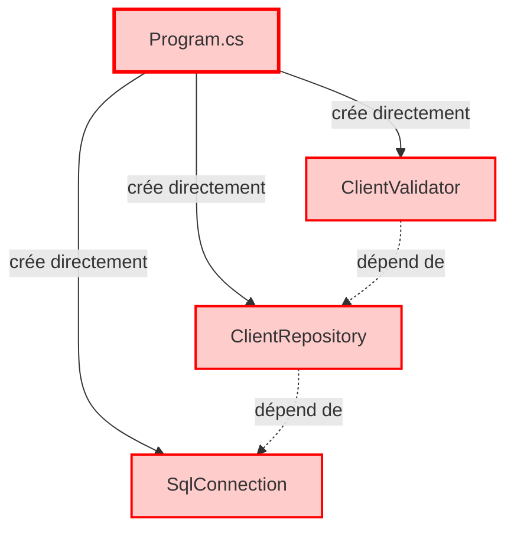
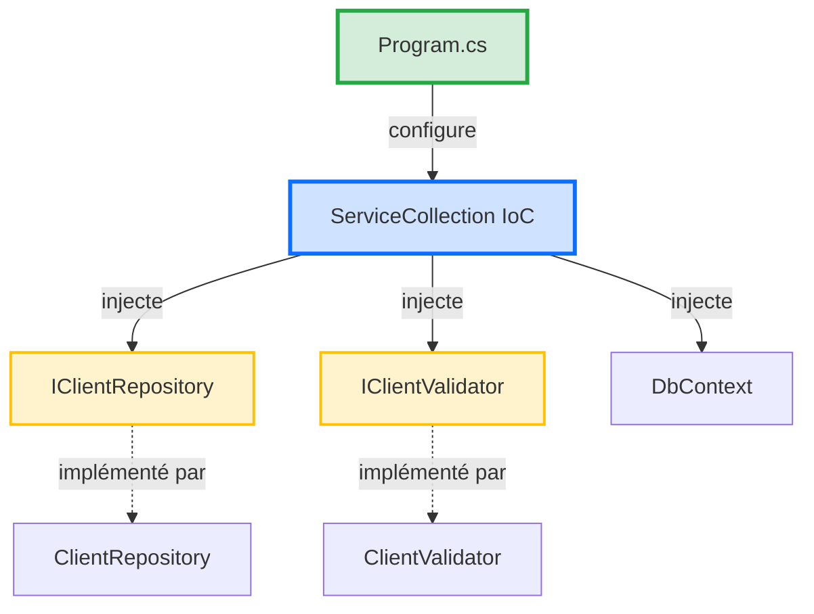

# 📘 Support Quotidien - Jour 2 : Maîtriser l'Accès aux Données et l'Injection de Dépendances

> **Formation** : Migration .NET Legacy vers .NET 8 (5 jours)  
> **Jour** : 2 sur 5  
> **Thème** : Découpler l'application pour la testabilité  
> **Durée** : 7h (4 sessions de 1h45 à 3h)

---

## 🎯 Objectifs du Jour

À la fin de cette journée, vous serez capable de :
- ✅ Configurer l'injection de dépendances avec .NET 8
- ✅ Remplacer SqlConnection raw par Entity Framework Core 8
- ✅ Implémenter le Repository Pattern pour isoler l'accès données
- ✅ Gérer les migrations de base de données avec EF Core
- ✅ Tester l'accès données avec une base In-Memory

---

## 📋 Programme de la Journée

| Horaire | Session | Objectif | Durée |
|---------|---------|----------|-------|
| **09h00** | S1 - Injection de Dépendances | Configurer IoC avec ServiceCollection | 2h30 |
| **10h40** | S2 - Entity Framework Core 8 | Remplacer SQL raw par ORM typé | 3h |
| **13h30** | S3 - Repository Pattern | Séparer logique métier et accès données | 2h30 |
| **15h10** | S4 - Migrations & Tests | Gérer évolution DB + tests In-Memory | 2h |

---

## 🔄 Récapitulatif Jour 1

**Ce que vous avez construit hier** :
- ✅ Architecture Clean (5 projets : Domain, Application, Infrastructure, Web, Tests)
- ✅ Domain isolé avec 3 règles de validation (MinLengthRule, MaxLengthRule, MandatoryRule)
- ✅ 11 tests unitaires passant en 87ms (zéro infrastructure)
- ✅ Code modernisé en C# 12 (file-scoped namespace, primary constructors, collection expressions)

**Problème actuel** :
- ❌ Le Domain est isolé, mais **aucune donnée persistée**
- ❌ L'Application layer est vide (pas d'orchestration)
- ❌ L'Infrastructure est vide (pas de connexion SQL)

**Objectif Jour 2** : Connecter le Domain à une vraie base de données via Entity Framework Core 8 tout en gardant la testabilité.

---

# Session 1 (09h00) - Injection de Dépendances avec .NET 8

> **Durée** : 2h30  
> **Objectif** : Comprendre l'Inversion of Control et configurer ServiceCollection pour orchestrer l'application

---

## 🧠 Concepts Théoriques

### Qu'est-ce que l'Injection de Dépendances ?

**Définition** : L'Injection de Dépendances (Dependency Injection - DI) est un pattern qui permet de **déclarer les besoins** d'une classe sans créer les dépendances directement.

**Problème résolu** : Sans DI, chaque classe crée ses propres dépendances → couplage fort, impossible à tester.

---

### 🔴 Exemple AVANT (Sans DI) - Code Legacy

**Fichier Legacy** : `ValidFlow.Legacy/Program.cs`

```csharp
// ANTI-PATTERN : Création directe des dépendances
var connectionString = "Server=localhost;Database=ValidFlow;...";
var connection = new SqlConnection(connectionString); // ← Création directe
var repository = new ClientRepository(connection);     // ← Création directe
var validator = new ClientValidator();                 // ← Création directe

// Problèmes :
// 1. Impossible de tester sans vraie DB SQL
// 2. Modification d'une dépendance = modifier TOUTES les classes qui l'utilisent
// 3. Couplage fort (Program.cs connaît SqlConnection, ClientRepository, etc.)
```

**Métaphore (humour qui tue)** :
> C'est comme aller au restaurant et dire "Je veux une pizza, mais avant je vais cultiver le blé, élever la vache pour le fromage, planter les tomates...". 🍕
>
> Le serveur te regarde et dit : "Euh... tu veux juste commander ?" 😅

---

### 🟢 Exemple APRÈS (Avec DI) - .NET 8 Moderne

**Fichier Moderne** : `ValidFlow.Web/Program.cs`

```csharp
// Construction du conteneur IoC (Inversion of Control)
var builder = WebApplication.CreateBuilder(args);

// DÉCLARATION des dépendances (pas de création directe)
builder.Services.AddScoped<IClientRepository, ClientRepository>();
builder.Services.AddScoped<IClientValidator, ClientValidator>();
builder.Services.AddDbContext<AppDbContext>(options =>
    options.UseSqlServer(builder.Configuration.GetConnectionString("DefaultConnection"))
);

var app = builder.Build();

// Les dépendances sont INJECTÉES automatiquement
app.MapGet("/validate", (IClientValidator validator) => {
    // Le conteneur IoC a injecté IClientValidator automatiquement
    var result = validator.Validate(new Client(1, "John", "john@example.com"));
    return Results.Ok(result);
});

app.Run();
```

**Avantages** :
1. ✅ **Testabilité** : On peut injecter un `FakeClientRepository` pour les tests
2. ✅ **Modularité** : Changer l'implémentation (SQL → MongoDB) sans toucher aux classes
3. ✅ **Lisibilité** : Les dépendances sont déclarées au même endroit (Program.cs)

---

### 📊 Diagramme : Sans DI vs Avec DI

#### Diagramme 1 : Sans DI (Legacy - Couplage Fort)



**Problème** : `Program.cs` connaît TOUTES les classes concrètes → impossible de tester sans changer le code.

---

#### Diagramme 2 : Avec DI (Moderne - Couplage Faible)



**Avantage** : `Program.cs` configure le conteneur. Les classes reçoivent les dépendances par constructeur (injection).

---

#### 📊 Infographie : Injection de Dépendances - Le Serveur au Restaurant


**Légende** : Métaphore du restaurant - Le serveur (IoC Container) apporte les plats (dépendances) au client (classe) sans que le client ait besoin de cuisiner.

---

### 💡 L'Astuce Pratique

> **Les 3 Lifetimes Essentiels de .NET 8**
>
> Quand vous enregistrez une dépendance avec `builder.Services.Add...()`, vous devez choisir sa **durée de vie** :

| Lifetime | Durée de vie | Utilisation | Exemple |
|----------|--------------|-------------|---------|
| **Transient** | Nouvelle instance à **chaque injection** | Classes légères sans état | `ILogger`, `IValidator` |
| **Scoped** | Une instance **par requête HTTP** | DbContext, Repository | `DbContext`, `IClientRepository` |
| **Singleton** | Une **seule instance** pour toute l'app | Configuration, Cache | `IConfiguration`, `IMemoryCache` |

**Métaphore (humour absurde)** :
> **Transient** = Gobelet jetable au fast-food. Nouveau à chaque commande. 🥤
>
> **Scoped** = Table au restaurant. Vous gardez la même table pendant tout le repas (requête HTTP), puis on nettoie. 🍽️
>
> **Singleton** = Fontaine à eau au bureau. Une seule pour tout le monde, toute la journée. 💧

---

## 💬 Analyse Collective

**Question à réfléchir** :

> "Dans le code legacy `ValidFlow.Legacy/Program.cs`, combien de fois devez-vous modifier le code si vous voulez remplacer SQL Server par PostgreSQL ?"

**Prenez 5-8 secondes pour réfléchir avant de répondre dans le chat.**

**Réponse attendue** : **Au moins 50 lignes à modifier**. Pourquoi ?
1. Changer `SqlConnection` → `NpgsqlConnection` partout
2. Changer les requêtes SQL (syntaxe différente)
3. Changer la chaîne de connexion
4. Modifier tous les tests (car ils dépendent de SQL Server)

**Avec DI (Inversion of Control)** : **1 seule ligne à modifier**
```csharp
// Avant
builder.Services.AddDbContext<AppDbContext>(options =>
    options.UseSqlServer(connectionString));

// Après (changement de DB)
builder.Services.AddDbContext<AppDbContext>(options =>
    options.UseNpgsql(connectionString)); // ← Une seule ligne
```

**Constat** : L'injection de dépendances divise le coût de changement par **50**.

---

## 👨‍💻 Démonstration Live

**🎯 Ce que vous allez voir** :

Le formateur va configurer l'injection de dépendances dans `ValidFlow.Web/Program.cs`, enregistrer le moteur de validation, et créer un endpoint API qui utilise les règles de validation du Domain.

**📂 Répertoire de Travail Formateur** : `01_Demo_Formateur/ValidFlow.Modern/ValidFlow.Web/`

**Étapes** :

1. **Installer le package Microsoft.Extensions.DependencyInjection**
   ```bash
   cd 01_Demo_Formateur/ValidFlow.Modern/ValidFlow.Web
   dotnet add package Microsoft.Extensions.DependencyInjection
   ```

2. **Configurer Program.cs avec DI**
   
   **Code tapé en direct** :
   ```csharp
   // [.NET 8] Top-level statements (pas de classe Program explicite)
   var builder = WebApplication.CreateBuilder(args);
   
   // ========================================
   // CONFIGURATION DES SERVICES (DI)
   // ========================================
   
   // Enregistrement des règles de validation (Transient car sans état)
   builder.Services.AddTransient<IValidationRule, MinLengthRule>(sp => new MinLengthRule(2));
   builder.Services.AddTransient<IValidationRule, MaxLengthRule>(sp => new MaxLengthRule(100));
   builder.Services.AddTransient<IValidationRule, MandatoryRule>();
   
   // Enregistrement du moteur de validation (Scoped car lié à la requête)
   builder.Services.AddScoped<IClientValidator, ClientValidator>();
   
   var app = builder.Build();
   
   // ========================================
   // ENDPOINTS API
   // ========================================
   
   // Endpoint de test : Valider un client
   app.MapPost("/api/validate", (IClientValidator validator, Client client) => {
       var errors = validator.Validate(client);
       
       if (errors.Count == 0)
           return Results.Ok(new { message = "Client valide", client });
       
       return Results.BadRequest(new { errors });
   });
   
   app.Run();
   ```
   
   **Ce que vous voyez** : Les dépendances (`IClientValidator`, `IValidationRule`) sont injectées automatiquement dans l'endpoint.

3. **Tester l'endpoint avec curl**
   
   **Option A : PowerShell (recommandé Windows)** - Copier-coller directement :
   ```powershell
   # Test avec un client valide
   curl -X POST http://localhost:5000/api/validate `
     -H "Content-Type: application/json" `
     -d '{"id":1,"name":"John Doe","email":"john@example.com"}'
   
   # Test avec un client invalide (nom trop court)
   curl -X POST http://localhost:5000/api/validate `
     -H "Content-Type: application/json" `
     -d '{"id":1,"name":"A","email":"john@example.com"}'
   ```
   
   **Option B : Une ligne (copier-coller rapide)** :
   ```bash
   # Client valide
   curl -X POST http://localhost:5000/api/validate -H "Content-Type: application/json" -d '{"id":1,"name":"John Doe","email":"john@example.com"}'
   
   # Client invalide
   curl -X POST http://localhost:5000/api/validate -H "Content-Type: application/json" -d '{"id":1,"name":"A","email":"john@example.com"}'
   ```
   
   > ⚠️ **Important** : Avant de tester avec curl, assurez-vous que le serveur est démarré :
   > ```bash
   > dotnet run
   > # Puis dans un autre terminal, exécutez les commandes curl
   > ```
   > 
   > **Erreur courante** : `Failed to connect to localhost port 5000` = Le serveur ne tourne pas !
   
   **Résultat attendu (client valide)** :
   ```json
   { "message": "Client valide", "client": { "id": 1, "name": "John Doe", "email": "john@example.com" } }
   ```
   
   **Résultat attendu (client invalide)** :
   ```json
   { "errors": ["Le nom doit contenir au moins 2 caractères"] }
   ```

4. **Expliquer l'injection automatique**
   
   **💬 Message formateur** :
   > "Vous voyez ? Je n'ai PAS écrit `new ClientValidator()` dans l'endpoint. Le conteneur IoC a vu que l'endpoint demande `IClientValidator`, il a cherché dans le `ServiceCollection`, trouvé que `IClientValidator` est lié à `ClientValidator`, et l'a créé automatiquement. C'est ça, l'Inversion of Control ! 🎯"

---

**💬 Message** :
> "Vous venez de voir le conteneur IoC en action. Maintenant, c'est à vous de configurer l'injection de dépendances pour le moteur de validation. 30 minutes. Go !"

---

## ⚙️ Défi d'Application

**Mission** : Configurer l'injection de dépendances dans `ValidFlow.Web/Program.cs` et créer un endpoint API pour valider un client.

**📂 Répertoire de Travail Stagiaires** : `02_Atelier_Stagiaires/ValidFlow.Modern/ValidFlow.Web/`

**⏱️ Durée** : 30 minutes

---

**📂 Structure Cible** :

```
ValidFlow.Web/
├─ Program.cs           (Configuration DI + endpoints)
├─ ValidFlow.Web.csproj (Dépendances NuGet)
```

**Étapes** :

1. **Ajouter la dépendance vers Domain et Application**
   ```bash
   cd 02_Atelier_Stagiaires/ValidFlow.Modern/ValidFlow.Web
   dotnet add reference ../ValidFlow.Domain/ValidFlow.Domain.csproj
   dotnet add reference ../ValidFlow.Application/ValidFlow.Application.csproj
   ```

2. **Configurer Program.cs avec DI**
   - Enregistrer les 3 règles de validation (Transient)
   - Enregistrer le moteur de validation (Scoped)

3. **Créer un endpoint POST /api/validate**
   - Accepte un JSON `{ "id": 1, "name": "John", "email": "john@example.com" }`
   - Retourne `{ "message": "Client valide" }` ou `{ "errors": [...] }`

4. **Tester avec curl ou Postman**
   ```bash
   dotnet run
   # Test dans un autre terminal
   curl -X POST http://localhost:5000/api/validate \
     -H "Content-Type: application/json" \
     -d '{"id":1,"name":"John Doe","email":"john@example.com"}'
   ```

**Critères de Succès** :
- [ ] DI configuré dans Program.cs
- [ ] 3 règles de validation enregistrées (MinLength, MaxLength, Mandatory)
- [ ] Endpoint POST /api/validate fonctionnel
- [ ] Test curl retourne 200 OK pour un client valide
- [ ] Test curl retourne 400 BadRequest pour un client invalide

---

### 💡 Pistes de Réflexion

**Pour démarrer** :
- **AddTransient vs AddScoped** : Les règles de validation sont sans état → Transient. Le moteur de validation peut être Scoped.
- **Injection dans endpoint** : `app.MapPost("/api/validate", (IClientValidator validator, Client client) => { ... })`
- **Enregistrement avec factory** : `builder.Services.AddTransient<IValidationRule>(sp => new MinLengthRule(2));`

**Si vous bloquez** :
- **Erreur CS0246** ("Le type 'IClientValidator' est introuvable") : Avez-vous ajouté `using ValidFlow.Application.Interfaces;` ?
- **Erreur 404 Not Found** : Vérifiez l'URL de l'endpoint (http://localhost:5000/api/validate)
- **Erreur DI** ("No service registered for IClientValidator") : Avez-vous appelé `builder.Services.AddScoped<IClientValidator, ClientValidator>()` ?

**Pour aller plus loin** :
- Créez un endpoint GET /api/rules qui retourne la liste des règles de validation enregistrées
- Utilisez `IServiceProvider` pour résoudre manuellement une dépendance

---

### 🔗 Documentation Officielle

- [Dependency Injection in .NET 8](https://learn.microsoft.com/en-us/dotnet/core/extensions/dependency-injection)
- [Service Lifetimes](https://learn.microsoft.com/en-us/dotnet/core/extensions/dependency-injection#service-lifetimes)

---

**🎯 Résumé Session 1**

Vous avez configuré l'injection de dépendances avec .NET 8 :
- ✅ Compris le principe IoC (Inversion of Control)
- ✅ Enregistré les dépendances dans ServiceCollection
- ✅ Créé un endpoint API qui injecte automatiquement les dépendances
- ✅ Testé avec curl et validé le comportement

**Prochaine session** : Entity Framework Core 8 pour remplacer SqlConnection raw par un ORM typé.

---
