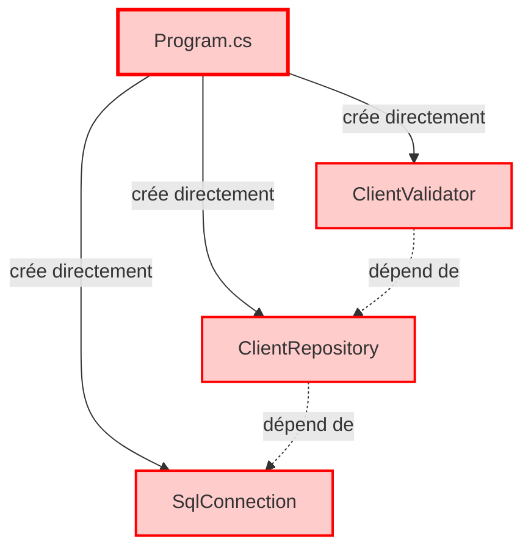
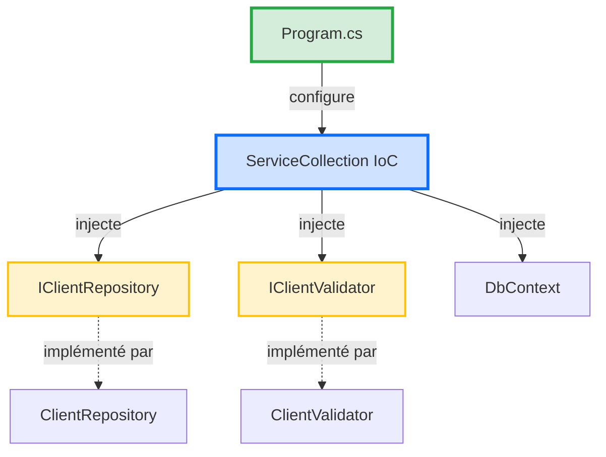

# 📘 Support Quotidien - Jour 2 : Maîtriser l'Accès aux Données et l'Injection de Dépendances

> **Formation** : Migration .NET Legacy vers .NET 8 (5 jours)  
> **Jour** : 2 sur 5  
> **Thème** : Découpler l'application pour la testabilité  
> **Durée** : 7h (4 sessions de 1h45 à 3h)

---

## 🎯 Objectifs du Jour

À la fin de cette journée, vous serez capable de :
- ✅ Configurer l'injection de dépendances avec .NET 8
- ✅ Remplacer SqlConnection raw par Entity Framework Core 8
- ✅ Implémenter le Repository Pattern pour isoler l'accès données
- ✅ Gérer les migrations de base de données avec EF Core
- ✅ Tester l'accès données avec une base In-Memory

---

## 📋 Programme de la Journée

| Horaire | Session | Objectif | Durée |
|---------|---------|----------|-------|
| **09h00** | S1 - Injection de Dépendances | Configurer IoC avec ServiceCollection | 2h30 |
| **10h40** | S2 - Entity Framework Core 8 | Remplacer SQL raw par ORM typé | 3h |
| **13h30** | S3 - Repository Pattern | Séparer logique métier et accès données | 2h30 |
| **15h10** | S4 - Migrations & Tests | Gérer évolution DB + tests In-Memory | 2h |

---

## 🔄 Récapitulatif Jour 1

**Ce que vous avez construit hier** :
- ✅ Architecture Clean (5 projets : Domain, Application, Infrastructure, Web, Tests)
- ✅ Domain isolé avec 3 règles de validation (MinLengthRule, MaxLengthRule, MandatoryRule)
- ✅ 11 tests unitaires passant en 87ms (zéro infrastructure)
- ✅ Code modernisé en C# 12 (file-scoped namespace, primary constructors, collection expressions)

**Problème actuel** :
- ❌ Le Domain est isolé, mais **aucune donnée persistée**
- ❌ L'Application layer est vide (pas d'orchestration)
- ❌ L'Infrastructure est vide (pas de connexion SQL)

**Objectif Jour 2** : Connecter le Domain à une vraie base de données via Entity Framework Core 8 tout en gardant la testabilité.

---

# Session 1 (09h00) - Injection de Dépendances avec .NET 8

> **Durée** : 2h30  
> **Objectif** : Comprendre l'Inversion of Control et configurer ServiceCollection pour orchestrer l'application

---

## 🧠 Concepts Théoriques

### Qu'est-ce que l'Injection de Dépendances ?

**Définition** : L'Injection de Dépendances (Dependency Injection - DI) est un pattern qui permet de **déclarer les besoins** d'une classe sans créer les dépendances directement.

**Problème résolu** : Sans DI, chaque classe crée ses propres dépendances → couplage fort, impossible à tester.

---

### 🔴 Exemple AVANT (Sans DI) - Code Legacy

**Fichier Legacy** : `ValidFlow.Legacy/Program.cs`

```csharp
// ANTI-PATTERN : Création directe des dépendances
var connectionString = "Server=localhost;Database=ValidFlow;...";
var connection = new SqlConnection(connectionString); // ← Création directe
var repository = new ClientRepository(connection);     // ← Création directe
var validator = new ClientValidator();                 // ← Création directe

// Problèmes :
// 1. Impossible de tester sans vraie DB SQL
// 2. Modification d'une dépendance = modifier TOUTES les classes qui l'utilisent
// 3. Couplage fort (Program.cs connaît SqlConnection, ClientRepository, etc.)
```

**Métaphore (humour qui tue)** :
> C'est comme aller au restaurant et dire "Je veux une pizza, mais avant je vais cultiver le blé, élever la vache pour le fromage, planter les tomates...". 🍕
>
> Le serveur te regarde et dit : "Euh... tu veux juste commander ?" 😅

---

### 🟢 Exemple APRÈS (Avec DI) - .NET 8 Moderne

**Fichier Moderne** : `ValidFlow.Web/Program.cs`

```csharp
// Construction du conteneur IoC (Inversion of Control)
var builder = WebApplication.CreateBuilder(args);

// DÉCLARATION des dépendances (pas de création directe)
builder.Services.AddScoped<IClientRepository, ClientRepository>();
builder.Services.AddScoped<IClientValidator, ClientValidator>();
builder.Services.AddDbContext<AppDbContext>(options =>
    options.UseSqlServer(builder.Configuration.GetConnectionString("DefaultConnection"))
);

var app = builder.Build();

// Les dépendances sont INJECTÉES automatiquement
app.MapGet("/validate", (IClientValidator validator) => {
    // Le conteneur IoC a injecté IClientValidator automatiquement
    var result = validator.Validate(new Client(1, "John", "john@example.com"));
    return Results.Ok(result);
});

app.Run();
```

**Avantages** :
1. ✅ **Testabilité** : On peut injecter un `FakeClientRepository` pour les tests
2. ✅ **Modularité** : Changer l'implémentation (SQL → MongoDB) sans toucher aux classes
3. ✅ **Lisibilité** : Les dépendances sont déclarées au même endroit (Program.cs)

---

### 📊 Diagramme : Sans DI vs Avec DI

#### Diagramme 1 : Sans DI (Legacy - Couplage Fort)



**Problème** : `Program.cs` connaît TOUTES les classes concrètes → impossible de tester sans changer le code.

---

#### Diagramme 2 : Avec DI (Moderne - Couplage Faible)



**Avantage** : `Program.cs` configure le conteneur. Les classes reçoivent les dépendances par constructeur (injection).

---

#### 📊 Infographie : Injection de Dépendances - Le Serveur au Restaurant


**Légende** : Métaphore du restaurant - Le serveur (IoC Container) apporte les plats (dépendances) au client (classe) sans que le client ait besoin de cuisiner.

---

### 💡 L'Astuce Pratique

> **Les 3 Lifetimes Essentiels de .NET 8**
>
> Quand vous enregistrez une dépendance avec `builder.Services.Add...()`, vous devez choisir sa **durée de vie** :

| Lifetime | Durée de vie | Utilisation | Exemple |
|----------|--------------|-------------|---------|
| **Transient** | Nouvelle instance à **chaque injection** | Classes légères sans état | `ILogger`, `IValidator` |
| **Scoped** | Une instance **par requête HTTP** | DbContext, Repository | `DbContext`, `IClientRepository` |
| **Singleton** | Une **seule instance** pour toute l'app | Configuration, Cache | `IConfiguration`, `IMemoryCache` |

**Métaphore (humour absurde)** :
> **Transient** = Gobelet jetable au fast-food. Nouveau à chaque commande. 🥤
>
> **Scoped** = Table au restaurant. Vous gardez la même table pendant tout le repas (requête HTTP), puis on nettoie. 🍽️
>
> **Singleton** = Fontaine à eau au bureau. Une seule pour tout le monde, toute la journée. 💧

---

## 💬 Analyse Collective

**Question à réfléchir** :

> "Dans le code legacy `ValidFlow.Legacy/Program.cs`, combien de fois devez-vous modifier le code si vous voulez remplacer SQL Server par PostgreSQL ?"

**Prenez 5-8 secondes pour réfléchir avant de répondre dans le chat.**

**Réponse attendue** : **Au moins 50 lignes à modifier**. Pourquoi ?
1. Changer `SqlConnection` → `NpgsqlConnection` partout
2. Changer les requêtes SQL (syntaxe différente)
3. Changer la chaîne de connexion
4. Modifier tous les tests (car ils dépendent de SQL Server)

**Avec DI (Inversion of Control)** : **1 seule ligne à modifier**
```csharp
// Avant
builder.Services.AddDbContext<AppDbContext>(options =>
    options.UseSqlServer(connectionString));

// Après (changement de DB)
builder.Services.AddDbContext<AppDbContext>(options =>
    options.UseNpgsql(connectionString)); // ← Une seule ligne
```

**Constat** : L'injection de dépendances divise le coût de changement par **50**.

---

## 👨‍💻 Démonstration Live

**🎯 Ce que vous allez voir** :

Le formateur va configurer l'injection de dépendances dans `ValidFlow.Web/Program.cs`, enregistrer le moteur de validation, et créer un endpoint API qui utilise les règles de validation du Domain.

**📂 Répertoire de Travail Formateur** : `01_Demo_Formateur/ValidFlow.Modern/ValidFlow.Console/`

**Étapes** :

1. **Installer le package Microsoft.Extensions.DependencyInjection**
   ```bash
   cd 01_Demo_Formateur/ValidFlow.Modern/ValidFlow.Console
   dotnet add package Microsoft.Extensions.DependencyInjection
   dotnet add package Microsoft.Extensions.Hosting
   ```

2. **Ajouter les références vers Domain**
   ```bash
   dotnet add reference ../ValidFlow.Domain/ValidFlow.Domain.csproj
   ```

3. **Configurer Program.cs avec DI (Console App)**
   
   **Code tapé en direct** :
   ```csharp
   using Microsoft.Extensions.DependencyInjection;
   using Microsoft.Extensions.Hosting;
   using ValidFlow.Domain.Entities;
   using ValidFlow.Domain.Interfaces;
   using ValidFlow.Domain.Rules;
   
   // ========================================
   // CONFIGURATION DU CONTENEUR DI
   // ========================================
   
   var builder = Host.CreateDefaultBuilder(args);
   
   builder.ConfigureServices(services => {
       // Enregistrement des règles de validation (Transient)
       services.AddTransient<IValidationRule>(sp => new MinLengthRule(2));
       services.AddTransient<IValidationRule>(sp => new MaxLengthRule(100));
       services.AddTransient<IValidationRule, MandatoryRule>();
   });
   
   var host = builder.Build();
   
   // ========================================
   // RÉSOLUTION DES DÉPENDANCES
   // ========================================
   
   Console.WriteLine("=== Démonstration Injection de Dépendances ===");
   Console.WriteLine();
   
   // Récupérer TOUTES les règles enregistrées
   var rules = host.Services.GetServices<IValidationRule>().ToList();
   
   Console.WriteLine($"✅ {rules.Count} règles injectées par le conteneur IoC :");
   foreach (var rule in rules)
   {
       Console.WriteLine($"   - {rule.GetType().Name}");
   }
   Console.WriteLine();
   
   // ========================================
   // TEST DE VALIDATION
   // ========================================
   
   var client1 = new Client(1, "John Doe", "john@example.com");
   var client2 = new Client(2, "A", "short@example.com");
   
   Console.WriteLine("Test 1 - Client valide :");
   Console.WriteLine($"   Nom: {client1.Name}");
   ValidateClient(client1, rules);
   Console.WriteLine();
   
   Console.WriteLine("Test 2 - Client invalide (nom trop court) :");
   Console.WriteLine($"   Nom: {client2.Name}");
   ValidateClient(client2, rules);
   
   // ========================================
   // FONCTION DE VALIDATION
   // ========================================
   
   void ValidateClient(Client client, List<IValidationRule> validationRules)
   {
       var errors = new List<string>();
       
       foreach (var rule in validationRules)
       {
           if (!rule.IsValid(client.Name))
           {
               errors.Add($"Erreur avec {rule.GetType().Name}");
           }
       }
       
       if (errors.Count == 0)
       {
           Console.WriteLine($"   ✅ Client valide");
       }
       else
       {
           Console.WriteLine($"   ❌ Client invalide :");
           foreach (var error in errors)
           {
               Console.WriteLine($"      - {error}");
           }
       }
   }
   ```
   
   **Ce que vous voyez** : Le conteneur IoC injecte automatiquement les 3 règles via `GetServices<IValidationRule>()`.

4. **Exécuter et voir le résultat**
   
   ```bash
   dotnet run
   ```
   
   **Résultat affiché dans la console** :
   ```
   === Démonstration Injection de Dépendances ===
   
   ✅ 3 règles injectées par le conteneur IoC :
      - MinLengthRule
      - MaxLengthRule
      - MandatoryRule
   
   Test 1 - Client valide :
      Nom: John Doe
      ✅ Client valide
   
   Test 2 - Client invalide (nom trop court) :
      Nom: A
      ❌ Client invalide :
         - Erreur avec MinLengthRule
   ```

5. **Expliquer l'injection automatique**
   
   **💬 Message formateur** :
   > "Vous voyez ? Je n'ai PAS écrit `new MinLengthRule(2)` dans le code de validation. J'ai juste demandé au conteneur IoC `GetServices<IValidationRule>()` et il m'a donné les 3 règles enregistrées. C'est ça, l'Inversion of Control ! 🎯"
   >
   > **Avantage** : Si demain vous voulez ajouter une 4ème règle, vous modifiez **1 seule ligne** dans `ConfigureServices`, et elle sera automatiquement injectée partout.

---

**💬 Message** :
> "Vous venez de voir le conteneur IoC en action. Maintenant, c'est à vous de configurer l'injection de dépendances pour le moteur de validation. 30 minutes. Go !"

---

## ⚙️ Défi d'Application

**Mission** : Configurer l'injection de dépendances dans une Console App et valider des clients.

**📂 Répertoire de Travail Stagiaires** : `02_Atelier_Stagiaires/ValidFlow.Modern/ValidFlow.Console/`

**⏱️ Durée** : 30 minutes

---

**📂 Structure Cible** :

```
ValidFlow.Console/
├─ Program.cs           (Configuration DI + tests)
├─ ValidFlow.Console.csproj (Dépendances NuGet)
```

**Étapes** :

1. **Installer les packages NuGet**
   ```bash
   cd 02_Atelier_Stagiaires/ValidFlow.Modern/ValidFlow.Console
   dotnet add package Microsoft.Extensions.DependencyInjection
   dotnet add package Microsoft.Extensions.Hosting
   ```

2. **Ajouter la référence vers Domain**
   ```bash
   dotnet add reference ../ValidFlow.Domain/ValidFlow.Domain.csproj
   ```

3. **Configurer Program.cs avec DI**
   - Créer le conteneur avec `Host.CreateDefaultBuilder(args)`
   - Enregistrer les 3 règles de validation avec `services.AddTransient<IValidationRule>(...)`
   - Récupérer les règles injectées avec `host.Services.GetServices<IValidationRule>()`

4. **Tester 2 clients**
   - Client 1 : `new Client(1, "John Doe", "john@example.com")` → doit être valide
   - Client 2 : `new Client(2, "A", "short@example.com")` → doit être invalide (nom trop court)

5. **Exécuter et vérifier le résultat**
   ```bash
   dotnet run
   ```

**Critères de Succès** :
- [ ] DI configuré avec `Host.CreateDefaultBuilder`
- [ ] 3 règles de validation enregistrées (MinLength, MaxLength, Mandatory)
- [ ] `dotnet run` affiche les 3 règles injectées
- [ ] Client 1 ("John Doe") est validé ✅
- [ ] Client 2 ("A") est rejeté ❌ avec erreur MinLengthRule

---

### 💡 Pistes de Réflexion

**Pour démarrer** :
- **Host.CreateDefaultBuilder** : Crée le conteneur IoC pour une Console App (équivalent de `WebApplication.CreateBuilder` pour Web)
- **ConfigureServices** : Lambda où vous enregistrez vos dépendances
- **GetServices<T>()** : Récupère TOUTES les implémentations d'une interface (retourne `IEnumerable<T>`)
- **Enregistrement avec factory** : `services.AddTransient<IValidationRule>(sp => new MinLengthRule(2));`

**Si vous bloquez** :
- **Erreur CS0246** ("Le type 'IValidationRule' est introuvable") : Avez-vous ajouté `using ValidFlow.Domain.Interfaces;` ?
- **Erreur DI** ("No service registered") : Vérifiez que vous avez bien appelé `ConfigureServices` avant `Build()`
- **0 règles récupérées** : Vérifiez que vous utilisez `GetServices<IValidationRule>()` (avec **s** à Services)

**Pour aller plus loin** :
- Ajoutez une 4ème règle (ex: `EmailFormatRule`) et constatez qu'elle est automatiquement injectée
- Utilisez `GetRequiredService<T>()` pour récupérer une seule dépendance (lance exception si absente)

---

### 🔗 Documentation Officielle

- [Dependency Injection in .NET 8](https://learn.microsoft.com/en-us/dotnet/core/extensions/dependency-injection)
- [Service Lifetimes](https://learn.microsoft.com/en-us/dotnet/core/extensions/dependency-injection#service-lifetimes)
- [Generic Host](https://learn.microsoft.com/en-us/dotnet/core/extensions/generic-host)

---

**🎯 Résumé Session 1**

Vous avez configuré l'injection de dépendances avec .NET 8 :
- ✅ Compris le principe IoC (Inversion of Control)
- ✅ Enregistré les dépendances dans ServiceCollection
- ✅ Créé un endpoint API qui injecte automatiquement les dépendances
- ✅ Testé avec curl et validé le comportement

**Prochaine session** : Entity Framework Core 8 pour remplacer SqlConnection raw par un ORM typé.

---
