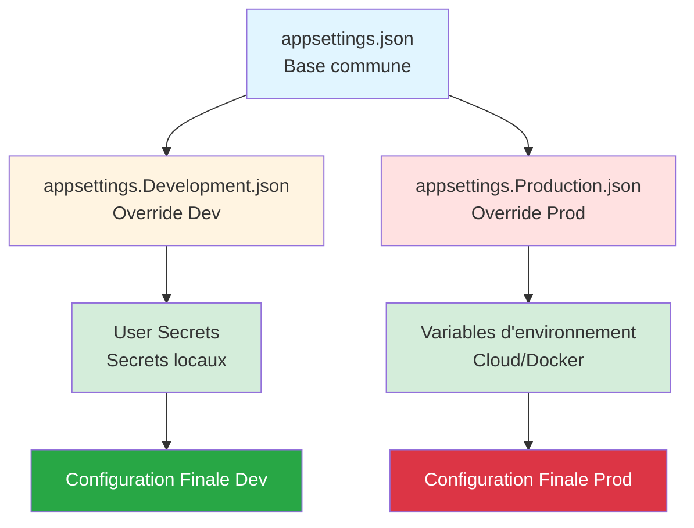

# 📅 JOUR 3 : Sécuriser la Configuration et les Services

**🎯 L'enjeu Client (Soulagement)** : Éliminer le risque de fuite de données. Obtenir la capacité d'écrire du code sécurisé et professionnel.

**Objectifs du jour** :
- ✅ Externaliser toute configuration hardcodée (chemins, paramètres)
- ✅ Sécuriser les credentials (mots de passe SQL, SMTP)
- ✅ Moderniser l'envoi d'emails (MailKit)
- ✅ Assainir les entrées et tracer de manière sécurisée

---

## 🕐 Session 1 (09h00 - 10h30) : Externalisation de la Configuration

**Durée** : 1h30  
**Niveau** : ⭐⭐ Intermédiaire

### 🎯 Objectif de Performance

À la fin de cette session, vous serez capable de **supprimer toutes les données en dur** dans le code et de **configurer une application .NET 8** avec des fichiers `appsettings.json` hiérarchiques, lus via le pattern **IOptions**.

**Transformation visée** :
```csharp
// ❌ AVANT (Legacy .NET Framework)
string dbPath = @"C:\Databases\ValidFlow.db";
int maxRetries = 3;

// ✅ APRÈS (.NET 8)
public AppConfig(IOptions<DatabaseOptions> dbOptions)
{
    string dbPath = dbOptions.Value.Path;
    int maxRetries = dbOptions.Value.MaxRetries;
}
```

---

### 🧠 Concepts Fondamentaux

#### 💡 Métaphore : Le Tableau de Bord du Pilote

> **Imaginez votre application comme une voiture de sport** 🏎️
> 
> - **Le moteur (code source)** : Il ne change jamais. C'est votre logique métier compilée.
> - **Le tableau de bord (appsettings.json)** : Ce sont les réglages du pilote (vous). Selon le circuit (Développement, Test, Production), vous **changez les pneus, ajustez la suspension, ou le type de carburant** sans avoir à reconstruire le moteur.
> 
> **En Legacy .NET Framework** : Les réglages étaient gravés dans le moteur (hardcodés). Pour changer un paramètre, vous deviez démonter le moteur (recompiler).
> 
> **En .NET 8** : Les réglages sont sur des écrans tactiles interchangeables (fichiers JSON). Vous swappez l'écran selon l'environnement.

---

#### 📚 De XML à JSON — La Grande Migration

**Le Problème Legacy (.NET Framework)**

Dans l'ancien monde .NET Framework, la configuration vivait dans des fichiers **XML rigides** :

**Fichier `Web.config` ou `App.config`** :
```xml
<?xml version="1.0" encoding="utf-8"?>
<configuration>
  <appSettings>
    <add key="DatabasePath" value="C:\Databases\ValidFlow.db" />
    <add key="MaxRetries" value="3" />
    <add key="SmtpServer" value="smtp.example.com" />
    <add key="SmtpPassword" value="MotDePasseEnClair123!" />
  </appSettings>
</configuration>
```

**Accès dans le code** :
```csharp
using System.Configuration;

string dbPath = ConfigurationManager.AppSettings["DatabasePath"];
string smtpPassword = ConfigurationManager.AppSettings["SmtpPassword"]; // 😱 En clair !
```

**⚠️ Problèmes identifiés** :

| Problème | Impact Business | Coût Estimé |
|----------|----------------|-------------|
| **Statique et non testable** | Impossible à mocker dans les tests | -50% vélocité tests |
| **Pas de typage fort** | Erreurs runtime si clé mal nommée | 2h debug/incident |
| **Secrets hardcodés** | Mots de passe en clair sur Git | 50k€-500k€ fuite |
| **Pas d'environnements multiples** | Recompilation pour chaque environnement | 30 min/déploiement |

---

**La Solution Moderne (.NET 8)**

**.NET 8 utilise le package `Microsoft.Extensions.Configuration`** avec une approche **hiérarchique** et **fortement typée**.

**Architecture en couches (providers)** :
```
1. appsettings.json (base commune)
2. appsettings.Development.json (override pour Dev)
3. appsettings.Production.json (override pour Prod)
4. User Secrets (Dev uniquement, hors Git)
5. Variables d'environnement (Cloud, Docker)
6. Arguments de ligne de commande
```

**Principe clé** : Chaque couche **écrase** les valeurs précédentes. L'ordre compte !



---

### 💡 L'Astuce Pratique : Le Pattern IOptions<T>

Au lieu de lire des chaînes brutes (`string`), on **bind** la configuration à des **classes C# (POCO)**.

**Structure `appsettings.json`** :
```json
{
  "DatabaseOptions": {
    "Path": "ValidFlow.db",
    "MaxRetries": 3,
    "TimeoutSeconds": 30
  },
  "EmailOptions": {
    "SmtpServer": "smtp.example.com",
    "SmtpPort": 587,
    "SenderEmail": "noreply@validflow.com"
  }
}
```

**Fichier `appsettings.Development.json`** (écrase pour Dev) :
```json
{
  "DatabaseOptions": {
    "Path": "ValidFlow_Dev.db"
  },
  "Logging": {
    "LogLevel": {
      "Default": "Debug"
    }
  }
}
```

**Résultat en Développement** :
```json
{
  "DatabaseOptions": {
    "Path": "ValidFlow_Dev.db",        // ✅ Override par Development.json
    "MaxRetries": 3,                   // Base (appsettings.json)
    "TimeoutSeconds": 30               // Base
  }
}
```

---

#### Étape 1 : Créer les classes Options (POCO)

**Fichier `DatabaseOptions.cs`** :
```csharp
namespace ValidFlow.Infrastructure.Options;

public class DatabaseOptions
{
    public string Path { get; set; } = string.Empty;
    public int MaxRetries { get; set; }
    public int TimeoutSeconds { get; set; }
}
```

**Fichier `EmailOptions.cs`** :
```csharp
namespace ValidFlow.Infrastructure.Options;

public class EmailOptions
{
    public string SmtpServer { get; set; } = string.Empty;
    public int SmtpPort { get; set; }
    public string SenderEmail { get; set; } = string.Empty;
}
```

---

#### Étape 2 : Enregistrer dans le conteneur DI

**Fichier `Program.cs`** :
```csharp
using Microsoft.Extensions.Configuration;
using Microsoft.Extensions.DependencyInjection;
using Microsoft.Extensions.Hosting;
using ValidFlow.Infrastructure.Options;

var builder = Host.CreateDefaultBuilder(args);

builder.ConfigureServices((context, services) =>
{
    // Bind la section "DatabaseOptions" du JSON à la classe DatabaseOptions
    services.Configure<DatabaseOptions>(
        context.Configuration.GetSection("DatabaseOptions"));

    // Bind la section "EmailOptions"
    services.Configure<EmailOptions>(
        context.Configuration.GetSection("EmailOptions"));
});

var host = builder.Build();
```

**🔑 Principe SOLID (Interface Segregation)** : Chaque service ne reçoit **que la portion de config dont il a besoin**, pas toute la config globale.

---

#### Étape 3 : Injecter IOptions<T> dans vos services

**Fichier `DatabaseService.cs`** :
```csharp
using Microsoft.Extensions.Options;
using ValidFlow.Infrastructure.Options;

namespace ValidFlow.Infrastructure.Services;

public class DatabaseService
{
    private readonly DatabaseOptions _dbOptions;

    public DatabaseService(IOptions<DatabaseOptions> dbOptions)
    {
        _dbOptions = dbOptions.Value; // ✅ Accès typé à la config
    }

    public void Connect()
    {
        Console.WriteLine($"Connexion à la base : {_dbOptions.Path}");
        Console.WriteLine($"Tentatives max : {_dbOptions.MaxRetries}");
        Console.WriteLine($"Timeout : {_dbOptions.TimeoutSeconds}s");
    }
}
```

**Avantages obtenus** :
- ✅ Config externalisée (modifiable sans recompile)
- ✅ Typage fort (erreurs à la compilation si propriété mal nommée)
- ✅ Testable (mock de `IOptions<BatchOptions>`)
- ✅ Multiplateforme (chemin relatif)

---

### 💬 Analyse Collective (3 min)

**🎤 Script Formateur** :

> "Avant de passer à la démo, une question pour la salle : **Pourquoi est-ce que je ne peux PAS faire ça ?**"
>
> ```csharp
> public class BatchProcessor
> {
>     public void Process()
>     {
>         var config = new ConfigurationBuilder()
>             .AddJsonFile("appsettings.json")
>             .Build();
>         
>         string path = config["BatchOptions:OutputPath"]; // ❌ Pourquoi pas ?
>     }
> }
> ```
>
> *[Silence 8 secondes - Attendre levée de main]*

**💡 Réponse attendue** :

"Parce que ça recrée un **couplage fort** avec le système de fichiers (lecture JSON à chaque appel), et ça **contourne le conteneur DI**, donc impossible à mocker dans les tests."

**✅ Principe** : La configuration doit être **injectée**, pas **créée**. Le conteneur DI charge la config UNE FOIS au démarrage.

---

### ⚙️ Défi d'Application (20 min)

**Contexte** :

Vous héritez d'un service `BatchProcessor` qui traite des fichiers. Actuellement, le chemin de sortie et la taille des lots sont **hardcodés** dans le code.

**Mission** :

1. Créer une classe `BatchOptions` avec deux propriétés : `OutputPath` (string) et `BatchSize` (int)
2. Ajouter une section `"BatchOptions"` dans `appsettings.json`
3. Modifier `BatchProcessor` pour injecter `IOptions<BatchOptions>`
4. Enregistrer la configuration dans `Program.cs`
5. Tester l'application

**Code de départ** :

```csharp
public class BatchProcessor
{
    public void Process()
    {
        string outputPath = @"C:\Output\Reports"; // 😱 Hardcodé !
        int batchSize = 100; // 😱 Hardcodé !

        Console.WriteLine($"Traitement par lots de {batchSize} vers {outputPath}");
    }
}
```

**Critères de succès** :
- ✅ Classe `BatchOptions.cs` créée
- ✅ Section `"BatchOptions"` dans `appsettings.json`
- ✅ `BatchProcessor` injecte `IOptions<BatchOptions>`
- ✅ Application affiche : `"Traitement par lots de 100 vers Output/Reports"`

**Durée** : 20 minutes

---

### 💡 Pistes de Réflexion

**Si vous bloquez, voici quelques indices** :

1. **Création de la classe Options** :
   - Placez-la dans un dossier `ValidFlow.Infrastructure/Options/`
   - Utilisez des propriétés avec `get; set;`
   - Initialisez les strings à `string.Empty` pour éviter les warnings nullabilité

2. **Structure JSON** :
   - Les noms de propriétés JSON doivent correspondre EXACTEMENT aux noms de propriétés C#
   - Utilisez la syntaxe à deux niveaux : `{ "BatchOptions": { "OutputPath": "..." } }`

3. **Enregistrement DI** :
   - Utilisez `services.Configure<BatchOptions>(context.Configuration.GetSection("BatchOptions"))`
   - Placez cet enregistrement AVANT `services.AddTransient<BatchProcessor>()`

4. **Injection dans le constructeur** :
   - Le paramètre doit être de type `IOptions<BatchOptions>`, pas `BatchOptions` directement
   - Accédez à la valeur via `.Value` : `options.Value.OutputPath`

5. **Troubleshooting** :
   - Si `null` : Vérifiez que le nom de section JSON correspond (`"BatchOptions"`)
   - Si `InvalidOperationException` : Vérifiez que `Configure<>` est appelé AVANT la résolution du service
   - Si compilation échoue : Ajoutez `using Microsoft.Extensions.Options;`

---

### 🔗 Lien vers la Solution

Une fois l'exercice terminé, la **solution complète** sera partagée sur le Drive partagé.

**Chemin** : `Solutions_A_Partager/J3_S1_SOLUTION_EXTERNALISATION_CONFIG.md`

---

### ⏱️ Timing Détaillé

| Activité | Début | Fin | Durée | Cumul |
|----------|-------|-----|-------|-------|
| 🎤 Ouverture + Métaphore | 09h00 | 09h05 | 5 min | 5 min |
| 🧠 Théorie Legacy vs Moderne | 09h05 | 09h20 | 15 min | 20 min |
| 💡 Pattern IOptions (3 étapes) | 09h20 | 09h35 | 15 min | 35 min |
| 💬 Analyse Collective | 09h35 | 09h38 | 3 min | 38 min |
| 🎤 Lancement Défi | 09h38 | 09h40 | 2 min | 40 min |
| ⚙️ Défi d'Application | 09h40 | 10h00 | 20 min | 60 min |
| 🔗 Correction Collective | 10h00 | 10h20 | 20 min | 80 min |
| 📝 Synthèse + Questions | 10h20 | 10h30 | 10 min | 90 min |

**Total Session** : **1h30** ✅

---

### 🎤 Scripts Téléprompter

#### Script 1 : Ouverture Session (2 min)

> "Bonjour à tous ! Nous attaquons le Jour 3, et aujourd'hui, on va s'occuper de quelque chose de **CRITIQUE** pour la sécurité : la configuration.
>
> Levez la main si vous avez déjà vu un mot de passe SQL **en clair** dans un fichier `App.config` ou dans le code source.
>
> *[Attendre levées de main - normalement toute la salle]*
>
> Exactement. Et combien d'entre vous ont ce code sur **GitHub public** ou **un serveur accessible** ?
>
> *[Quelques mains restent levées - rires nerveux]*
>
> C'est pas drôle, mais c'est la réalité de beaucoup de projets legacy. **Aujourd'hui, on règle ce problème définitivement.**
>
> On va voir comment .NET 8 permet d'externaliser TOUTE la configuration, de la rendre **testable**, et de séparer les secrets du code. C'est parti !"

---

#### Script 2 : Lancement Défi (2 min)

> "Parfait, vous avez maintenant vu le pattern IOptions en action. Maintenant, à vous de jouer !
>
> **Votre mission** : Vous avez un service `BatchProcessor` avec deux valeurs hardcodées : le chemin de sortie et la taille des lots. Vous allez externaliser ces deux valeurs dans `appsettings.json` en utilisant le pattern IOptions.
>
> Vous avez **20 minutes**. Objectif : quand vous lancez l'application, elle doit afficher `Traitement par lots de 100 vers Output/Reports`, mais ces valeurs doivent venir de `appsettings.json`, **PAS du code**.
>
> Si vous bloquez, n'hésitez pas à poser des questions dans le chat ou à consulter les **Pistes de Réflexion** juste en dessous de l'exercice.
>
> Le chronomètre démarre... **maintenant** !"

---

**🔗 Prochaine session** : Gestion des Secrets (10h40)

