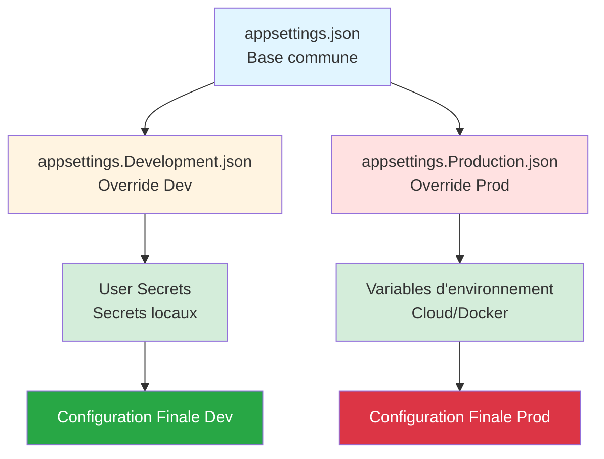
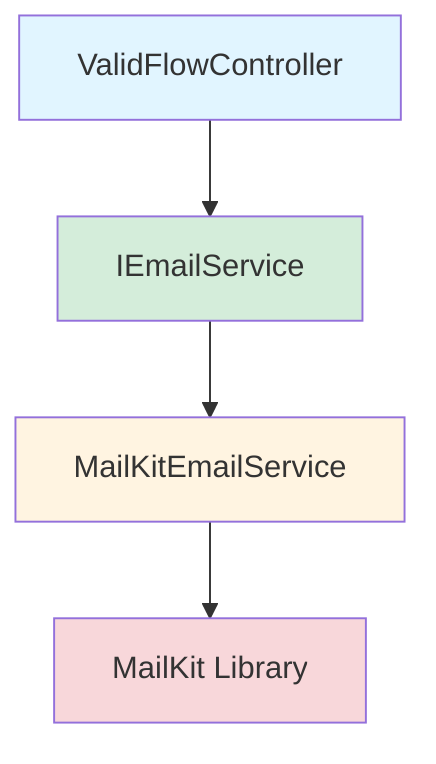

# 📅 JOUR 3 : Sécuriser la Configuration et les Services

**🎯 L'enjeu Client (Soulagement)** : Éliminer le risque de fuite de données. Obtenir la capacité d'écrire du code sécurisé et professionnel.

**Objectifs du jour** :
- ✅ Externaliser toute configuration hardcodée (chemins, paramètres)
- ✅ Sécuriser les credentials (mots de passe SQL, SMTP)
- ✅ Moderniser l'envoi d'emails (MailKit)
- ✅ Assainir les entrées et tracer de manière sécurisée

---

## 🕐 Session 1 (09h00 - 10h30) : Externalisation de la Configuration

**Durée** : 1h30  
**Niveau** : ⭐⭐ Intermédiaire

### 🎯 Objectif de Performance

À la fin de cette session, vous serez capable de **supprimer toutes les données en dur** dans le code et de **configurer une application .NET 8** avec des fichiers `appsettings.json` hiérarchiques, lus via le pattern **IOptions**.

**Transformation visée** :
```csharp
// ❌ AVANT (Legacy .NET Framework)
string dbPath = @"C:\Databases\ValidFlow.db";
int maxRetries = 3;

// ✅ APRÈS (.NET 8)
public AppConfig(IOptions<DatabaseOptions> dbOptions)
{
    string dbPath = dbOptions.Value.Path;
    int maxRetries = dbOptions.Value.MaxRetries;
}
```

---

### 🧠 Concepts Fondamentaux

#### 💡 Métaphore : Le Tableau de Bord du Pilote

> **Imaginez votre application comme une voiture de sport** 🏎️
> 
> - **Le moteur (code source)** : Il ne change jamais. C'est votre logique métier compilée.
> - **Le tableau de bord (appsettings.json)** : Ce sont les réglages du pilote (vous). Selon le circuit (Développement, Test, Production), vous **changez les pneus, ajustez la suspension, ou le type de carburant** sans avoir à reconstruire le moteur.
> 
> **En Legacy .NET Framework** : Les réglages étaient gravés dans le moteur (hardcodés). Pour changer un paramètre, vous deviez démonter le moteur (recompiler).
> 
> **En .NET 8** : Les réglages sont sur des écrans tactiles interchangeables (fichiers JSON). Vous swappez l'écran selon l'environnement.

---

#### 📚 De XML à JSON — La Grande Migration

**Le Problème Legacy (.NET Framework)**

Dans l'ancien monde .NET Framework, la configuration vivait dans des fichiers **XML rigides** :

**Fichier `Web.config` ou `App.config`** :
```xml
<?xml version="1.0" encoding="utf-8"?>
<configuration>
  <appSettings>
    <add key="DatabasePath" value="C:\Databases\ValidFlow.db" />
    <add key="MaxRetries" value="3" />
    <add key="SmtpServer" value="smtp.example.com" />
    <add key="SmtpPassword" value="MotDePasseEnClair123!" />
  </appSettings>
</configuration>
```

**Accès dans le code** :
```csharp
using System.Configuration;

string dbPath = ConfigurationManager.AppSettings["DatabasePath"];
string smtpPassword = ConfigurationManager.AppSettings["SmtpPassword"]; // 😱 En clair !
```

**⚠️ Problèmes identifiés** :

| Problème | Impact Business | Coût Estimé |
|----------|----------------|-------------|
| **Statique et non testable** | Impossible à mocker dans les tests | -50% vélocité tests |
| **Pas de typage fort** | Erreurs runtime si clé mal nommée | 2h debug/incident |
| **Secrets hardcodés** | Mots de passe en clair sur Git | 50k€-500k€ fuite |
| **Pas d'environnements multiples** | Recompilation pour chaque environnement | 30 min/déploiement |

---

**La Solution Moderne (.NET 8)**

**.NET 8 utilise le package `Microsoft.Extensions.Configuration`** avec une approche **hiérarchique** et **fortement typée**.

**Architecture en couches (providers)** :
```
1. appsettings.json (base commune)
2. appsettings.Development.json (override pour Dev)
3. appsettings.Production.json (override pour Prod)
4. User Secrets (Dev uniquement, hors Git)
5. Variables d'environnement (Cloud, Docker)
6. Arguments de ligne de commande
```

**Principe clé** : Chaque couche **écrase** les valeurs précédentes. L'ordre compte !



---

### 💡 L'Astuce Pratique : Le Pattern IOptions<T>

Au lieu de lire des chaînes brutes (`string`), on **bind** la configuration à des **classes C# (POCO)**.

**Structure `appsettings.json`** :
```json
{
  "DatabaseOptions": {
    "Path": "ValidFlow.db",
    "MaxRetries": 3,
    "TimeoutSeconds": 30
  },
  "EmailOptions": {
    "SmtpServer": "smtp.example.com",
    "SmtpPort": 587,
    "SenderEmail": "noreply@validflow.com"
  }
}
```

**Fichier `appsettings.Development.json`** (écrase pour Dev) :
```json
{
  "DatabaseOptions": {
    "Path": "ValidFlow_Dev.db"
  },
  "Logging": {
    "LogLevel": {
      "Default": "Debug"
    }
  }
}
```

**Résultat en Développement** :
```json
{
  "DatabaseOptions": {
    "Path": "ValidFlow_Dev.db",        // ✅ Override par Development.json
    "MaxRetries": 3,                   // Base (appsettings.json)
    "TimeoutSeconds": 30               // Base
  }
}
```

---

#### Étape 1 : Créer les classes Options (POCO)

**Fichier `DatabaseOptions.cs`** :
```csharp
namespace ValidFlow.Infrastructure.Options;

public class DatabaseOptions
{
    public string Path { get; set; } = string.Empty;
    public int MaxRetries { get; set; }
    public int TimeoutSeconds { get; set; }
}
```

**Fichier `EmailOptions.cs`** :
```csharp
namespace ValidFlow.Infrastructure.Options;

public class EmailOptions
{
    public string SmtpServer { get; set; } = string.Empty;
    public int SmtpPort { get; set; }
    public string SenderEmail { get; set; } = string.Empty;
}
```

---

#### Étape 2 : Enregistrer dans le conteneur DI

**Fichier `Program.cs`** :
```csharp
using Microsoft.Extensions.Configuration;
using Microsoft.Extensions.DependencyInjection;
using Microsoft.Extensions.Hosting;
using ValidFlow.Infrastructure.Options;

var builder = Host.CreateDefaultBuilder(args);

builder.ConfigureServices((context, services) =>
{
    // Bind la section "DatabaseOptions" du JSON à la classe DatabaseOptions
    services.Configure<DatabaseOptions>(
        context.Configuration.GetSection("DatabaseOptions"));

    // Bind la section "EmailOptions"
    services.Configure<EmailOptions>(
        context.Configuration.GetSection("EmailOptions"));
});

var host = builder.Build();
```

**🔑 Principe SOLID (Interface Segregation)** : Chaque service ne reçoit **que la portion de config dont il a besoin**, pas toute la config globale.

---

#### Étape 3 : Injecter IOptions<T> dans vos services

**Fichier `DatabaseService.cs`** :
```csharp
using Microsoft.Extensions.Options;
using ValidFlow.Infrastructure.Options;

namespace ValidFlow.Infrastructure.Services;

public class DatabaseService
{
    private readonly DatabaseOptions _dbOptions;

    public DatabaseService(IOptions<DatabaseOptions> dbOptions)
    {
        _dbOptions = dbOptions.Value; // ✅ Accès typé à la config
    }

    public void Connect()
    {
        Console.WriteLine($"Connexion à la base : {_dbOptions.Path}");
        Console.WriteLine($"Tentatives max : {_dbOptions.MaxRetries}");
        Console.WriteLine($"Timeout : {_dbOptions.TimeoutSeconds}s");
    }
}
```

**Avantages obtenus** :
- ✅ Config externalisée (modifiable sans recompile)
- ✅ Typage fort (erreurs à la compilation si propriété mal nommée)
- ✅ Testable (mock de `IOptions<BatchOptions>`)
- ✅ Multiplateforme (chemin relatif)

---

### 💬 Analyse Collective (3 min)

**🎤 Script Formateur** :

> "Avant de passer à la démo, une question pour la salle : **Pourquoi est-ce que je ne peux PAS faire ça ?**"
>
> ```csharp
> public class BatchProcessor
> {
>     public void Process()
>     {
>         var config = new ConfigurationBuilder()
>             .AddJsonFile("appsettings.json")
>             .Build();
>         
>         string path = config["BatchOptions:OutputPath"]; // ❌ Pourquoi pas ?
>     }
> }
> ```
>
> *[Silence 8 secondes - Attendre levée de main]*

**💡 Réponse attendue** :

"Parce que ça recrée un **couplage fort** avec le système de fichiers (lecture JSON à chaque appel), et ça **contourne le conteneur DI**, donc impossible à mocker dans les tests."

**✅ Principe** : La configuration doit être **injectée**, pas **créée**. Le conteneur DI charge la config UNE FOIS au démarrage.

---

### ⚙️ Défi d'Application (20 min)

**Contexte** :

Vous héritez d'un service `BatchProcessor` qui traite des fichiers. Actuellement, le chemin de sortie et la taille des lots sont **hardcodés** dans le code.

**Mission** :

1. Créer une classe `BatchOptions` avec deux propriétés : `OutputPath` (string) et `BatchSize` (int)
2. Ajouter une section `"BatchOptions"` dans `appsettings.json`
3. Modifier `BatchProcessor` pour injecter `IOptions<BatchOptions>`
4. Enregistrer la configuration dans `Program.cs`
5. Tester l'application

**Code de départ** :

```csharp
public class BatchProcessor
{
    public void Process()
    {
        string outputPath = @"C:\Output\Reports"; // 😱 Hardcodé !
        int batchSize = 100; // 😱 Hardcodé !

        Console.WriteLine($"Traitement par lots de {batchSize} vers {outputPath}");
    }
}
```

**Critères de succès** :
- ✅ Classe `BatchOptions.cs` créée
- ✅ Section `"BatchOptions"` dans `appsettings.json`
- ✅ `BatchProcessor` injecte `IOptions<BatchOptions>`
- ✅ Application affiche : `"Traitement par lots de 100 vers Output/Reports"`

**Durée** : 20 minutes

---

### 💡 Pistes de Réflexion

**Si vous bloquez, voici quelques indices** :

1. **Création de la classe Options** :
   - Placez-la dans un dossier `ValidFlow.Infrastructure/Options/`
   - Utilisez des propriétés avec `get; set;`
   - Initialisez les strings à `string.Empty` pour éviter les warnings nullabilité

2. **Structure JSON** :
   - Les noms de propriétés JSON doivent correspondre EXACTEMENT aux noms de propriétés C#
   - Utilisez la syntaxe à deux niveaux : `{ "BatchOptions": { "OutputPath": "..." } }`

3. **Enregistrement DI** :
   - Utilisez `services.Configure<BatchOptions>(context.Configuration.GetSection("BatchOptions"))`
   - Placez cet enregistrement AVANT `services.AddTransient<BatchProcessor>()`

4. **Injection dans le constructeur** :
   - Le paramètre doit être de type `IOptions<BatchOptions>`, pas `BatchOptions` directement
   - Accédez à la valeur via `.Value` : `options.Value.OutputPath`

5. **Troubleshooting** :
   - Si `null` : Vérifiez que le nom de section JSON correspond (`"BatchOptions"`)
   - Si `InvalidOperationException` : Vérifiez que `Configure<>` est appelé AVANT la résolution du service
   - Si compilation échoue : Ajoutez `using Microsoft.Extensions.Options;`

---

### 🔗 Lien vers la Solution

Une fois l'exercice terminé, la **solution complète** sera partagée sur le Drive partagé.

**Chemin** : `Solutions_A_Partager/J3_S1_SOLUTION_EXTERNALISATION_CONFIG.md`

---

### ⏱️ Timing Détaillé

| Activité | Début | Fin | Durée | Cumul |
|----------|-------|-----|-------|-------|
| 🎤 Ouverture + Métaphore | 09h00 | 09h05 | 5 min | 5 min |
| 🧠 Théorie Legacy vs Moderne | 09h05 | 09h20 | 15 min | 20 min |
| 💡 Pattern IOptions (3 étapes) | 09h20 | 09h35 | 15 min | 35 min |
| 💬 Analyse Collective | 09h35 | 09h38 | 3 min | 38 min |
| 🎤 Lancement Défi | 09h38 | 09h40 | 2 min | 40 min |
| ⚙️ Défi d'Application | 09h40 | 10h00 | 20 min | 60 min |
| 🔗 Correction Collective | 10h00 | 10h20 | 20 min | 80 min |
| 📝 Synthèse + Questions | 10h20 | 10h30 | 10 min | 90 min |

**Total Session** : **1h30** ✅

---

### 📋 Consignes de Session

#### 📢 Ouverture de Session (2 minutes)

**Objectif** : Créer une prise de conscience du risque de sécurité lié aux configurations hardcodées  
**Message clé** : La configuration en clair est un vecteur d'attaque majeur en production

Bonjour à tous ! Nous attaquons le Jour 3, et aujourd'hui, on va s'occuper de quelque chose de **CRITIQUE** pour la sécurité : la configuration.

**Question interactive** : Qui a déjà vu un mot de passe SQL **en clair** dans un fichier `App.config` ou dans le code source ?

*(La majorité des participants devrait lever la main - c'est un problème répandu)*

Et combien d'entre vous ont ce code sur **GitHub public** ou **un serveur accessible** ?

*(Quelques mains restent levées - moment de prise de conscience)*

C'est la réalité de beaucoup de projets legacy. **Aujourd'hui, on règle ce problème définitivement.**

On va voir comment .NET 8 permet d'externaliser TOUTE la configuration, de la rendre **testable**, et de séparer les secrets du code. C'est parti !

---

#### ⚡ Lancement du Défi d'Application (2 minutes)

**Objectif** : Mise en pratique du pattern IOptions  
**Durée** : 20 minutes  
**Critère de réussite** : Valeurs lues depuis `appsettings.json`, pas du code

Parfait, vous avez maintenant vu le pattern IOptions en action. Maintenant, à vous de jouer !

**Votre mission** : Vous avez un service `BatchProcessor` avec deux valeurs hardcodées : le chemin de sortie et la taille des lots. Vous allez externaliser ces deux valeurs dans `appsettings.json` en utilisant le pattern IOptions.

Vous avez **20 minutes**. Objectif : quand vous lancez l'application, elle doit afficher `Traitement par lots de 100 vers Output/Reports`, mais ces valeurs doivent venir de `appsettings.json`, **PAS du code**.

💡 **Ressources disponibles** :
- Pistes de Réflexion (section ci-dessous)
- Questions dans le chat
- Documentation en ligne

Le chronomètre démarre... **maintenant** !

---

## 🕐 Session 2 (10h40 - 12h10) : Gestion des Secrets (Secure Coding)

**Durée** : 1h30  
**Niveau** : ⭐⭐⭐ Avancé (Sécurité)

### 🎯 Objectif de Performance

À la fin de cette session, vous serez capable de **sécuriser tous les credentials** (mots de passe, API keys, tokens) en utilisant **.NET Secret Manager** pour le développement et en comprenant les stratégies de production (Variables d'Environnement, Azure Key Vault).

**Transformation visée** :
```csharp
// ❌ AVANT (.NET Framework)
string smtpPassword = "MotDePasseEnClair123!"; // 😱 Dans le code source !

// ✅ APRÈS (.NET 8)
public EmailService(IOptions<SmtpOptions> options)
{
    string smtpPassword = options.Value.Password; // ✅ Depuis User Secrets ou Key Vault
}
```

---

### 🧠 Concepts Fondamentaux

#### 💡 Métaphore : Le Coffre-Fort vs Le Paillasson


> **La clé sous le paillasson vs le coffre-fort biométrique** 🔐
> 
> **Dans l'ancien monde (.NET Framework)** :
> - Stocker un mot de passe dans `Web.config` = laisser la clé de votre maison sous le paillasson
> - Toute personne avec accès au code source (le paillasson) peut trouver la clé
> - Si vous commitez sur Git → **la clé est publique pour toujours**
>
> **Avec .NET 8, la philosophie change** :
> - **En développement (Le Chantier)** : Vous utilisez le **.NET Secret Manager**. C'est comme donner un badge temporaire aux ouvriers. Ce badge n'est valide que sur leur machine locale et **n'est jamais rangé avec les plans de la maison** (le code source).
> - **En production (La Maison terminée)** : Vous utilisez des **Variables d'environnement** ou un **Azure Key Vault**. C'est un coffre-fort biométrique de haute sécurité. Les clés ne sont injectées qu'au moment d'entrer dans la maison, directement dans la serrure (la mémoire de l'application).

---

#### 📚 Qu'est-ce qu'un "Secret" ?

Un **secret** est toute donnée sensible qui, si exposée, pourrait compromettre la sécurité de votre application ou de vos utilisateurs.

**Exemples de secrets** :
- Mots de passe de base de données
- Clés API (SendGrid, Stripe, Azure, AWS)
- Tokens d'authentification (JWT secrets)
- Certificats SSL privés
- Connection strings avec credentials

**⚠️ Règle d'Or** : **Ne JAMAIS commiter un secret sur Git**, même dans un repository privé.

**Pourquoi ?**
- L'historique Git est **permanent** (même si vous supprimez le fichier après)
- Un repository privé peut devenir public par accident
- Les employés qui quittent l'entreprise conservent l'accès à leurs clones locaux
- Les services comme GitHub scannent automatiquement les secrets et vous alertent (mais le mal est fait)

---

### 🔐 Le .NET Secret Manager (Développement uniquement)

**Qu'est-ce que c'est ?**

Le **Secret Manager** est un outil CLI intégré à .NET qui stocke vos secrets **en dehors de l'arborescence du projet**, dans un fichier `secrets.json` caché.

**Où sont stockés les secrets ?**
- **Windows** : `%AppData%\Microsoft\UserSecrets\<GUID>\secrets.json`
- **macOS/Linux** : `~/.microsoft/usersecrets/<GUID>/secrets.json`

**Important** : Les secrets ne sont **pas chiffrés** sur le disque, mais ils sont **hors Git** par défaut.

---

#### Étape 1 : Initialiser le Secret Manager

Dans le dossier de votre projet (où se trouve le `.csproj`), exécutez :

```bash
dotnet user-secrets init
```

**Ce que ça fait** :
- Ajoute un `<UserSecretsId>` unique dans votre fichier `.csproj`
- Crée le fichier `secrets.json` dans le dossier système utilisateur

**Vérification dans le `.csproj`** :
```xml
<Project Sdk="Microsoft.NET.Sdk">
  <PropertyGroup>
    <OutputType>Exe</OutputType>
    <TargetFramework>net8.0</TargetFramework>
    <UserSecretsId>a1b2c3d4-e5f6-7890-abcd-ef1234567890</UserSecretsId>
  </PropertyGroup>
</Project>
```

---

#### Étape 2 : Ajouter des secrets

**Syntaxe** :
```bash
dotnet user-secrets set "Cle:SousCle" "Valeur"
```

**Exemples** :
```bash
# Secret SMTP
dotnet user-secrets set "Smtp:Password" "MonSuperMotDePasseSecret123!"

# Secret Base de Données
dotnet user-secrets set "ConnectionStrings:DefaultConnection" "Server=monServeur;Database=maDb;User Id=admin;Password=MotDePasseDB!"

# API Key externe
dotnet user-secrets set "SendGrid:ApiKey" "SG.abc123def456ghi789"
```

**Notation hiérarchique** : Le délimiteur `:` crée une structure JSON imbriquée.

**Résultat dans `secrets.json`** :
```json
{
  "Smtp": {
    "Password": "MonSuperMotDePasseSecret123!"
  },
  "ConnectionStrings": {
    "DefaultConnection": "Server=monServeur;Database=maDb;User Id=admin;Password=MotDePasseDB!"
  },
  "SendGrid": {
    "ApiKey": "SG.abc123def456ghi789"
  }
}
```

---

#### Étape 3 : Lire les secrets via IOptions (comme Session 1)

**Fichier `SmtpOptions.cs`** :
```csharp
namespace ValidFlow.Infrastructure.Options;

public class SmtpOptions
{
    public string Host { get; set; } = string.Empty;
    public int Port { get; set; }
    public string Username { get; set; } = string.Empty;
    public string Password { get; set; } = string.Empty; // ✅ Sera lu depuis User Secrets
}
```

**Fichier `appsettings.json`** (données non sensibles uniquement) :
```json
{
  "Smtp": {
    "Host": "smtp.example.com",
    "Port": 587,
    "Username": "contact@validflow.com"
  }
}
```

**⚠️ PAS de mot de passe ici !** Le mot de passe est dans `secrets.json` (hors Git).

**Fichier `Program.cs`** :
```csharp
using Microsoft.Extensions.Configuration;
using Microsoft.Extensions.DependencyInjection;
using Microsoft.Extensions.Hosting;
using ValidFlow.Infrastructure.Options;

var builder = Host.CreateDefaultBuilder(args); // ✅ Charge automatiquement User Secrets si environnement = Development

builder.ConfigureServices((context, services) =>
{
    // Bind la section "Smtp" qui fusionne appsettings.json + secrets.json
    services.Configure<SmtpOptions>(
        context.Configuration.GetSection("Smtp"));
    
    services.AddTransient<EmailService>();
});

var host = builder.Build();

// Test de lecture du secret
var emailService = host.Services.GetRequiredService<EmailService>();
emailService.Connect();
```

**Fichier `EmailService.cs`** :
```csharp
using Microsoft.Extensions.Options;
using ValidFlow.Infrastructure.Options;

namespace ValidFlow.Infrastructure.Services;

public class EmailService
{
    private readonly SmtpOptions _smtpOptions;

    public EmailService(IOptions<SmtpOptions> options)
    {
        _smtpOptions = options.Value;
    }

    public void Connect()
    {
        Console.WriteLine($"Connexion SMTP à {_smtpOptions.Host}:{_smtpOptions.Port}");
        Console.WriteLine($"Utilisateur : {_smtpOptions.Username}");
        Console.WriteLine($"Mot de passe : {new string('*', _smtpOptions.Password.Length)}"); // Masqué
        
        // TODO: Vraie connexion SMTP ici
    }
}
```

**🔑 Principe clé** : Le code **reste identique** que les secrets viennent de `appsettings.json`, `secrets.json` ou d'Azure Key Vault. Seule la **source** change.

---

### 🌐 Gestion des Secrets en Production

**❌ User Secrets ne fonctionne PAS en production** : Ils ne sont chargés que si `ASPNETCORE_ENVIRONMENT=Development`.

**✅ Deux solutions pour la production** :

---

#### Solution 1 : Variables d'Environnement (Simple)

**Principe** : Les secrets sont définis comme variables d'environnement sur le serveur/conteneur.

**Syntaxe pour .NET** :
- Remplacer les `:` (deux-points) par `__` (double underscore)
- Exemple : `Smtp:Password` devient `Smtp__Password`

**Configuration sur Azure App Service** (exemple) :
1. Aller dans Configuration → Application Settings
2. Ajouter :
   - Nom : `Smtp__Password`
   - Valeur : `MonMotDePasseProd`

**Configuration avec Docker** :
```bash
docker run -e Smtp__Password="MonMotDePasseProd" monapp
```

**Avantages** :
- Simple à mettre en place
- Les secrets ne sont **jamais écrits sur le disque**
- Ils résident uniquement en mémoire

**Inconvénients** :
- Pas de rotation automatique des clés
- Logs et panneaux d'administration peuvent exposer les secrets

---

#### Solution 2 : Azure Key Vault (Recommandé pour l'Entreprise)

**Principe** : Un service Azure dédié qui stocke les secrets avec chiffrement asymétrique, rotation automatique et audit complet.

**Fonctionnalités** :
- Chiffrement matériel (HSM)
- Rotation automatique des clés
- Logs d'accès (qui a lu quel secret, quand)
- Contrôle d'accès granulaire (RBAC)

**Intégration .NET 8** (aperçu conceptuel uniquement - pas d'implémentation dans ce cours) :

```bash
# Packages NuGet requis
dotnet add package Azure.Identity
dotnet add package Azure.Extensions.AspNetCore.Configuration.Secrets
```

```csharp
// Dans Program.cs
var builder = WebApplication.CreateBuilder(args);

// Connexion à Azure Key Vault
var keyVaultUrl = new Uri("https://mon-keyvault.vault.azure.net/");
builder.Configuration.AddAzureKeyVault(keyVaultUrl, new DefaultAzureCredential());

// Le code métier reste identique !
builder.Services.Configure<SmtpOptions>(builder.Configuration.GetSection("Smtp"));
```

**Avantages** :
- Sécurité maximale
- Rotation automatique
- Audit complet
- Séparation des responsabilités (DevOps gère les secrets, Devs codent)

**Inconvénients** :
- Coût (environ 5€/mois/Key Vault)
- Complexité de configuration initiale

---

### � Hiérarchie de Configuration (.NET 8)

**.NET 8 fusionne les sources de configuration dans cet ordre** (les dernières écrasent les premières) :

```
1. appsettings.json (base commune)
2. appsettings.Development.json (override Dev)
3. appsettings.Production.json (override Prod)
4. User Secrets (si Environment=Development) ← Uniquement DEV
5. Variables d'environnement (toujours)
6. Arguments de ligne de commande (toujours)
7. Azure Key Vault (si configuré) ← Uniquement PROD
```

**Exemple** :

Fichier `appsettings.json` :
```json
{
  "Smtp": {
    "Host": "smtp.example.com",
    "Password": "DefaultPassword"
  }
}
```

Fichier `secrets.json` (Dev) :
```json
{
  "Smtp": {
    "Password": "DevPassword"
  }
}
```

Variable d'environnement (Prod) :
```bash
Smtp__Password=ProdPassword
```

**Résultat en Dev** : `Password = "DevPassword"` (secrets.json écrase appsettings.json)  
**Résultat en Prod** : `Password = "ProdPassword"` (variable env écrase tout)

---

### 💬 Analyse Collective (3 min)

#### 📢 Question Interactive

**Question** : "Pourquoi est-ce que je ne peux PAS faire ça en production ?"

```csharp
var config = new ConfigurationBuilder()
    .AddUserSecrets<Program>()
    .Build();

string password = config["Smtp:Password"];
```

*(Laisser 10 secondes de réflexion)*

**💡 Réponse attendue** :

"Parce que `.AddUserSecrets()` n'est actif que si `ASPNETCORE_ENVIRONMENT=Development`. En production, cette ligne est ignorée et `password` sera `null`."

**✅ Principe** : **Toujours tester en mode Production localement** avant de déployer.

---

### ⚙️ Défi d'Application (25 min)

**Contexte** :

Vous héritez d'un service `DatabaseService` qui se connecte à SQL Server. Actuellement, le mot de passe de la base de données est **hardcodé** dans le code.

**Mission** :

1. Modifier `appsettings.json` pour y mettre la connection string **SANS mot de passe**
2. Utiliser `dotnet user-secrets` pour stocker la connection string complète (avec mot de passe)
3. Modifier `DatabaseService` pour injecter `IOptions<ConnectionStrings>` (ou lire via `IConfiguration.GetConnectionString()`)
4. Tester l'application et vérifier que la connexion fonctionne

**Code de départ** :

```csharp
public class DatabaseService
{
    public void Connect()
    {
        string connectionString = "Server=(localdb)\\MSSQLLocalDB;Database=ValidFlowDb;User Id=admin;Password=MotDePasseEnClair!"; // 😱 Hardcodé !
        
        Console.WriteLine($"Connexion à la base : {connectionString}");
    }
}
```

**Critères de succès** :
- ✅ `appsettings.json` ne contient AUCUN mot de passe en clair
- ✅ Commande `dotnet user-secrets list` affiche la connection string complète
- ✅ `DatabaseService` injecte `IConfiguration` ou `IOptions<T>`
- ✅ Application affiche : `"Connexion à la base : Server=...Password=***"` (mot de passe masqué)
- ✅ Un collègue qui clone le repo Git **ne peut PAS** se connecter à la base (il n'a pas le secret)

**Durée** : 25 minutes

---

### 💡 Pistes de Réflexion

**Si vous bloquez, voici quelques indices** :

1. **Initialisation User Secrets** :
   - Se placer dans le dossier du projet (où se trouve le `.csproj`)
   - Exécuter `dotnet user-secrets init` en premier
   - Vérifier que `<UserSecretsId>` apparaît dans le `.csproj`

2. **Ajouter le secret** :
   - Syntaxe : `dotnet user-secrets set "ConnectionStrings:DefaultConnection" "Server=...;Password=MonMotDePasse;"`
   - Bien utiliser `ConnectionStrings:` comme préfixe (convention .NET)

3. **Lire la connection string** :
   - Option 1 (Simple) : `context.Configuration.GetConnectionString("DefaultConnection")`
   - Option 2 (Pattern Options) : Créer une classe `ConnectionStringsOptions` et binder `ConnectionStrings`

4. **Masquer le mot de passe dans les logs** :
   - Utiliser une regex ou `string.Replace("Password=xxx", "Password=***")`
   - Ou lire uniquement les parties nécessaires (Server, Database)

5. **Troubleshooting** :
   - Si `null` : Vérifier que `ASPNETCORE_ENVIRONMENT=Development` (ou que vous utilisez `Host.CreateDefaultBuilder`)
   - Si erreur de connexion : Vérifier que LocalDB est démarré (`sqllocaldb start MSSQLLocalDB`)
   - Si `UserSecretsId` manquant : Relancer `dotnet user-secrets init`

---

### 🔗 Lien vers la Solution

Une fois l'exercice terminé, la **solution complète** sera partagée sur le Drive partagé.

**Chemin** : `Solutions_A_Partager/J3_S2_SOLUTION_SECRETS.md`

---

### ⏱️ Timing Détaillé

| Activité | Début | Fin | Durée | Cumul |
|----------|-------|-----|-------|-------|
| 📢 Ouverture + Métaphore Coffre-Fort | 10h40 | 10h45 | 5 min | 5 min |
| 🧠 Concepts : Qu'est-ce qu'un Secret ? | 10h45 | 10h50 | 5 min | 10 min |
| 🔐 Démo : Secret Manager (init + set + read) | 10h50 | 11h05 | 15 min | 25 min |
| 🌐 Théorie : Variables Env + Azure Key Vault | 11h05 | 11h15 | 10 min | 35 min |
| 💬 Analyse Collective | 11h15 | 11h18 | 3 min | 38 min |
| 🎤 Lancement Défi | 11h18 | 11h20 | 2 min | 40 min |
| ⚙️ Défi d'Application | 11h20 | 11h45 | 25 min | 65 min |
| 🔗 Correction Collective | 11h45 | 12h05 | 20 min | 85 min |
| 📝 Synthèse + Questions | 12h05 | 12h10 | 5 min | 90 min |

**Total Session** : **1h30** ✅

---

### 📋 Consignes de Session

#### 📢 Ouverture de Session (5 minutes)

**Objectif** : Créer une prise de conscience du danger des secrets en clair  
**Message clé** : User Secrets pour le Dev, Variables Env ou Key Vault pour la Prod

Bienvenue pour cette deuxième session du Jour 3 ! On va maintenant traiter un problème **encore plus critique** que la configuration : les **secrets**.

**Question interactive** : Combien d'entre vous ont déjà committé par accident un mot de passe sur Git ?

*(Quelques mains se lèvent - c'est un problème ultra-fréquent)*

Même si vous supprimez le commit après, **il reste dans l'historique Git à jamais**. Et si votre repo est public, les bots de GitHub scannent en permanence et récupèrent vos secrets en quelques secondes.

Aujourd'hui, vous allez apprendre à **ne PLUS JAMAIS commiter un secret**. On va voir le .NET Secret Manager pour le développement, et les stratégies de production (variables d'environnement et Azure Key Vault).

---

#### ⚡ Lancement du Défi d'Application (2 minutes)

**Objectif** : Sécuriser une connection string avec User Secrets  
**Durée** : 25 minutes  
**Critère de réussite** : Mot de passe hors Git, application fonctionne, collègue ne peut PAS se connecter sans secret

Parfait, vous avez vu comment stocker et lire des secrets avec User Secrets. Maintenant, à vous de jouer !

**Votre mission** : Vous avez un service `DatabaseService` avec une connection string hardcodée. Vous allez externaliser cette connection string dans User Secrets.

Vous avez **25 minutes**. Objectif : quand vous lancez l'application, elle doit se connecter à la base, mais le mot de passe ne doit **jamais** apparaître dans Git.

💡 **Ressources disponibles** :
- Pistes de Réflexion (section ci-dessus)
- Commande `dotnet user-secrets --help`
- Documentation Microsoft

Le chronomètre démarre... **maintenant** !

---

## 🕐 Session 3 (13h30 - 16h00) : Modernisation des Services Externes (E-mail avec MailKit)

**Durée** : 2h30  
**Niveau** : ⭐⭐⭐ Avancé (Architecture + Sécurité + Async)

### 🎯 Objectif de Performance

À la fin de cette session, vous serez capable de **moderniser l'envoi d'emails** en remplaçant l'ancien `SmtpClient` obsolète par **MailKit**, une librairie moderne qui supporte **TLS obligatoire**, la **programmation asynchrone** et le **découplage via DI**.

**Transformation visée** :
```csharp
// ❌ AVANT (.NET Framework - SmtpClient obsolète)
var client = new SmtpClient("smtp.example.com");
client.Send(message); // 😱 Bloque un thread, TLS optionnel

// ✅ APRÈS (.NET 8 - MailKit moderne)
public interface IEmailService
{
    Task SendAsync(string to, string subject, string body);
}

// Injection DI + Async + TLS obligatoire
await _emailService.SendAsync(to, subject, body);
```

---

### 🧠 Concepts Fondamentaux

#### 💡 Métaphore : La Vieille Camionnette vs Le Camion Électrique Moderne


> **La camionnette rouillée vs le camion électrique** 📧
> 
> **SmtpClient (Legacy .NET Framework)** :
> - Une vieille camionnette de livraison rouillée
> - Microsoft ne la maintient plus (obsolète depuis .NET Core)
> - Elle bloque un thread pendant toute la durée de l'envoi (synchrone)
> - TLS/SSL optionnel → risque de faille de sécurité
> - Impossible à tester (couplage fort avec le serveur SMTP)
>
> **MailKit (.NET 8 Moderne)** :
> - Un camion électrique moderne recommandé par Microsoft
> - Asynchrone : `await SendAsync()` libère les threads
> - TLS 1.2/1.3 **obligatoire** via `SecureSocketOptions.StartTls`
> - Testable : injection de `IEmailService`
> - Maintenu activement par la communauté

---

#### 📚 Pourquoi Microsoft recommande MailKit

**Problèmes de `System.Net.Mail.SmtpClient`** :

| Problème | Impact Business | Coût Estimé |
|----------|----------------|-------------|
| **Obsolète** | Microsoft ne corrige plus les bugs | Vulnérabilités non patchées |
| **Synchrone bloquant** | Thread bloqué pendant l'envoi (3-10 sec) | Scalabilité limitée à 10-50 emails/sec |
| **TLS optionnel** | Risque de faille Man-in-the-Middle | Fuite de credentials SMTP |
| **Impossible à mocker** | Tests unitaires impossibles | -50% vélocité tests |

**Avantages de MailKit** :

✅ **Asynchrone** : `await client.SendAsync()` ne bloque pas de thread  
✅ **TLS obligatoire** : `SecureSocketOptions.StartTls` ou `SslOnConnect`  
✅ **Découplé** : Interface `IEmailService` injectable  
✅ **Testable** : Mock de l'interface dans les tests  
✅ **Moderne** : Support IMAP, POP3, MIME complet

---

### 🛠️ Architecture : Interface + Implémentation

**Principe SOLID : Inversion de Dépendances**

Votre code métier ne doit **jamais** dépendre directement de MailKit. Il doit dépendre d'une **interface**.



---

#### Étape 1 : Définir l'interface `IEmailService`

**Fichier `IEmailService.cs`** :
```csharp
namespace ValidFlow.Infrastructure.Interfaces;

public interface IEmailService
{
    Task SendAsync(string to, string subject, string body);
}
```

**Pourquoi une interface ?**
- Découplage : Le code métier ne connaît pas MailKit
- Testabilité : On peut mocker `IEmailService` dans les tests
- Flexibilité : On peut changer de librairie sans toucher au code métier

---

#### Étape 2 : Installer MailKit

**Commande** :
```bash
dotnet add package MailKit
```

**Packages installés** :
- `MailKit` : Client SMTP/IMAP/POP3 moderne
- `MimeKit` : Gestion des messages MIME (dépendance automatique)

---

#### Étape 3 : Implémenter `MailKitEmailService`

**Fichier `MailKitEmailService.cs`** :
```csharp
using Microsoft.Extensions.Options;
using MailKit.Net.Smtp;
using MailKit.Security;
using MimeKit;
using ValidFlow.Infrastructure.Interfaces;
using ValidFlow.Infrastructure.Options;

namespace ValidFlow.Infrastructure.Services;

public class MailKitEmailService : IEmailService
{
    private readonly EmailOptions _options;

    public MailKitEmailService(IOptions<EmailOptions> options)
    {
        _options = options.Value;
    }

    public async Task SendAsync(string to, string subject, string body)
    {
        // 1. Créer le message MIME
        var message = new MimeMessage();
        message.From.Add(new MailboxAddress("ValidFlow System", _options.From));
        message.To.Add(new MailboxAddress("", to));
        message.Subject = subject;

        message.Body = new TextPart("html")
        {
            Text = body
        };

        // 2. Envoyer via SMTP avec TLS obligatoire
        using var client = new SmtpClient();
        
        try
        {
            // Connexion avec TLS obligatoire (SecureSocketOptions.StartTls)
            await client.ConnectAsync(_options.Host, _options.Port, SecureSocketOptions.StartTls);
            
            // Authentification
            await client.AuthenticateAsync(_options.Username, _options.Password);
            
            // Envoi asynchrone (ne bloque pas de thread)
            await client.SendAsync(message);
        }
        finally
        {
            await client.DisconnectAsync(true);
        }
    }
}
```

**Points clés** :
- ✅ `async Task` : Méthode asynchrone
- ✅ `SecureSocketOptions.StartTls` : TLS 1.2+ obligatoire
- ✅ `using var client` : Libération automatique des ressources
- ✅ `try/finally` : Déconnexion garantie même en cas d'erreur

---

#### Étape 4 : Configuration via `IOptions<EmailOptions>`

**Fichier `EmailOptions.cs`** :
```csharp
namespace ValidFlow.Infrastructure.Options;

public class EmailOptions
{
    public string Host { get; set; } = string.Empty;
    public int Port { get; set; }
    public string Username { get; set; } = string.Empty;
    public string Password { get; set; } = string.Empty;
    public string From { get; set; } = string.Empty;
}
```

**Fichier `appsettings.json`** (données non sensibles) :
```json
{
  "Email": {
    "Host": "smtp.example.com",
    "Port": 587,
    "Username": "noreply@validflow.com",
    "From": "noreply@validflow.com"
  }
}
```

**User Secrets** (mot de passe hors Git) :
```bash
dotnet user-secrets set "Email:Password" "MonMotDePasseSMTP!"
```

---

#### Étape 5 : Enregistrement dans le conteneur DI

**Fichier `Program.cs`** :
```csharp
using Microsoft.Extensions.Configuration;
using Microsoft.Extensions.DependencyInjection;
using Microsoft.Extensions.Hosting;
using ValidFlow.Infrastructure.Interfaces;
using ValidFlow.Infrastructure.Options;
using ValidFlow.Infrastructure.Services;

var builder = Host.CreateDefaultBuilder(args);

builder.ConfigureServices((context, services) =>
{
    // Configuration Email
    services.Configure<EmailOptions>(
        context.Configuration.GetSection("Email"));
    
    // Enregistrement du service Email (Transient = nouvelle instance à chaque injection)
    services.AddTransient<IEmailService, MailKitEmailService>();
});

var host = builder.Build();
```

**Pourquoi `AddTransient` ?**
- Un `SmtpClient` ne doit **jamais** être réutilisé entre plusieurs envois
- Chaque appel à `SendAsync()` doit avoir sa propre instance

---

### 🔐 Sécurité TLS Obligatoire

**Les 3 options de sécurité MailKit** :

```csharp
// Option 1 : StartTls (Port 587 - Recommandé)
await client.ConnectAsync(host, 587, SecureSocketOptions.StartTls);

// Option 2 : SslOnConnect (Port 465 - Implicit SSL)
await client.ConnectAsync(host, 465, SecureSocketOptions.SslOnConnect);

// Option 3 : Auto (MailKit détecte - Non recommandé en production)
await client.ConnectAsync(host, port, SecureSocketOptions.Auto);
```

**⚠️ JAMAIS faire ça** :
```csharp
// ❌ DANGEREUX : Désactive la validation du certificat SSL !
await client.ConnectAsync(host, port, SecureSocketOptions.None);
```

---

### ⚡ Programmation Asynchrone : Pourquoi c'est critique

**Scénario sans async (SmtpClient legacy)** :

```csharp
// ❌ AVANT : Synchrone bloquant
public void SendEmail(string to, string subject, string body)
{
    var client = new SmtpClient();
    client.Send(message); // Bloque le thread pendant 3-10 secondes !
}
```

**Problème** :
- Si 1000 utilisateurs envoient un email en même temps
- 1000 threads bloqués pendant 3 secondes chacun
- Le ThreadPool est saturé → l'application devient lente

---

**Scénario avec async (MailKit moderne)** :

```csharp
// ✅ APRÈS : Asynchrone non-bloquant
public async Task SendEmailAsync(string to, string subject, string body)
{
    await _emailService.SendAsync(to, subject, body); // Thread libéré pendant l'envoi
}
```

**Avantages** :
- Le thread est rendu au ThreadPool pendant l'envoi réseau
- 1000 emails peuvent être envoyés avec seulement 10-20 threads
- Scalabilité maximale

---

### 💬 Analyse Collective (3 min)

#### 📢 Question Interactive

**Question** : "Pourquoi est-ce que je ne peux PAS faire ça ?"

```csharp
public class OrderController
{
    public void PlaceOrder()
    {
        var emailService = new MailKitEmailService(/* options */);
        emailService.SendAsync(to, subject, body).Wait(); // ❌ Pourquoi pas ?
    }
}
```

*(Laisser 10 secondes de réflexion)*

**💡 Réponses attendues** :

1. **`new MailKitEmailService()`** : Crée un couplage fort. Impossible à mocker dans les tests.
2. **`.Wait()`** : Bloque le thread ! On perd tout l'avantage de l'asynchrone. Risque de deadlock.

**✅ Solution correcte** :
```csharp
public class OrderController
{
    private readonly IEmailService _emailService;

    // Injection DI
    public OrderController(IEmailService emailService)
    {
        _emailService = emailService;
    }

    // Méthode async de bout en bout
    public async Task PlaceOrderAsync()
    {
        await _emailService.SendAsync(to, subject, body);
    }
}
```

---

### ⚙️ Défi d'Application (40 min)

**Contexte** :

ValidFlow doit envoyer un email de notification quand un document est approuvé. Actuellement, le code utilise un vieux `SmtpClient` synchrone avec le mot de passe hardcodé.

**Code de départ** (Legacy) :

```csharp
public class DocumentApprovalService
{
    public void ApproveDocument(int documentId, string adminEmail)
    {
        // Logique métier
        Console.WriteLine($"Document {documentId} approuvé.");
        
        // Envoi email (LEGACY - À MODERNISER)
        var smtpClient = new SmtpClient("smtp.example.com");
        smtpClient.Credentials = new NetworkCredential("user", "MotDePasseEnClair!"); // 😱 Hardcodé
        
        var message = new MailMessage("noreply@validflow.com", adminEmail);
        message.Subject = "Document Approuvé";
        message.Body = $"Le document {documentId} a été approuvé.";
        
        smtpClient.Send(message); // Bloque le thread
    }
}
```

**Mission** :

1. Créer l'interface `IEmailService` avec la méthode `Task SendAsync(string to, string subject, string body)`
2. Implémenter `MailKitEmailService` avec support TLS obligatoire (`SecureSocketOptions.StartTls`)
3. Créer `EmailOptions` avec Host, Port, Username, Password, From
4. Stocker le mot de passe SMTP dans User Secrets
5. Modifier `DocumentApprovalService` pour injecter `IEmailService`
6. Transformer la méthode `ApproveDocument` en `ApproveDocumentAsync` (asynchrone)
7. Enregistrer `IEmailService` dans `Program.cs` avec `AddTransient`

**Critères de succès** :
- ✅ Interface `IEmailService` créée
- ✅ Package MailKit installé
- ✅ `MailKitEmailService` implémente `IEmailService` avec TLS obligatoire
- ✅ Mot de passe SMTP dans User Secrets (hors Git)
- ✅ `DocumentApprovalService` injecte `IEmailService` (pas de `new`)
- ✅ Méthode `ApproveDocumentAsync` est asynchrone (`async Task`)
- ✅ Application compile et fonctionne (`dotnet run`)

**Durée** : 40 minutes

---

### 💡 Pistes de Réflexion

**Si vous bloquez, voici quelques indices** :

1. **Installation MailKit** :
   - `dotnet add package MailKit` dans le projet Infrastructure
   - Vérifier que le package apparaît dans le `.csproj`

2. **Création de l'interface** :
   - Placez-la dans `ValidFlow.Infrastructure/Interfaces/IEmailService.cs`
   - Signature : `Task SendAsync(string to, string subject, string body);`

3. **Configuration EmailOptions** :
   - Créer la classe dans `ValidFlow.Infrastructure/Options/EmailOptions.cs`
   - Propriétés : Host, Port, Username, Password, From

4. **Stocker le mot de passe** :
   - `dotnet user-secrets init` (dans le projet Infrastructure)
   - `dotnet user-secrets set "Email:Password" "VotreMotDePasse"`

5. **SecureSocketOptions** :
   - Utiliser `SecureSocketOptions.StartTls` pour le port 587
   - Ou `SecureSocketOptions.SslOnConnect` pour le port 465

6. **Transformation en async** :
   - Signature : `public async Task ApproveDocumentAsync(...)`
   - Appel : `await _emailService.SendAsync(...);`

7. **Troubleshooting** :
   - Si erreur `SmtpCommandException: 5.7.0 Authentication Required` : Vérifier username/password
   - Si erreur `SslHandshakeException` : Vérifier que le serveur SMTP supporte TLS 1.2+
   - Si `NullReferenceException` : Vérifier que `AddTransient` est appelé avant `Build()`

---

### 🔗 Lien vers la Solution

Une fois l'exercice terminé, la **solution complète** sera partagée sur le Drive partagé.

**Chemin** : `Solutions_A_Partager/J3_S3_SOLUTION_MAILKIT.md`

---

### ⏱️ Timing Détaillé

| Activité | Début | Fin | Durée | Cumul |
|----------|-------|-----|-------|-------|
| 📢 Ouverture + Métaphore Camionnette | 13h30 | 13h37 | 7 min | 7 min |
| 🧠 Concepts : Pourquoi MailKit ? | 13h37 | 13h47 | 10 min | 17 min |
| 🛠️ Architecture : Interface + Impl (5 étapes) | 13h47 | 14h12 | 25 min | 42 min |
| 🔐 Sécurité TLS + Async | 14h12 | 14h22 | 10 min | 52 min |
| 💬 Analyse Collective | 14h22 | 14h25 | 3 min | 55 min |
| 🎤 Lancement Défi | 14h25 | 14h27 | 2 min | 57 min |
| ⚙️ Défi d'Application | 14h27 | 15h07 | 40 min | 97 min |
| 🔗 Correction Collective | 15h07 | 15h32 | 25 min | 122 min |
| 📝 Synthèse + Questions | 15h32 | 15h42 | 10 min | 132 min |
| ⏸️ PAUSE | 15h42 | 16h00 | 18 min | 150 min |

**Total Session** : **2h30** ✅

---

### 📋 Consignes de Session

#### 📢 Ouverture de Session (7 minutes)

**Objectif** : Comprendre pourquoi SmtpClient est obsolète et pourquoi MailKit est le standard  
**Message clé** : Microsoft recommande officiellement MailKit pour .NET Core/.NET 8

Bonjour à tous ! On attaque la troisième session du Jour 3, et c'est une session importante : on va moderniser l'envoi d'emails.

**Question interactive** : Qui utilise encore `System.Net.Mail.SmtpClient` dans ses projets ?

*(Plusieurs mains se lèvent)*

Et bien, je vais vous apprendre quelque chose qui va peut-être vous surprendre : **Microsoft a officiellement déclaré `SmtpClient` comme obsolète** depuis .NET Core. La documentation officielle recommande d'utiliser une librairie tierce : **MailKit**.

Pourquoi ? Trois raisons :

1. **SmtpClient est synchrone** → bloque un thread pendant 3-10 secondes par email
2. **TLS est optionnel** → risque de faille de sécurité Man-in-the-Middle
3. **Impossible à tester** → couplage fort avec le serveur SMTP

Aujourd'hui, vous allez apprendre à utiliser **MailKit** : asynchrone, TLS obligatoire, testable, et maintenu activement par la communauté.

On va voir l'architecture complète : interface `IEmailService`, implémentation `MailKitEmailService`, injection DI, et sécurisation TLS.

C'est parti !

---

#### ⚡ Lancement du Défi d'Application (2 minutes)

**Objectif** : Moderniser l'envoi d'email legacy avec MailKit  
**Durée** : 40 minutes  
**Critère de réussite** : TLS obligatoire, async, injection DI, mot de passe hors Git

Parfait, vous avez vu toute l'architecture MailKit en action. Maintenant, à vous de moderniser un vrai service legacy !

**Votre mission** : Vous avez un service `DocumentApprovalService` qui envoie un email avec l'ancien `SmtpClient`. Vous allez le moderniser avec MailKit : interface `IEmailService`, implémentation avec TLS obligatoire, injection DI, et mot de passe dans User Secrets.

Vous avez **40 minutes**. Objectif : une application asynchrone, sécurisée (TLS), testable (injection DI), et sans secrets dans Git.

💡 **Ressources disponibles** :
- Pistes de Réflexion (section ci-dessus)
- Documentation MailKit : https://github.com/jstedfast/MailKit
- Commande `dotnet add package MailKit`

Le chronomètre démarre... **maintenant** !

---

## 🕑 Session 4 (15h10 - 17h10) : Sécurisation des Flux et Logging (Serilog + Validation)

**Durée** : 2h  
**Niveau** : ⭐⭐⭐ Avancé (Sécurité + Observabilité + RGPD)

### 🎯 Objectif de Performance

À la fin de cette session, vous serez capable de **sécuriser les logs et les inputs** en utilisant **Serilog** pour des logs structurés JSON, **Data Annotations** pour la validation stricte, et des techniques de **masquage PII** (Personal Identifiable Information) pour respecter le RGPD.

**Transformation visée** :
```csharp
// ❌ AVANT (Legacy - Logs non structurés + PII en clair)
Console.WriteLine($"User {email} logged in with password {password}"); // 😱 PII en clair !

// ✅ APRÈS (.NET 8 - Logs structurés + Masquage PII + Validation)
[Required]
[EmailAddress]
public string Email { get; set; }

_logger.LogInformation("User {MaskedEmail} logged in", MaskEmail(email));
// Output JSON: {"@timestamp":"2026-03-20T22:00:00Z","@level":"Information","MaskedEmail":"jo***@example.com"}
```

---

### 🧠 Concepts Fondamentaux

#### 💡 Métaphore : Le Registre Papier Désorganisé vs La Base de Données Sécurisée


> **Du registre papier au système structuré** 🔒
> 
> **Console.WriteLine() (Legacy)** :
> - Un registre papier en désordre avec notes manuscrites illisibles
> - Logs texte non structurés : impossible à indexer ou requêter
> - PII en clair : emails, mots de passe, tokens exposés
> - Interpolation `$"..."` crée un nouveau template à chaque fois
> - Impossible de filtrer par niveau (Info, Warning, Error)
>
> **Serilog JSON (Moderne)** :
> - Une base de données structurée et sécurisée
> - Logs JSON indexables (ElasticSearch, Seq)
> - Template constant : `_logger.LogInfo("User {UserId}", id)`
> - Masquage automatique des PII (emails partiels, [REDACTED])
> - Niveaux de log : Debug, Info, Warning, Error, Critical

---

#### 📚 Problème : Logs Non Structurés en Legacy

**En .NET Framework**, le logging se faisait souvent ainsi :

```csharp
// Legacy - Texte non structuré
Console.WriteLine($"Payment of {amount} for card {cardNumber} at {DateTime.Now}");
// Output: Payment of 150 for card 4532-1234-5678-9012 at 20/03/2026 22:15:30
```

**Problèmes** :

| Problème | Impact | Coût Estimé |
|----------|--------|-------------|
| **Non structuré** | Impossible de requêter "tous les payments > 100€" | Analyse manuelle = heures de travail |
| **PII en clair** | Numéro de carte visible dans les logs | Violation RGPD = 20M€ d'amende max |
| **Interpolation** | Template différent à chaque appel → gaspillage mémoire | Performance dégradée |
| **Pas de niveaux** | Impossible de filtrer Info vs Error | Bruit excessif en production |

---

### 🔐 Validation des Inputs avec Data Annotations

**Principe** : Valider **TOUTES** les données entrantes AVANT de les traiter.

#### Les Attributs Essentiels

```csharp
using System.ComponentModel.DataAnnotations;

public class LoginRequest
{
    [Required(ErrorMessage = "L'email est requis")]
    [EmailAddress(ErrorMessage = "Format d'email invalide")]
    public string Email { get; set; } = string.Empty;

    [Required]
    [StringLength(100, MinimumLength = 8, ErrorMessage = "Le mot de passe doit faire entre 8 et 100 caractères")]
    [RegularExpression(@"^(?=.*[A-Z])(?=.*\d).*$", ErrorMessage = "Le mot de passe doit contenir une majuscule et un chiffre")]
    public string Password { get; set; } = string.Empty;

    [Range(18, 120, ErrorMessage = "L'âge doit être entre 18 et 120 ans")]
    public int Age { get; set; }
}
```

#### Validation dans un Contrôleur API

```csharp
[ApiController] // ✅ Valide automatiquement ModelState
[Route("api/[controller]")]
public class AuthController : ControllerBase
{
    [HttpPost("login")]
    public IActionResult Login([FromBody] LoginRequest request)
    {
        // Si [ApiController] : validation automatique, retourne HTTP 400 si invalide
        // Sinon, vérifier manuellement :
        if (!ModelState.IsValid)
        {
            return BadRequest(ModelState);
        }
        
        // Code métier ici
        return Ok();
    }
}
```

**Important** : L'attribut `[ApiController]` valide automatiquement et retourne HTTP 400 Bad Request si `ModelState.IsValid == false`.

---

### 📊 Serilog : Logging Structuré Moderne

#### Installation

```bash
dotnet add package Serilog.AspNetCore
dotnet add package Serilog.Sinks.Console
dotnet add package Serilog.Sinks.File
dotnet add package Serilog.Sinks.Seq
```

---

#### Configuration dans `Program.cs`

```csharp
using Serilog;
using Serilog.Events;
using Serilog.Formatting.Json;

var builder = WebApplication.CreateBuilder(args);

// Configuration Serilog
Log.Logger = new LoggerConfiguration()
    .MinimumLevel.Information()
    .MinimumLevel.Override("Microsoft", LogEventLevel.Warning) // Réduit le bruit Microsoft
    .WriteTo.Console(new JsonFormatter()) // Console en JSON
    .WriteTo.File(
        new JsonFormatter(),
        "logs/app-.json",
        rollingInterval: RollingInterval.Day) // Fichier JSON par jour
    .WriteTo.Seq("http://localhost:5341") // Serveur Seq (optionnel)
    .CreateLogger();

builder.Host.UseSerilog(); // Remplace le logger .NET par défaut

var app = builder.Build();
app.MapControllers();
app.Run();
```

---

#### Utilisation dans un Service

```csharp
public class PaymentService
{
    private readonly ILogger<PaymentService> _logger;

    public PaymentService(ILogger<PaymentService> logger)
    {
        _logger = logger;
    }

    public void ProcessPayment(decimal amount, string cardNumber)
    {
        string maskedCard = MaskCreditCard(cardNumber);
        
        // ✅ BON : Template constant avec paramètres
        _logger.LogInformation("Processing payment of {Amount} for card {MaskedCard}", amount, maskedCard);
        
        // ❌ MAUVAIS : Interpolation
        // _logger.LogInformation($"Processing payment of {amount} for card {maskedCard}");
    }

    private string MaskCreditCard(string cardNumber)
    {
        if (cardNumber.Length < 4) return "****";
        return "****-****-****-" + cardNumber.Substring(cardNumber.Length - 4);
    }
}
```

**Output JSON** :
```json
{
  "@timestamp": "2026-03-20T22:15:30.123Z",
  "@level": "Information",
  "@message": "Processing payment of {Amount} for card {MaskedCard}",
  "Amount": 150,
  "MaskedCard": "****-****-****-9012",
  "SourceContext": "PaymentService"
}
```

---

### 🎭 Masquage des PII (Personal Identifiable Information)

**Données à JAMAIS logger en clair** :
- Mots de passe
- Numéros de carte bancaire
- Emails complets
- Numéros de sécurité sociale
- Tokens d'authentification

#### Méthode de Masquage Email

```csharp
private string MaskEmail(string email)
{
    if (string.IsNullOrEmpty(email)) return "***";
    
    var parts = email.Split('@');
    if (parts.Length != 2) return "***";
    
    string name = parts[0];
    string domain = parts[1];
    
    string maskedName = name.Length > 2 
        ? name.Substring(0, 2) + "***" 
        : "***";
    
    return $"{maskedName}@{domain}";
}

// Exemple :
// Input : john.doe@company.com
// Output : jo***@company.com
```

#### Méthode de Masquage Carte Bancaire

```csharp
private string MaskCreditCard(string cardNumber)
{
    // Retire les espaces/tirets
    string cleaned = cardNumber.Replace("-", "").Replace(" ", "");
    
    if (cleaned.Length < 4) return "****";
    
    // Garde seulement les 4 derniers chiffres
    return "****-****-****-" + cleaned.Substring(cleaned.Length - 4);
}

// Exemple :
// Input : 4532-1234-5678-9012
// Output : ****-****-****-9012
```

---

### ⚠️ Anti-Patterns à ÉVITER

#### ❌ Anti-Pattern 1 : Interpolation de chaînes

```csharp
// ❌ MAUVAIS : Crée un nouveau template à chaque appel
_logger.LogInformation($"User {userId} logged in at {DateTime.Now}");
```

**Problème** : Serilog ne peut pas indexer `userId`. Chaque appel crée un template unique en mémoire.

**✅ Correction** :
```csharp
_logger.LogInformation("User {UserId} logged in at {Timestamp}", userId, DateTime.Now);
```

---

#### ❌ Anti-Pattern 2 : Logger des objets complets

```csharp
// ❌ DANGEREUX : L'objet peut contenir des PII
_logger.LogInformation("Request received: {@Request}", request);
```

**Problème** : Si `request` contient un mot de passe, il sera dans les logs.

**✅ Correction** :
```csharp
// Créer un DTO dédié au logging (sans PII)
var logDto = new { request.UserId, request.Action, Timestamp = DateTime.UtcNow };
_logger.LogInformation("Request received: {@RequestLog}", logDto);
```

---

#### ❌ Anti-Pattern 3 : Oublier de vérifier ModelState

```csharp
// ❌ MAUVAIS : Traite les données sans valider
[HttpPost]
public IActionResult Create([FromBody] UserDto user)
{
    _context.Users.Add(user); // Peut planter si données invalides
    _context.SaveChanges();
    return Ok();
}
```

**✅ Correction** :
```csharp
[ApiController] // Valide automatiquement
[HttpPost]
public IActionResult Create([FromBody] UserDto user)
{
    // Validation automatique grâce à [ApiController]
    _context.Users.Add(user);
    _context.SaveChanges();
    return Ok();
}
```

---

### 🔍 Les 5 Niveaux de Log Serilog

```csharp
_logger.LogTrace("Message de débogage très détaillé"); // Dev seulement
_logger.LogDebug("Information de débogage"); // Dev seulement
_logger.LogInformation("Opération normale réussie"); // Info générale
_logger.LogWarning("Quelque chose d'anormal mais géré"); // Attention requise
_logger.LogError(exception, "Une erreur s'est produite"); // Erreur à investiguer
_logger.LogCritical("Le système est dans un état critique !"); // Alerte immédiate
```

**Filtrage par niveau** :
```csharp
.MinimumLevel.Information() // Affiche Info, Warning, Error, Critical (pas Debug/Trace)
.MinimumLevel.Override("Microsoft", LogEventLevel.Warning) // Réduit le bruit Microsoft
```

---

### 💬 Analyse Collective (3 min)

#### 📢 Question Interactive

**Question** : "Pourquoi cette approche est-elle DANGEREUSE ?"

```csharp
public class UserService
{
    public void CreateUser(string email, string password)
    {
        _logger.LogInformation($"Creating user with email {email} and password {password}");
        // ...
    }
}
```

*(Laisser 10 secondes de réflexion)*

**💡 Réponses attendues** :

1. **Mot de passe en clair dans les logs** : Violation RGPD majeure
2. **Interpolation `$"..."`** : Serilog ne peut pas indexer les champs
3. **Email non masqué** : PII exposé

**✅ Solution correcte** :
```csharp
public void CreateUser(string email, string password)
{
    string maskedEmail = MaskEmail(email);
    
    // Ne JAMAIS logger le mot de passe !
    _logger.LogInformation("Creating user with email {MaskedEmail}", maskedEmail);
}
```

---

### ⚙️ Défi d'Application (30 min)

**Contexte** :

Vous héritez d'un microservice `PaymentService` qui traite les paiements par carte bancaire. Actuellement :
- Les logs utilisent `Console.WriteLine()` avec interpolation
- Le numéro de carte est loggé en clair
- Aucune validation des inputs

**Code de départ** (Legacy) :

```csharp
public class PaymentController : ControllerBase
{
    [HttpPost("process")]
    public IActionResult ProcessPayment([FromBody] PaymentRequest request)
    {
        // ❌ Aucune validation !
        Console.WriteLine($"Processing payment of {request.Amount} for card {request.CardNumber}"); // PII en clair
        
        // Logique métier
        return Ok("Payment processed");
    }
}

public class PaymentRequest
{
    public decimal Amount { get; set; }
    public string CardNumber { get; set; }
    public string Email { get; set; }
}
```

**Mission** :

1. Installer Serilog (packages : `Serilog.AspNetCore`, `Serilog.Sinks.File`)
2. Configurer Serilog dans `Program.cs` avec sortie JSON vers fichier `logs/payment-.json`
3. Ajouter Data Annotations sur `PaymentRequest` :
   - `Amount` : `[Range(1, 10000)]`
   - `CardNumber` : `[Required]`, `[RegularExpression(@"^\d{16}$")]` (16 chiffres)
   - `Email` : `[Required]`, `[EmailAddress]`
4. Créer méthodes `MaskCreditCard()` et `MaskEmail()`
5. Remplacer `Console.WriteLine()` par `_logger.LogInformation()` avec masquage
6. Ajouter `[ApiController]` pour validation automatique

**Critères de succès** :
- ✅ Serilog configuré avec sortie JSON dans fichier
- ✅ Data Annotations sur `PaymentRequest`
- ✅ Validation automatique (HTTP 400 si données invalides)
- ✅ Logs structurés avec template constant
- ✅ Numéro de carte masqué (`****-****-****-1234`)
- ✅ Email masqué (`jo***@example.com`)
- ✅ Mot de passe JAMAIS loggé

**Durée** : 30 minutes

---

### 💡 Pistes de Réflexion

**Si vous bloquez, voici quelques indices** :

1. **Installation Serilog** :
   ```bash
   dotnet add package Serilog.AspNetCore
   dotnet add package Serilog.Sinks.File
   dotnet add package Serilog.Formatting.Json
   ```

2. **Configuration Serilog** :
   ```csharp
   Log.Logger = new LoggerConfiguration()
       .WriteTo.File(new JsonFormatter(), "logs/payment-.json", rollingInterval: RollingInterval.Day)
       .CreateLogger();
   
   builder.Host.UseSerilog();
   ```

3. **Data Annotations** :
   ```csharp
   [Range(1, 10000)]
   public decimal Amount { get; set; }
   
   [Required]
   [RegularExpression(@"^\d{16}$")]
   public string CardNumber { get; set; }
   ```

4. **Injection ILogger** :
   ```csharp
   private readonly ILogger<PaymentController> _logger;
   
   public PaymentController(ILogger<PaymentController> logger)
   {
       _logger = logger;
   }
   ```

5. **Masquage** :
   ```csharp
   string maskedCard = "****-****-****-" + cardNumber.Substring(cardNumber.Length - 4);
   _logger.LogInformation("Payment {Amount} for card {MaskedCard}", amount, maskedCard);
   ```

6. **Troubleshooting** :
   - Si logs non créés : Vérifier les permissions du dossier `logs/`
   - Si validation ne marche pas : Ajouter `[ApiController]` sur le contrôleur
   - Si interpolation détectée : Remplacer `$"..."` par template avec paramètres

---

### 🔗 Lien vers la Solution

Une fois l'exercice terminé, la **solution complète** sera partagée sur le Drive partagé.

**Chemin** : `Solutions_A_Partager/J3_S4_SOLUTION_LOGGING.md`

---

### ⏱️ Timing Détaillé

| Activité | Début | Fin | Durée | Cumul |
|----------|-------|-----|-------|-------|
| 📢 Ouverture + Métaphore Registre | 15h10 | 15h17 | 7 min | 7 min |
| 🧠 Concepts : Logs Non Structurés | 15h17 | 15h22 | 5 min | 12 min |
| 🔐 Validation Data Annotations | 15h22 | 15h32 | 10 min | 22 min |
| 📊 Serilog : Config + Utilisation | 15h32 | 15h47 | 15 min | 37 min |
| 🎭 Masquage PII | 15h47 | 15h57 | 10 min | 47 min |
| ⚠️ Anti-Patterns + Niveaux de Log | 15h57 | 16h07 | 10 min | 57 min |
| 💬 Analyse Collective | 16h07 | 16h10 | 3 min | 60 min |
| 🎤 Lancement Défi | 16h10 | 16h12 | 2 min | 62 min |
| ⚙️ Défi d'Application | 16h12 | 16h42 | 30 min | 92 min |
| 🔗 Correction Collective | 16h42 | 17h02 | 20 min | 112 min |
| 📝 Synthèse Jour 3 + Questions | 17h02 | 17h10 | 8 min | 120 min |

**Total Session** : **2h00** ✅

---

### 📋 Consignes de Session

#### 📢 Ouverture de Session (7 minutes)

**Objectif** : Comprendre les risques des logs non structurés et des PII en clair  
**Message clé** : Serilog JSON + Masquage PII = RGPD compliant

Bienvenue pour la dernière session du Jour 3 ! On a déjà vu la configuration, les secrets, et l'envoi d'emails. Maintenant, on va s'attaquer à un problème **critique** pour la sécurité ET le RGPD : **les logs**.

**Question interactive** : Qui a déjà vu des mots de passe ou des numéros de carte bancaire dans des logs en production ?

*(Plusieurs mains se lèvent - malheureusement c'est fréquent)*

En 2018, **Twitter a découvert qu'ils stockaient des mots de passe en clair dans leurs logs**. Des millions de comptes compromis.

Aujourd'hui, vous allez apprendre à :
1. **Valider TOUS les inputs** avec Data Annotations
2. **Logger en JSON structuré** avec Serilog (indexable, requêtable)
3. **Masquer automatiquement les PII** (emails, cartes bancaires, mots de passe)

Deux règles d'or :
- Ne **JAMAIS** logger de PII en clair
- Ne **JAMAIS** utiliser l'interpolation `$"..."` avec Serilog

C'est parti !

---

#### ⚡ Lancement du Défi d'Application (2 minutes)

**Objectif** : Sécuriser les logs d'un service de paiement  
**Durée** : 30 minutes  
**Critère de réussite** : Serilog JSON, Data Annotations, PII masqués

Parfait, vous avez vu Serilog en action, la validation, et le masquage PII. Maintenant, à vous de sécuriser un vrai service de paiement !

**Votre mission** : Vous avez un `PaymentController` qui logge des numéros de carte en clair avec `Console.WriteLine()`. Vous allez le sécuriser avec Serilog JSON, Data Annotations, et masquage PII.

Vous avez **30 minutes**. Objectif : logs structurés JSON dans un fichier, validation automatique des inputs, et PII masqués.

💡 **Ressources disponibles** :
- Pistes de Réflexion (section ci-dessus)
- Documentation Serilog : https://serilog.net/
- Commande `dotnet add package Serilog.AspNetCore`

Le chronomètre démarre... **maintenant** !

---

### 🎉 Synthèse Jour 3 (8 minutes)

**Félicitations** ! Vous avez terminé le Jour 3 : Sécuriser la Configuration et les Services.

**Ce que vous avez appris aujourd'hui** :

| Session | Compétence Acquise | Outil |
|---------|-------------------|-------|
| **Session 1 (09h00)** | Externalisation configuration | `appsettings.json` + `IOptions<T>` |
| **Session 2 (10h40)** | Gestion des secrets | User Secrets + Azure Key Vault |
| **Session 3 (13h30)** | Modernisation emails | MailKit + TLS + Async |
| **Session 4 (15h10)** | Logging sécurisé | Serilog + Data Annotations + Masquage PII |

**Vous êtes maintenant capable de** :
- ✅ Supprimer TOUS les secrets du code source
- ✅ Configurer une application .NET 8 multi-environnements
- ✅ Envoyer des emails avec TLS obligatoire et async
- ✅ Logger en JSON structuré avec masquage automatique des PII

**Demain (Jour 4)** : Tests Unitaires + Docker + Cross-Platform

**À demain 09h00** ! Repos bien mérité ce soir. 🎯

---

**FIN DU JOUR 3** 🎓

