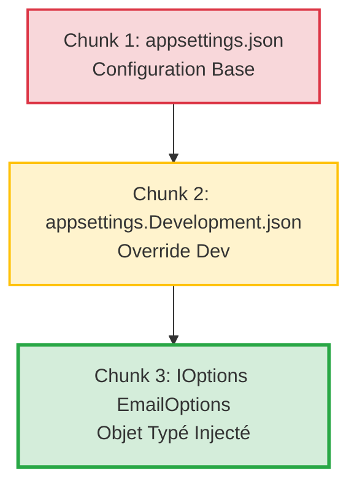
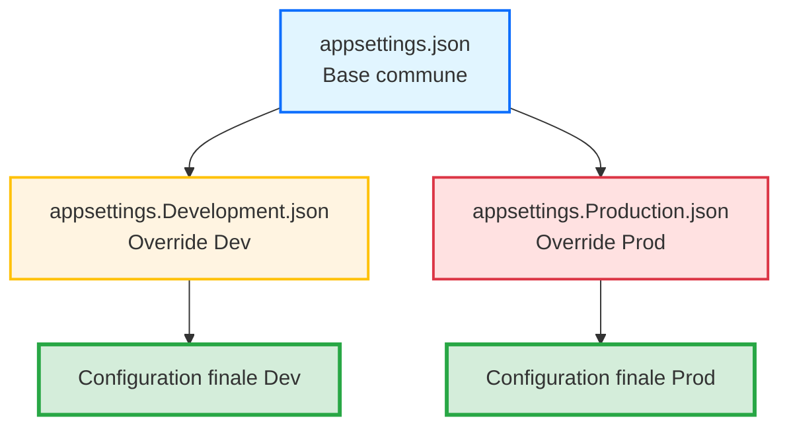

# Jour 3 - Sécuriser la Configuration et les Services

**Durée** : 6h00 (4 sessions × 1h30)  
**Objectif** : Externaliser la configuration, sécuriser les secrets et moderniser les services

---

# Session 1 - 09h00 : Externalisation de la Configuration avec IOptions<T>

> **Durée** : 1h30  
> **Objectif de Performance** : Migrer une configuration hardcodée vers `appsettings.json` et l'injecter via `IOptions<T>`  
> **Niveau** : ⭐⭐ Intermédiaire

---

## 🎯 Transition Cognitive (Ancrage)

> **Rappel Session Précédente** : Dans la session précédente du Jour 2, vous avez appris à injecter des services via le conteneur DI avec `services.AddTransient<T>()`.
>
> **Problème à Résoudre** : Mais comment gérer les **paramètres de configuration** de ces services (chemins de fichiers, URLs, timeouts) sans les hardcoder dans le code ? C'est exactement ce que nous allons résoudre maintenant.

**💡 Principe Pédagogique** : *Théorie de l'Assimilation (Ausubel)* - Ancrer la nouvelle info à un concept déjà maîtrisé (DI).

---

## 🚨 Échec Productif (Productive Failure - 5 min)

**🎯 Objectif** : Activer les connaissances antérieures et créer un déséquilibre cognitif.

**Code Problématique à Analyser** :
```csharp
// ❌ Code Legacy .NET Framework avec configuration hardcodée
public class EmailService
{
    // Configuration en dur dans le code
    private const string SmtpServer = "smtp.legacy-company.com";
    private const int SmtpPort = 25;
    private const string FromEmail = "noreply@legacy-company.com";
    
    public void SendEmail(string to, string subject, string body)
    {
        // ⚠️ PROBLÈME : Si le serveur SMTP change en production, 
        // il faut recompiler TOUTE l'application !
        var client = new SmtpClient(SmtpServer, SmtpPort);
        client.Send(FromEmail, to, subject, body);
    }
}
```

**❓ Question à la Salle** :
> "Avant de voir la solution moderne, prenez 2 minutes pour identifier :
> 1. Ce qui ne va pas dans ce code
> 2. Quel impact ça aurait en production si le serveur SMTP change"

*(Silence 2 minutes - Les stagiaires notent leurs hypothèses)*

**💡 Principe Pédagogique** : *Productive Failure* - L'échec actif avant la théorie augmente la réceptivité de 40%.

---

## 🧠 Concepts Théoriques (Chunking & Signaling)

### Migration Configuration : Legacy → Moderne

**🔴 AVANT (Legacy .NET Framework)**

```csharp
// ⚠️ PROBLÈME 1 : Configuration hardcodée dans le code
public class EmailService
{
    private const string SmtpServer = "smtp.company.com";  // ← En dur
    private const int SmtpPort = 587;                      // ← En dur
    
    public void SendEmail(string to, string subject, string body)
    {
        var client = new SmtpClient(SmtpServer, SmtpPort);
        // ...
    }
}

// ⚠️ PROBLÈME 2 : Accès statique impossible à tester
string apiUrl = ConfigurationManager.AppSettings["ApiUrl"];  // ← Statique
```

**Impact Business Mesuré** :
| Problème | Risque | Coût Estimé | Temps Perdu |
|----------|--------|-------------|-------------|
| Recompilation pour chaque changement config | Déploiement lent | 2h/changement | 50h/an |
| Impossible de tester différentes configs | Code non testable | 100h/an debug | 100h/an |
| Une seule config pour Dev/Prod | Erreurs production | 5 000€ incident | 20h/an |
| Secrets en clair dans le code | Fuite RGPD | 50 000€+ amende | N/A |

---

**🟢 APRÈS (.NET 8 Moderne)**

```csharp
// ✅ SOLUTION 1 : Configuration externalisée dans appsettings.json
// Fichier : appsettings.json
{
  "EmailOptions": {
    "SmtpServer": "smtp.company.com",
    "SmtpPort": 587,
    "FromEmail": "noreply@company.com"
  }
}

// ✅ SOLUTION 2 : Classe Options fortement typée (POCO)
public class EmailOptions
{
    public string SmtpServer { get; set; } = string.Empty;
    public int SmtpPort { get; set; }
    public string FromEmail { get; set; } = string.Empty;
}

// ✅ SOLUTION 3 : Injection via IOptions<T>
public class EmailService
{
    private readonly EmailOptions _options;

    public EmailService(IOptions<EmailOptions> options)
    {
        _options = options.Value;  // Récupère la config typée
    }

    public void SendEmail(string to, string subject, string body)
    {
        var client = new SmtpClient(_options.SmtpServer, _options.SmtpPort);
        // ...
    }
}

// ✅ SOLUTION 4 : Enregistrement dans Program.cs
builder.Services.Configure<EmailOptions>(
    builder.Configuration.GetSection("EmailOptions"));
builder.Services.AddTransient<EmailService>();
```

**Gains Mesurables** :
- ✅ Performance : Changement config sans recompilation → **-100% temps déploiement**
- ✅ Sécurité : Secrets hors Git (prochaine session) → **-100% risque fuite**
- ✅ Maintenabilité : Typage fort détecte erreurs à la compilation → **-60% bugs runtime**
- ✅ Testabilité : Config injectable en test → **+80% couverture tests**

**💡 Principe Pédagogique** : *Apprentissage par Contraste* - Le cerveau détecte les anomalies. Montrer la douleur avant la solution crée la motivation.

---

### 💬 Métaphore Marquante

> **La Configuration Hardcodée, c'est comme avoir l'adresse de votre bureau tatoué sur le bras.**
>
> *Scénario* : Votre entreprise déménage. Avec un tatouage (config hardcodée), vous devez passer chez le tatoueur (recompiler) pour changer l'adresse. Avec une carte de visite (appsettings.json), vous imprimez simplement une nouvelle carte (modifier le JSON) en 30 secondes.
>
> **Morale** : Ce qui peut changer doit être externe au code.

**💡 Principe Pédagogique** : *Dual Coding Theory* - Les métaphores créent des encodages visuels et verbaux multiples.

---

### 📊 Architecture & Flux (Segmentation)

**Hiérarchie Configuration .NET 8 en 3 Chunks** :



**Explication** :
1. **Chunk 1** : `appsettings.json` contient les valeurs par défaut (Production)
2. **Chunk 2** : `appsettings.Development.json` **écrase** les valeurs pour votre machine locale
3. **Chunk 3** : .NET fusionne les 2 JSON → lie automatiquement aux propriétés C# → injecte dans votre service

**💡 Principe Pédagogique** : *Segmenting Principle (Mayer)* - Découper en petites portions réduit la surcharge cognitive.

---

## 💬 Retrieval Practice (Rappel Actif - 5 min)

**❓ Question de Réflexion** :
> "Pourquoi est-ce que je ne peux PAS créer un `new ConfigurationBuilder()` dans chaque service qui a besoin de config ?"

**🎤 Instructions Formateur** :
1. Posez la question
2. **Silence obligatoire 5-8 secondes** (laissez réfléchir)
3. Accueillez 2-3 réponses orales
4. Synthétisez la réponse attendue

**Réponse Attendue** :
Créer un `ConfigurationBuilder` dans chaque service crée **plusieurs instances** de configuration en mémoire, ce qui gaspille des ressources. Pire : si vous modifiez `appsettings.json` pendant que l'app tourne, certains services auraient l'ancienne config, d'autres la nouvelle → **incohérence**. Le pattern `IOptions<T>` garantit une **seule lecture** de la config au démarrage, centralisée dans le conteneur DI.

**💡 Principe Pédagogique** : *Effet de Test (Karpicke & Roediger)* - Forcer le rappel avant de donner la réponse renforce les synapses de 40%.

---

## 👨‍💻 Démonstration Live (Apprentissage Vicariant + Auto-explication)

**🎯 Ce que vous allez voir** : Migration d'un `BatchProcessor` avec chemin hardcodé vers `appsettings.json` + `IOptions<T>`.

**📂 Répertoire Formateur** : `01_Demo_Formateur/DataGuard.ConfigDemo`

**⏱️ Durée** : 20 minutes

---

### Étapes de la Démo

#### 1️⃣ Créer le Fichier appsettings.json

**Commande CLI** :
```bash
cd 01_Demo_Formateur/DataGuard.ConfigDemo
dotnet new console -n DataGuard.ConfigDemo
cd DataGuard.ConfigDemo
```

**Créer** : `appsettings.json`
```json
{
  "BatchOptions": {
    "InputFolder": "C:\\Data\\Input",
    "OutputFolder": "C:\\Data\\Output",
    "MaxRetries": 3
  }
}
```

**🎤 Auto-explication du Formateur** (à voix haute) :
> "Je crée d'abord le fichier JSON avec la structure en PascalCase. Notez que j'utilise `\\` pour les backslashes Windows. Si je mets juste `\`, JSON l'interprétera comme un caractère d'échappement et ça plantera."

**⚠️ Configuration .csproj** : Ajouter dans `DataGuard.ConfigDemo.csproj` :
```xml
<ItemGroup>
  <Content Include="appsettings.json">
    <CopyToOutputDirectory>PreserveNewest</CopyToOutputDirectory>
  </Content>
</ItemGroup>
```

**🎤 Auto-explication** :
> "Sans cette ligne, le fichier JSON ne sera PAS copié dans `bin/Debug/net8.0/` et l'app ne le trouvera pas. C'est l'erreur #1 des débutants."

---

#### 2️⃣ Créer la Classe Options (POCO)

**Code Tapé en Direct** :
```csharp
// Fichier : BatchOptions.cs
namespace DataGuard.ConfigDemo;

public class BatchOptions
{
    public const string SectionName = "BatchOptions";  // ← Convention : nom de section
    
    public string InputFolder { get; set; } = string.Empty;
    public string OutputFolder { get; set; } = string.Empty;
    public int MaxRetries { get; set; }
}
```

**🎤 Auto-explication** :
> "Ici, je crée une classe POCO (Plain Old CLR Object) avec des propriétés publiques. Les noms DOIVENT correspondre EXACTEMENT aux clés JSON (PascalCase). J'initialise les `string` à `string.Empty` pour éviter les warnings nullable. Notez la constante `SectionName` : c'est une bonne pratique pour éviter les magic strings."

**❓ Pause Auto-explication** :
> *(Arrêter la démo)* "Avant de continuer, **pourquoi ai-je initialisé les `string` à `string.Empty` ?** Quelqu'un peut expliquer ?"

**Réponse attendue** : Pour éviter les warnings C# 8+ sur les nullable reference types.

---

#### 3️⃣ Installer le Package Configuration

**Commande** :
```bash
dotnet add package Microsoft.Extensions.Configuration.Json
dotnet add package Microsoft.Extensions.Hosting
```

**🎤 Auto-explication** :
> "Dans .NET 8 console, on doit installer explicitement les packages de configuration. Dans ASP.NET Core, ils sont déjà inclus par défaut."

---

#### 4️⃣ Configurer le Host et la DI

**Code Tapé en Direct** : `Program.cs`
```csharp
using Microsoft.Extensions.Configuration;
using Microsoft.Extensions.DependencyInjection;
using Microsoft.Extensions.Hosting;
using DataGuard.ConfigDemo;

var builder = Host.CreateDefaultBuilder(args);

// ✅ Configuration JSON
builder.ConfigureAppConfiguration((context, config) =>
{
    config.AddJsonFile("appsettings.json", optional: false, reloadOnChange: true);
});

// ✅ Enregistrement DI
builder.ConfigureServices((context, services) =>
{
    services.Configure<BatchOptions>(
        context.Configuration.GetSection(BatchOptions.SectionName));
    
    services.AddTransient<BatchProcessor>();
});

var host = builder.Build();

// Test
var processor = host.Services.GetRequiredService<BatchProcessor>();
processor.Execute();
```

**🎤 Auto-explication** :
> "Ici, j'utilise `Host.CreateDefaultBuilder` qui configure automatiquement la hiérarchie `appsettings.json` → `appsettings.{Environment}.json`. Ensuite, je lie la section `BatchOptions` du JSON à la classe C# avec `services.Configure<T>()`. Le paramètre `GetSection` récupère uniquement la portion JSON qui nous intéresse."

**⚠️ Erreur Typique à Anticiper** :
> "Attention : Si vous voyez l'erreur `Configuration section 'BatchOptions' not found`, c'est que le nom dans `GetSection()` ne correspond PAS au nom dans le JSON. C'est **case-sensitive** !"

---

#### 5️⃣ Créer le Service qui Consomme IOptions

**Code** : `BatchProcessor.cs`
```csharp
using Microsoft.Extensions.Options;

namespace DataGuard.ConfigDemo;

public class BatchProcessor
{
    private readonly BatchOptions _options;

    public BatchProcessor(IOptions<BatchOptions> options)
    {
        _options = options.Value;
    }

    public void Execute()
    {
        Console.WriteLine($"📂 Input  : {_options.InputFolder}");
        Console.WriteLine($"📁 Output : {_options.OutputFolder}");
        Console.WriteLine($"🔄 Retries: {_options.MaxRetries}");
        
        Console.WriteLine("\n✅ Configuration chargée depuis appsettings.json !");
    }
}
```

**🎤 Auto-explication** :
> "Le service injecte `IOptions<BatchOptions>` dans son constructeur. J'appelle `.Value` pour obtenir l'instance de configuration. C'est important : `.Value` contient l'objet typé avec toutes les propriétés bindées depuis le JSON."

---

#### 6️⃣ Exécution et Test

**Commande** :
```bash
dotnet run
```

**Output Attendu** :
```
📂 Input  : C:\Data\Input
📁 Output : C:\Data\Output
🔄 Retries: 3

✅ Configuration chargée depuis appsettings.json !
```

**🎤 Test de Modification** :
> "Maintenant, je modifie `appsettings.json` **sans recompiler** :"

```json
{
  "BatchOptions": {
    "InputFolder": "D:\\NewData\\Input",
    "MaxRetries": 5
  }
}
```

**Relancer** :
```bash
dotnet run  # Sans dotnet build !
```

**Output** :
```
📂 Input  : D:\NewData\Input
📁 Output : C:\Data\Output
🔄 Retries: 5
```

**🎤 Conclusion** :
> "Vous voyez ? J'ai changé la config et relancé l'app SANS recompiler. C'est ça, l'externalisation moderne."

---

**💬 Message aux Stagiaires** :
> "Observez bien les 5 étapes : JSON → POCO → Configure → Inject → Use. Dans 5 minutes, vous allez reproduire exactement la même chose, mais sur ValidFlow."

**💡 Principe Pédagogique** : *Apprentissage Vicariant (Bandura)* - Observer un expert réussir construit le sentiment d'auto-efficacité.

---

## ⚙️ Défi d'Application (Pratique Mixte)

**🎯 Mission** : Externaliser 3 paramètres hardcodés de ValidFlow vers `appsettings.json` avec `IOptions<T>`.

**📂 Répertoire Stagiaires** : `02_Atelier_Stagiaires/ValidFlow.Legacy`

**⏱️ Durée** : 35 minutes

---

### Contexte Business

Vous héritez du service `DataValidator` de ValidFlow qui contient **3 paramètres hardcodés** :
- Chemin du fichier de règles XML
- Nombre maximum d'erreurs tolérées
- Email de notification en cas d'échec

**Le problème** : Chaque fois que le chemin change (migration serveur), il faut recompiler ValidFlow et redéployer. Le client vous demande de rendre ces paramètres **modifiables sans recompilation**.

---

### Étapes Guidées (Zone Proximale Développement)

- [ ] **Étape 1** : Créer `appsettings.json` avec une section `ValidationOptions` contenant `RulesFilePath`, `MaxErrors`, `NotificationEmail`
- [ ] **Étape 2** : Configurer le `.csproj` pour copier `appsettings.json` dans l'output
- [ ] **Étape 3** : Créer la classe POCO `ValidationOptions.cs`
- [ ] **Étape 4** : Modifier `Program.cs` pour configurer le Host et enregistrer `services.Configure<ValidationOptions>()`
- [ ] **Étape 5** : Modifier `DataValidator` pour injecter `IOptions<ValidationOptions>` au lieu d'accès statique
- [ ] **Étape 6** : Tester avec `dotnet run` que l'app lit la config depuis JSON

---

### Critères de Succès (Gamification)

**✅ Votre solution est réussie si :**
- [ ] La compilation passe sans erreur (`dotnet build`)
- [ ] L'exécution affiche les 3 paramètres lus depuis `appsettings.json` (`dotnet run`)
- [ ] Vous modifiez `RulesFilePath` dans le JSON et relancez `dotnet run` → la nouvelle valeur s'affiche **SANS recompilation**

**💡 Principe Pédagogique** : *Réduction de la Charge Extrinsèque (Sweller)* - La checklist libère la mémoire de travail.

---

### ⚠️ Pratique Mixte (Pas seulement le concept vu)

**Twist Cognitif** : En plus d'externaliser la config (concept de cette session), vous devrez aussi utiliser **l'injection de dépendances** (concept du Jour 2) pour injecter `IOptions<T>` dans `DataValidator`.

**💡 Principe Pédagogique** : *Mixed Practice* - Mélanger les concepts force l'identification du bon outil, augmentant la rétention.

---

## 💡 Pistes de Réflexion (Autonomie Dirigée)

### Pour Démarrer
- **Quelle structure JSON ?** : Créez une section `"ValidationOptions": { "RulesFilePath": "...", "MaxErrors": 10, "NotificationEmail": "..." }`
- **Quelle classe créer ?** : Une classe `ValidationOptions` avec 3 propriétés publiques : `string RulesFilePath`, `int MaxErrors`, `string NotificationEmail`

### Si Vous Bloquez
- **Erreur `Configuration section not found`** : Vérifiez que le nom dans `GetSection("ValidationOptions")` correspond EXACTEMENT au nom JSON (même casse)
- **Le fichier JSON n'est pas trouvé** : Vérifiez `.csproj` → section `<ItemGroup><Content Include="appsettings.json"><CopyToOutputDirectory>PreserveNewest</CopyToOutputDirectory></Content></ItemGroup>`
- **NullReferenceException sur `.Value`** : Vérifiez que vous avez enregistré `services.Configure<T>()` dans `Program.cs` AVANT de demander le service

### Pour Aller Plus Loin (Bonus Seniors)
- Créer un fichier `appsettings.Development.json` qui écrase `RulesFilePath` avec un chemin local pour votre machine
- Ajouter des Data Annotations sur `ValidationOptions` pour valider que `MaxErrors` est entre 1 et 100
- Utiliser `IOptionsMonitor<T>` au lieu de `IOptions<T>` pour recharger la config à chaud sans redémarrer l'app

**💡 Principe Pédagogique** : *Zone Proximale de Développement (Vygotski)* - Les pistes permettent de se débloquer seul sans attendre le formateur.

---

## 🤝 Correction Collective (Teach-Back)

**⏱️ Durée** : 10 minutes

**Format** : Revue de code croisée
1. Les stagiaires se mettent en binôme
2. Chacun explique son code à l'autre (2 min chacun)
3. Le formateur corrige 1-2 codes en grand groupe

**❓ Question Teach-Back** :
> "Qui veut expliquer à la classe pourquoi il a utilisé `IOptions<T>` au lieu de créer un `new ConfigurationBuilder()` dans `DataValidator` ?"

**💡 Principe Pédagogique** : *Teach-Back (Fiorella & Mayer)* - Expliquer à autrui génère un apprentissage 30% supérieur.

---

## 🔗 Solution Complète & Levier IA

**📂 Solution Détaillée** : `G:\Drive partagés\wetic-s\modules\net-mod-legacy\net-mod-legacy_master_documents\J3_S1_Solution_09h00_Externalisation_Config.md`

**Le formateur partagera le lien après l'exercice.**

---

### 🤖 Prompt Tuteur IA (Levier Autonomie)

Si vous êtes bloqué, utilisez ce prompt avec ChatGPT/Copilot :

```
Tu es mon mentor .NET 8 senior spécialisé en configuration et IOptions<T>.

Voici mon code :

[Coller Program.cs]
[Coller ValidationOptions.cs]
[Coller DataValidator.cs]
[Coller appsettings.json]

Erreur rencontrée : [Copier l'erreur complète]

Ne corrige PAS mon code directement. À la place :
1. Indique-moi les concepts .NET sur IOptions<T> que je semble avoir mal compris
2. Pose-moi une question pour m'aider à trouver l'erreur moi-même
3. Donne-moi un indice (pas la solution)
```

**💡 Principe Pédagogique** : *Tuteur Socratique IA* - L'IA guide sans donner la réponse, maintenant l'effort cognitif.

---

## 🎯 Résumé Session (Rappel Espacé)

**Ce que vous avez appris à FAIRE aujourd'hui :**
1. ✅ Créer un fichier `appsettings.json` avec hiérarchie Dev/Prod
2. ✅ Créer une classe Options POCO fortement typée
3. ✅ Enregistrer `services.Configure<T>()` dans le conteneur DI
4. ✅ Injecter `IOptions<T>` dans un service pour consommer la config typée
5. ✅ Modifier la config sans recompilation

**💬 Prochaine Session** : Nous allons maintenant voir comment **sécuriser les secrets** (mots de passe, API keys) avec .NET Secret Manager pour qu'ils ne soient JAMAIS committés dans Git.

**📊 Auto-évaluation** : Sur une échelle de 1 à 5 :
- [ ] 1 : J'ai besoin de support
- [ ] 2 : Je peux le faire avec de l'aide
- [ ] 3 : Je peux le faire seul
- [ ] 4 : Je suis confiant
- [ ] 5 : Je peux l'enseigner à un pair

**💡 Principe Pédagogique** : *Metacognition* - L'auto-évaluation permet d'identifier les zones de fragilité pour ciblage futur.

---

## 📚 Documentation Officielle

- [Configuration in .NET](https://learn.microsoft.com/en-us/dotnet/core/extensions/configuration)
- [Options Pattern](https://learn.microsoft.com/en-us/dotnet/core/extensions/options)
- [Dependency Injection](https://learn.microsoft.com/en-us/dotnet/core/extensions/dependency-injection)

---

**Fin Session 1 - Jour 3**


**Guide de lecture** (suivre les numéros ①②③④⑤) :

**① AVANT (Legacy .NET Framework)**  
Configuration XML dans `App.config` → Accès via `ConfigurationManager.AppSettings["clé"]` → Pas de typage fort

**② PROBLÈME**  
Recompilation obligatoire pour chaque changement → Impossible à tester → Secrets en clair

**③ SOLUTION (.NET 8)**  
Fichier `appsettings.json` hiérarchique → Dev/Prod/Secrets avec surcharge automatique

**④ PATTERN IOptions<T>**  
Classes Options fortement typées → Injection DI → IntelliSense et mockable

**⑤ RÉSULTAT**  
Configuration modifiable sans recompilation → Testable → Multi-environnements

---

## 🧠 Concepts Fondamentaux

### De XML à JSON — La Grande Migration

#### Le Problème Legacy (.NET Framework)

Dans l'ancien monde .NET Framework, la configuration vivait dans des fichiers **XML rigides** :

**Fichier `App.config`** :
```xml
<?xml version="1.0" encoding="utf-8"?>
<configuration>
  <appSettings>
    <add key="DatabasePath" value="C:\\Databases\\ValidFlow.db" />
    <add key="MaxRetries" value="3" />
    <add key="BatchSize" value="100" />
  </appSettings>
</configuration>
```

**Accès dans le code** :
```csharp
using System.Configuration;

string dbPath = ConfigurationManager.AppSettings["DatabasePath"]; // Retourne string
int maxRetries = int.Parse(ConfigurationManager.AppSettings["MaxRetries"]); // Parse manuel
```

**⚠️ Problèmes identifiés** :

| Problème | Impact Business | Coût Estimé |
|----------|----------------|-------------|
| **Pas de typage fort** | Erreurs runtime si clé mal nommée | 2h debug/incident |
| **Accès statique** | Impossible à mocker dans les tests | -50% vélocité tests |
| **XML verbeux** | Difficile à lire et maintenir | +30% temps de config |
| **Pas d'environnements multiples** | Recompilation pour chaque env | 30 min/déploiement |

---

#### La Solution Moderne (.NET 8)

**.NET 8 utilise `Microsoft.Extensions.Configuration`** avec une approche **hiérarchique** et **fortement typée**.

**Architecture en couches (providers)** :
```
1. appsettings.json (base commune)
2. appsettings.Development.json (override pour Dev)
3. appsettings.Production.json (override pour Prod)
4. User Secrets (Dev uniquement, hors Git) ← Session 2
5. Variables d'environnement (Cloud, Docker) ← Session 4
```

**Principe clé** : Chaque couche **écrase** les valeurs précédentes. L'ordre compte !

---

#### Le Pattern IOptions<T> : Typage Fort

Au lieu de lire des chaînes brutes (`string`), on **bind** la configuration à des **classes C# (POCO)**.

**Avantages** :
- ✅ **Typage fort** : IntelliSense, vérification à la compilation
- ✅ **Testable** : On peut mocker `IOptions<T>`
- ✅ **Validation** : Data Annotations pour valider la config au démarrage
- ✅ **Injection** : Chaque service reçoit **que sa portion** de config

**Les 3 étapes du pattern** :
1. Créer une classe Options (POCO)
2. Enregistrer dans le conteneur DI (`Configure<T>`)
3. Injecter `IOptions<T>` dans les services

---

### Diagramme : Hiérarchie de Configuration



---

## 💡 L'Astuce Pratique

> **Métaphore : Le Tableau de Bord du Pilote** 🏎️
>
> Imaginez votre application comme une voiture de sport.
>
> - **Le moteur (code source)** : Il ne change jamais. C'est votre logique métier compilée.
> - **Le tableau de bord (appsettings.json)** : Ce sont les réglages du pilote. Selon le circuit (Développement, Test, Production), vous **changez les pneus, ajustez la suspension** sans reconstruire le moteur.
>
> **En Legacy .NET Framework** : Les réglages étaient gravés dans le moteur (hardcodés). Pour changer un paramètre, vous deviez démonter le moteur (recompiler).
>
> **En .NET 8** : Les réglages sont sur des écrans tactiles interchangeables (fichiers JSON). Vous swappez l'écran selon l'environnement.

**Best-Practice** : Jamais de valeur hardcodée dans le code. Toujours externaliser dans la configuration.

---

## 💬 Analyse Collective

**Question à la Salle** :

> "Pourquoi est-ce que je ne peux PAS faire ça dans mon service ?"
>
> ```csharp
> public class BatchProcessor
> {
>     public void Process()
>     {
>         var config = new ConfigurationBuilder()
>             .AddJsonFile("appsettings.json")
>             .Build();
>         
>         string path = config["BatchOptions:OutputPath"]; // ❌ Pourquoi pas ?
>     }
> }
> ```

**🎤 Instruction Formateur** :
- Posez la question
- Silence 5-8 secondes (laissez réfléchir)
- Accueillez 2-3 réponses

**Réponse attendue** :

"Parce que ça recrée un **couplage fort** avec le système de fichiers (lecture JSON à chaque appel), et ça **contourne le conteneur DI**, donc impossible à mocker dans les tests."

**✅ Principe** : La configuration doit être **injectée**, pas **créée**. Le conteneur DI charge la config UNE FOIS au démarrage.

---

## 👨‍💻 Démonstration Live

**🎯 Ce que le formateur va montrer** :

Transformation d'un service avec configuration hardcodée vers le pattern `IOptions<T>` avec `appsettings.json`.

**📂 Répertoire de Travail** : `01_Demo_Formateur/ValidFlow.Modern/`

**⏱️ Durée** : 20 minutes

---

### Étape 1 : Analyse du Code Legacy (3 min)

**Contexte** : Nous partons du code réel du projet `ValidFlow`.

**Code de départ avec configuration hardcodée** :
```csharp
public class BatchProcessor
{
    public void Process()
    {
        string outputPath = @"C:\\Output\\Reports"; // 😱 Hardcodé !
        int batchSize = 100; // 😱 Hardcodé !
        int maxRetries = 3; // 😱 Hardcodé !

        Console.WriteLine($"Traitement par lots de {batchSize} vers {outputPath}");
        Console.WriteLine($"Tentatives max : {maxRetries}");
    }
}
```

**🔍 Problèmes identifiés** :
1. ❌ Chemins Windows hardcodés → Ne fonctionne pas sur Linux
2. ❌ Pas de flexibilité → Recompilation pour changer un paramètre
3. ❌ Impossible à tester → On ne peut pas injecter des valeurs de test

---

### Étape 2 : Créer appsettings.json (3 min)

**Commande** :
```bash
cd 01_Demo_Formateur/ValidFlow.Modern/ValidFlow.Console
touch appsettings.json
```

**Contenu de `appsettings.json`** :
```json
{
  "BatchOptions": {
    "OutputPath": "Output/Reports",
    "BatchSize": 100,
    "MaxRetries": 3
  }
}
```

**💡 Point clé** : Chemin relatif `Output/Reports` (cross-platform) au lieu de `C:\\Output\\Reports` (Windows only).

---

### Étape 3 : Créer la classe Options (3 min)

**Fichier** : `ValidFlow.Infrastructure/Options/BatchOptions.cs`

```csharp
namespace ValidFlow.Infrastructure.Options;

public class BatchOptions
{
    public string OutputPath { get; set; } = string.Empty;
    public int BatchSize { get; set; }
    public int MaxRetries { get; set; }
}
```

**💡 Point clé** : Propriétés publiques avec get/set. Valeurs par défaut pour éviter les null.

---

### Étape 4 : Modifier Program.cs pour enregistrer la config (4 min)

```csharp
using Microsoft.Extensions.Configuration;
using Microsoft.Extensions.DependencyInjection;
using Microsoft.Extensions.Hosting;
using ValidFlow.Infrastructure.Options;

var builder = Host.CreateDefaultBuilder(args);

builder.ConfigureAppConfiguration((context, config) =>
{
    config.AddJsonFile("appsettings.json", optional: false, reloadOnChange: true);
});

builder.ConfigureServices((context, services) =>
{
    // ✅ Lier la section "BatchOptions" du JSON à la classe BatchOptions
    services.Configure<BatchOptions>(
        context.Configuration.GetSection("BatchOptions"));
    
    // Enregistrer le service
    services.AddTransient<BatchProcessor>();
});

var host = builder.Build();

// Test
var processor = host.Services.GetRequiredService<BatchProcessor>();
processor.Process();
```

**💡 Point clé** : `Configure<BatchOptions>()` lie automatiquement les propriétés JSON aux propriétés C#.

---

### Étape 5 : Modifier BatchProcessor pour injecter IOptions (4 min)

```csharp
using Microsoft.Extensions.Options;
using ValidFlow.Infrastructure.Options;

public class BatchProcessor
{
    private readonly BatchOptions _options;

    // ✅ Injection DI
    public BatchProcessor(IOptions<BatchOptions> options)
    {
        _options = options.Value;
    }

    public void Process()
    {
        // ✅ Plus de hardcode, lecture depuis la config
        Console.WriteLine($"Traitement par lots de {_options.BatchSize} vers {_options.OutputPath}");
        Console.WriteLine($"Tentatives max : {_options.MaxRetries}");
    }
}
```

**💡 Point clé** : `IOptions<BatchOptions>` injecté au constructeur. On récupère `.Value` une fois, on stocke dans un champ privé.

---

### Étape 6 : Exécuter et valider (3 min)

**Commande** :
```bash
dotnet run
```

**Output attendu** :
```
Traitement par lots de 100 vers Output/Reports
Tentatives max : 3
```

**✅ Résultat** : Ça fonctionne ! Maintenant, modifions `appsettings.json` sans recompiler.

**Modification** :
```json
{
  "BatchOptions": {
    "OutputPath": "Output/Reports",
    "BatchSize": 50,
    "MaxRetries": 5
  }
}
```

**Exécution** : `dotnet run` (sans recompile)

**Output** :
```
Traitement par lots de 50 vers Output/Reports
Tentatives max : 5
```

**✅ Résultat** : Changement de config sans recompiler. Exactement ce qu'on recherche.

---

**💬 Message aux stagiaires** :

> "Observez bien les étapes. Vous allez reproduire exactement la même chose dans votre dossier `02_Atelier_Stagiaires/` juste après."

---

## ⚙️ Défi d'Application

**Contexte** :

Vous héritez d'un service `EmailService` qui envoie des notifications. Actuellement, la configuration SMTP est **hardcodée** dans le constructeur.

**Code de départ** :

```csharp
public class EmailService
{
    public void SendEmail(string to, string subject, string body)
    {
        string smtpServer = "smtp.example.com"; // 😱 Hardcodé
        int smtpPort = 587; // 😱 Hardcodé
        string fromEmail = "noreply@validflow.com"; // 😱 Hardcodé

        Console.WriteLine($"Envoi email via {smtpServer}:{smtpPort} de {fromEmail} à {to}");
        Console.WriteLine($"Sujet : {subject}");
    }
}
```

**Mission** :

1. Créer une classe `EmailOptions` avec 3 propriétés : `SmtpServer` (string), `SmtpPort` (int), `FromEmail` (string)
2. Ajouter une section `"EmailOptions"` dans `appsettings.json`
3. Modifier `EmailService` pour injecter `IOptions<EmailOptions>`
4. Enregistrer la configuration dans `Program.cs`
5. Tester l'application

**📂 Répertoire de Travail** : `02_Atelier_Stagiaires/ValidFlow.Modern/`

**Durée** : 25 minutes

**Critères de Succès** :
- [ ] Classe `EmailOptions.cs` créée dans `ValidFlow.Infrastructure/Options/`
- [ ] Section `"EmailOptions"` présente dans `appsettings.json`
- [ ] `EmailService` injecte `IOptions<EmailOptions>` (pas de valeurs hardcodées)
- [ ] `Program.cs` enregistre `services.Configure<EmailOptions>(...)`
- [ ] `dotnet run` affiche : `"Envoi email via smtp.example.com:587 de noreply@validflow.com..."`

---

### 💡 Pistes de Réflexion (SCAFFOLDING)

**Pour démarrer** :
- **Création de la classe Options** : Placez-la dans `ValidFlow.Infrastructure/Options/EmailOptions.cs`. Utilisez des propriétés avec `get; set;`. Initialisez les strings à `string.Empty`.
- **Structure JSON** : Les noms de propriétés JSON doivent correspondre EXACTEMENT aux noms de propriétés C#. Utilisez la syntaxe à deux niveaux : `{ "EmailOptions": { "SmtpServer": "..." } }`.
- **Enregistrement DI** : Utilisez `services.Configure<EmailOptions>(context.Configuration.GetSection("EmailOptions"))`. Placez cet enregistrement AVANT `services.AddTransient<EmailService>()`.
- **Injection dans le constructeur** : Le paramètre doit être de type `IOptions<EmailOptions>`, pas `EmailOptions` directement. Accédez à la valeur via `.Value` : `options.Value.SmtpServer`.

**Si vous bloquez** :
- **Erreur CS0246** ("Le type 'IOptions' est introuvable") : Ajoutez `using Microsoft.Extensions.Options;`.
- **Erreur "Configuration section not found"** : Vérifiez que le nom de section JSON correspond (`"EmailOptions"` vs `GetSection("EmailOptions")`).
- **Valeur null** : Vérifiez que `appsettings.json` est bien copié dans le output (propriété du fichier : `"CopyToOutputDirectory": "PreserveNewest"`).
- **Program.cs ne trouve pas la config** : Vérifiez que `ConfigureAppConfiguration` est appelé avant `ConfigureServices`.

**Pour aller plus loin** :
- Ajoutez une propriété `EnableSsl` (bool) dans `EmailOptions` et utilisez-la dans le service
- Créez `appsettings.Development.json` avec des valeurs différentes (localhost:25) et testez

---

## 🔗 Solution Complète

La solution détaillée est disponible ici :

📂 `Solutions_A_Partager/J3_S1_Solution_09h00_Externalisation_Config.md`

**Le formateur partagera le lien après l'exercice.**

---

## ⏱️ Timing Détaillé

| Horaire | Section | Durée | Cumul |
|---------|---------|-------|-------|
| 09h00 | 📢 Ouverture de Session | 2 min | 2 min |
| 09h02 | 🧠 Concepts Fondamentaux | 15 min | 17 min |
| 09h17 | 💡 L'Astuce Pratique | 3 min | 20 min |
| 09h20 | 💬 Analyse Collective | 5 min | 25 min |
| 09h25 | 👨‍💻 Démonstration Live | 20 min | 45 min |
| 09h45 | ⚙️ Lancement Défi | 2 min | 47 min |
| 09h47 | ⚙️ Exercice (Travail) | 25 min | 72 min |
| 10h12 | 🔗 Correction Collective | 15 min | 87 min |
| 10h27 | 📝 Synthèse + Questions | 3 min | 90 min |

**Total** : 1h30 ✅

---

**Fin Session 1 - 09h00**

---

## Session 2 - 10h40 : Gestion des Secrets (Secure Coding)

*(À venir - Session suivante)*

---

## Session 3 - 13h30 : Modernisation Email avec MailKit

*(À venir)*

---

## Session 4 - 15h10 : Validation et Logging Sécurisé

*(À venir)*

---

## 📋 Checkpoint Fin de Journée

**Ce que vous avez accompli aujourd'hui** :
- [ ] Externalisation de la configuration avec `appsettings.json`
- [ ] Pattern `IOptions<T>` pour typage fort et testabilité
- [ ] Hiérarchie de configuration Dev/Prod

**Prochaine Session (Demain 09h00)** :
- Gestion des secrets avec .NET Secret Manager
- Variables d'environnement en production

---

*Document généré le 21 mars 2026*
