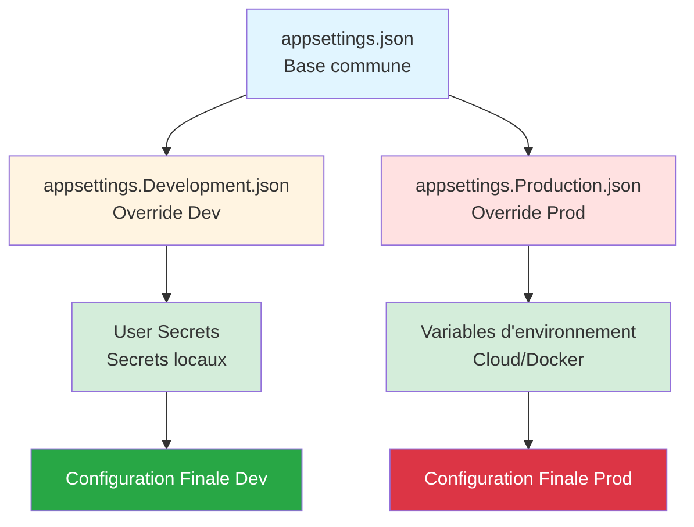

# 📅 JOUR 3 : Sécuriser la Configuration et les Services

**🎯 L'enjeu Client (Soulagement)** : Éliminer le risque de fuite de données. Obtenir la capacité d'écrire du code sécurisé et professionnel.

**Objectifs du jour** :
- ✅ Externaliser toute configuration hardcodée (chemins, paramètres)
- ✅ Sécuriser les credentials (mots de passe SQL, SMTP)
- ✅ Moderniser l'envoi d'emails (MailKit)
- ✅ Assainir les entrées et tracer de manière sécurisée

---

## 🕐 Session 1 (09h00 - 10h30) : Externalisation de la Configuration

**Durée** : 1h30  
**Niveau** : ⭐⭐ Intermédiaire

### 🎯 Objectif de Performance

À la fin de cette session, vous serez capable de **supprimer toutes les données en dur** dans le code et de **configurer une application .NET 8** avec des fichiers `appsettings.json` hiérarchiques, lus via le pattern **IOptions**.

**Transformation visée** :
```csharp
// ❌ AVANT (Legacy .NET Framework)
string dbPath = @"C:\Databases\ValidFlow.db";
int maxRetries = 3;

// ✅ APRÈS (.NET 8)
public AppConfig(IOptions<DatabaseOptions> dbOptions)
{
    string dbPath = dbOptions.Value.Path;
    int maxRetries = dbOptions.Value.MaxRetries;
}
```

---

### 🧠 Concepts Fondamentaux

#### 💡 Métaphore : Le Tableau de Bord du Pilote

> **Imaginez votre application comme une voiture de sport** 🏎️
> 
> - **Le moteur (code source)** : Il ne change jamais. C'est votre logique métier compilée.
> - **Le tableau de bord (appsettings.json)** : Ce sont les réglages du pilote (vous). Selon le circuit (Développement, Test, Production), vous **changez les pneus, ajustez la suspension, ou le type de carburant** sans avoir à reconstruire le moteur.
> 
> **En Legacy .NET Framework** : Les réglages étaient gravés dans le moteur (hardcodés). Pour changer un paramètre, vous deviez démonter le moteur (recompiler).
> 
> **En .NET 8** : Les réglages sont sur des écrans tactiles interchangeables (fichiers JSON). Vous swappez l'écran selon l'environnement.

---

#### 📚 De XML à JSON — La Grande Migration

**Le Problème Legacy (.NET Framework)**

Dans l'ancien monde .NET Framework, la configuration vivait dans des fichiers **XML rigides** :

**Fichier `Web.config` ou `App.config`** :
```xml
<?xml version="1.0" encoding="utf-8"?>
<configuration>
  <appSettings>
    <add key="DatabasePath" value="C:\Databases\ValidFlow.db" />
    <add key="MaxRetries" value="3" />
    <add key="SmtpServer" value="smtp.example.com" />
    <add key="SmtpPassword" value="MotDePasseEnClair123!" />
  </appSettings>
</configuration>
```

**Accès dans le code** :
```csharp
using System.Configuration;

string dbPath = ConfigurationManager.AppSettings["DatabasePath"];
string smtpPassword = ConfigurationManager.AppSettings["SmtpPassword"]; // 😱 En clair !
```

**⚠️ Problèmes identifiés** :

| Problème | Impact Business | Coût Estimé |
|----------|----------------|-------------|
| **Statique et non testable** | Impossible à mocker dans les tests | -50% vélocité tests |
| **Pas de typage fort** | Erreurs runtime si clé mal nommée | 2h debug/incident |
| **Secrets hardcodés** | Mots de passe en clair sur Git | 50k€-500k€ fuite |
| **Pas d'environnements multiples** | Recompilation pour chaque environnement | 30 min/déploiement |

---

**La Solution Moderne (.NET 8)**

**.NET 8 utilise le package `Microsoft.Extensions.Configuration`** avec une approche **hiérarchique** et **fortement typée**.

**Architecture en couches (providers)** :
```
1. appsettings.json (base commune)
2. appsettings.Development.json (override pour Dev)
3. appsettings.Production.json (override pour Prod)
4. User Secrets (Dev uniquement, hors Git)
5. Variables d'environnement (Cloud, Docker)
6. Arguments de ligne de commande
```

**Principe clé** : Chaque couche **écrase** les valeurs précédentes. L'ordre compte !



---

### 💡 L'Astuce Pratique : Le Pattern IOptions<T>

Au lieu de lire des chaînes brutes (`string`), on **bind** la configuration à des **classes C# (POCO)**.

**Structure `appsettings.json`** :
```json
{
  "DatabaseOptions": {
    "Path": "ValidFlow.db",
    "MaxRetries": 3,
    "TimeoutSeconds": 30
  },
  "EmailOptions": {
    "SmtpServer": "smtp.example.com",
    "SmtpPort": 587,
    "SenderEmail": "noreply@validflow.com"
  }
}
```

**Fichier `appsettings.Development.json`** (écrase pour Dev) :
```json
{
  "DatabaseOptions": {
    "Path": "ValidFlow_Dev.db"
  },
  "Logging": {
    "LogLevel": {
      "Default": "Debug"
    }
  }
}
```

**Résultat en Développement** :
```json
{
  "DatabaseOptions": {
    "Path": "ValidFlow_Dev.db",        // ✅ Override par Development.json
    "MaxRetries": 3,                   // Base (appsettings.json)
    "TimeoutSeconds": 30               // Base
  }
}
```

---

#### Étape 1 : Créer les classes Options (POCO)

**Fichier `DatabaseOptions.cs`** :
```csharp
namespace ValidFlow.Infrastructure.Options;

public class DatabaseOptions
{
    public string Path { get; set; } = string.Empty;
    public int MaxRetries { get; set; }
    public int TimeoutSeconds { get; set; }
}
```

**Fichier `EmailOptions.cs`** :
```csharp
namespace ValidFlow.Infrastructure.Options;

public class EmailOptions
{
    public string SmtpServer { get; set; } = string.Empty;
    public int SmtpPort { get; set; }
    public string SenderEmail { get; set; } = string.Empty;
}
```

---

#### Étape 2 : Enregistrer dans le conteneur DI

**Fichier `Program.cs`** :
```csharp
using Microsoft.Extensions.Configuration;
using Microsoft.Extensions.DependencyInjection;
using Microsoft.Extensions.Hosting;
using ValidFlow.Infrastructure.Options;

var builder = Host.CreateDefaultBuilder(args);

builder.ConfigureServices((context, services) =>
{
    // Bind la section "DatabaseOptions" du JSON à la classe DatabaseOptions
    services.Configure<DatabaseOptions>(
        context.Configuration.GetSection("DatabaseOptions"));

    // Bind la section "EmailOptions"
    services.Configure<EmailOptions>(
        context.Configuration.GetSection("EmailOptions"));
});

var host = builder.Build();
```

**🔑 Principe SOLID (Interface Segregation)** : Chaque service ne reçoit **que la portion de config dont il a besoin**, pas toute la config globale.

---

#### Étape 3 : Injecter IOptions<T> dans vos services

**Fichier `DatabaseService.cs`** :
```csharp
using Microsoft.Extensions.Options;
using ValidFlow.Infrastructure.Options;

namespace ValidFlow.Infrastructure.Services;

public class DatabaseService
{
    private readonly DatabaseOptions _dbOptions;

    public DatabaseService(IOptions<DatabaseOptions> dbOptions)
    {
        _dbOptions = dbOptions.Value; // ✅ Accès typé à la config
    }

    public void Connect()
    {
        Console.WriteLine($"Connexion à la base : {_dbOptions.Path}");
        Console.WriteLine($"Tentatives max : {_dbOptions.MaxRetries}");
        Console.WriteLine($"Timeout : {_dbOptions.TimeoutSeconds}s");
    }
}
```

**Avantages obtenus** :
- ✅ Config externalisée (modifiable sans recompile)
- ✅ Typage fort (erreurs à la compilation si propriété mal nommée)
- ✅ Testable (mock de `IOptions<BatchOptions>`)
- ✅ Multiplateforme (chemin relatif)

---

### 💬 Analyse Collective (3 min)

**🎤 Script Formateur** :

> "Avant de passer à la démo, une question pour la salle : **Pourquoi est-ce que je ne peux PAS faire ça ?**"
>
> ```csharp
> public class BatchProcessor
> {
>     public void Process()
>     {
>         var config = new ConfigurationBuilder()
>             .AddJsonFile("appsettings.json")
>             .Build();
>         
>         string path = config["BatchOptions:OutputPath"]; // ❌ Pourquoi pas ?
>     }
> }
> ```
>
> *[Silence 8 secondes - Attendre levée de main]*

**💡 Réponse attendue** :

"Parce que ça recrée un **couplage fort** avec le système de fichiers (lecture JSON à chaque appel), et ça **contourne le conteneur DI**, donc impossible à mocker dans les tests."

**✅ Principe** : La configuration doit être **injectée**, pas **créée**. Le conteneur DI charge la config UNE FOIS au démarrage.

---

### ⚙️ Défi d'Application (20 min)

**Contexte** :

Vous héritez d'un service `BatchProcessor` qui traite des fichiers. Actuellement, le chemin de sortie et la taille des lots sont **hardcodés** dans le code.

**Mission** :

1. Créer une classe `BatchOptions` avec deux propriétés : `OutputPath` (string) et `BatchSize` (int)
2. Ajouter une section `"BatchOptions"` dans `appsettings.json`
3. Modifier `BatchProcessor` pour injecter `IOptions<BatchOptions>`
4. Enregistrer la configuration dans `Program.cs`
5. Tester l'application

**Code de départ** :

```csharp
public class BatchProcessor
{
    public void Process()
    {
        string outputPath = @"C:\Output\Reports"; // 😱 Hardcodé !
        int batchSize = 100; // 😱 Hardcodé !

        Console.WriteLine($"Traitement par lots de {batchSize} vers {outputPath}");
    }
}
```

**Critères de succès** :
- ✅ Classe `BatchOptions.cs` créée
- ✅ Section `"BatchOptions"` dans `appsettings.json`
- ✅ `BatchProcessor` injecte `IOptions<BatchOptions>`
- ✅ Application affiche : `"Traitement par lots de 100 vers Output/Reports"`

**Durée** : 20 minutes

---

### 💡 Pistes de Réflexion

**Si vous bloquez, voici quelques indices** :

1. **Création de la classe Options** :
   - Placez-la dans un dossier `ValidFlow.Infrastructure/Options/`
   - Utilisez des propriétés avec `get; set;`
   - Initialisez les strings à `string.Empty` pour éviter les warnings nullabilité

2. **Structure JSON** :
   - Les noms de propriétés JSON doivent correspondre EXACTEMENT aux noms de propriétés C#
   - Utilisez la syntaxe à deux niveaux : `{ "BatchOptions": { "OutputPath": "..." } }`

3. **Enregistrement DI** :
   - Utilisez `services.Configure<BatchOptions>(context.Configuration.GetSection("BatchOptions"))`
   - Placez cet enregistrement AVANT `services.AddTransient<BatchProcessor>()`

4. **Injection dans le constructeur** :
   - Le paramètre doit être de type `IOptions<BatchOptions>`, pas `BatchOptions` directement
   - Accédez à la valeur via `.Value` : `options.Value.OutputPath`

5. **Troubleshooting** :
   - Si `null` : Vérifiez que le nom de section JSON correspond (`"BatchOptions"`)
   - Si `InvalidOperationException` : Vérifiez que `Configure<>` est appelé AVANT la résolution du service
   - Si compilation échoue : Ajoutez `using Microsoft.Extensions.Options;`

---

### 🔗 Lien vers la Solution

Une fois l'exercice terminé, la **solution complète** sera partagée sur le Drive partagé.

**Chemin** : `Solutions_A_Partager/J3_S1_SOLUTION_EXTERNALISATION_CONFIG.md`

---

### ⏱️ Timing Détaillé

| Activité | Début | Fin | Durée | Cumul |
|----------|-------|-----|-------|-------|
| 🎤 Ouverture + Métaphore | 09h00 | 09h05 | 5 min | 5 min |
| 🧠 Théorie Legacy vs Moderne | 09h05 | 09h20 | 15 min | 20 min |
| 💡 Pattern IOptions (3 étapes) | 09h20 | 09h35 | 15 min | 35 min |
| 💬 Analyse Collective | 09h35 | 09h38 | 3 min | 38 min |
| 🎤 Lancement Défi | 09h38 | 09h40 | 2 min | 40 min |
| ⚙️ Défi d'Application | 09h40 | 10h00 | 20 min | 60 min |
| 🔗 Correction Collective | 10h00 | 10h20 | 20 min | 80 min |
| 📝 Synthèse + Questions | 10h20 | 10h30 | 10 min | 90 min |

**Total Session** : **1h30** ✅

---

### 📋 Consignes de Session

#### 📢 Ouverture de Session (2 minutes)

**Objectif** : Créer une prise de conscience du risque de sécurité lié aux configurations hardcodées  
**Message clé** : La configuration en clair est un vecteur d'attaque majeur en production

Bonjour à tous ! Nous attaquons le Jour 3, et aujourd'hui, on va s'occuper de quelque chose de **CRITIQUE** pour la sécurité : la configuration.

**Question interactive** : Qui a déjà vu un mot de passe SQL **en clair** dans un fichier `App.config` ou dans le code source ?

*(La majorité des participants devrait lever la main - c'est un problème répandu)*

Et combien d'entre vous ont ce code sur **GitHub public** ou **un serveur accessible** ?

*(Quelques mains restent levées - moment de prise de conscience)*

C'est la réalité de beaucoup de projets legacy. **Aujourd'hui, on règle ce problème définitivement.**

On va voir comment .NET 8 permet d'externaliser TOUTE la configuration, de la rendre **testable**, et de séparer les secrets du code. C'est parti !

---

#### ⚡ Lancement du Défi d'Application (2 minutes)

**Objectif** : Mise en pratique du pattern IOptions  
**Durée** : 20 minutes  
**Critère de réussite** : Valeurs lues depuis `appsettings.json`, pas du code

Parfait, vous avez maintenant vu le pattern IOptions en action. Maintenant, à vous de jouer !

**Votre mission** : Vous avez un service `BatchProcessor` avec deux valeurs hardcodées : le chemin de sortie et la taille des lots. Vous allez externaliser ces deux valeurs dans `appsettings.json` en utilisant le pattern IOptions.

Vous avez **20 minutes**. Objectif : quand vous lancez l'application, elle doit afficher `Traitement par lots de 100 vers Output/Reports`, mais ces valeurs doivent venir de `appsettings.json`, **PAS du code**.

💡 **Ressources disponibles** :
- Pistes de Réflexion (section ci-dessous)
- Questions dans le chat
- Documentation en ligne

Le chronomètre démarre... **maintenant** !

---

## 🕐 Session 2 (10h40 - 12h10) : Gestion des Secrets (Secure Coding)

**Durée** : 1h30  
**Niveau** : ⭐⭐⭐ Avancé (Sécurité)

### 🎯 Objectif de Performance

À la fin de cette session, vous serez capable de **sécuriser tous les credentials** (mots de passe, API keys, tokens) en utilisant **.NET Secret Manager** pour le développement et en comprenant les stratégies de production (Variables d'Environnement, Azure Key Vault).

**Transformation visée** :
```csharp
// ❌ AVANT (.NET Framework)
string smtpPassword = "MotDePasseEnClair123!"; // 😱 Dans le code source !

// ✅ APRÈS (.NET 8)
public EmailService(IOptions<SmtpOptions> options)
{
    string smtpPassword = options.Value.Password; // ✅ Depuis User Secrets ou Key Vault
}
```

---

### 🧠 Concepts Fondamentaux

#### 💡 Métaphore : Le Coffre-Fort vs Le Paillasson


> **La clé sous le paillasson vs le coffre-fort biométrique** 🔐
> 
> **Dans l'ancien monde (.NET Framework)** :
> - Stocker un mot de passe dans `Web.config` = laisser la clé de votre maison sous le paillasson
> - Toute personne avec accès au code source (le paillasson) peut trouver la clé
> - Si vous commitez sur Git → **la clé est publique pour toujours**
>
> **Avec .NET 8, la philosophie change** :
> - **En développement (Le Chantier)** : Vous utilisez le **.NET Secret Manager**. C'est comme donner un badge temporaire aux ouvriers. Ce badge n'est valide que sur leur machine locale et **n'est jamais rangé avec les plans de la maison** (le code source).
> - **En production (La Maison terminée)** : Vous utilisez des **Variables d'environnement** ou un **Azure Key Vault**. C'est un coffre-fort biométrique de haute sécurité. Les clés ne sont injectées qu'au moment d'entrer dans la maison, directement dans la serrure (la mémoire de l'application).

---

#### 📚 Qu'est-ce qu'un "Secret" ?

Un **secret** est toute donnée sensible qui, si exposée, pourrait compromettre la sécurité de votre application ou de vos utilisateurs.

**Exemples de secrets** :
- Mots de passe de base de données
- Clés API (SendGrid, Stripe, Azure, AWS)
- Tokens d'authentification (JWT secrets)
- Certificats SSL privés
- Connection strings avec credentials

**⚠️ Règle d'Or** : **Ne JAMAIS commiter un secret sur Git**, même dans un repository privé.

**Pourquoi ?**
- L'historique Git est **permanent** (même si vous supprimez le fichier après)
- Un repository privé peut devenir public par accident
- Les employés qui quittent l'entreprise conservent l'accès à leurs clones locaux
- Les services comme GitHub scannent automatiquement les secrets et vous alertent (mais le mal est fait)

---

### 🔐 Le .NET Secret Manager (Développement uniquement)

**Qu'est-ce que c'est ?**

Le **Secret Manager** est un outil CLI intégré à .NET qui stocke vos secrets **en dehors de l'arborescence du projet**, dans un fichier `secrets.json` caché.

**Où sont stockés les secrets ?**
- **Windows** : `%AppData%\Microsoft\UserSecrets\<GUID>\secrets.json`
- **macOS/Linux** : `~/.microsoft/usersecrets/<GUID>/secrets.json`

**Important** : Les secrets ne sont **pas chiffrés** sur le disque, mais ils sont **hors Git** par défaut.

---

#### Étape 1 : Initialiser le Secret Manager

Dans le dossier de votre projet (où se trouve le `.csproj`), exécutez :

```bash
dotnet user-secrets init
```

**Ce que ça fait** :
- Ajoute un `<UserSecretsId>` unique dans votre fichier `.csproj`
- Crée le fichier `secrets.json` dans le dossier système utilisateur

**Vérification dans le `.csproj`** :
```xml
<Project Sdk="Microsoft.NET.Sdk">
  <PropertyGroup>
    <OutputType>Exe</OutputType>
    <TargetFramework>net8.0</TargetFramework>
    <UserSecretsId>a1b2c3d4-e5f6-7890-abcd-ef1234567890</UserSecretsId>
  </PropertyGroup>
</Project>
```

---

#### Étape 2 : Ajouter des secrets

**Syntaxe** :
```bash
dotnet user-secrets set "Cle:SousCle" "Valeur"
```

**Exemples** :
```bash
# Secret SMTP
dotnet user-secrets set "Smtp:Password" "MonSuperMotDePasseSecret123!"

# Secret Base de Données
dotnet user-secrets set "ConnectionStrings:DefaultConnection" "Server=monServeur;Database=maDb;User Id=admin;Password=MotDePasseDB!"

# API Key externe
dotnet user-secrets set "SendGrid:ApiKey" "SG.abc123def456ghi789"
```

**Notation hiérarchique** : Le délimiteur `:` crée une structure JSON imbriquée.

**Résultat dans `secrets.json`** :
```json
{
  "Smtp": {
    "Password": "MonSuperMotDePasseSecret123!"
  },
  "ConnectionStrings": {
    "DefaultConnection": "Server=monServeur;Database=maDb;User Id=admin;Password=MotDePasseDB!"
  },
  "SendGrid": {
    "ApiKey": "SG.abc123def456ghi789"
  }
}
```

---

#### Étape 3 : Lire les secrets via IOptions (comme Session 1)

**Fichier `SmtpOptions.cs`** :
```csharp
namespace ValidFlow.Infrastructure.Options;

public class SmtpOptions
{
    public string Host { get; set; } = string.Empty;
    public int Port { get; set; }
    public string Username { get; set; } = string.Empty;
    public string Password { get; set; } = string.Empty; // ✅ Sera lu depuis User Secrets
}
```

**Fichier `appsettings.json`** (données non sensibles uniquement) :
```json
{
  "Smtp": {
    "Host": "smtp.example.com",
    "Port": 587,
    "Username": "contact@validflow.com"
  }
}
```

**⚠️ PAS de mot de passe ici !** Le mot de passe est dans `secrets.json` (hors Git).

**Fichier `Program.cs`** :
```csharp
using Microsoft.Extensions.Configuration;
using Microsoft.Extensions.DependencyInjection;
using Microsoft.Extensions.Hosting;
using ValidFlow.Infrastructure.Options;

var builder = Host.CreateDefaultBuilder(args); // ✅ Charge automatiquement User Secrets si environnement = Development

builder.ConfigureServices((context, services) =>
{
    // Bind la section "Smtp" qui fusionne appsettings.json + secrets.json
    services.Configure<SmtpOptions>(
        context.Configuration.GetSection("Smtp"));
    
    services.AddTransient<EmailService>();
});

var host = builder.Build();

// Test de lecture du secret
var emailService = host.Services.GetRequiredService<EmailService>();
emailService.Connect();
```

**Fichier `EmailService.cs`** :
```csharp
using Microsoft.Extensions.Options;
using ValidFlow.Infrastructure.Options;

namespace ValidFlow.Infrastructure.Services;

public class EmailService
{
    private readonly SmtpOptions _smtpOptions;

    public EmailService(IOptions<SmtpOptions> options)
    {
        _smtpOptions = options.Value;
    }

    public void Connect()
    {
        Console.WriteLine($"Connexion SMTP à {_smtpOptions.Host}:{_smtpOptions.Port}");
        Console.WriteLine($"Utilisateur : {_smtpOptions.Username}");
        Console.WriteLine($"Mot de passe : {new string('*', _smtpOptions.Password.Length)}"); // Masqué
        
        // TODO: Vraie connexion SMTP ici
    }
}
```

**🔑 Principe clé** : Le code **reste identique** que les secrets viennent de `appsettings.json`, `secrets.json` ou d'Azure Key Vault. Seule la **source** change.

---

### 🌐 Gestion des Secrets en Production

**❌ User Secrets ne fonctionne PAS en production** : Ils ne sont chargés que si `ASPNETCORE_ENVIRONMENT=Development`.

**✅ Deux solutions pour la production** :

---

#### Solution 1 : Variables d'Environnement (Simple)

**Principe** : Les secrets sont définis comme variables d'environnement sur le serveur/conteneur.

**Syntaxe pour .NET** :
- Remplacer les `:` (deux-points) par `__` (double underscore)
- Exemple : `Smtp:Password` devient `Smtp__Password`

**Configuration sur Azure App Service** (exemple) :
1. Aller dans Configuration → Application Settings
2. Ajouter :
   - Nom : `Smtp__Password`
   - Valeur : `MonMotDePasseProd`

**Configuration avec Docker** :
```bash
docker run -e Smtp__Password="MonMotDePasseProd" monapp
```

**Avantages** :
- Simple à mettre en place
- Les secrets ne sont **jamais écrits sur le disque**
- Ils résident uniquement en mémoire

**Inconvénients** :
- Pas de rotation automatique des clés
- Logs et panneaux d'administration peuvent exposer les secrets

---

#### Solution 2 : Azure Key Vault (Recommandé pour l'Entreprise)

**Principe** : Un service Azure dédié qui stocke les secrets avec chiffrement asymétrique, rotation automatique et audit complet.

**Fonctionnalités** :
- Chiffrement matériel (HSM)
- Rotation automatique des clés
- Logs d'accès (qui a lu quel secret, quand)
- Contrôle d'accès granulaire (RBAC)

**Intégration .NET 8** (aperçu conceptuel uniquement - pas d'implémentation dans ce cours) :

```bash
# Packages NuGet requis
dotnet add package Azure.Identity
dotnet add package Azure.Extensions.AspNetCore.Configuration.Secrets
```

```csharp
// Dans Program.cs
var builder = WebApplication.CreateBuilder(args);

// Connexion à Azure Key Vault
var keyVaultUrl = new Uri("https://mon-keyvault.vault.azure.net/");
builder.Configuration.AddAzureKeyVault(keyVaultUrl, new DefaultAzureCredential());

// Le code métier reste identique !
builder.Services.Configure<SmtpOptions>(builder.Configuration.GetSection("Smtp"));
```

**Avantages** :
- Sécurité maximale
- Rotation automatique
- Audit complet
- Séparation des responsabilités (DevOps gère les secrets, Devs codent)

**Inconvénients** :
- Coût (environ 5€/mois/Key Vault)
- Complexité de configuration initiale

---

### � Hiérarchie de Configuration (.NET 8)

**.NET 8 fusionne les sources de configuration dans cet ordre** (les dernières écrasent les premières) :

```
1. appsettings.json (base commune)
2. appsettings.Development.json (override Dev)
3. appsettings.Production.json (override Prod)
4. User Secrets (si Environment=Development) ← Uniquement DEV
5. Variables d'environnement (toujours)
6. Arguments de ligne de commande (toujours)
7. Azure Key Vault (si configuré) ← Uniquement PROD
```

**Exemple** :

Fichier `appsettings.json` :
```json
{
  "Smtp": {
    "Host": "smtp.example.com",
    "Password": "DefaultPassword"
  }
}
```

Fichier `secrets.json` (Dev) :
```json
{
  "Smtp": {
    "Password": "DevPassword"
  }
}
```

Variable d'environnement (Prod) :
```bash
Smtp__Password=ProdPassword
```

**Résultat en Dev** : `Password = "DevPassword"` (secrets.json écrase appsettings.json)  
**Résultat en Prod** : `Password = "ProdPassword"` (variable env écrase tout)

---

### 💬 Analyse Collective (3 min)

#### 📢 Question Interactive

**Question** : "Pourquoi est-ce que je ne peux PAS faire ça en production ?"

```csharp
var config = new ConfigurationBuilder()
    .AddUserSecrets<Program>()
    .Build();

string password = config["Smtp:Password"];
```

*(Laisser 10 secondes de réflexion)*

**💡 Réponse attendue** :

"Parce que `.AddUserSecrets()` n'est actif que si `ASPNETCORE_ENVIRONMENT=Development`. En production, cette ligne est ignorée et `password` sera `null`."

**✅ Principe** : **Toujours tester en mode Production localement** avant de déployer.

---

### ⚙️ Défi d'Application (25 min)

**Contexte** :

Vous héritez d'un service `DatabaseService` qui se connecte à SQL Server. Actuellement, le mot de passe de la base de données est **hardcodé** dans le code.

**Mission** :

1. Modifier `appsettings.json` pour y mettre la connection string **SANS mot de passe**
2. Utiliser `dotnet user-secrets` pour stocker la connection string complète (avec mot de passe)
3. Modifier `DatabaseService` pour injecter `IOptions<ConnectionStrings>` (ou lire via `IConfiguration.GetConnectionString()`)
4. Tester l'application et vérifier que la connexion fonctionne

**Code de départ** :

```csharp
public class DatabaseService
{
    public void Connect()
    {
        string connectionString = "Server=(localdb)\\MSSQLLocalDB;Database=ValidFlowDb;User Id=admin;Password=MotDePasseEnClair!"; // 😱 Hardcodé !
        
        Console.WriteLine($"Connexion à la base : {connectionString}");
    }
}
```

**Critères de succès** :
- ✅ `appsettings.json` ne contient AUCUN mot de passe en clair
- ✅ Commande `dotnet user-secrets list` affiche la connection string complète
- ✅ `DatabaseService` injecte `IConfiguration` ou `IOptions<T>`
- ✅ Application affiche : `"Connexion à la base : Server=...Password=***"` (mot de passe masqué)
- ✅ Un collègue qui clone le repo Git **ne peut PAS** se connecter à la base (il n'a pas le secret)

**Durée** : 25 minutes

---

### 💡 Pistes de Réflexion

**Si vous bloquez, voici quelques indices** :

1. **Initialisation User Secrets** :
   - Se placer dans le dossier du projet (où se trouve le `.csproj`)
   - Exécuter `dotnet user-secrets init` en premier
   - Vérifier que `<UserSecretsId>` apparaît dans le `.csproj`

2. **Ajouter le secret** :
   - Syntaxe : `dotnet user-secrets set "ConnectionStrings:DefaultConnection" "Server=...;Password=MonMotDePasse;"`
   - Bien utiliser `ConnectionStrings:` comme préfixe (convention .NET)

3. **Lire la connection string** :
   - Option 1 (Simple) : `context.Configuration.GetConnectionString("DefaultConnection")`
   - Option 2 (Pattern Options) : Créer une classe `ConnectionStringsOptions` et binder `ConnectionStrings`

4. **Masquer le mot de passe dans les logs** :
   - Utiliser une regex ou `string.Replace("Password=xxx", "Password=***")`
   - Ou lire uniquement les parties nécessaires (Server, Database)

5. **Troubleshooting** :
   - Si `null` : Vérifier que `ASPNETCORE_ENVIRONMENT=Development` (ou que vous utilisez `Host.CreateDefaultBuilder`)
   - Si erreur de connexion : Vérifier que LocalDB est démarré (`sqllocaldb start MSSQLLocalDB`)
   - Si `UserSecretsId` manquant : Relancer `dotnet user-secrets init`

---

### 🔗 Lien vers la Solution

Une fois l'exercice terminé, la **solution complète** sera partagée sur le Drive partagé.

**Chemin** : `Solutions_A_Partager/J3_S2_SOLUTION_SECRETS.md`

---

### ⏱️ Timing Détaillé

| Activité | Début | Fin | Durée | Cumul |
|----------|-------|-----|-------|-------|
| 📢 Ouverture + Métaphore Coffre-Fort | 10h40 | 10h45 | 5 min | 5 min |
| 🧠 Concepts : Qu'est-ce qu'un Secret ? | 10h45 | 10h50 | 5 min | 10 min |
| 🔐 Démo : Secret Manager (init + set + read) | 10h50 | 11h05 | 15 min | 25 min |
| 🌐 Théorie : Variables Env + Azure Key Vault | 11h05 | 11h15 | 10 min | 35 min |
| 💬 Analyse Collective | 11h15 | 11h18 | 3 min | 38 min |
| 🎤 Lancement Défi | 11h18 | 11h20 | 2 min | 40 min |
| ⚙️ Défi d'Application | 11h20 | 11h45 | 25 min | 65 min |
| 🔗 Correction Collective | 11h45 | 12h05 | 20 min | 85 min |
| 📝 Synthèse + Questions | 12h05 | 12h10 | 5 min | 90 min |

**Total Session** : **1h30** ✅

---

### 📋 Consignes de Session

#### 📢 Ouverture de Session (5 minutes)

**Objectif** : Créer une prise de conscience du danger des secrets en clair  
**Message clé** : User Secrets pour le Dev, Variables Env ou Key Vault pour la Prod

Bienvenue pour cette deuxième session du Jour 3 ! On va maintenant traiter un problème **encore plus critique** que la configuration : les **secrets**.

**Question interactive** : Combien d'entre vous ont déjà committé par accident un mot de passe sur Git ?

*(Quelques mains se lèvent - c'est un problème ultra-fréquent)*

Même si vous supprimez le commit après, **il reste dans l'historique Git à jamais**. Et si votre repo est public, les bots de GitHub scannent en permanence et récupèrent vos secrets en quelques secondes.

Aujourd'hui, vous allez apprendre à **ne PLUS JAMAIS commiter un secret**. On va voir le .NET Secret Manager pour le développement, et les stratégies de production (variables d'environnement et Azure Key Vault).

---

#### ⚡ Lancement du Défi d'Application (2 minutes)

**Objectif** : Sécuriser une connection string avec User Secrets  
**Durée** : 25 minutes  
**Critère de réussite** : Mot de passe hors Git, application fonctionne, collègue ne peut PAS se connecter sans secret

Parfait, vous avez vu comment stocker et lire des secrets avec User Secrets. Maintenant, à vous de jouer !

**Votre mission** : Vous avez un service `DatabaseService` avec une connection string hardcodée. Vous allez externaliser cette connection string dans User Secrets.

Vous avez **25 minutes**. Objectif : quand vous lancez l'application, elle doit se connecter à la base, mais le mot de passe ne doit **jamais** apparaître dans Git.

💡 **Ressources disponibles** :
- Pistes de Réflexion (section ci-dessus)
- Commande `dotnet user-secrets --help`
- Documentation Microsoft

Le chronomètre démarre... **maintenant** !

---

**🔗 Prochaine session** : Modernisation des Services Externes (E-mail avec MailKit) - 13h30

