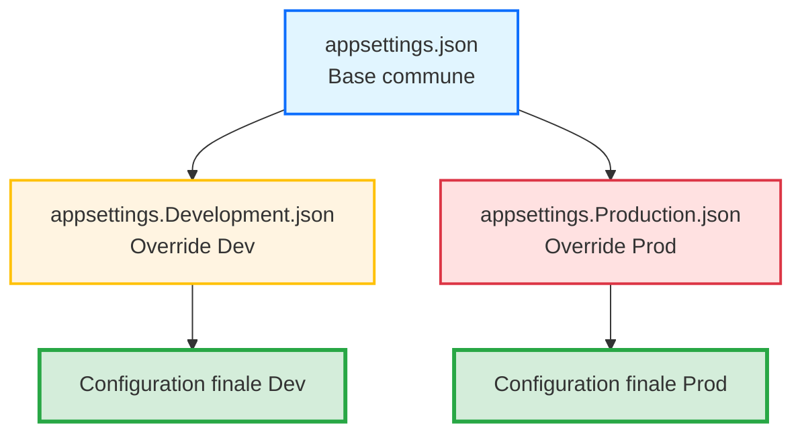

# Jour 3 - Sécuriser la Configuration et les Services

**Durée** : 6h00 (4 sessions × 1h30)  
**Objectif** : Externaliser la configuration, sécuriser les secrets et moderniser les services

---

## Session 1 - 09h00 : Externalisation de la Configuration

**Durée** : 1h30  
**Niveau** : ⭐⭐ Intermédiaire

---

### 📋 Consignes de Session

#### 📢 Ouverture de Session (2 minutes)

**Objectif** : Créer une prise de conscience du risque lié aux configurations hardcodées  
**Durée** : 2 minutes  
**Message clé** : La configuration hardcodée empêche le déploiement multi-environnements

Bonjour à tous ! Nous attaquons le Jour 3, et aujourd'hui, on va s'occuper de quelque chose de **CRITIQUE** : la configuration.

**Question interactive** : Qui a déjà vu un chemin de fichier ou un paramètre **en dur** dans le code source ?

*(La majorité des participants devrait lever la main)*

Et combien d'entre vous doivent **recompiler** l'application pour changer un simple paramètre ?

*(Moments de prise de conscience)*

C'est la réalité de beaucoup de projets legacy. **Aujourd'hui, on règle ce problème définitivement.**

On va voir comment .NET 8 permet d'externaliser TOUTE la configuration, de la rendre **modifiable sans recompilation**, et de gérer plusieurs environnements (Dev/Prod) facilement. C'est parti !

---

### 🎯 Objectifs de Performance

À la fin de cette session, vous serez capable de :
1. **Identifier** les configurations hardcodées dans un code legacy
2. **Créer** des classes Options fortement typées (POCO)
3. **Configurer** les fichiers `appsettings.json` avec hiérarchie Dev/Prod
4. **Injecter** `IOptions<T>` dans vos services via DI
5. **Tester** que l'application lit la config depuis JSON, pas du code

---

### 📊 Présentation de l'Infographie


**Guide de lecture** (suivre les numéros ①②③④⑤) :

**① AVANT (Legacy .NET Framework)**  
Configuration XML dans `App.config` → Accès via `ConfigurationManager.AppSettings["clé"]` → Pas de typage fort

**② PROBLÈME**  
Recompilation obligatoire pour chaque changement → Impossible à tester → Secrets en clair

**③ SOLUTION (.NET 8)**  
Fichier `appsettings.json` hiérarchique → Dev/Prod/Secrets avec surcharge automatique

**④ PATTERN IOptions<T>**  
Classes Options fortement typées → Injection DI → IntelliSense et mockable

**⑤ RÉSULTAT**  
Configuration modifiable sans recompilation → Testable → Multi-environnements

---

## 🧠 Concepts Fondamentaux

### De XML à JSON — La Grande Migration

#### Le Problème Legacy (.NET Framework)

Dans l'ancien monde .NET Framework, la configuration vivait dans des fichiers **XML rigides** :

**Fichier `App.config`** :
```xml
<?xml version="1.0" encoding="utf-8"?>
<configuration>
  <appSettings>
    <add key="DatabasePath" value="C:\\Databases\\ValidFlow.db" />
    <add key="MaxRetries" value="3" />
    <add key="BatchSize" value="100" />
  </appSettings>
</configuration>
```

**Accès dans le code** :
```csharp
using System.Configuration;

string dbPath = ConfigurationManager.AppSettings["DatabasePath"]; // Retourne string
int maxRetries = int.Parse(ConfigurationManager.AppSettings["MaxRetries"]); // Parse manuel
```

**⚠️ Problèmes identifiés** :

| Problème | Impact Business | Coût Estimé |
|----------|----------------|-------------|
| **Pas de typage fort** | Erreurs runtime si clé mal nommée | 2h debug/incident |
| **Accès statique** | Impossible à mocker dans les tests | -50% vélocité tests |
| **XML verbeux** | Difficile à lire et maintenir | +30% temps de config |
| **Pas d'environnements multiples** | Recompilation pour chaque env | 30 min/déploiement |

---

#### La Solution Moderne (.NET 8)

**.NET 8 utilise `Microsoft.Extensions.Configuration`** avec une approche **hiérarchique** et **fortement typée**.

**Architecture en couches (providers)** :
```
1. appsettings.json (base commune)
2. appsettings.Development.json (override pour Dev)
3. appsettings.Production.json (override pour Prod)
4. User Secrets (Dev uniquement, hors Git) ← Session 2
5. Variables d'environnement (Cloud, Docker) ← Session 4
```

**Principe clé** : Chaque couche **écrase** les valeurs précédentes. L'ordre compte !

---

#### Le Pattern IOptions<T> : Typage Fort

Au lieu de lire des chaînes brutes (`string`), on **bind** la configuration à des **classes C# (POCO)**.

**Avantages** :
- ✅ **Typage fort** : IntelliSense, vérification à la compilation
- ✅ **Testable** : On peut mocker `IOptions<T>`
- ✅ **Validation** : Data Annotations pour valider la config au démarrage
- ✅ **Injection** : Chaque service reçoit **que sa portion** de config

**Les 3 étapes du pattern** :
1. Créer une classe Options (POCO)
2. Enregistrer dans le conteneur DI (`Configure<T>`)
3. Injecter `IOptions<T>` dans les services

---

### Diagramme : Hiérarchie de Configuration



---

## 💡 L'Astuce Pratique

> **Métaphore : Le Tableau de Bord du Pilote** 🏎️
>
> Imaginez votre application comme une voiture de sport.
>
> - **Le moteur (code source)** : Il ne change jamais. C'est votre logique métier compilée.
> - **Le tableau de bord (appsettings.json)** : Ce sont les réglages du pilote. Selon le circuit (Développement, Test, Production), vous **changez les pneus, ajustez la suspension** sans reconstruire le moteur.
>
> **En Legacy .NET Framework** : Les réglages étaient gravés dans le moteur (hardcodés). Pour changer un paramètre, vous deviez démonter le moteur (recompiler).
>
> **En .NET 8** : Les réglages sont sur des écrans tactiles interchangeables (fichiers JSON). Vous swappez l'écran selon l'environnement.

**Best-Practice** : Jamais de valeur hardcodée dans le code. Toujours externaliser dans la configuration.

---

## 💬 Analyse Collective

**Question à la Salle** :

> "Pourquoi est-ce que je ne peux PAS faire ça dans mon service ?"
>
> ```csharp
> public class BatchProcessor
> {
>     public void Process()
>     {
>         var config = new ConfigurationBuilder()
>             .AddJsonFile("appsettings.json")
>             .Build();
>         
>         string path = config["BatchOptions:OutputPath"]; // ❌ Pourquoi pas ?
>     }
> }
> ```

**🎤 Instruction Formateur** :
- Posez la question
- Silence 5-8 secondes (laissez réfléchir)
- Accueillez 2-3 réponses

**Réponse attendue** :

"Parce que ça recrée un **couplage fort** avec le système de fichiers (lecture JSON à chaque appel), et ça **contourne le conteneur DI**, donc impossible à mocker dans les tests."

**✅ Principe** : La configuration doit être **injectée**, pas **créée**. Le conteneur DI charge la config UNE FOIS au démarrage.

---

## 👨‍💻 Démonstration Live

**🎯 Ce que le formateur va montrer** :

Transformation d'un service avec configuration hardcodée vers le pattern `IOptions<T>` avec `appsettings.json`.

**📂 Répertoire de Travail** : `01_Demo_Formateur/ValidFlow.Modern/`

**⏱️ Durée** : 20 minutes

---

### Étape 1 : Analyse du Code Legacy (3 min)

**Contexte** : Nous partons du code réel du projet `ValidFlow`.

**Code de départ avec configuration hardcodée** :
```csharp
public class BatchProcessor
{
    public void Process()
    {
        string outputPath = @"C:\\Output\\Reports"; // 😱 Hardcodé !
        int batchSize = 100; // 😱 Hardcodé !
        int maxRetries = 3; // 😱 Hardcodé !

        Console.WriteLine($"Traitement par lots de {batchSize} vers {outputPath}");
        Console.WriteLine($"Tentatives max : {maxRetries}");
    }
}
```

**🔍 Problèmes identifiés** :
1. ❌ Chemins Windows hardcodés → Ne fonctionne pas sur Linux
2. ❌ Pas de flexibilité → Recompilation pour changer un paramètre
3. ❌ Impossible à tester → On ne peut pas injecter des valeurs de test

---

### Étape 2 : Créer appsettings.json (3 min)

**Commande** :
```bash
cd 01_Demo_Formateur/ValidFlow.Modern/ValidFlow.Console
touch appsettings.json
```

**Contenu de `appsettings.json`** :
```json
{
  "BatchOptions": {
    "OutputPath": "Output/Reports",
    "BatchSize": 100,
    "MaxRetries": 3
  }
}
```

**💡 Point clé** : Chemin relatif `Output/Reports` (cross-platform) au lieu de `C:\\Output\\Reports` (Windows only).

---

### Étape 3 : Créer la classe Options (3 min)

**Fichier** : `ValidFlow.Infrastructure/Options/BatchOptions.cs`

```csharp
namespace ValidFlow.Infrastructure.Options;

public class BatchOptions
{
    public string OutputPath { get; set; } = string.Empty;
    public int BatchSize { get; set; }
    public int MaxRetries { get; set; }
}
```

**💡 Point clé** : Propriétés publiques avec get/set. Valeurs par défaut pour éviter les null.

---

### Étape 4 : Modifier Program.cs pour enregistrer la config (4 min)

```csharp
using Microsoft.Extensions.Configuration;
using Microsoft.Extensions.DependencyInjection;
using Microsoft.Extensions.Hosting;
using ValidFlow.Infrastructure.Options;

var builder = Host.CreateDefaultBuilder(args);

builder.ConfigureAppConfiguration((context, config) =>
{
    config.AddJsonFile("appsettings.json", optional: false, reloadOnChange: true);
});

builder.ConfigureServices((context, services) =>
{
    // ✅ Lier la section "BatchOptions" du JSON à la classe BatchOptions
    services.Configure<BatchOptions>(
        context.Configuration.GetSection("BatchOptions"));
    
    // Enregistrer le service
    services.AddTransient<BatchProcessor>();
});

var host = builder.Build();

// Test
var processor = host.Services.GetRequiredService<BatchProcessor>();
processor.Process();
```

**💡 Point clé** : `Configure<BatchOptions>()` lie automatiquement les propriétés JSON aux propriétés C#.

---

### Étape 5 : Modifier BatchProcessor pour injecter IOptions (4 min)

```csharp
using Microsoft.Extensions.Options;
using ValidFlow.Infrastructure.Options;

public class BatchProcessor
{
    private readonly BatchOptions _options;

    // ✅ Injection DI
    public BatchProcessor(IOptions<BatchOptions> options)
    {
        _options = options.Value;
    }

    public void Process()
    {
        // ✅ Plus de hardcode, lecture depuis la config
        Console.WriteLine($"Traitement par lots de {_options.BatchSize} vers {_options.OutputPath}");
        Console.WriteLine($"Tentatives max : {_options.MaxRetries}");
    }
}
```

**💡 Point clé** : `IOptions<BatchOptions>` injecté au constructeur. On récupère `.Value` une fois, on stocke dans un champ privé.

---

### Étape 6 : Exécuter et valider (3 min)

**Commande** :
```bash
dotnet run
```

**Output attendu** :
```
Traitement par lots de 100 vers Output/Reports
Tentatives max : 3
```

**✅ Résultat** : Ça fonctionne ! Maintenant, modifions `appsettings.json` sans recompiler.

**Modification** :
```json
{
  "BatchOptions": {
    "OutputPath": "Output/Reports",
    "BatchSize": 50,
    "MaxRetries": 5
  }
}
```

**Exécution** : `dotnet run` (sans recompile)

**Output** :
```
Traitement par lots de 50 vers Output/Reports
Tentatives max : 5
```

**✅ Résultat** : Changement de config sans recompiler. Exactement ce qu'on recherche.

---

**💬 Message aux stagiaires** :

> "Observez bien les étapes. Vous allez reproduire exactement la même chose dans votre dossier `02_Atelier_Stagiaires/` juste après."

---

## ⚙️ Défi d'Application

**Contexte** :

Vous héritez d'un service `EmailService` qui envoie des notifications. Actuellement, la configuration SMTP est **hardcodée** dans le constructeur.

**Code de départ** :

```csharp
public class EmailService
{
    public void SendEmail(string to, string subject, string body)
    {
        string smtpServer = "smtp.example.com"; // 😱 Hardcodé
        int smtpPort = 587; // 😱 Hardcodé
        string fromEmail = "noreply@validflow.com"; // 😱 Hardcodé

        Console.WriteLine($"Envoi email via {smtpServer}:{smtpPort} de {fromEmail} à {to}");
        Console.WriteLine($"Sujet : {subject}");
    }
}
```

**Mission** :

1. Créer une classe `EmailOptions` avec 3 propriétés : `SmtpServer` (string), `SmtpPort` (int), `FromEmail` (string)
2. Ajouter une section `"EmailOptions"` dans `appsettings.json`
3. Modifier `EmailService` pour injecter `IOptions<EmailOptions>`
4. Enregistrer la configuration dans `Program.cs`
5. Tester l'application

**📂 Répertoire de Travail** : `02_Atelier_Stagiaires/ValidFlow.Modern/`

**Durée** : 25 minutes

**Critères de Succès** :
- [ ] Classe `EmailOptions.cs` créée dans `ValidFlow.Infrastructure/Options/`
- [ ] Section `"EmailOptions"` présente dans `appsettings.json`
- [ ] `EmailService` injecte `IOptions<EmailOptions>` (pas de valeurs hardcodées)
- [ ] `Program.cs` enregistre `services.Configure<EmailOptions>(...)`
- [ ] `dotnet run` affiche : `"Envoi email via smtp.example.com:587 de noreply@validflow.com..."`

---

### 💡 Pistes de Réflexion (SCAFFOLDING)

**Pour démarrer** :
- **Création de la classe Options** : Placez-la dans `ValidFlow.Infrastructure/Options/EmailOptions.cs`. Utilisez des propriétés avec `get; set;`. Initialisez les strings à `string.Empty`.
- **Structure JSON** : Les noms de propriétés JSON doivent correspondre EXACTEMENT aux noms de propriétés C#. Utilisez la syntaxe à deux niveaux : `{ "EmailOptions": { "SmtpServer": "..." } }`.
- **Enregistrement DI** : Utilisez `services.Configure<EmailOptions>(context.Configuration.GetSection("EmailOptions"))`. Placez cet enregistrement AVANT `services.AddTransient<EmailService>()`.
- **Injection dans le constructeur** : Le paramètre doit être de type `IOptions<EmailOptions>`, pas `EmailOptions` directement. Accédez à la valeur via `.Value` : `options.Value.SmtpServer`.

**Si vous bloquez** :
- **Erreur CS0246** ("Le type 'IOptions' est introuvable") : Ajoutez `using Microsoft.Extensions.Options;`.
- **Erreur "Configuration section not found"** : Vérifiez que le nom de section JSON correspond (`"EmailOptions"` vs `GetSection("EmailOptions")`).
- **Valeur null** : Vérifiez que `appsettings.json` est bien copié dans le output (propriété du fichier : `"CopyToOutputDirectory": "PreserveNewest"`).
- **Program.cs ne trouve pas la config** : Vérifiez que `ConfigureAppConfiguration` est appelé avant `ConfigureServices`.

**Pour aller plus loin** :
- Ajoutez une propriété `EnableSsl` (bool) dans `EmailOptions` et utilisez-la dans le service
- Créez `appsettings.Development.json` avec des valeurs différentes (localhost:25) et testez

---

## 🔗 Solution Complète

La solution détaillée est disponible ici :

📂 `Solutions_A_Partager/J3_S1_Solution_09h00_Externalisation_Config.md`

**Le formateur partagera le lien après l'exercice.**

---

## ⏱️ Timing Détaillé

| Horaire | Section | Durée | Cumul |
|---------|---------|-------|-------|
| 09h00 | 📢 Ouverture de Session | 2 min | 2 min |
| 09h02 | 🧠 Concepts Fondamentaux | 15 min | 17 min |
| 09h17 | 💡 L'Astuce Pratique | 3 min | 20 min |
| 09h20 | 💬 Analyse Collective | 5 min | 25 min |
| 09h25 | 👨‍💻 Démonstration Live | 20 min | 45 min |
| 09h45 | ⚙️ Lancement Défi | 2 min | 47 min |
| 09h47 | ⚙️ Exercice (Travail) | 25 min | 72 min |
| 10h12 | 🔗 Correction Collective | 15 min | 87 min |
| 10h27 | 📝 Synthèse + Questions | 3 min | 90 min |

**Total** : 1h30 ✅

---

**Fin Session 1 - 09h00**

---

## Session 2 - 10h40 : Gestion des Secrets (Secure Coding)

*(À venir - Session suivante)*

---

## Session 3 - 13h30 : Modernisation Email avec MailKit

*(À venir)*

---

## Session 4 - 15h10 : Validation et Logging Sécurisé

*(À venir)*

---

## 📋 Checkpoint Fin de Journée

**Ce que vous avez accompli aujourd'hui** :
- [ ] Externalisation de la configuration avec `appsettings.json`
- [ ] Pattern `IOptions<T>` pour typage fort et testabilité
- [ ] Hiérarchie de configuration Dev/Prod

**Prochaine Session (Demain 09h00)** :
- Gestion des secrets avec .NET Secret Manager
- Variables d'environnement en production

---

*Document généré le 21 mars 2026*
