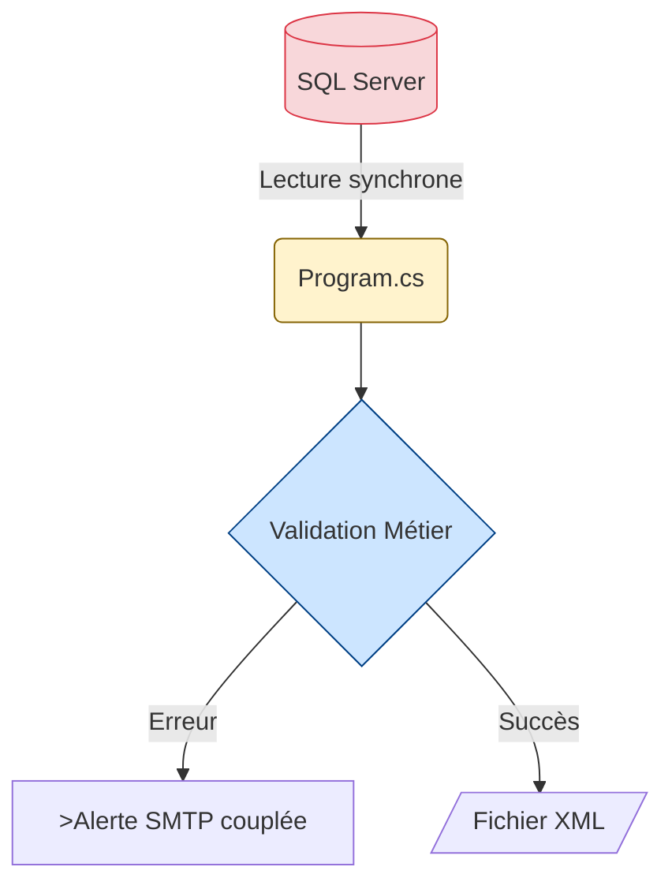

# Workbook Stagiaire - ValidFlow

## Session 09h00 : Analyse de l'existant

---

## 📥 Préparation de l'Environnement

> **⚙️ Setup Initial - À faire MAINTENANT**

Avant de commencer l'analyse, vous devez cloner le repository de formation qui contient le code legacy à auditer.

### Étapes d'Installation

**1. Créer le dossier de travail** :
```bash
cd C:\dev
```
*(Si le dossier `C:\dev` n'existe pas, créez-le d'abord : `mkdir C:\dev`)*

**2. Cloner le repository GitHub** :
```bash
git clone https://github.com/mounirelouali/net-mod-legacy-formation.git
cd net-mod-legacy-formation
```

**3. Ouvrir le projet dans Visual Studio Code** :
```bash
code .
```

**4. Explorer la structure** :
```
net-mod-legacy-formation/
├── README.md (contexte métier)
├── 00_Reference_Client/generationxml/ (code legacy client)
├── 02_Atelier_Stagiaires/ValidFlow.Legacy/ (votre code à moderniser)
└── 03_Workbooks_Stagiaires/ (vos guides)
```

> ✅ **Checkpoint** : Vous devez voir le fichier `README.md` ouvert dans VS Code avant de continuer.

---

### 🧠 1. Fondations Théoriques : La Dette Technique

Un "batch" legacy accumule de la dette technique avec le temps. Avant de refactoriser, il faut auditer le code pour prouver qu'il viole les standards modernes.

Notre application extrait des données SQL, les valide selon des règles métier, et génère un XML ou envoie un e-mail en cas d'erreur.

**Les 5 catégories d'anti-patterns à identifier :**

| Catégorie | Question clé |
|-----------|--------------|
| 🔓 **Sécurité** | Y a-t-il des secrets en clair ? |
| 🐌 **Performance** | Le code bloque-t-il le thread ? |
| 💥 **Robustesse** | Y a-t-il des gestions d'erreur ? |
| 🔧 **Maintenabilité** | Le code est-il testable ? |
| 📦 **Déploiement** | L'app est-elle portable ? |

---

### 📊 2. Modélisation du Workflow (AS-IS)



**Observation :** Tout est mélangé dans un seul fichier `Program.cs`. C'est le monolithe.

---

### 🎯 3. Votre Mission (15 min)

**Objectif :** Identifier les 5 anti-patterns critiques dans le code Legacy.

**Actions :**

1. Ouvrez le fichier `02_Atelier_Stagiaires/ValidFlow.Legacy/Start/Program.cs`.
2. Pour chaque catégorie du tableau ci-dessus, trouvez le code problématique.
3. Notez les **numéros de ligne exacts** pour chaque problème.

**Format de réponse attendu :**
```
#1 Sécurité : Ligne XX - Description du problème
#2 Performance : Ligne XX - Description du problème
...
```

---

### ✅ Checkpoint de Validation

Avant de demander la correction, vérifiez que vous avez :
- [ ] Identifié les 5 problèmes
- [ ] Noté les numéros de ligne exacts
- [ ] Compris l'impact métier de chaque problème

---

> 💡 **Correction :** Le formateur partagera le fichier de correction officiel directement dans le chat à la fin du temps imparti.
