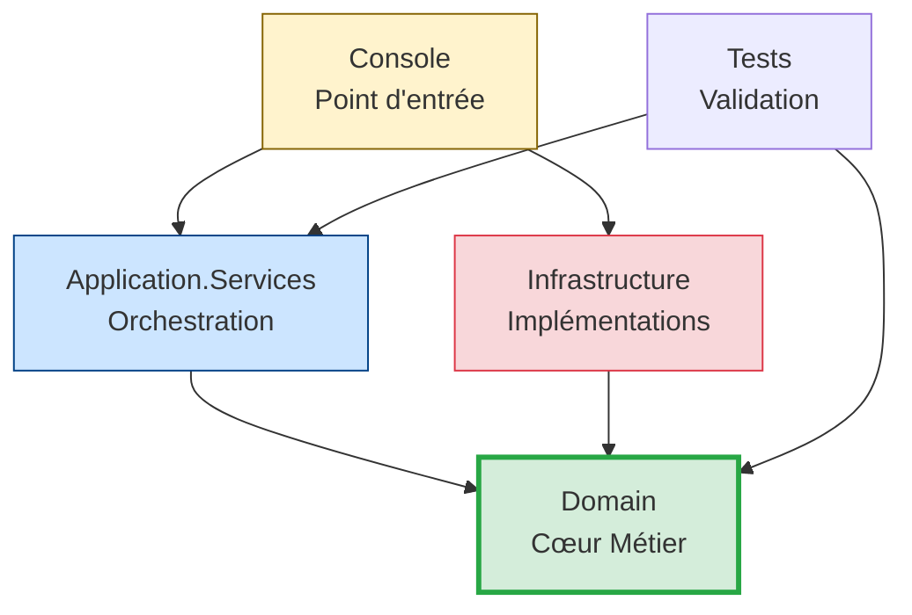

# Workbook Stagiaire - ValidFlow

## Session 10h40 : Scaffolding Clean Architecture

---

## 🎯 Objectif de la Session

Créer la **coquille vide** de l'architecture Clean Architecture pour le projet ValidFlow.Modern. À la fin de cette session, vous aurez 5 projets .NET 8 correctement référencés.

---

## 🧠 1. Fondations Théoriques : Clean Architecture

### Le Principe d'Inversion de Dépendance



**Règle d'or** : Les flèches pointent TOUJOURS vers le Domain. Le Domain ne dépend de RIEN.

### Les 5 Projets Cibles

| Projet | Rôle | Dépendances |
|--------|------|-------------|
| **ValidFlow.Domain** | Cœur métier pur (entités, interfaces) | AUCUNE |
| **ValidFlow.Infrastructure** | Implémentations (SQL, SMTP, fichiers) | Domain |
| **ValidFlow.Application.Services** | Orchestration (use cases) | Domain |
| **ValidFlow.Console** | Point d'entrée + Injection de dépendances | Infrastructure, Application.Services |
| **ValidFlow.Tests** | Tests unitaires | Domain, Application.Services |

---

## 🎯 2. Votre Mission (45 min)

### Étape 1 : Créer la Solution et le Domain

Ouvrez un terminal dans le dossier `02_Atelier_Stagiaires/` et exécutez :

```bash
cd 02_Atelier_Stagiaires
dotnet new sln -n ValidFlow.Modern
dotnet new classlib -n ValidFlow.Domain
dotnet sln add ValidFlow.Domain
```

> ❓ **Question** : Dans le projet Domain, quels packages NuGet avez-vous le droit d'installer ?  
> **Réponse** : AUCUN. Le Domain est une zone stérile. Zéro dépendance externe.

---

### Étape 2 : Créer les Couches Externes

```bash
dotnet new classlib -n ValidFlow.Infrastructure
dotnet new classlib -n ValidFlow.Application.Services
dotnet new console -n ValidFlow.Console
dotnet new xunit -n ValidFlow.Tests

dotnet sln add ValidFlow.Infrastructure
dotnet sln add ValidFlow.Application.Services
dotnet sln add ValidFlow.Console
dotnet sln add ValidFlow.Tests
```

---

### Étape 3 : Configurer les Références (CRITIQUE)

C'est ici que Clean Architecture prend forme :

```bash
# Infrastructure et Application pointent vers Domain
dotnet add ValidFlow.Infrastructure reference ValidFlow.Domain
dotnet add ValidFlow.Application.Services reference ValidFlow.Domain

# Console assemble tout (Composition Root)
dotnet add ValidFlow.Console reference ValidFlow.Infrastructure
dotnet add ValidFlow.Console reference ValidFlow.Application.Services

# Tests valident Domain et Application
dotnet add ValidFlow.Tests reference ValidFlow.Domain
dotnet add ValidFlow.Tests reference ValidFlow.Application.Services
```

> ❓ **Question** : Pourquoi le Console référence-t-il Infrastructure alors qu'il ne contient aucune logique métier ?  
> **Réponse** : Parce que le Console est le "Composition Root". C'est le seul endroit où l'on configure l'Injection de Dépendances au démarrage.

---

### Étape 4 : Valider le Build

```bash
dotnet build
```

**Résultat attendu** :
```
Build succeeded.
    0 Warning(s)
    0 Error(s)
```

---

## 📁 3. Structure Finale Attendue

```
02_Atelier_Stagiaires/
├── ValidFlow.Legacy/          (code existant - NE PAS TOUCHER)
├── ValidFlow.Modern.sln       ✅ Nouveau
├── ValidFlow.Domain/          ✅ Nouveau
├── ValidFlow.Infrastructure/  ✅ Nouveau
├── ValidFlow.Application.Services/ ✅ Nouveau
├── ValidFlow.Console/         ✅ Nouveau
└── ValidFlow.Tests/           ✅ Nouveau
```

---

## ✅ Checkpoint de Validation

Avant de demander la correction, vérifiez que vous avez :
- [ ] 5 projets créés dans la solution
- [ ] `dotnet build` réussit sans erreur
- [ ] Les références pointent vers Domain (pas l'inverse)
- [ ] Aucun package NuGet dans Domain

---

> 💡 **Correction :** Le formateur partagera le fichier de correction officiel directement dans le chat à la fin du temps imparti.
