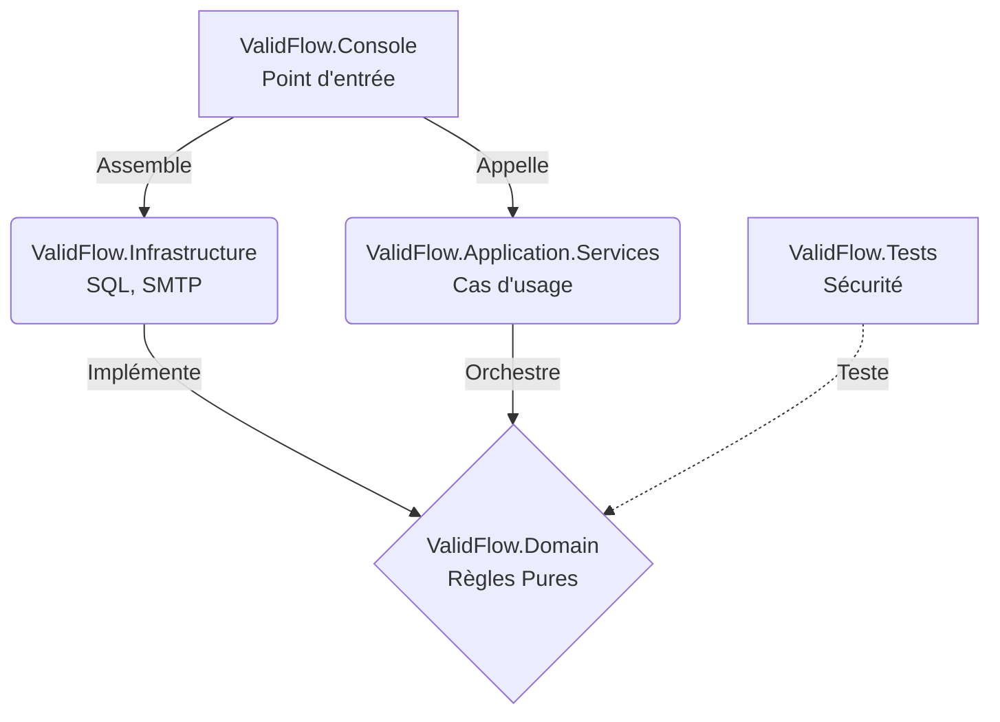

# Workbook Stagiaire - ValidFlow

## Session 10h40 : Scaffolding de la Clean Architecture

### 🧠 1. Fondations Théoriques : L'Inversion de Dépendance

Le diagnostic de notre ancien batch monolithique est sans appel : le code métier est collé à la base de données et à l'envoi d'e-mails, ce qui le rend impossible à tester et à faire évoluer.

La **Clean Architecture** résout ce problème en séparant le code en plusieurs couches (projets) avec une règle stricte : **Les dépendances pointent toujours vers l'intérieur**.

* **Le projet `Domain` (le cœur métier)** : C'est une zone stérile. Il ne doit avoir AUCUNE dépendance externe (ni SQL, ni SMTP, ni framework web). Il ne connaît que le langage C# pur.
* **Les couches externes (`Infrastructure`, `Console`)** : Elles dépendent du `Domain` pour fonctionner. L'Infrastructure s'adapte au métier, et non l'inverse.

### 📊 2. Modélisation de l'Architecture Cible (TO-BE)

Voici le schéma des dépendances que nous allons construire ensemble. Remarquez comment l'Infrastructure et les Services pointent vers le Domain.



### 🎯 3. Votre Mission : Les Étapes de la Démonstration (45 min)

À vous de jouer ! Reproduisez les étapes montrées par le formateur pour créer la coquille vide du projet `ValidFlow.Modern`.

**Étape 1 : Création de la Solution globale**

1. Ouvrez un terminal dans le dossier `02_Atelier_Stagiaires/`.
2. Créez un dossier pour la nouvelle architecture et entrez dedans :
```bash
mkdir ValidFlow.Modern
cd ValidFlow.Modern

```


3. Créez le fichier de solution globale :
```bash
dotnet new sln -n ValidFlow.Modern

```


**Étape 2 : Création des 5 projets (Les couches)**
Tapez les commandes suivantes pour générer les briques de notre architecture :

```bash
dotnet new classlib -n ValidFlow.Domain
dotnet new classlib -n ValidFlow.Infrastructure
dotnet new classlib -n ValidFlow.Application.Services
dotnet new console -n ValidFlow.Console
dotnet new xunit -n ValidFlow.Tests

```

**Étape 3 : Intégration à la Solution**
Liez ces nouveaux projets à votre fichier `.sln` :

```bash
dotnet sln add ValidFlow.Domain
dotnet sln add ValidFlow.Infrastructure
dotnet sln add ValidFlow.Application.Services
dotnet sln add ValidFlow.Console
dotnet sln add ValidFlow.Tests

```

**Étape 4 : Gestion des Dépendances (L'Inversion de Contrôle)**
C'est l'étape la plus critique. Appliquez les flèches de notre diagramme Mermaid :

1. L'Infrastructure et l'Application dépendent du Domain :
```bash
dotnet add ValidFlow.Infrastructure reference ValidFlow.Domain
dotnet add ValidFlow.Application.Services reference ValidFlow.Domain

```


2. Le point d'entrée (Console) assemble le tout au démarrage :
```bash
dotnet add ValidFlow.Console reference ValidFlow.Infrastructure
dotnet add ValidFlow.Console reference ValidFlow.Application.Services

```


**Étape 5 : Validation**
Vérifiez que toute votre coquille s'assemble correctement sans erreur :

```bash
dotnet build

```

> 💡 **Correction :** Le formateur partagera le fichier de correction officiel (contenant le script complet) directement dans le chat de la visioconférence à la fin du temps imparti.
