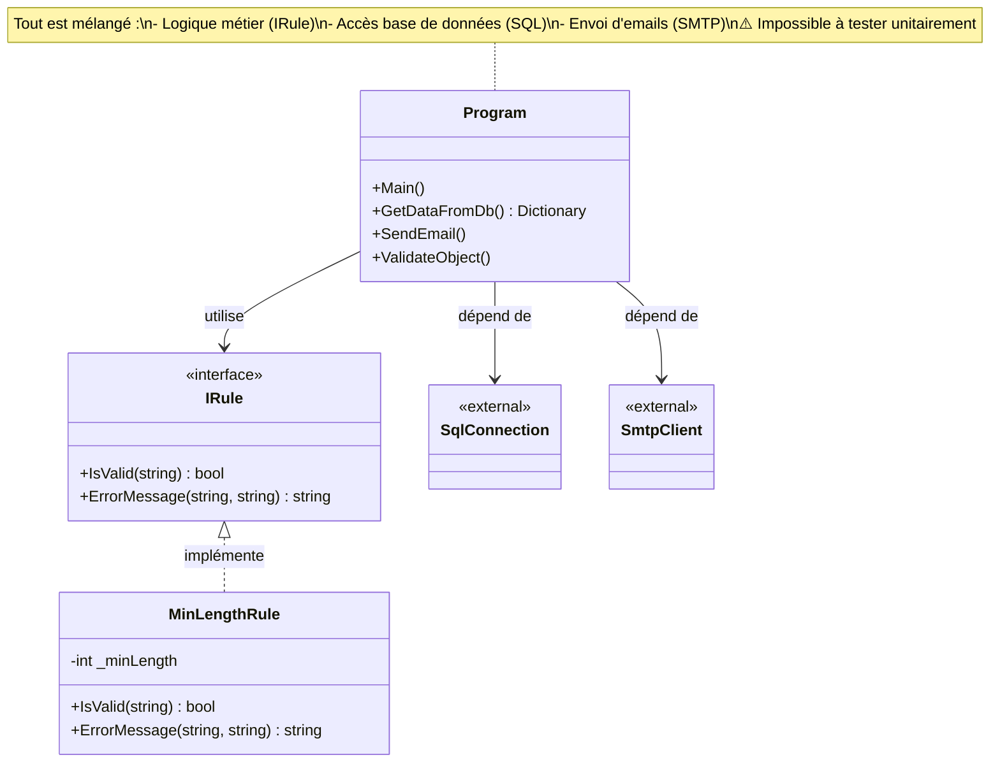
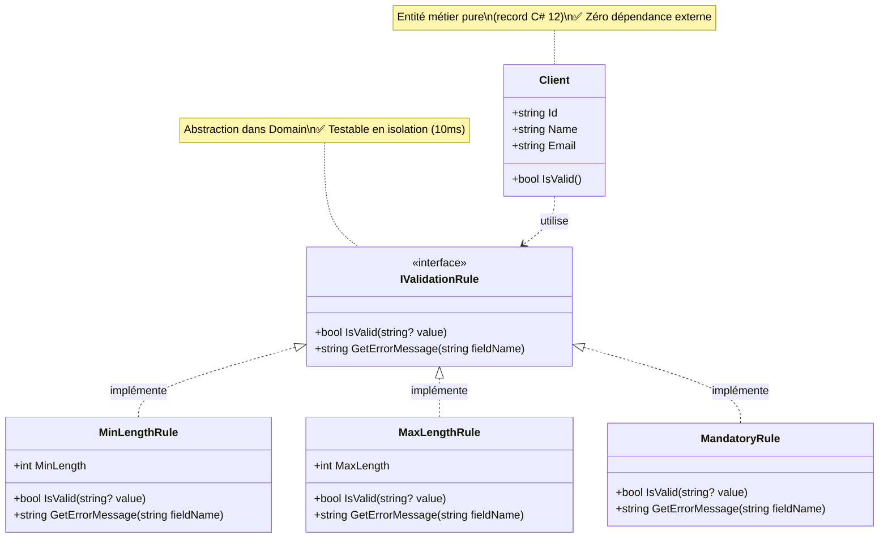

# 📘 Workbook Stagiaire - ValidFlow

## Session 13h30 : Migration du Cœur Métier vers le Projet Domain

> **🎯 Objectif de la Session**  
> Extraire l'entité `Client` et les règles de validation du code legacy vers un projet `Domain` 100% pur (zéro dépendance externe), en utilisant les fonctionnalités modernes de C# 12 (records, pattern matching).

---

## 🏝️ BLOC 1 : POURQUOI - La Métaphore de l'Île Stérile

### Le Problème du Code Legacy

Imaginez le projet Domain comme une **île stérile**. Sur cette île, rien n'entre sauf du **C# pur**. Pas de bateau SQL, pas d'avion SMTP, pas de conteneur Docker.

Le diagnostic de ce matin a révélé que notre code legacy mélange **3 mondes incompatibles** :

- 🗄️ **Base de données** (SqlConnection)
- 📧 **Envoi d'emails** (SmtpClient)  
- 🧠 **Logique métier** (IRule)

**Conséquence** : Pour tester UNE règle métier (ex: "Le nom doit avoir 2 caractères minimum"), je dois :
1. Lancer une vraie base de données SQL
2. Configurer un serveur SMTP
3. Exécuter TOUT le batch

**Résultat** : Personne n'ose tester, les bugs partent en production.

### 📊 2. Modélisation du Domain (classDiagram)

#### Diagramme 1 : L'Architecture Legacy (Le Problème)

D'abord, visualisons **pourquoi** le code legacy est impossible à tester :



**Le problème** : Pour tester UNE règle métier, je dois lancer SQL + SMTP. C'est inacceptable.

---

#### Diagramme 2 : L'Architecture Cible (La Solution)

Voici la structure que nous allons construire dans le projet `ValidFlow.Domain` :



**La solution** : Le Domain est 100% pur. Je peux tester `MinLengthRule` en 10ms sans base de données ni serveur mail.

### 🎯 3. Votre Mission : Migration du Legacy vers le Domain (45 min)

Reproduisez les étapes montrées par le formateur pour migrer les règles métier du code legacy vers votre projet `ValidFlow.Domain`.

---

**Étape 1 : Création de la structure de dossiers**

1. Ouvrez un terminal dans le dossier `02_Atelier_Stagiaires/ValidFlow.Modern/ValidFlow.Domain/`.
2. Créez les dossiers pour organiser votre Domain :

```bash
mkdir Entities
mkdir Interfaces
mkdir ValueObjects
```

3. Supprimez le fichier `Class1.cs` généré automatiquement :

```bash
del Class1.cs
```

---

**Étape 2 : Création de l'entité Client (C# 12 record)**

Créez le fichier `Entities/Client.cs` avec le contenu suivant :

```csharp
// ValidFlow.Domain/Entities/Client.cs
namespace ValidFlow.Domain.Entities;

/// <summary>
/// Entité Client - Zone stérile du Domain (aucune dépendance externe)
/// Utilise la syntaxe record C# 12 pour l'immuabilité
/// </summary>
public record Client
{
    public required string Id { get; init; }
    public required string Name { get; init; }
    public required string Email { get; init; }
    
    /// <summary>
    /// Validation métier pure - testable en isolation totale
    /// </summary>
    public bool IsValid() => 
        !string.IsNullOrWhiteSpace(Name) && 
        Name.Length >= 2 &&
        Email.Contains('@');
}
```

> 💡 **C# 12** : Le mot-clé `required` garantit que les propriétés sont initialisées. Le mot-clé `init` rend l'objet immuable après création.

---

**Étape 3 : Création de l'interface IValidationRule**

Créez le fichier `Interfaces/IValidationRule.cs` :

```csharp
// ==========================================================================================
// FICHIER : ValidFlow.Domain/Interfaces/IValidationRule.cs
// ==========================================================================================

// Déclaration de l'espace de noms (namespace) selon la syntaxe moderne (C# 10+).
// Tout le code qui suit dans ce fichier appartiendra à "ValidFlow.Domain.Interfaces".
namespace ValidFlow.Domain.Interfaces;

/* Le "Contrat" de base. Toute règle de validation devra obligatoirement 
 * implémenter ces deux méthodes pour être considérée comme une "IValidationRule".
 */
public interface IValidationRule
{
    // Le '?' après 'string' est une fonctionnalité de C# 8 (Nullable Reference Types).
    // Il indique explicitement que la variable 'value' a le droit d'être 'null'.
    // Cela force le développeur qui code la règle à gérer le cas où la valeur n'existe pas.
    bool IsValid(string? value);
    
    // Méthode qui renverra le message d'erreur si IsValid a retourné 'false'.
    string GetErrorMessage(string fieldName);
}
```

---

**Étape 4 : Implémentation des règles de validation (Pattern Matching)**

Créez le fichier `ValueObjects/MinLengthRule.cs` :

```csharp
// ==========================================================================================
// FICHIER : ValidFlow.Domain/ValueObjects/MinLengthRule.cs
// ==========================================================================================

namespace ValidFlow.Domain.ValueObjects;

using ValidFlow.Domain.Interfaces;

/* Un "record" en C# (depuis C# 9) est une classe spéciale optimisée pour représenter des données.
 * Il est IMMUABLE par défaut : une fois créé, on ne peut plus modifier "MinLength".
 * La syntaxe "(int MinLength)" est un constructeur "positionnel".
 * Le compilateur va automatiquement créer une propriété "MinLength" en lecture seule.
 * Le ":" signifie que ce record implémente l'interface "IValidationRule".
 */
public record MinLengthRule(int MinLength) : IValidationRule
{
    /* Implémentation de la méthode IsValid de l'interface.
     * On utilise ici une expression "switch" (introduite dans C# 8), qui est 
     * beaucoup plus puissante et concise qu'une suite de "if / else if / else".
     * L'opérateur "=>" (expression-bodied member) signifie "cette méthode retourne le résultat de ce switch".
     */
    public bool IsValid(string? value) => value switch
    {
        // CAS 1 : Si la chaîne de caractères est 'null' OU si elle est vide ("").
        // On retourne immédiatement 'false' (la règle n'est pas respectée).
        null or "" => false,

        // CAS 2 : Le "Property Pattern Matching" (Filtrage par motif de propriété).
        // Si 'value' n'est pas null, on va regarder sa propriété "Length".
        // "{ Length: var len }" veut dire : "Prends la valeur de value.Length et mets-la dans une variable temporaire 'len'".
        // "when len >= MinLength" est une condition supplémentaire (une garde) : "...et vérifie que 'len' est supérieur ou égal au minimum requis".
        // Si tout ça est vrai, on retourne 'true'.
        { Length: var len } when len >= MinLength => true,

        // CAS 3 : Le cas par défaut (le "default" d'un switch classique).
        // L'underscore "_" (discard) signifie "pour tout ce qui n'a pas été intercepté par les cas précédents".
        // Ici, cela capture les chaînes de caractères qui sont valides (ni nulles, ni vides) mais dont la longueur est inférieure à MinLength.
        _ => false
    };
    
    /* Le signe '$' avant les guillemets permet de faire de l'"Interpolation de chaîne".
     * Cela permet d'insérer directement des variables entre accolades { } dans le texte, 
     * au lieu de faire de la concaténation "texte" + variable + "texte".
     */
    public string GetErrorMessage(string fieldName) => 
        $"Le champ '{fieldName}' doit contenir au moins {MinLength} caractères.";
}
```

Créez le fichier `ValueObjects/MandatoryRule.cs` :

```csharp
// ==========================================================================================
// FICHIER : ValidFlow.Domain/ValueObjects/MandatoryRule.cs
// ==========================================================================================

namespace ValidFlow.Domain.ValueObjects;

using ValidFlow.Domain.Interfaces;

/* Règle de champ obligatoire - Démonstration de l'opérateur 'is not' de C# 9
 * Cette règle est plus simple car elle n'a pas de paramètre (pas de longueur minimum à gérer).
 */
public record MandatoryRule : IValidationRule
{
    // L'opérateur 'is not' permet d'inverser la logique de pattern matching.
    // Ici : "la valeur est valide SI elle n'est PAS (null ou vide)".
    public bool IsValid(string? value) => value is not (null or "");
    
    public string GetErrorMessage(string fieldName) => 
        $"Le champ '{fieldName}' est obligatoire.";
}
```

---

**Étape 5 : Création des tests unitaires (Le Filet de Sécurité)**

> 💡 **Pourquoi tester ?** Un test unitaire est un programme qui vérifie automatiquement qu'une partie de votre code fonctionne correctement. C'est votre filet de sécurité : si vous modifiez le code et cassez quelque chose, le test devient rouge immédiatement.

---

**5.1 - Test de l'entité Client**

Dans le projet `ValidFlow.Tests/`, créez le fichier `ClientTests.cs` :

```csharp
// ==========================================================================================
// FICHIER : ValidFlow.Tests/ClientTests.cs
// ==========================================================================================

// Déclaration du namespace (espace de noms) pour organiser le code
namespace ValidFlow.Tests;

// Import des classes nécessaires
using ValidFlow.Domain.Entities;  // Pour accéder à la classe Client
using Xunit;                       // Framework de test unitaire (comme NUnit ou MSTest)

// Classe de tests pour l'entité Client
public class ClientTests
{
    // Premier test : vérifier qu'un client VALIDE est bien détecté comme valide
    // [Fact] signifie "test simple qui s'exécute une seule fois"
    [Fact]
    public void Client_WithValidData_ShouldBeValid()
    {
        // ARRANGE (Préparation) : Je crée un client avec des données correctes
        var client = new Client 
        { 
            Id = "CLT-001",                 // ID correct
            Name = "Acme Corporation",      // Nom >= 2 caractères ✓
            Email = "contact@acme.com"      // Email contient '@' ✓
        };
        
        // ACT (Action) : J'appelle la méthode IsValid()
        // ASSERT (Vérification) : Je vérifie que le résultat est TRUE
        Assert.True(client.IsValid());
        // Si IsValid() retourne FALSE, le test échoue (devient rouge)
    }
    
    // Deuxième test : vérifier qu'un client INVALIDE est bien détecté comme invalide
    // [Theory] signifie "test paramétré qui s'exécute PLUSIEURS fois avec des données différentes"
    // Chaque [InlineData] va lancer le test une fois avec les valeurs indiquées
    [Theory]
    [InlineData("", "test@email.com")]           // CAS 1 : Nom vide (invalide)
    [InlineData("A", "test@email.com")]          // CAS 2 : Nom trop court (1 caractère, min=2)
    [InlineData("Acme", "invalid-email")]        // CAS 3 : Email sans '@' (invalide)
    public void Client_WithInvalidData_ShouldBeInvalid(string name, string email)
    {
        // ARRANGE : Je crée un client avec les données passées en paramètre
        // Ces données viennent des [InlineData] au-dessus
        var client = new Client 
        { 
            Id = "CLT-001",     // L'ID est toujours valide
            Name = name,        // Le nom vient du paramètre (vide, "A", ou "Acme")
            Email = email       // L'email vient du paramètre
        };
        
        // ACT & ASSERT : Je vérifie que le client est détecté comme INVALIDE
        Assert.False(client.IsValid());
        // Si IsValid() retourne TRUE (alors qu'il devrait retourner FALSE), le test échoue
    }
}
```

---

**5.2 - Tests des règles de validation**

Créez le fichier `ValidationRulesTests.cs` pour tester les règles MinLengthRule, MaxLengthRule et MandatoryRule :

```csharp
// ==========================================================================================
// FICHIER : ValidFlow.Tests/ValidationRulesTests.cs
// ==========================================================================================

namespace ValidFlow.Tests;

using ValidFlow.Domain.ValueObjects;
using Xunit;

// Classe de tests pour la règle MinLengthRule
public class MinLengthRuleTests
{
    [Fact]
    public void IsValid_WithNullValue_ShouldReturnFalse()
    {
        // ARRANGE : Je crée une règle qui exige minimum 2 caractères
        var rule = new MinLengthRule(MinLength: 2);
        
        // ACT : Je teste avec une valeur NULL
        bool result = rule.IsValid(null);
        
        // ASSERT : NULL ne doit PAS passer la validation (retourne FALSE)
        Assert.False(result);
        // Ce test vérifie aussi que le code ne plante PAS avec une NullReferenceException
    }
    
    // [Theory] permet de tester PLUSIEURS scénarios d'un coup
    [Theory]
    [InlineData("", false)]           // CAS 1 : Chaîne vide → invalide
    [InlineData("A", false)]          // CAS 2 : 1 caractère (< 2) → invalide
    [InlineData("AB", true)]          // CAS 3 : Exactement 2 caractères → VALIDE
    [InlineData("ABC", true)]         // CAS 4 : Plus de 2 caractères → VALIDE
    public void IsValid_WithVariousLengths_ShouldReturnExpectedResult(
        string value,      // La valeur à tester
        bool expected)     // Le résultat attendu (true ou false)
    {
        // ARRANGE
        var rule = new MinLengthRule(MinLength: 2);
        
        // ACT
        bool result = rule.IsValid(value);
        
        // ASSERT : Je compare le résultat obtenu avec le résultat attendu
        Assert.Equal(expected, result);
        // Si result != expected, le test échoue
    }
    
    [Fact]
    public void GetErrorMessage_ShouldReturnFormattedMessage()
    {
        // ARRANGE
        var rule = new MinLengthRule(MinLength: 3);
        
        // ACT : Je récupère le message d'erreur pour le champ "Nom"
        string message = rule.GetErrorMessage("Nom");
        
        // ASSERT : Je vérifie que le message contient bien les bonnes informations
        Assert.Equal("Le champ 'Nom' doit contenir au moins 3 caractères.", message);
    }
}

// Classe de tests pour la règle MaxLengthRule
public class MaxLengthRuleTests
{
    [Theory]
    [InlineData(null, true)]          // NULL est autorisé (champ optionnel)
    [InlineData("", true)]            // Chaîne vide autorisée
    [InlineData("AB", true)]          // 2 caractères (< 10) → VALIDE
    [InlineData("ABCDEFGHIJ", true)]  // Exactement 10 caractères → VALIDE
    [InlineData("ABCDEFGHIJK", false)] // 11 caractères (> 10) → INVALIDE
    public void IsValid_WithVariousLengths_ShouldReturnExpectedResult(
        string value, 
        bool expected)
    {
        // ARRANGE : Règle qui autorise maximum 10 caractères
        var rule = new MaxLengthRule(MaxLength: 10);
        
        // ACT
        bool result = rule.IsValid(value);
        
        // ASSERT
        Assert.Equal(expected, result);
    }
    
    [Fact]
    public void GetErrorMessage_ShouldReturnFormattedMessage()
    {
        // ARRANGE
        var rule = new MaxLengthRule(MaxLength: 50);
        
        // ACT
        string message = rule.GetErrorMessage("Email");
        
        // ASSERT
        Assert.Equal("Le champ 'Email' ne doit pas dépasser 50 caractères.", message);
    }
}

// Classe de tests pour la règle MandatoryRule (champ obligatoire)
public class MandatoryRuleTests
{
    [Theory]
    [InlineData(null, false)]         // NULL → INVALIDE (champ obligatoire)
    [InlineData("", false)]           // Chaîne vide → INVALIDE
    [InlineData("   ", true)]         // Espaces (la règle ne vérifie que null/vide)
    [InlineData("Valeur", true)]      // Valeur présente → VALIDE
    public void IsValid_WithVariousValues_ShouldReturnExpectedResult(
        string value, 
        bool expected)
    {
        // ARRANGE
        var rule = new MandatoryRule();
        
        // ACT
        bool result = rule.IsValid(value);
        
        // ASSERT
        Assert.Equal(expected, result);
    }
    
    [Fact]
    public void GetErrorMessage_ShouldReturnFormattedMessage()
    {
        // ARRANGE
        var rule = new MandatoryRule();
        
        // ACT
        string message = rule.GetErrorMessage("Email");
        
        // ASSERT
        Assert.Equal("Le champ 'Email' est obligatoire.", message);
    }
}
```

> 💡 **Comprendre la structure Arrange-Act-Assert (AAA)**
> - **Arrange** : Je prépare les données (créer un objet, définir des variables)
> - **Act** : J'exécute l'action à tester (appeler une méthode)
> - **Assert** : Je vérifie que le résultat est celui attendu

> 💡 **[Fact] vs [Theory]**
> - **[Fact]** : Test simple qui s'exécute 1 fois
> - **[Theory]** : Test paramétré qui s'exécute N fois (1 fois par [InlineData])

---

**Étape 6 : Ajout de la référence de projet (CRITIQUE)**

> ⚠️ **Avant de lancer les tests**, le projet `ValidFlow.Tests` doit référencer `ValidFlow.Domain`.

1. Ajoutez la référence du projet `Domain` au projet `Tests` :

```bash
cd 02_Atelier_Stagiaires/ValidFlow.Modern/ValidFlow.Tests
dotnet add reference ../ValidFlow.Domain/ValidFlow.Domain.csproj
```

2. Vérifiez que le fichier `.csproj` contient maintenant la référence :

```xml
<!-- ValidFlow.Tests.csproj -->
<ItemGroup>
  <ProjectReference Include="..\ValidFlow.Domain\ValidFlow.Domain.csproj" />
</ItemGroup>
```

3. Exécutez les tests pour valider votre travail :

```bash
dotnet test
```

**Résultat attendu :**
```
Passed!  - Failed:     0, Passed:     2, Skipped:     0, Total:     2, Duration: < 100 ms
```

---

### ✅ Critères de Succès

- [ ] Le projet `ValidFlow.Domain` n'a **aucun package NuGet** (vérifiez le `.csproj`)
- [ ] L'entité `Client` utilise la syntaxe **record C# 12**
- [ ] Les règles de validation utilisent le **Pattern Matching**
- [ ] `dotnet test` passe au **vert** en moins de **100ms**

---

> 💡 **Correction :** Le formateur partagera le fichier de correction officiel directement dans le chat à la fin du temps imparti.
