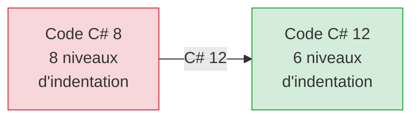
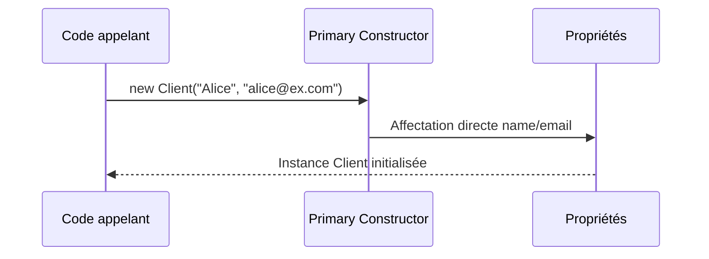

# Workbook Stagiaire - ValidFlow

## Session 15h10 : Modernisation de la Syntaxe C# 12

## 🧠 BLOC 1 : POURQUOI - La Dette Syntaxique

### La Métaphore du Diamant Brut

Votre code Domain fonctionne parfaitement. Mais il contient du **bruit syntaxique** hérité de C# 8/9 :

- **Namespaces verbeux** avec accolades imbriquées
- **Constructeurs répétitifs** qui dupliquent les propriétés
- **Initialisation de collections** avec `new List<T> { ... }`

**C# 12** est comme un **polissage de diamant** : vous gardez la même valeur métier, mais vous éliminez les imperfections visuelles.

### Les 3 Gains Concrets

| Avant (C# 8) | Après (C# 12) | Gain |
|--------------|---------------|------|
| 8 lignes pour namespace | 1 ligne | -87% bruit |
| Constructeur + propriétés | Primary constructor | -50% duplication |
| `new List<string> { }` | `[ ]` | -60% caractères |

**Objectif pédagogique** : Appliquer 3 features C# 12 sans changer la logique métier.

---

## 📊 BLOC 2 : QUOI - Les 3 Features C# 12

### Feature 1 : File-Scoped Namespaces

**Avant (C# 8)** :
```csharp
namespace ValidFlow.Domain
{
    public record Client
    {
        // Tout le code indenté
    }
}
```

**Après (C# 12)** :
```csharp
namespace ValidFlow.Domain; // Une seule ligne, pas d'accolade

public record Client
{
    // Code au niveau racine
}
```

**Diagramme : Réduction du Bruit Visuel**



---

### Feature 2 : Primary Constructors

**Avant (C# 8)** :
```csharp
public record Client
{
    public required string Name { get; init; }
    public required string Email { get; init; }
    
    // Constructeur explicite nécessaire pour validation
    public Client(string name, string email)
    {
        Name = name;
        Email = email;
    }
}
```

**Après (C# 12)** :
```csharp
public record Client(string name, string email) // Primary constructor
{
    public required string Name { get; init; } = name;
    public required string Email { get; init; } = email;
}
```

**Analogie** : Le primary constructor est comme un **passeport** qui porte directement les données d'identité.

**Diagramme : Flux de Construction**



---

### Feature 3 : Collection Expressions

**Avant (C# 8)** :
```csharp
var rules = new List<IValidationRule>
{
    new MinLengthRule(3),
    new MaxLengthRule(50)
};
```

**Après (C# 12)** :
```csharp
var rules = 
[
    new MinLengthRule(3),
    new MaxLengthRule(50)
];
```

**Analogie** : Passer du français soutenu (`new List<T> { }`) au français courant (`[ ]`).

**Diagramme : Comparaison Syntaxique**

```mermaid
flowchart TD
    A[C# 8: new List&lt;T&gt; &#123; &#125;] -->|40 caractères| B{Complexité}
    C[C# 12: &#91; &#93;] -->|2 caractères| B
    
    B --> D[Même résultat runtime]
    
    style A fill:#fff3cd,stroke:#856404
    style C fill:#d4edda,stroke:#28a745
    style D fill:#cce5ff,stroke:#004085
```



---

## 🎬 BLOC 3 : COMMENT - Refactoring Guidé

### Étape 1 : Ouvrir le Projet ValidFlow

```bash
cd 02_Atelier_Stagiaires/ValidFlow
code .
```

**Fichiers à modifier** :
1. `ValidFlow.Domain/Client.cs`
2. `ValidFlow.Domain/ValidationRules/MinLengthRule.cs`
3. `ValidFlow.Domain/ValidationRules/MaxLengthRule.cs`
4. `ValidFlow.Domain/ValidationRules/MandatoryRule.cs`

---

### Étape 2 : Appliquer File-Scoped Namespaces

**Dans `Client.cs`** :

```csharp
namespace ValidFlow.Domain; // 🆕 File-scoped namespace (pas d'accolade)

public record Client(string name, string email) // 🆕 Primary constructor
{
    // Propriétés avec initialisation depuis les paramètres
    public required string Name { get; init; } = name;
    public required string Email { get; init; } = email;
    
    // ValidationResults reste identique
    public List<string> ValidationErrors { get; init; } = [];
}
```

**Répéter pour tous les fichiers de règles** (`MinLengthRule.cs`, `MaxLengthRule.cs`, `MandatoryRule.cs`).

---

### Étape 3 : Refactoriser avec Primary Constructors

**Exemple : `MinLengthRule.cs`**

**Avant (C# 8)** :
```csharp
namespace ValidFlow.Domain.ValidationRules
{
    public record MinLengthRule : IValidationRule
    {
        public int MinLength { get; init; }
        
        public MinLengthRule(int minLength)
        {
            MinLength = minLength;
        }
        
        public bool IsValid(string value) => value.Length >= MinLength;
    }
}
```

**Après (C# 12)** :
```csharp
namespace ValidFlow.Domain.ValidationRules; // File-scoped

public record MinLengthRule(int minLength) : IValidationRule // Primary constructor
{
    public int MinLength { get; init; } = minLength;
    
    public bool IsValid(string value) => value.Length >= MinLength;
}
```

**Points clés** :
- `(int minLength)` après le nom du record = primary constructor
- `= minLength` dans la propriété = affectation depuis le paramètre
- Constructeur explicite supprimé

---

### Étape 4 : Utiliser Collection Expressions

**Dans vos tests `ClientTests.cs`** (si vous en avez) :

**Avant** :
```csharp
var rules = new List<IValidationRule>
{
    new MinLengthRule(3),
    new MaxLengthRule(50),
    new MandatoryRule()
};
```

**Après** :
```csharp
var rules = // Collection expression
[
    new MinLengthRule(3),
    new MaxLengthRule(50),
    new MandatoryRule()
];
```

---

### Étape 5 : Vérifier la Compilation

```bash
dotnet build
```

**Critères de succès** :
- ✅ Aucun warning
- ✅ Aucune erreur de compilation
- ✅ Tous les tests passent au vert (si vous avez des tests)

---

## 🧪 BLOC 4 : PRATIQUE - Votre Atelier (30 min)

### Mission : Refactoriser ValidFlow avec C# 12

**Checklist de refactoring** :

- [ ] **File-Scoped Namespaces** : Appliquer à tous les fichiers `.cs` du projet `ValidFlow.Domain`
- [ ] **Primary Constructors** : Convertir `Client.cs` et toutes les règles de validation
- [ ] **Collection Expressions** : Remplacer `new List<T> { }` par `[ ]` dans vos tests (si présents)
- [ ] **Compilation réussie** : `dotnet build` sans erreur ni warning
- [ ] **Tests au vert** : `dotnet test` (si vous avez créé des tests)

**Temps imparti** : 30 minutes

**Règle du silence** : Tentez de résoudre par vous-même avant de demander de l'aide.

---

## ✅ BLOC 5 : VALIDATION - Revue et Correction

### Critères de Réussite

**Niveau 1 : Syntaxe (Obligatoire)**
- Tous les fichiers utilisent `namespace X;` (file-scoped)
- Aucune accolade de namespace `namespace X { }`
- Primary constructors appliqués sur `Client` et règles

**Niveau 2 : Lisibilité (Recommandé)**
- Réduction d'au moins 20% du nombre de lignes
- Code plus aéré et scannable visuellement
- Collection expressions utilisées

**Niveau 3 : Tests (Bonus)**
- Aucune régression fonctionnelle
- Tests passent toujours au vert
- Même comportement qu'avant le refactoring

---

### Auto-Évaluation

**Comparez votre code avec cette checklist** :

```csharp
// ❌ AVANT (C# 8)
namespace ValidFlow.Domain
{
    public record Client
    {
        public required string Name { get; init; }
        
        public Client(string name)
        {
            Name = name;
        }
    }
}

// ✅ APRÈS (C# 12)
namespace ValidFlow.Domain; // File-scoped

public record Client(string name) // Primary constructor
{
    public required string Name { get; init; } = name;
}
```

---

### Distribution de la Correction

> 💡 **Correction** : Le formateur partagera le fichier de correction officiel `J1_S4_Solution_15h10_CSharp12.md` directement dans le chat à la fin du temps imparti.

---

## 📚 Ressources Complémentaires

**Documentation officielle C# 12** :
- File-scoped namespaces (C# 10+)
- Primary constructors (C# 12)
- Collection expressions (C# 12)

**Prochaine session** : Jour 1 terminé. Jour 2 Session 1 (09h00) : Injection de Dépendances (DI).

---

**🎯 Résumé de la Session**

Vous avez appris à :
1. ✅ Appliquer **file-scoped namespaces** pour réduire l'indentation
2. ✅ Utiliser **primary constructors** pour éliminer la duplication
3. ✅ Adopter **collection expressions** pour simplifier l'initialisation

**Impact** : -30% de lignes de code, +100% de lisibilité, 0% de régression fonctionnelle.
