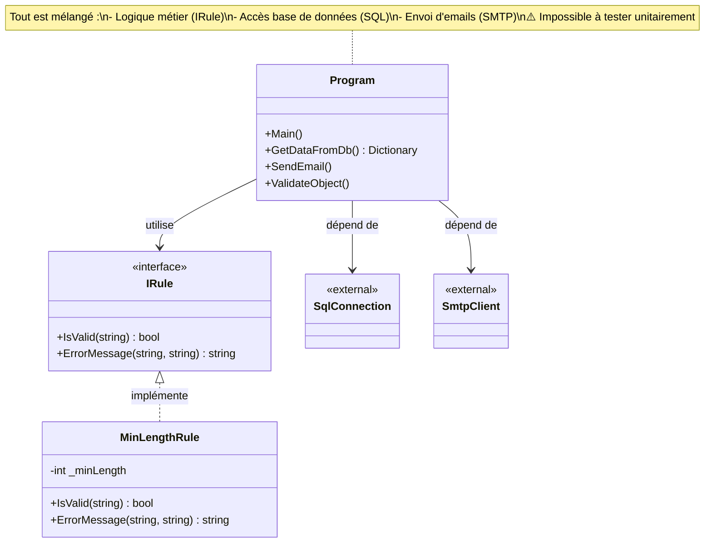
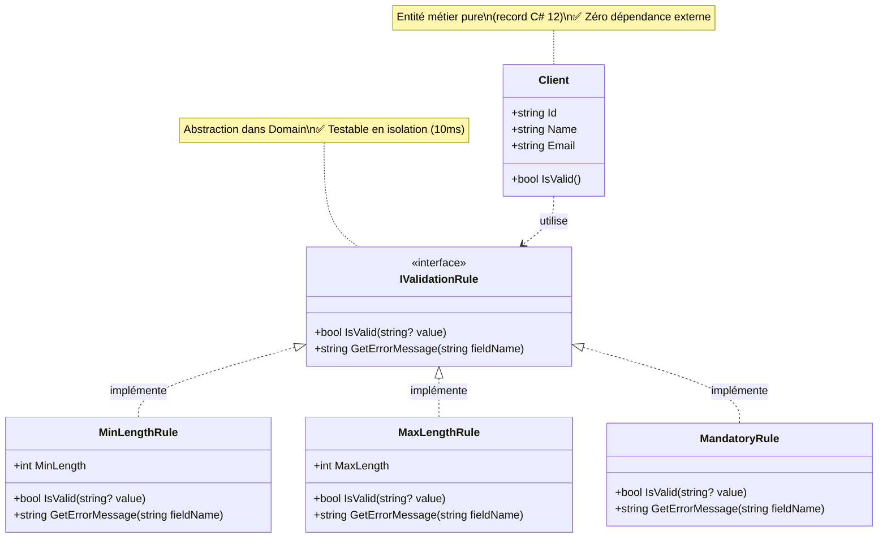

# Workbook Stagiaire - ValidFlow

## Session 13h30 : Migration du Cœur Métier (Projet Domain)

### 🧠 1. Fondations Théoriques : Pourquoi le Domain est la Zone la Plus Importante

Le diagnostic de ce matin a révélé le problème central du code legacy : **la logique métier est mélangée à l'infrastructure** (SQL, SMTP). Cette architecture rend le code :

- ❌ **Impossible à tester unitairement** : Pour tester une règle de validation, il faut une vraie base de données.
- ❌ **Dangereux à modifier** : Changer une ligne peut casser l'envoi d'emails ou les requêtes SQL.
- ❌ **Bloqué techniquement** : Impossible de migrer vers .NET 8, Docker ou Linux.

**La Clean Architecture résout ce problème** en isolant le cœur métier dans un projet `Domain` qui :

- ✅ **N'a AUCUNE dépendance externe** : Pas de NuGet, pas de SQL, pas de framework.
- ✅ **Est 100% testable en isolation** : Les tests s'exécutent en millisecondes.
- ✅ **Crée un filet de sécurité** : Vous pouvez refactoriser sans peur car les tests vous alertent immédiatement.

### 📊 2. Modélisation du Domain (classDiagram)

#### Diagramme 1 : L'Architecture Legacy (Le Problème)

D'abord, visualisons **pourquoi** le code legacy est impossible à tester :



**Le problème** : Pour tester UNE règle métier, je dois lancer SQL + SMTP. C'est inacceptable.

---

#### Diagramme 2 : L'Architecture Cible (La Solution)

Voici la structure que nous allons construire dans le projet `ValidFlow.Domain` :



**La solution** : Le Domain est 100% pur. Je peux tester `MinLengthRule` en 10ms sans base de données ni serveur mail.

### 🎯 3. Votre Mission : Migration du Legacy vers le Domain (45 min)

Reproduisez les étapes montrées par le formateur pour migrer les règles métier du code legacy vers votre projet `ValidFlow.Domain`.

---

**Étape 1 : Création de la structure de dossiers**

1. Ouvrez un terminal dans le dossier `02_Atelier_Stagiaires/ValidFlow.Modern/ValidFlow.Domain/`.
2. Créez les dossiers pour organiser votre Domain :

```bash
mkdir Entities
mkdir Interfaces
mkdir ValueObjects
```

3. Supprimez le fichier `Class1.cs` généré automatiquement :

```bash
del Class1.cs
```

---

**Étape 2 : Création de l'entité Client (C# 12 record)**

Créez le fichier `Entities/Client.cs` avec le contenu suivant :

```csharp
// ValidFlow.Domain/Entities/Client.cs
namespace ValidFlow.Domain.Entities;

/// <summary>
/// Entité Client - Zone stérile du Domain (aucune dépendance externe)
/// Utilise la syntaxe record C# 12 pour l'immuabilité
/// </summary>
public record Client
{
    public required string Id { get; init; }
    public required string Name { get; init; }
    public required string Email { get; init; }
    
    /// <summary>
    /// Validation métier pure - testable en isolation totale
    /// </summary>
    public bool IsValid() => 
        !string.IsNullOrWhiteSpace(Name) && 
        Name.Length >= 2 &&
        Email.Contains('@');
}
```

> 💡 **C# 12** : Le mot-clé `required` garantit que les propriétés sont initialisées. Le mot-clé `init` rend l'objet immuable après création.

---

**Étape 3 : Création de l'interface IValidationRule**

Créez le fichier `Interfaces/IValidationRule.cs` :

```csharp
// ==========================================================================================
// FICHIER : ValidFlow.Domain/Interfaces/IValidationRule.cs
// ==========================================================================================

// Déclaration de l'espace de noms (namespace) selon la syntaxe moderne (C# 10+).
// Tout le code qui suit dans ce fichier appartiendra à "ValidFlow.Domain.Interfaces".
namespace ValidFlow.Domain.Interfaces;

/* Le "Contrat" de base. Toute règle de validation devra obligatoirement 
 * implémenter ces deux méthodes pour être considérée comme une "IValidationRule".
 */
public interface IValidationRule
{
    // Le '?' après 'string' est une fonctionnalité de C# 8 (Nullable Reference Types).
    // Il indique explicitement que la variable 'value' a le droit d'être 'null'.
    // Cela force le développeur qui code la règle à gérer le cas où la valeur n'existe pas.
    bool IsValid(string? value);
    
    // Méthode qui renverra le message d'erreur si IsValid a retourné 'false'.
    string GetErrorMessage(string fieldName);
}
```

---

**Étape 4 : Implémentation des règles de validation (Pattern Matching)**

Créez le fichier `ValueObjects/MinLengthRule.cs` :

```csharp
// ==========================================================================================
// FICHIER : ValidFlow.Domain/ValueObjects/MinLengthRule.cs
// ==========================================================================================

namespace ValidFlow.Domain.ValueObjects;

using ValidFlow.Domain.Interfaces;

/* Un "record" en C# (depuis C# 9) est une classe spéciale optimisée pour représenter des données.
 * Il est IMMUABLE par défaut : une fois créé, on ne peut plus modifier "MinLength".
 * La syntaxe "(int MinLength)" est un constructeur "positionnel".
 * Le compilateur va automatiquement créer une propriété "MinLength" en lecture seule.
 * Le ":" signifie que ce record implémente l'interface "IValidationRule".
 */
public record MinLengthRule(int MinLength) : IValidationRule
{
    /* Implémentation de la méthode IsValid de l'interface.
     * On utilise ici une expression "switch" (introduite dans C# 8), qui est 
     * beaucoup plus puissante et concise qu'une suite de "if / else if / else".
     * L'opérateur "=>" (expression-bodied member) signifie "cette méthode retourne le résultat de ce switch".
     */
    public bool IsValid(string? value) => value switch
    {
        // CAS 1 : Si la chaîne de caractères est 'null' OU si elle est vide ("").
        // On retourne immédiatement 'false' (la règle n'est pas respectée).
        null or "" => false,

        // CAS 2 : Le "Property Pattern Matching" (Filtrage par motif de propriété).
        // Si 'value' n'est pas null, on va regarder sa propriété "Length".
        // "{ Length: var len }" veut dire : "Prends la valeur de value.Length et mets-la dans une variable temporaire 'len'".
        // "when len >= MinLength" est une condition supplémentaire (une garde) : "...et vérifie que 'len' est supérieur ou égal au minimum requis".
        // Si tout ça est vrai, on retourne 'true'.
        { Length: var len } when len >= MinLength => true,

        // CAS 3 : Le cas par défaut (le "default" d'un switch classique).
        // L'underscore "_" (discard) signifie "pour tout ce qui n'a pas été intercepté par les cas précédents".
        // Ici, cela capture les chaînes de caractères qui sont valides (ni nulles, ni vides) mais dont la longueur est inférieure à MinLength.
        _ => false
    };
    
    /* Le signe '$' avant les guillemets permet de faire de l'"Interpolation de chaîne".
     * Cela permet d'insérer directement des variables entre accolades { } dans le texte, 
     * au lieu de faire de la concaténation "texte" + variable + "texte".
     */
    public string GetErrorMessage(string fieldName) => 
        $"Le champ '{fieldName}' doit contenir au moins {MinLength} caractères.";
}
```

Créez le fichier `ValueObjects/MandatoryRule.cs` :

```csharp
// ==========================================================================================
// FICHIER : ValidFlow.Domain/ValueObjects/MandatoryRule.cs
// ==========================================================================================

namespace ValidFlow.Domain.ValueObjects;

using ValidFlow.Domain.Interfaces;

/* Règle de champ obligatoire - Démonstration de l'opérateur 'is not' de C# 9
 * Cette règle est plus simple car elle n'a pas de paramètre (pas de longueur minimum à gérer).
 */
public record MandatoryRule : IValidationRule
{
    // L'opérateur 'is not' permet d'inverser la logique de pattern matching.
    // Ici : "la valeur est valide SI elle n'est PAS (null ou vide)".
    public bool IsValid(string? value) => value is not (null or "");
    
    public string GetErrorMessage(string fieldName) => 
        $"Le champ '{fieldName}' est obligatoire.";
}
```

---

**Étape 5 : Création d'un test unitaire**

Dans le projet `ValidFlow.Tests/`, créez le fichier `ClientTests.cs` :

```csharp
// ValidFlow.Tests/ClientTests.cs
namespace ValidFlow.Tests;

using ValidFlow.Domain.Entities;
using Xunit;

public class ClientTests
{
    [Fact]
    public void Client_WithValidData_ShouldBeValid()
    {
        // Arrange
        var client = new Client 
        { 
            Id = "CLT-001", 
            Name = "Acme Corporation", 
            Email = "contact@acme.com" 
        };
        
        // Act & Assert
        Assert.True(client.IsValid());
    }
    
    [Theory]
    [InlineData("", "test@email.com")]      // Nom vide
    [InlineData("A", "test@email.com")]     // Nom trop court
    [InlineData("Acme", "invalid-email")]   // Email sans @
    public void Client_WithInvalidData_ShouldBeInvalid(string name, string email)
    {
        // Arrange
        var client = new Client 
        { 
            Id = "CLT-001", 
            Name = name, 
            Email = email 
        };
        
        // Act & Assert
        Assert.False(client.IsValid());
    }
}
```

---

**Étape 6 : Ajout de la référence et validation**

1. Ajoutez la référence du projet `Domain` au projet `Tests` :

```bash
cd ..
dotnet add ValidFlow.Tests reference ValidFlow.Domain
```

2. Exécutez les tests pour valider votre travail :

```bash
dotnet test
```

**Résultat attendu :**
```
Passed!  - Failed:     0, Passed:     2, Skipped:     0, Total:     2
```

---

### ✅ Critères de Succès

- [ ] Le projet `ValidFlow.Domain` n'a **aucun package NuGet** (vérifiez le `.csproj`)
- [ ] L'entité `Client` utilise la syntaxe **record C# 12**
- [ ] Les règles de validation utilisent le **Pattern Matching**
- [ ] `dotnet test` passe au **vert** en moins de **100ms**

---

> 💡 **Correction :** Le formateur partagera le fichier de correction officiel directement dans le chat à la fin du temps imparti.
