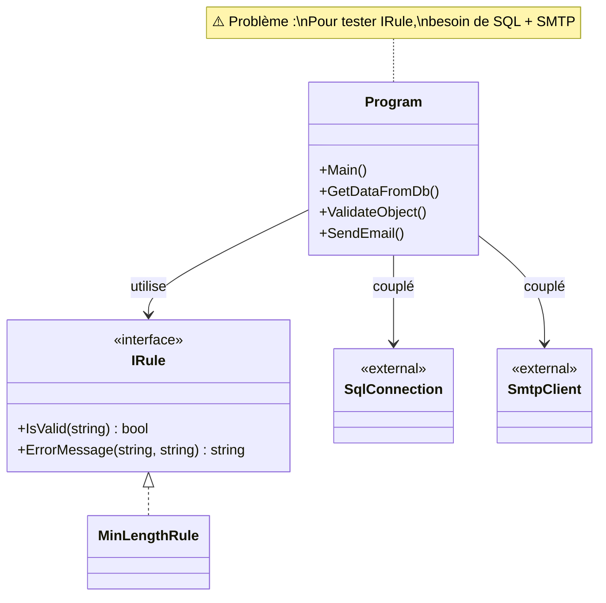
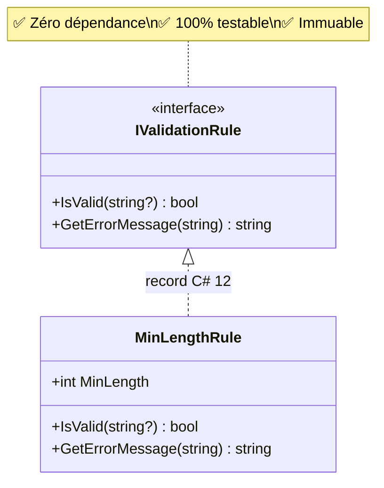

# Workbook Stagiaire - ValidFlow

## Session 13h30 : Implémentation du Cœur Métier (Projet Domain)

---

### 🎯 Objectif de la Session

Créer un **filet de sécurité** via tests unitaires rapides (< 100ms). Vous pourrez refactoriser **sans peur**.

---

### 🧠 1. Théorie : Pourquoi le Domain est une Zone Stérile

**Le diagnostic de ce matin** a révélé le problème central du code legacy : **la logique métier est mélangée à l'infrastructure** (SQL, SMTP).

**Conséquences :**
- ❌ **Impossible à tester unitairement** : Tester 1 règle → besoin de SQL + SMTP
- ❌ **Dangereux à modifier** : Changer une ligne peut casser l'envoi d'emails
- ❌ **Bloqué techniquement** : Impossible de migrer vers .NET 8, Docker ou Linux

**La Clean Architecture résout ce problème** en isolant le cœur métier dans un projet `Domain` qui :
- ✅ **Zéro dépendance externe** : Pas de NuGet, pas de SQL, pas de framework
- ✅ **100% testable en isolation** : Tests en millisecondes
- ✅ **Crée un filet de sécurité** : Refactoring sans peur

---

### 📊 2. Visualisation : Les Deux Architectures

#### Diagramme 1 : Couplage Legacy (Le Problème)



**Analyse :** `IRule` est une excellente abstraction, mais elle est **utilisée dans `Program.cs`** qui dépend de SQL + SMTP. Résultat : impossible de tester unitairement.

---

#### Diagramme 2 : Architecture Cible (Domain Pur)



**Solution :** Extraction de `IRule` dans le Domain. **Zéro dépendance**. Tests rapides.

---

### 🎯 3. Votre Mission : Migration de ValidFlow.Domain (45 min)

Reproduisez les étapes montrées par le formateur pour migrer les règles métier du code legacy vers votre projet `ValidFlow.Domain`.

---

**Étape 1 : Création de la structure de dossiers**

1. Ouvrez un terminal dans `02_Atelier_Stagiaires/ValidFlow.Modern/ValidFlow.Domain/`
2. Créez les dossiers :

```bash
mkdir Interfaces
mkdir Rules
```

---

**Étape 2 : Création de l'interface IValidationRule**

Créez le fichier `Interfaces/IValidationRule.cs` :

```csharp
// ValidFlow.Domain/Interfaces/IValidationRule.cs
namespace ValidFlow.Domain.Interfaces;

public interface IValidationRule
{
    bool IsValid(string? value);  // Le '?' force à gérer null
    string GetErrorMessage(string fieldName);
}
```

> 💡 **C# 8 - Nullable Reference Types** : Le `?` après `string` indique que la valeur peut être `null`. Cela force le développeur à gérer ce cas.

---

**Étape 3 : Implémentation de MinLengthRule (Record + Pattern Matching)**

Créez le fichier `Rules/MinLengthRule.cs` :

```csharp
// ValidFlow.Domain/Rules/MinLengthRule.cs
namespace ValidFlow.Domain.Rules;

using ValidFlow.Domain.Interfaces;

// Record = classe immuable optimisée pour les données (C# 9+)
public record MinLengthRule(int MinLength) : IValidationRule
{
    // Pattern Matching avec switch expression (C# 8+)
    public bool IsValid(string? value) => value switch
    {
        null or "" => false,                                    // CAS 1 : null ou vide
        { Length: var len } when len >= MinLength => true,      // CAS 2 : longueur OK
        _ => false                                              // CAS 3 : longueur insuffisante
    };
    
    public string GetErrorMessage(string fieldName) => 
        $"Le champ '{fieldName}' doit contenir au moins {MinLength} caractères.";
}
```

> 💡 **C# 9 - Records** : Un `record` est immuable par défaut. Une fois créé, on ne peut plus modifier `MinLength`.

> 💡 **C# 8 - Pattern Matching** : Le `switch` expression remplace les longues cascades de `if/else`.

---

**Étape 4 : Création d'un test unitaire (Le Filet de Sécurité)**

Allez dans le projet `ValidFlow.Tests` et créez le fichier `MinLengthRuleTests.cs` :

```csharp
// ValidFlow.Tests/MinLengthRuleTests.cs
using ValidFlow.Domain.Rules;
using Xunit;

public class MinLengthRuleTests
{
    [Fact]
    public void IsValid_WithNull_ReturnsFalse()
    {
        // Arrange
        var rule = new MinLengthRule(2);
        
        // Act
        bool result = rule.IsValid(null);
        
        // Assert
        Assert.False(result);  // ✅ Pas de crash !
    }
    
    [Fact]
    public void IsValid_WithValidLength_ReturnsTrue()
    {
        var rule = new MinLengthRule(2);
        Assert.True(rule.IsValid("AB"));
    }
}
```

---

**Étape 5 : Exécutez les tests**

Dans le terminal :

```bash
cd 02_Atelier_Stagiaires/ValidFlow.Modern
dotnet test
```

**Résultat attendu :**
```
Passed! - 12ms
```

✅ **Critère de succès** : Tests verts en moins de 100ms.

---

### ✅ Validation Finale

Avant de passer à la suite, vérifiez :

- [ ] Le projet `ValidFlow.Domain` **ne contient AUCUN package NuGet** (zéro dépendance externe)
- [ ] L'interface `IValidationRule` est dans le dossier `Interfaces/`
- [ ] La règle `MinLengthRule` est dans le dossier `Rules/`
- [ ] Les tests passent au vert en moins de 100ms
- [ ] Vous avez utilisé les **records** et le **pattern matching** de C# 12

---

> 💡 **Correction :** Le formateur partagera le fichier de correction officiel directement dans le chat à la fin du temps imparti.
