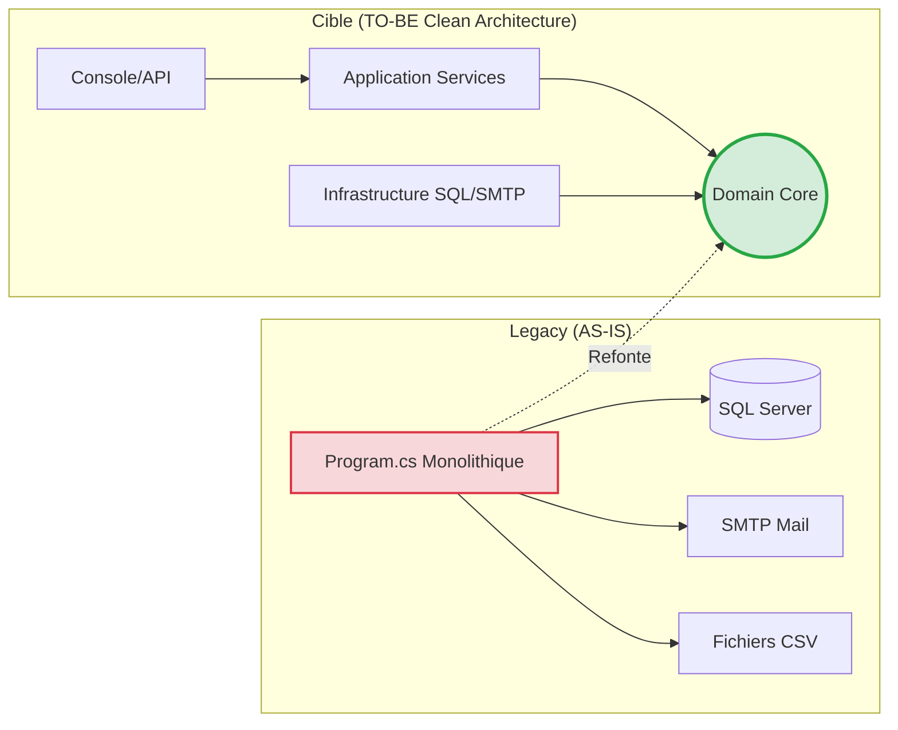

# 🏢 Opération DataGuard : Refonte ValidFlow

**Contexte :** Notre vieux batch monolithique (.NET Framework 4.8) appelé *ValidFlow* est devenu critique. Il plante silencieusement, contient des secrets en clair et n'est pas déployable sous Linux.

**Votre Mission :** Transformer cette application en une solution **.NET 8 Clean Architecture**.

---

## 📊 Architecture : AS-IS vs TO-BE



---

## 📁 Structure du Repository

```
net-mod-legacy/
├─ 00_Reference_Client/          ← Code Legacy original (NE PAS MODIFIER)
├─ 01_Demo_Formateur/            ← Démonstrations live du formateur
├─ 02_Atelier_Stagiaires/        ← VOS exercices pratiques
│  └─ ValidFlow.Legacy/Start/    ← Votre point de départ
└─ 03_Workbooks_Stagiaires/      ← Instructions étape par étape
```

---

## 🚀 Démarrage Rapide

### Prérequis
- .NET 8 SDK
- Visual Studio 2022 ou VS Code + extension C#

### Cloner le Repository
```bash
git clone --single-branch --branch main https://github.com/mounirelouali/net-mod-legacy-formation.git
cd net-mod-legacy-formation
```

> ⚠️ **Important** : Ne faites PAS de `git pull` pendant la formation.

---

## 🎯 Pédagogie : "Montrer puis Faire"

1. **Démonstration Formateur** : Sur **DataGuard** (projet fil rouge)
2. **Pratique Stagiaire** : Sur **ValidFlow** (votre atelier)

Les corrections sont partagées **uniquement à la fin du temps imparti**.

---

## 📋 Backlog Jour 1

- **09h00** : Audit du code Legacy (Sécurité, Performance, Couplage)
- **10h40** : Scaffolding Clean Architecture (5 projets)
- **13h30** : Migration du Domain Layer (Entities + Validation)

---

## 📞 Support

En cas de blocage : Consultez le Workbook ou demandez au formateur.
