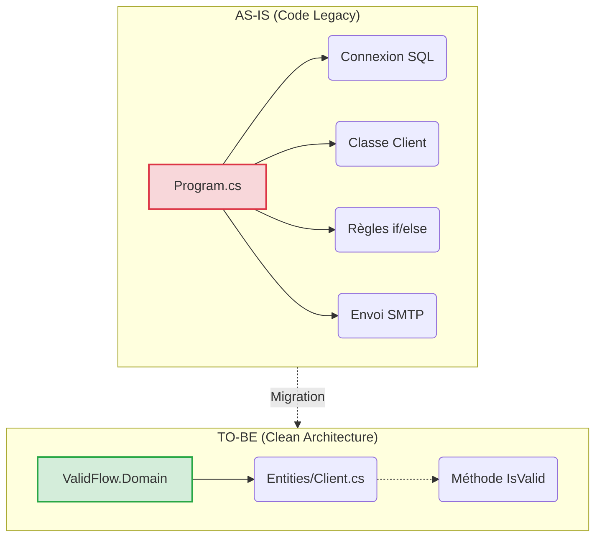
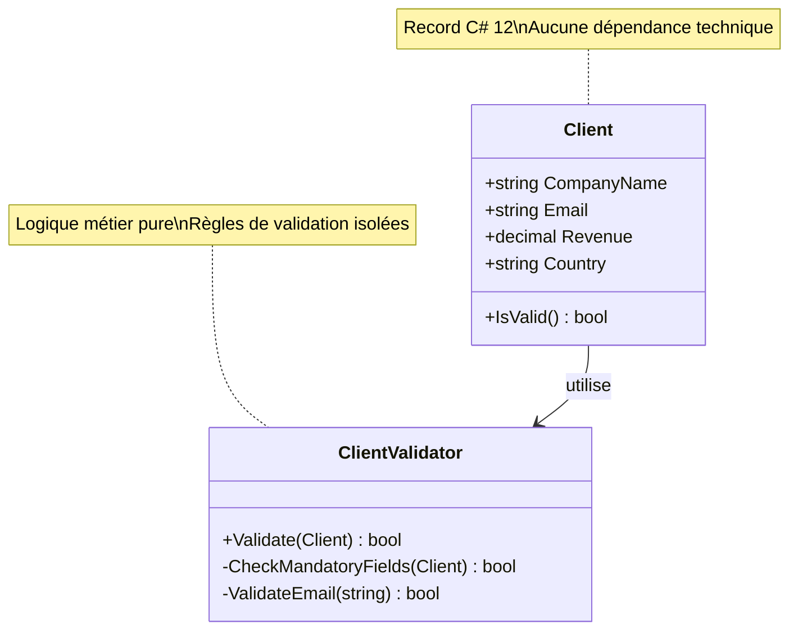

# Correction : Implémentation du projet Domain (ValidFlow)

[🔙 Retour au Workbook](../03_Workbooks_Stagiaires/Workbook_13h30_Migration_Domain.md)

### 📌 Rappel du Contexte
- **DataGuard** (ex-generationxml) : C'est le projet "Fil Rouge" utilisé par le formateur pour les démonstrations.
- **ValidFlow** : C'est VOTRE projet d'atelier pour la mise en pratique.

**Rappel de la mission :** Isoler l'entité `Client` et sa logique de validation métier dans le projet `ValidFlow.Domain`, en utilisant C# 12, sans aucune dépendance technique.

---

### 📊 Approche Top-Down (AS-IS vs TO-BE)
Dans le code Legacy, tout était mélangé. Notre objectif est de sanctuariser les règles métier.



---

### 📁 Structure du Projet Domain

```
ValidFlow.Domain/
├─ Entities/
│  └─ Client.cs           (Entité métier avec record C# 12)
└─ Validators/
   └─ ClientValidator.cs  (Logique de validation métier)
```

---

### 🎯 Objectifs Pédagogiques

1. **Isolation de la logique métier** : Séparer les règles de validation du code technique
2. **C# 12 Moderne** : Utiliser les `record` pour l'immuabilité
3. **Zéro dépendance** : Aucune référence à EF Core, SQL, ou Infrastructure

---

### 📊 Modèle de Données



---

### ✅ Critères de Réussite

- [ ] Le projet Domain compile sans dépendance externe
- [ ] L'entité `Client` utilise un `record` C# 12
- [ ] La logique de validation est isolée dans `ClientValidator`
- [ ] Aucune référence à `System.Data` ou `Microsoft.EntityFrameworkCore`
- [ ] Les tests unitaires peuvent être écrits sans base de données
