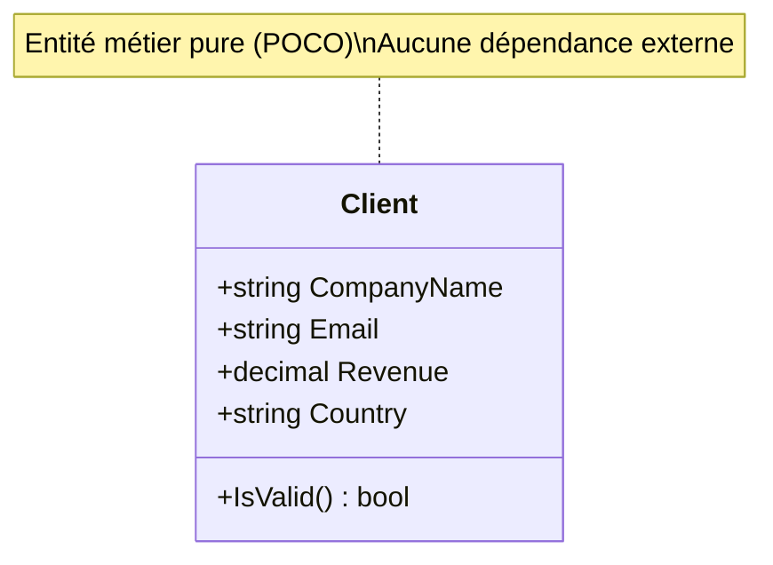

# Correction : Implémentation du projet Domain (ValidFlow)

[🔙 Retour au Workbook](../03_Workbooks_Stagiaires/Workbook_13h30_Migration_Domain.md)

**Rappel de la mission :** Isoler l'entité `Client` et sa logique de validation métier dans le projet `ValidFlow.Domain`, en utilisant les nouveautés de C# 12 sans aucune dépendance à la base de données.

---

### 📊 Architecture du projet Domain



---

### 🎯 Objectifs Pédagogiques

1. **Isolation de la logique métier** : Séparer les règles de validation du code technique
2. **C# 12 Modernes** : Utiliser les `record` pour l'immuabilité
3. **Zéro dépendance** : Aucune référence à EF Core, SQL, ou Infrastructure

---

### 📁 Structure du Projet Domain

```
ValidFlow.Domain/
├─ Models/
│  └─ Client.cs           (Entité métier)
├─ Interfaces/
│  └─ IClientValidator.cs (Contrat de validation)
└─ Validators/
   └─ ClientValidator.cs  (Implémentation métier)
```

---

### ✅ Critères de Réussite

- [ ] Le projet Domain compile sans dépendance externe
- [ ] L'entité `Client` utilise un `record` C# 12
- [ ] La logique de validation est isolée dans une classe dédiée
- [ ] Aucune référence à `System.Data` ou `Microsoft.EntityFrameworkCore`
